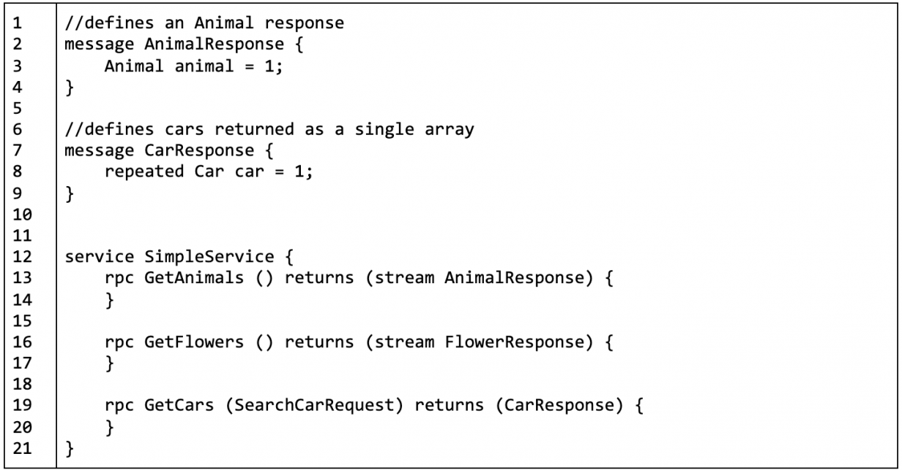

# Руководство по архитектурам API: SOAP, REST, GraphQL и gRPC

Существует множество способов обмена данными. Ниже приведено руководство по 
четырем основным.

Опубликовано: 2 октября 2020 г. | [Боб Реселман (Red Hat, ведущий соавтор)](https://www.redhat.com/architect/users/rreselma)


Фото [Си-минг Ли (SML)](https://www.flickr.com/photos/48973657@N00), лицензия [CC BY 2.0](https://creativecommons.org/licenses/by/2.0/?ref=ccsearch&atype=rich)

Архитектура — это принятие желаемого за действительное, пока мы не поймем, как 
информация передается между системами. Это означает, что независимо от того, 
являетесь ли вы архитектором приложений или архитектором предприятия, важно, 
чтобы вы понимали возможные компромиссы при рассмотрении конкретного метода 
перемещения информации между системами. К счастью, процесс преобразования данных 
из одной схемы в другую всегда был частью ИТ-архитектуры, известной как обмен 
данными.

В этой статье рассматривается история обмена данными и сравнение API SOAP, REST, 
GraphQL и gRPC.

## Воспринимаем API как обмен данными

Обмен данными был важнейшим аспектом архитектуры предприятия с момента появления 
цифровых вычислений. Найдите минутку, чтобы ознакомиться с концепцией обмена 
данными, если вы еще не знакомы с ней.

Хотя большая часть обмена данными происходит внутри мейнфрейма компании, в 
какой-то момент этой информацией приходится делиться с другим компьютером.
Ранние формы обмена данными были физическими. Операторы загружали данные на 
катушки с магнитной лентой. Эти ленты затем транспортировались из одного объекта 
в другой на расстоянии в несколько миль. (Транспортировка компьютерных лент 
туда-сюда была моей работой в аспирантуре.) Когда сетевые коммуникации стали 
стандартизированными, обмен информацией осуществлялся в цифровом виде по 
телефонным линиям и сетевым проводам с использованием протоколов общего 
назначения, таких как Telnet, SMTP, FTP и HTTP.

Несмотря на то, что средства обмена данными стандартизировались, фактические 
данные, поступающие по проводам, были намного менее однородными. Общепринятых 
форматов данных не существовало. У каждой компании и технологии был свой способ 
структурирования данных.

Но, как говорится, необходимость — мать изобретения. Промышленность нуждалась в 
стандартизации, и она это сделала. В настоящее время существует несколько чаще всего используемых
общепринятых форматов данных. Одним из первых был XML, который используется до 
сих пор. Однако по большей части текстовый JSON и несколько двоичных форматов, 
таких как Protocol Buffers и Thrift, стали универсальными языками для обмена данными.

Эта стандартизация форматов данных привела к распространению архитектурного стиля 
проектирования, который позиционирует API как стержень в архитектуре приложений.
Сегодняшняя тенденция заключается в том, чтобы клиенты взаимодействовали со 
слоем API, представляющим приложение на стороне сервера.

Преимущество использования подхода на основе API к проектированию архитектуры 
приложений заключается в том, что он позволяет широкому спектру физических 
клиентских устройств и типов приложений взаимодействовать с данным приложением.
Один API можно использовать не только для вычислений на базе ПК, но и для 
мобильных телефонов и устройств IoT. Коммуникация не ограничивается взаимодействием 
между людьми и приложениями. С появлением машинного обучения и искусственного 
интеллекта взаимодействие между сервисами через API, станет основным видом 
активности в Интернете.

API привносят новое измерение в архитектурный стиль проектирования. Однако, 
хотя сетевое взаимодействие и структуры данных со временем стали более 
традиционными, форматы API по-прежнему отличаются разнообразием. Не существует 
«одного кольца, чтобы править всеми». Вместо этого существует множество 
форматов API, наиболее популярными из которых являются SOAP, REST, GraphQL и 
gRPC. Таким образом, разумный вопрос, который следует задать архитектору 
предприятия, заключается в том, как мне выбрать наилучший формат API для 
удовлетворения текущих потребностей? Ответ заключается в том, что это вопрос 
понимания преимуществ и недостатков конкретного формата. Цель этой статьи — выделить 
преимущества и недостатки наиболее популярных форматов API: SOAP, REST, GraphQL и 
gRPC. Следующие разделы посвящены обсуждению деталей.

## SOAP

Простой протокол доступа к объектам (SOAP) — это протокол для обмена информацией, 
закодированной в расширяемом языке разметки ([XML](https://en.wikipedia.org/wiki/XML)), между клиентом и процедурой 
или сервисом, находящимся в Интернете. Спецификация была обнародована в 1999 
году и опубликована W3C как открытый стандарт.

SOAP может использоваться различными транспортными протоколами помимо HTTP, 
например, FTP и SMTP. (Чаще всего HTTP используется для синхронного 
обмена данными и SMTP или FTP для асинхронного взаимодействия).

Чтобы поддерживать согласованность при структурировании данных, SOAP использует 
стандартную схему XML (XSL) для кодирования XML. Кроме того, разработчики могут 
создавать свои собственные схемы XML для добавления пользовательских элементов 
XML в сообщения SOAP.

SOAP обычно используется с языком описания веб-сервисов (WSDL). Необходимость 
использования WSDL заключается в том, что разработчики и компьютеры могут 
исследовать веб-сервис, поддерживающий SOAP, для обнаружения особенностей обмена 
информацией по сети. Кроме того, WSDL описывает, как структурировать сообщения 
запросов и ответов SOAP, поддерживаемые данным сервисом. Обнаружение через WSDL 
упрощает программирование веб-сервисов с использованием SOAP.

## Структура SOAP сообщения

Сообщение SOAP представляет собой иерархическую структуру, в которой корневым 
элементом является <soap:Envelope>. Корневой элемент может иметь три дочерних 
элемента. Эти дочерние элементы — <soap:Header>, <soap:Body> и <soap:Fault>.

Элемент <soap:Body> является обязательным. Элементы <soap:Header> и <soap:Fault> 
являются необязательными. Когда используется необязательный элемент <soap:Header>, 
он должен быть первым дочерним элементом в родительском элементе <soap:Envelope>, 
а когда используется необязательный элемент <soap:Fault>, он должен быть дочерним 
элементом элемент, <soap:Body>.

Как упоминалось ранее, элемент <soap:Envelope> является корневым для всего 
сообщения SOAP. Элемент <soap:Header> предоставляет информацию заголовка, 
относящуюся к сообщению. Элемент <soap:Body> описывает полезную нагрузку 
сообщения. Элемент <soap:Fault> содержит информацию об ошибках, возникших при 
передаче и использовании сообщения. В листинге 0 ниже показан пример сообщения 
SOAP, включая определение HTTP-запроса POST, который отправляет сообщение 
целевому адресату.

```
 1| POST /BobsTickers HTTP/1.1
 2| Host: www.example.org
 3| Content-Type: application/soap+xml; charset=utf-8
 4| Content-Length: 275
 5| SOAPAction: "http://cooltickers.org/soap"
 6|
 7| <?xml version="1.0"?>
 8| <soap:Envelope xmlns:soap="http://www.w3.org/2003/05/soap-envelope" xmlns:m="http://www.exampletickers.org">
 9|    <soap:Header>
10|    </soap:Header>
11|    <soap:Body>
12|        <m:GetStockPriceRequest>
13|            <m:StockName>IBM</m:StockName>
14|        </m:GetStockPriceRequest>
15|    </soap:Body>
16| </soap:Envelope>
```

Листинг 0 - Пример SOAP сообщения.

Давайте проанализируем сообщение, показанное выше в листинге 0.

Строки с 1 по 5 описывают информацию заголовка исходного запроса POST. Строка 1 
объявляет метод HTTP, конечную точку доступа для сообщения после его прибытия 
на веб-сервер и транспортный протокол, в данном случае HTTP/1.1. Строка 2 
объявляет DNS-имя целевого адресата. Строка 3 объявляет, что Content-Type запроса 
содержит XML, закодированный в соответствии со спецификацией SOAP. Строка 4 — это 
длина тела запроса. Строка 5 содержит пару "имя-значение", описывающую SOAPAction, 
которую мы обсудим позже в разделе "Определение поведения в SOAP". Строки 1–4 типичны 
для HTTP заголовка. Все становится специфичным для SOAP, начиная со строки 8, 
которая определяет корневой элемент XML, Envelope, который содержит все 
сообщение SOAP. Обратите внимание, что в строке 9 объявляется пространство имен 
XML с именем `m`. В этом случае переменная пространства имен ограничена 
фиктивным URL-адресом, который должен содержать определения элементов, 
задаваемые URL-адресом пространства имен. Пространство имен `m` объявляет 
фиктивные элементы `GetStockPriceRequest` и `StockName`, которые используются в 
строках 13 и 14 соответственно. По сути, код в листинге 0 сообщает хосту, что 
SOAP-сообщение является запросом цены акции для биржевого символа IBM. Учитывая 
информацию, представленную в сообщении SOAP, разумный вопрос: как хост, получающий 
сообщение SOAP, понимает все это? Чтобы ответить на этот вопрос, нам нужно 
вернуться к атрибуту HTTP заголовка SOAPAction, показанному выше в листинге 0 в 
строке 5.

## Определение поведения в SOAP

[SOAPAction](https://www.w3.org/TR/2000/NOTE-SOAP-20000508/#_Toc478383528) — это 
атрибут HTTP заголовка, который сообщает хосту, что входящий запрос является 
сообщением SOAP. Кроме того, URL-адрес, связанный с атрибутом SOAPAction, 
предоставляет ссылку, описывающую общую информацию о сообщении. Во многих случаях 
веб-сервисы, поддерживающие SOAP, направляют запрос к внутренним компонентам сервиса 
на основе информации, указанной в заголовке SOAPAction. Что касается конкретного 
поведения, которое должно выполняться, как описано в сообщении SOAP, это зависит 
от хоста, получающего сообщение. В случае примера, показанного выше в листинге 
0, предполагается, что логика конечной точки, BobsTickers, знает, как 
анализировать входящее сообщение SOAP, и когда он встречает элемент `<m:GetStockPriceRequest>`, 
она знает, как выполнить поиск символа, описанного в элементе `<m:StockName>`, и, 
таким образом, действовать соответствующим образом. Хотя SOAP является мощным 
форматом API, в нем нет ничего волшебного. Фактическое поведение, связанное с 
сообщением SOAP, зависит от хоста, получающего информацию. Таким образом, те, 
кто создает сообщение SOAP, должны убедиться, что предоставлена вся информация, 
необходимая для выполнения желаемого поведения.

## REST

[REST](https://en.wikipedia.org/wiki/Representational_state_transfer) — это 
аббревиатура от Representational State Transfer. REST - это архитектурный 
стиль, разработанный Роем Филдингом в его докторской диссертации 2000 года. Основной
смысл заключается в том, что разработчики используют стандартные HTTP методы: 
GET, POST, PUT и DELETE, для запроса и изменения ресурсов, представленных URI 
в Интернете. (Смотри рисунок 1 ниже)


Рисунок 1. REST использует стандартные HTTP методы для работы с серверными ресурсами

Вы можете думать о ресурсе как об очень большом наборе данных, описывающем набор 
сущностей одного типа, например, животных, цветов и автомобилей. REST не зависит от формата, 
используемого для структурирования данных ответа от ресурса. Использование текстовых 
форматов данных стало общепринятым. JSON — самый популярный формат данных, хотя вы 
можете использовать и другие, такие как XML, CSV и даже RSS.

HTTP/1.1 — это протокол, используемый для обмена данными REST. Таким образом, 
механизм запроса-ответа без сохранения состояния является неотъемлемой частью 
стиля. Кроме того, спецификация REST поддерживает концепцию [гипермедиа как 
механизма состояния приложения](https://en.wikipedia.org/wiki/HATEOAS) (HATEOAS). С точки зрения эксплуатации это 
означает, что ответ REST может содержать ссылки, описывающие операции или 
последующие шаги рабочего процесса, относящиеся к данному ресурсу. (Смотри листинг 
1 ниже.)

```json
{
  "car": {
    "vin": "KNDJT2A23A7703818",
    "make": "kia",
    "model": "soul",
    "year": 2010,
    "links": {
      "service": "/cars/KNDJT2A23A7703818/service",
      "sell": "/cars/KNDJT2A23A7703818/sell",
      "clean": "/cars/KNDJT2A23A7703818/sell"
    }
  }
}
```
Листинг 1. REST использует HATEOAS для определения операций и задач, относящихся 
к ресурсу.

REST — это формат с самоописанием. Это означает, что вы можете определить поля 
и значения в ответе, просто взглянув на результаты ответа. Например, в листинге 1 
выше вы можете вычислить значение VIN в ответе, потому что на самом деле существует 
свойство с именем «VIN». Вам не нужен внешний словарь для определения значения и 
положения свойств. Самоописание — это полезная функция, которое также используется 
в GraphQL, который мы рассмотрим далее.

## GraphQL

GraphQL — это технология, пришедшая из Facebook, но теперь имеющая открытый 
исходный код. GraphQL — это спецификация. Поскольку GraphQL — это спецификация, 
она по своей сути не зависит от языка. Существует множество реализаций спецификации 
на различных языках программирования. Существуют реализации на [Go](https://github.com/graphql-go/graphql), [.NET/C#](https://graphql-dotnet.github.io/docs/getting-started/introduction/), 
[Node.js](https://www.apollographql.com/docs/apollo-server/) и [Python](https://graphene-python.org/), 
и это лишь некоторые из них.

Базовым механизмом для выполнения запросов и мутаций является команда HTTP 
POST. Это означает, что клиент GraphQL, написанный на Go, может взаимодействовать 
с сервером GraphQL, написанным на Node.JS. Или вы можете выполнить запрос или 
мутацию с помощью команды `curl`.

Существует несколько вещей, которые делают GraphQL особенным. Во-первых, как 
следует из названия, GraphQL предназначен для представления данных в виде 
графа. Вместо столбцов и строк в реляционной базе данных или набора 
структурированных документов в ориентированной на документы базе данных, такой 
как MongoDB, графовая база данных представляет собой набор узлов и ребер.
Вы можете думать о графовой базе данных как о большом массиве объектов (узлов), 
связанных определенным образом (ребра). Например, объекты Фидо (узел) и Китти 
(узел) относятся к объекту Боб (узел) как его домашние животные (ребро). 
GraphQL очень хорошо справляется с этой сложностью.

Граф определяется в соответствии с языком схем, характерным для GraphQL. Разработчики 
используют язык схемы для определения типов, а также операций запросов и мутаций, 
которые будут опубликованы GraphQL API. (Перейдите по [ссылке](https://gist.github.com/reselbob/da7acb06f226abc7912a4cbb657583db), чтобы просмотреть пример 
простой схемы GraphQL.)

Как только типы, запросы и мутации определены в схеме, разработчик реализует 
схему, используя выбранный язык.

> Хотите просмотреть полностью рабочий демонстрационный пример GraphQL API?
> 
> Если вы хотите просмотреть полностью рабочий GraphQL API, посмотрите 
> демонстрационный проект IMBOB на GitHub. Вы можете посмотреть эго [здесь](https://github.com/reselbob). 
> Проект написан на Node.js и демонстрирует все основные возможности GraphQL.

Второе, что делает GraphQL особенным, это то, что он очень гибко определяет 
структуру данных, которые возвращаются при выполнении запроса к API. В отличие 
от REST, в котором вызывающая сторона не имеет контроля над структурой 
возвращаемого набора данных, GraphQL позволяет явно определять структуру 
возвращаемых данных в самом запросе. Например, взгляните на листинг 2 ниже.
Это запрос на [языке запросов GraphQL](https://graphql.org/), запрашивающий информацию о местах 
проведения. (Язык запросов GraphQL похож на JSON, но не совсем такой же.)
Обратите внимание, что оператор GraphQL определяет три поля — `name`, `city` и 
`state_province` — которые должны быть возвращены из графа места проведения.


Листинг 2. Запрос `name`, `city` и `state_province` из графа-примера мест проведения 
с использованием GraphQL

Команда GraphQL, показанная в листинге 3, запрашивает информацию только о двух 
полях места проведения: `name` и `postal_code`.


Листинг 3. Запрос `name` и `postal_code` для графа-примера мест проведения
с использованием GraphQL

Если бы вы запросили ресурс места проведения в REST, вы бы получили все поля, 
связанные с этим ресурсом. В GraphQL у вас есть большая гибкость с точки зрения 
определения данных результатов. Это значительное преимущество для разработчиков 
интерфейса. Возможность определять только те данные, которые вам нужны, экономит 
трудозатраты, память и потребление ЦП, которые связаны с синтаксическим анализом 
и фильтрацией бесполезных данных из огромных наборов результатов.

Третья особенность GraphQL — это подписки. (Смотри рисунок 2 ниже.) Подписки 
позволяют осуществлять асинхронный обмен сообщениями.


Рисунок 2: GraphQL выполняет синхронные запросы и мутации, а также асинхронно 
обменивается сообщениями с помощью подписок

Обмен данными с помощью запросов и мутаций в GraphQL происходит синхронно из-за 
шаблона запрос-ответ, присущего протоколу HTTP/1.1. Однако GraphQL позволяет 
пользователям получать сообщения асинхронно, когда на стороне сервера возникает 
определенное событие. Давайте рассмотрим вариант использования.

Представьте, что у вас есть GraphQL API, который позволяет клиентам покупать 
билеты на концерт в определенном месте. Логика рабочего процесса заключается в 
том, что клиент просматривает места в зале, чтобы определить, какие из них 
купить. Клиент нажимает на интересующие места в пользовательском интерфейсе 
приложения, а затем покупает билеты. Однако существует проблема. Между выбором 
места и фактической оплатой может пройти значительное время. Клиент должен 
взять свою кредитную карту и предоставить информацию в пользовательском интерфейсе.
Затем необходимо осуществить обработку в бэкенде, чтобы убедиться, что номер 
кредитной карты действителен и можно совершить покупку. В некоторых случаях эта 
транзакция может занять минуту или две. Если место не находится в режиме "занято",
другой клиент может также попытаться приобрести это место. Ясно, что существует 
состояние гонки.

Это проблема, для которой подписка на GraphQL является полезным решением. Разработчик 
может сделать так, чтобы после получения платежа на сервер перед началом платежной 
транзакции на сервер выдавалось сообщение «место зарезервировано». (Смотри 
рисунок 2 выше.) Внутренние компоненты реализации GraphQL API реагируют на событие, 
асинхронно пересылая сообщение «место зарезервировано» обратно всем клиентам, 
использующим API. Все клиенты, использующие сайт продажи билетов, получают 
сообщение «Место зарезервировано» и помечают конкретное место (места) как 
недоступные. Если транзакция покупки завершается успешно, на все клиентские 
пользовательские интерфейсы отправляется сообщение о покупке места. Если 
транзакция завершается неудачно, всем клиентским пользовательским интерфейсам 
отправляется сообщение «место доступно», и их код пользовательского интерфейса 
показывает, что место (места) снова доступно для покупки.

Но нужно не забыть зарегистрировать все клиентские пользовательские интерфейсы
в GraphQL API для каждой интересующей подписки. Но это задача программирования 
на стороне клиента, которую легко реализовать.

> Хотите узнать больше о GraphQL?
> 
> Прочитайте подробное исследование GraphQL по этой [ссылке](https://www.redhat.com/en/topics/api/what-is-graphql).

Гибридная модель GraphQL обеспечивает большую гибкость. Объединение синхронных 
и асинхронных возможностей в единый API добавляет новое измерение к серверным 
возможностям. GraphQL мощен, но не идеален. Синхронные и асинхронные действия 
различаются. На самом деле, если вы заглянете под капот, вы увидите, что в 
типичном GraphQL API на самом деле задействовано два сервера. Есть синхронный 
HTTP-сервер, а также асинхронный сервер подписки. Является ли это камнем преткновения? 
Не совсем. Но есть еще одна технология, которая органично сочетает синхронность и 
асинхронность в программируемом фреймворке. Эта технология — gRPC.

## gRPC

gRPC — это технология обмена данными, разработанная Google, а затем позднее её 
код стал открытым. Как и GraphQL, это спецификация, реализованная на разных 
языках. В отличие от REST и GraphQL, которые используют текстовые форматы данных, 
gRPC использует [двоичный формат Protocol Buffers](https://developers.google.com/protocol-buffers/docs/overview). Для использования Protocol Buffers 
требуется, чтобы и клиент, и сервер в обмене данными gRPC имели доступ к одному 
и тому же определению схемы. По соглашению определение Protocol Buffers определяются 
в файле `.proto`. (Смотри рисунок 3 ниже.)


Рис. 3. В gRPC и клиент, и сервер используют одну и ту же схему Protocol Buffers.

Файл .proto содержит «словарь», с помощью которого данные кодируются и 
декодируются в двоичный формат Protocol Buffers и из него. (Вы можете просмотреть 
пример простого файла .proto в виде Gist на GitHub по [ссылке](https://gist.github.com/reselbob/7b87c49e0ac9407b06a96e55ec7ed2f9).)

Преимущество использования двоичного формата в качестве средства обмена данными 
заключается в повышении производительности. В отличие от REST и GraphQL, которые 
используют текстовые форматы данных, которые как правило более громоздкие, 
данные, закодированные в двоичном формате, компактны. Эта можно сравнить с 
почтальоном, доставляющим письмо весом в одну унцию (~ 30 грамм), и посылкой в 
четыре фунта (~ 2 кг).

Помимо использования Protocol Buffers для кодирования данных и, следовательно, 
повышения производительности, gRPC имеет еще одно преимущество. Он поддерживает 
двунаправленный асинхронный обмен данными. Это связано с тем, что gRPC основан 
на протоколе HTTP/2.

В отличие от HTTP/1.1, который поддерживает только взаимодействие запрос-ответ 
по одному соединению, HTTP/2 поддерживает любое количество запросов и ответов 
по одному соединению. Соединения также могут быть двусторонними. Другими словами, 
в HTTP/2 клиент открывает соединение с целевым сервером, и это соединение остается 
открытым до тех пор, пока клиент или сервер не закроют его. Это означает, что 
gRPC позволяет передавать через соединение не только запросы и ответы, но и 
потоки данных. Поток может исходить от клиента или от сервера.

Взгляните на листинг 4 ниже. Это фрагмент из примера схемы gRPC, которую вы 
можете просмотреть по [ссылке](https://gist.github.com/reselbob/7b87c49e0ac9407b06a96e55ec7ed2f9). Во фрагменте 
показано несколько сообщений: `CarResponse` (строка 7), имеющее поле, car, 
которое представляет собой массив сообщений Car, как указано зарезервированным 
словом gRPC, `repeated`. Существует сообщение `AnimalResponse` (строка 2), 
описывающее ответное сообщение, содержащее `Animal`. (Сообщения `Animal` и `Car`
полностью описаны в Gist по этой [ссылке](https://gist.github.com/reselbob/7b87c49e0ac9407b06a96e55ec7ed2f9).) 
Фрагмент показывает операции, поддерживаемые конкретным gRPC API в сервисах в 
строке 12.

Обратите внимание, что возвращаемый тип метода `GetAnimals` — (поток `Animals`). 
Это означает, что когда клиент вызывает этот gRPC метод, данные будут возвращены 
в виде непрерывного потока сообщений `Animal` по одному открытому соединению.



Листинг 4: Пример кода gRPC схемы в формате protocol buffer

Теперь взгляните на метод `GetCars()` в строке 19 выше в листинге 4. Обратите 
внимание, что возвращаемый тип — `CarResponse`. `CarResponse` содержит одно поле 
`car`, представляющее собой массив сообщений `Car`. Это важное отличие от ответа 
`GetAnimals()`. Позвольте мне объяснить, почему.

При вызове `GetCars()` серверный код создаст массив, а затем добавит в него 
автомобили. Этот заполненный массив будет присвоен полю `car` в сообщении 
`CarResponse`. Сообщение `CarResponse` будет возвращено вызывающему абоненту. Другими 
словами, вся работа по созданию массива, поиску автомобилей и добавлению их в 
массив выполняется до выполнения ответа.

С другой стороны, когда вызывается `GetAnimals()`, внутренний код создает сообщение 
`AnimalResponse` для каждого обнаруженного животного и возвращает каждое сообщение 
через поток, проходящий через соединение HTTP/2. Если будет найдено 1000 животных, 
то каждое животное будет возвращено по одному через поток. Вызывающему объекту не 
нужно ждать, пока все `Animals` будут объединены в один массив. Вместо этого каждый 
отправляется обратно вызывающей стороне по мере его доступности.

Возврат данных в потоки особенно удобен, когда вы работаете с чувствительными 
ко времени данными, такими как биржевая активность. Также помните, что потоковая 
передача является двунаправленной. Это означает, что клиент может отправлять 
данные на сервер непрерывным потоком. Когда эти данные обрабатываются, они 
возвращаются в потоке клиенту. Выполнение этого сценария под HTTP/1.1 потребует 
открытия и закрытия 1000 соединений между клиентом и сервером. Эффективность 
очевидна.

## Какой формат API вам подходит?

Все форматы API, описанные выше, имеют свои преимущества и недостатки. Давайте 
рассмотрим те, которые мы рассмотрели.

## SOAP

SOAP имеет много преимуществ. Он может быть реализован с использованием 
различных протоколов, не только HTTP, но и SMTP и FTP. SOAP поддерживает 
обнаружение через WSDL и не зависит от языка. Возможность использовать SOAP в 
различных языках программирования имеет особое преимущество для крупных компаний, 
у которых есть приложения, созданные на разных языках программирования, но 
которые должны поддерживать связь между этими разрозненными программами 
стандартным образом.

SOAP существует уже некоторое время. По-прежнему существует большое количество 
устаревших реализаций SOAP, которые необходимо поддерживать. Таким образом, для 
тех, кто знает SOAP, по-прежнему будут возможности трудоустройства, для поддержания 
кодовой базы, использующий протокол. Но у SOAP есть и свои недостатки. SOAP 
можно рассматривать как сложный формат сообщения с большим количеством входов и 
выходов в спецификации. Кроме того, многословный характер XML, являющийся 
форматом, на котором основан SOAP, в сочетании с зависимостью от внешних пространств 
имен для расширения базового формата сообщений, делает протокол громоздким и 
временами сложным в управлении. Сообщения SOAP могут быть довольно большими. 
Перемещение громоздких текстовых сообщений SOAP между источником и адресатом 
занимает много времени по сравнению с бинарными протоколами обмена сообщениями, 
такими как gRPC и Thrift. Когда эффективность протоколов обмена сообщениями, к 
сожалению, измеряется в миллисекундах, в большинстве случаев сообщения SOAP не 
проходят проверку.

Наконец, SOAP — это устаревший протокол. Несмотря на то, что для тех систем, 
которые его используют, необходимо выполнить много работ по обслуживанию, новые 
архитектуры используют более современный подход к межсервисному взаимодействию. 
Тем не менее, когда SOAP только появился, это был настоящий прорыв. Он предоставил 
стандартный способ структурированного обмена сообщениями. Он поддерживал обнаружение и, 
по сути, это был относительно простой протокол для разработчиков.

Вклад SOAP в обмен данными между доменами и сервисами нельзя недооценивать. Это 
отправная точка для многих современных технологий обмена информацией. SOAP сделал 
ИТ лучше.

## REST

REST прост, хорошо известен и широко используется. Вы делаете вызов ресурса, 
представленного URL-адресом в Интернете, используя HTTP-глагол, и получаете 
ответ в формате JSON или XML. Реакция в REST практически немедленная.

Однако у REST есть проблемы. Он неуклюж и неизменен с точки зрения структуры 
данных ответа. Кроме того, учитывая что ответ отдаётся, используя HTTP/1.1, REST может 
быть медленным.

## GraphQL

GraphQL является гибким и набирает популярность. Последняя версия API GitHub 
опубликована с использованием GraphQL. Yelp публикует свой API в GraphQL, как и 
Shopify. Эти примеры лишь некоторые из многих. Список продолжает расти.

Основная проблема, связанная с GraphQL, заключается в том, что это образ жизни. 
Спецификация GraphQL охватывает все аспекты реализации API, от скаляров, типов, 
интерфейсов, объединений, директив и т. д. Несмотря на то, что спецификация 
допускает настройку, нельзя избежать базовой структуры. Вы должны делать что-то 
в соответствии тем как это делается в GraphQL. REST, с другой стороны, имеет ограниченный 
набор правил. Это как разница в производстве скейтборда и автомобиля. Несмотря 
ни на что, вам нужны четыре колеса, а также способ начала и остановки движения, но 
скейтборд (REST) гораздо проще сделать и использовать, чем автомобиль (GraphQL). 
Однако после внедрения GraphQL пользователи считают его более удобным для 
разработчиков, чем REST. Это вопрос компромиссов и уверенности в том, что 
преимущества использования перевешивают затраты на внедрение.

## gRPC

gRPC точен и невероятно быстр. По мнению многих, это стало стандартом де-факто 
для межсервисного обмена данными на сервере. Кроме того, возможности 
двунаправленной потоковой передачи, предоставляемые HTTP/2, позволяют использовать 
gRPC в ситуациях, когда нельзя даже рассматривать REST или GraphQL.

Есть несколько проблем, связанных с использованием gRPC. Во-первых, и клиент, 
и сервер должны поддерживать одну и ту же спецификацию Protocol Buffers. Это 
важно с точки зрения контроля версий. В REST или GraphQL можно добавить новый 
атрибут (атрибуты) к ресурсу (REST) или типу (GraphQL), не рискуя нарушить 
существующий код. Однако внесение таких дополнений в gRPC может иметь пагубные 
последствия. Таким образом, обновления файла `.proto` необходимо тщательно 
координировать.

Еще одна проблема заключается в том, что HTTP/2 не имеет универсальной поддержки 
общедоступных взаимодействий клиент-сервер в Интернете. На момент написания этой 
статьи только[ 48,2% веб-сайтов](https://w3techs.com/technologies/details/ce-http2) в Интернете поддерживают HTTP/2. Таким образом, 
gRPC лучше всего подходит для ситуаций, когда разработчики контролируют действия 
по обмену данными как клиента, так и сервера. Обычно такие границы существуют 
на бэкенде. Отсюда известность gRPC как серверной технологии.

Третья проблема, связанная с использованием gRPC, заключается в том, что для достижения 
мастерства требуется время. Некоторое время можно сэкономить, используя инструмент 
[protoc](https://grpc.io/docs/protoc-installation/). `protoc` будет автоматически 
генерировать клиентский и серверный код gRPC в соответствии с конкретным языком 
программирования на основе определенного файла `.proto`. Это полезно для создания 
шаблонного кода, но для более сложного программирования требуется гораздо больше 
работы.

Наконец, есть проблема, связанная с использованием формата двоичных данных 
Protocol Buffers. Преимущество Protocol Buffers заключается в том, что они 
позволяют быстро перемещать данные. Однако компании, использующие gRPC, могут 
быть избалованы преимуществами, которое gRPC приносит, удовлетворяя их 
потребность в скорости. Они, как правило, хотят большей эффективности. Один из 
методов, который разработчики используют для экономии времени обработки, 
заключается в полном отказе от десериализации двоичных данных. Вместо этого они 
работают с Protocol Buffers непосредственно на битовом уровне.

Спецификация Protocol Buffers позволяет обнаруживать положение поля и тип 
данных, связанных с этим полем, в двоичном сообщении. Таким образом, чтобы 
получить как можно больше скорости, разработчики будут углубляться в биты 
двоичного сообщения и извлекать только интересующие данные. Это не повсеместная 
практика, но и не редкость. Этот тип программирования очень точен и может быть 
очень ненадежным, если файл `.proto` изменится. Если порядок полей в сообщении 
изменен, любой код, анализирующий двоичное сообщение на уровне битов, сломается.

Короче говоря, gRPC — это очень специфический формат API, который обеспечивает 
молниеносное выполнение за счет гибкости. Тем не менее, если у вас есть приложение, 
в котором учитываются наносекунды, gRPC работает со скоростью, которую трудно 
сопоставить при использовании REST или GraphQL.

## Делаем выводы

Выбор правильного формата API для корпоративной архитектуры — важное решение. 
Выбор будет определять, как будет работать архитектура, а также кандидатов и бюджет, 
которые потребуются для реализации и обслуживания приложения на протяжении всего 
его жизненного цикла.

Для компании, которая не хочет рисковать и хочет использовать проверенный формат, 
REST, вероятно, лучше всего подходит для удовлетворения текущих потребностей. 
Если компании необходимо предоставить разработчикам интерфейса максимальную 
гибкость для поддержки как синхронных, так и асинхронных взаимодействий между 
клиентом и сервером, GraphQL — хороший выбор. Если архитектуре требуется быстрый 
обмен данными, который может происходить в одностороннем или двустороннем потоке 
между клиентом и сервером через одно соединение, возможно, подойдет gRPC.

Каждый формат API имеет свои преимущества и недостатки. Ни один из форматов не 
является универсальным. Хитрость заключается в том, чтобы собрать команду 
непредубежденных сотрудников со всей компании, чтобы использовать вдумчивый 
аналитический подход при рассмотрении формата API. В конце концов, архитектура 
хороша настолько, насколько хорош код, который ее реализует. Выбранный сегодня 
формат API будет жить и после того, как архитектурные диаграммы, используемые 
в процессе принятия решений, будут заархивированы.

Примечание редактора: Эта статья была обновлена путём добавления SOAP 10 декабря 2020 г.

Темы: [Облака](https://www.redhat.com/architect/topics/cloud), [API](https://www.redhat.com/architect/topics/apis), 
[обмен данными](https://www.redhat.com/architect/topics/data-exchange), 
[шаблоны передачи сообщений](https://www.redhat.com/architect/topics/messaging-patterns).

## Боб Реселман
Боб Реселман — всемирно известный разработчик программного обеспечения, 
системный архитектор, отраслевой аналитик и технический писатель/журналист. 
[Больше обо мне](https://www.redhat.com/architect/users/rreselma)