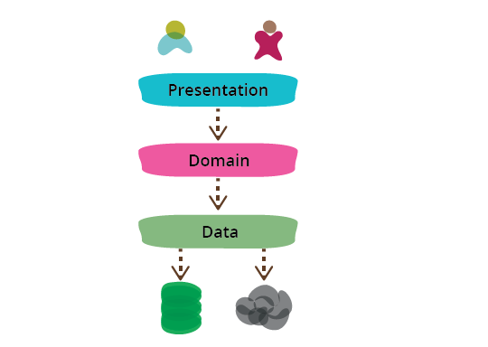
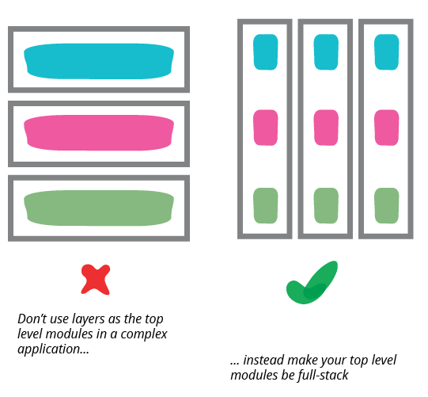

# Разделение на слои Представления-Предметной области-Данных

26 августа 2015

[Мартин Фаулер](https://martinfowler.com/)

[ОРГАНИЗАЦИЯ КОМАНДЫ](https://martinfowler.com/tags/team%20organization.html)
[БАЗА ДАННЫХ](https://martinfowler.com/tags/database.html)
[ИНКАПСУЛЯЦИЯ](https://martinfowler.com/tags/encapsulation.html)
[АРХИТЕКТУРА ПРИЛОЖЕНИЯ](https://martinfowler.com/tags/application%20architecture.html)
[ВЕБ-РАЗРАБОТКА](https://martinfowler.com/tags/web%20development.html)

Один из наиболее распространенных способов модульного разделения программы, 
с большим количеством информации, состоит в том, чтобы разделить ее на три больших 
слоя: представление (UI), логика предметной области (также известная как бизнес-логика) 
и доступ к данным. Таким образом, вы часто видите веб-приложения, разделенные на 
веб-слой, который знает об обработке HTTP-запросов и рендеринге HTML, 
уровень бизнес-логики, который содержит проверки и вычисления, и уровень 
доступа к данным, который определяет, как управлять постоянными данными в базе 
данных или удаленных службами.

В целом я обнаружил, что это эффективная форма модульности для многих приложений, 
которую я регулярно использую и поощряю. Его самое большое преимущество (для меня) 
заключается в том, что он позволяет мне **уменьшить сферу моего внимания**, 
позволяя мне думать о трех темах относительно независимо. Когда я работаю над 
кодом логики предметной области, я в основном могу игнорировать пользовательский интерфейс 
и рассматривать любое взаимодействие с источниками данных как абстрактный набор 
функций, которые предоставляют мне нужные мне данные и обновляют их по моему 
желанию. Когда я работаю над уровнем доступа к данным, я сосредотачиваюсь на 
деталях преобразования данных в форму, требуемую моим интерфейсом. Когда я работаю 
над представлением, я могу сосредоточиться на поведении пользовательского 
интерфейса, рассматривая любые данные для отображения или обновления как волшебным 
образом возникающие при вызовах функций. Разделяя эти элементы, я сужаю область 
своего мышления в каждой части, что облегчает мне понимание того, что мне нужно делать.

Это сужение области не подразумевает какой-либо последовательности для их 
программирования - обычно я перехожу от одного слоя к другому. Я мог бы создать 
уровни данных и предметной области на основе своего первоначального понимания UX, 
но при уточнении UX мне нужно изменить предметную область, что влечет за собой 
изменение слоя данных. Но даже при такой межуровневой итерации мне легче 
сосредоточиться на одном слое за раз, когда я вношу изменения. Это похоже на 
переключение режимов мышления, которое вы получаете при [рефакторинге](https://martinfowler.com/articles/workflowsOfRefactoring/#2hats).

Еще одна причина использовать модульность заключается в том, что позволяет мне **заменять различные 
реализации** модулей. Это разделение позволяет мне создавать несколько представлений 
поверх одной и той же логики предметной области, не дублируя ее. Несколько представлений 
могут быть отдельными страницами в веб-приложении, иметь веб-приложение и отдельные 
мобильные приложения, API для сценариев или даже старомодный интерфейс командной 
строки. Модульность источника данных позволяет мне корректно справляться с 
изменениями в технологии базы данных или поддерживать сервисы для обеспечения 
устойчивости, которые могут измениться без особого уведомления. Однако я должен 
упомянуть, что, хотя я часто слышу о подмене доступа к данным как о драйвере 
для разделения уровня источника данных, я редко слышу, чтобы кто-то 
действительно это делал.

Модульность также поддерживает тестируемость, что, естественно, нравится мне как 
большому поклоннику [SelfTestingCode](https://martinfowler.com/bliki/SelfTestingCode.html). Границы модуля определяют **места, которые хорошо 
подходят для тестирования**. Код пользовательского интерфейса часто сложно тестировать, 
поэтому хорошо добавить как можно больше логики в слой предметной области, который 
легко тестируется без необходимости доступа к программе через пользовательский 
интерфейс [[1]](https://martinfowler.com/bliki/PresentationDomainDataLayering.html#footnote-page-object). Доступ к данным часто медленный и неудобный, 
поэтому использование [TestDoubles](https://martinfowler.com/bliki/TestDouble.html) на уровне данных часто делает тестирование 
логики предметной области намного проще и быстрее.

Хотя заменяемость и тестируемость, безусловно, являются преимуществами этого 
многоуровневого разделения, я должен подчеркнуть, что даже без любой из этих 
причин я бы все равно разделил на слои, подобные этом. Причина сокращения объема 
внимания достаточна сама по себе.

Говоря об этом, мы можем рассматривать это как один шаблон (представления-предметная область-данные) или 
разделить его на два шаблона (представления-предметная область и предметная область-данные). 
Обе точки зрения полезны — я думаю о представлении-предметной области-данных как о 
соединении представления-предметной области и предметной области-данных.

Я рассматриваю эти слои в виде модуля, что является общим словом, которое я 
использую для обозначения того, как мы объединяем наше программное обеспечение 
в относительно независимые части. То, как именно это соответствует коду, зависит 
от среды программирования, в которой мы находимся. Обычно самым низким уровнем 
является некоторая форма подпрограммы или функции. Объектно-ориентированный язык 
будет работать с понятием класса, который объединяет функции и структуру данных. 
В большинстве языков есть формы более высокого уровня, называемые пакетами или 
пространствами имен, которые часто могут быть сформированы в виде иерархии. 
Модули могут соответствовать отдельно развертываемым единицам: библиотекам или 
сервисам, но это не обязательно.

Разделение на слои может происходить на любом из этих уровней. Небольшая программа 
может просто поместить отдельные функции для слоев в разные файлы. Более крупная 
система может иметь уровни, соответствующие пространствам имен, в каждом из 
которых имеется множество классов.

Я упомянул здесь три слоя, но часто встречаются архитектуры с более чем тремя слоями. 
Распространенным вариантом является размещение слоя сервиса между предметной областью и 
представлением или разделение уровня представления на отдельные слои с помощью 
чего-то вроде [модели представления](https://martinfowler.com/eaaDev/PresentationModel.html). Я не считаю, что большее количество слоев 
нарушает основной шаблон, поскольку основные слои все еще остаются.

Зависимости обычно движутся сверху вниз через стек слоев: представление зависит 
от предметной области, который затем зависит от источника данных. Распространенным 
вариантом является организация вещей таким образом, чтобы предметная область не зависела от 
своих источников данных, путем введения [преобразователя](https://martinfowler.com/eaaCatalog/mapper.html) между слоями предметной 
области и источника данных. Этот подход часто называют 
[гексагональной архитектурой](http://alistair.cockburn.us/Hexagonal+architecture).

Эти три слоя являются логическими, а не физическими. Я могу запустить все три 
слоя на своем ноутбуке, могу запустить презентацию и модель предметной области 
на рабочей станции с базой данных на сервере, я могу разделить презентацию с 
помощью полнофункционального клиента в браузере и [Backed For Frontend](https://samnewman.io/patterns/architectural/bff/) на сервере.
В этом случае я рассматриваю BFF как уровень представления, поскольку он 
ориентирован на поддержку определенного варианта представления.

Хотя разделение представления-предметной области-данных является распространенным 
подходом, его следует применять только с относительно небольшой степенью 
детализации. По мере роста приложения каждый уровень может стать достаточно 
сложным сам по себе, что потребует дальнейшей модульности. Когда это происходит, 
обычно не лучше использовать представление-предметную область-данные в качестве 
модулей более высокого уровня. Часто фреймворки рекомендуют вам иметь что-то 
вроде view-model-data в качестве пространств имен верхнего уровня; это нормально 
для небольших систем, но как только любой из этих уровней становится слишком 
большим, вы должны разделить свой верхний уровень на модули, ориентированные на 
предметную область, которые являются внутренними уровнями.

Это разделение на уровни вводит организации в заблуждение, — это [антишаблон](https://martinfowler.com/bliki/AntiPattern.html) 
разделять команды разработчиков по этим уровням. Это выглядит привлекательно, 
потому что для фронтенд- и бэкэнд-разработки требуются разные фреймворки 
(или даже языки), что позволяет разработчикам легко специализироваться на одном 
или другом. Объединение людей с общими навыками способствует обмену навыками и 
позволяет организации относиться к команде как к поставщику одного, четко 
определенного типа работы. Точно так же объединение всех специалистов по базам 
данных соответствует общей централизации баз данных и схем. Но взаимодействие 
между этими слоями требует частого переключения между ними. Это не так уж сложно, 
когда в одной команде есть специалисты, которые могут время от времени сотрудничать, 
но границы команды создают значительные трения, а также снижают мотивацию отдельных 
лиц к развитию важного межуровневого понимания системы. Хуже того, разделение слоев 
на команды увеличивает дистанцию между разработчиками и пользователями. 
Разработчики не должны быть футстек (хотя это похвально), но команды должны быть такими.

## Дальнейшее чтение

Я писал об этом разделении с разных точек зрения в других работах месте. Это 
разделение на слои использует структуру Шаблонов корпоративных приложений, и в 
главе 1 этой книги больше рассказывается об этом разделении. В этой книге я не 
превращал это разделении в самостоятельный шаблон, но поиграл с этим с помощью 
[разделенного представления](https://martinfowler.com/eaaDev/SeparatedPresentation.html) и 
[разделения предметной области-представления](https://martinfowler.com/bliki/PresentationDomainSeparation.html).

Чтобы узнать больше о том, почему презентация-предметная область-данные не должны 
быть модулями самого высокого уровня в более крупной системе, взгляните на записи 
и выступления [Саймона Брауна](http://www.codingthearchitecture.com/). Я также согласен с ним в том, что архитектура 
программного обеспечения должна быть встроена в код.

У меня была [увлекательная беседа с моим коллегой Бадри Джанакираманом](https://martinfowler.com/articles/badri-hexagonal/) о природе 
гексагональных архитектур. Контекст в основном касался приложений, использующих 
Ruby on Rails, но большая часть размышлений применима и к другим случаям, 
когда вы, возможно, рассматриваете этот подход.

## Благодарности

Джеймс Льюис, Йерун Сотерс, Маркос Бризено, Руан Уилсенах и Шон Ньюхэм обсуждали со мной черновики этого поста.

## Примечания

1: [PageObject](https://martinfowler.com/bliki/PageObject.html) также является 
важным инструментом, помогающим тестировать пользовательские интерфейсы.