# Общая картина Event Storming

[Оригинал](https://medium.com/@chatuev/big-picture-event-storming-7a1fe18ffabb)

В [первой статье](https://medium.com/@chatuev/ddd-for-microservices-4778a363c071) цикла об использовании предметно-ориентированного подхода для
проектирования микросервисов мы углубились в DDD и сосредоточились на стратегических 
шаблонах. В соответствии с Воном Верноном, ядром стратегических шаблонов 
является «**единый язык в явно определенном ограниченном контексте**».

Единый язык, на котором говорят **все стороны**, участвующие в процессе разработки 
программного обеспечения, показывает эволюцию предметной области и отражает ее
изменения в ограниченных контекстах. Переформулируя, **единый язык** определяет **ограниченные
контексты**, а развитие языка формирует модель предметной области бизнеса.

По моему опыту, чтобы эффективно использовать DDD, лучше начать с обнаружения 
предметной области, обмена знаниями и сбора единого языка.

Чтобы глубже изучить предметную область и точно собрать понятия единого языка,
нам необходимо создать общий пул бизнес-знаний. На практике знания о предметной
области имеют очень разнообразный характер и распределены несколькими 
экспертами с разным опытом и должностями: заинтересованными сторонами, 
владельцами продукта, дизайнерами UX/UI, инженерами, менеджерами по продажам, 
менеджерами по обслуживанию клиентов и т. д.

К счастью, в мире DDD существует недооцененный метод мозгового штурма под 
названием **Event Storming**, который помогает управлять знаниями о текущем 
состоянии и будущих возможностях предметной области. Event storming был создан 
практиком и консультантом DDD Альберто Брандолини и в настоящее время широко 
используется для достижения DDD.

Event storming — это семинар-мозговой штурм, на котором участники продукта с
разным опытом делятся своей частью бизнес-знаний, выражая их на красочных 
стикерах на широкой стене.

Что делает Event storming таким эффективным, так это то, что это быстрый, 
легкий, интенсивный, интерактивный и совместный семинар. Это синтез методов 
облегченного группового обучения от [Gamestorming](http://gamestorming.com/) и принципов 
[предметно-ориентированного проектирования](https://medium.com/@chatuev/ddd-for-microservices-4778a363c071) (DDD). Event storming не 
ограничивается разработкой программного обеспечения и может использоваться для 
решения любой предметной области бизнеса.

Существуют различные типы Event storming семинаров. Событие Big Picture (общая 
картина) обычно используется для изучения сферы бизнеса и обмена знаниями и 
обычно проводится в полной изоляции от деятельности по разработке программного 
обеспечения. Участники должны в основном состоять из бизнесменов: стейкхолдеров, 
владельцев продукта, службы поддержки клиентов, продаж и т. д.

Event storming, связанный с проектированием программного обеспечения больше
сосредоточен на разработке систем и включает разработчиков, владельцев продуктов,
дизайнеров UX / UI и инженеров-менеджеров.

## Как провести Event storm?

В этой статье мы сосредоточимся на общей картине.

Прежде всего, определитесь с границами предметной области, которую вы собираетесь 
рассматривать. В Event storming общей картины вы можете сфокусироваться на всём
бизнесе или сузить свое внимание до конкретных подобластей. Понимание масштаба 
поможет вам определить список приглашенных.

Ценностями любого мозгового штурма являются люди и их знания. Таким образом, для 
успешного Event storming необходимо также пригласить нужных людей с соответствующими 
знаниями. Идеальное количество участников может зависеть от характера вашего 
бизнеса, но я считаю оптимальным числом 8–10. Постарайтесь разнообразить 
участников по их областям знаний и опыту, чтобы группа вместе владела 
бизнес-знаниями о той части бизнеса, которую вы собираетесь рассматривать.

## Подготовка

Теперь подготовьте необходимые материалы. Если вы собираетесь проводить 
офлайн event storming вам понадобится помещение со стеной длиной 8–10 метров, 
чем больше, тем лучше. Вам также понадобится рулон бумаги такой же длины и 
высоты 70–100 см и [куча стикеров]. Дешевый рулон белой плоттерной бумаги отлично
подойдёт. Рулон крепится к стене, и туда будут приклеиваться стикеры.

Для онлайн event storming Miro - очень удобный инструмент для этого. Изображение 
выше взято с семинара, который я проводил во время изоляции от коронавируса, 
что доказывает, что он удобен для онлайн-мозгового штурма. Все следующие примеры 
в статье сделаны с использованием одного и того же инструмента.

Как упоминалось выше, знания описываются с помощью красочных стикеров, так что 
они вам тоже понадобятся. Ниже приведена картинка, откуда вы можете определить 
цвет, размер и назначение каждого из них. Я подробно объясню каждый тип 
позже в статье.

Рисунок 1 - Стикеры.

И, что не менее важно, подготовьте маркеры, чтобы каждый из участников мог 
делать записи на стикерах.

## Время

Продолжительность event storming зависит от размера подобласти, который вы 
собираетесь штурмовать. Очень полезно впервые провести однодневную общую сессию, 
чтобы понять объем вашей области, ее сложность и наиболее сложные части. Просто 
убедитесь, что у вас есть необходимые перерывы, а также немного еды и напитков, 
чтобы участники оставались свежими.

Для последующих штурмов, когда вы можете сосредоточиться на конкретных подобластях
и обнаружить конкретные проблемы, оптимальной может быть 2-3-часовая сессия с 
небольшим перерывом в середине.

## Давайте начнем

План методики заключается в том, чтобы сначала оценить текущее состояние 
бизнеса, а затем выявить наиболее эффективные области для улучшений. Так что 
сосредоточьтесь на текущем состоянии предметной области.
Чтобы понять event storming, давайте познакомимся с ключевыми понятиями.

## Событие предметной области

Любой event storming начинается со сбора _знаний_ о вашем бизнесе, выраженных в 
виде **событий предметной области**, которые приклеены к стене во временном порядке 
слева направо.

**_Событие предметной области_** — это любое событие, важное для вашего бизнеса и 
оказывающее на него явное влияние. Событие может произойти внутри или снаружи 
вашей бизнес-системы. Принято каждое событие выражать глаголом прошедшего 
времени, записанным на _оранжевом_ стикере.

Чтобы снизить порог входа для участников, фасилитатор обычно делает первый шаг, 
прикрепляя ключевые события, которые подчеркивают основные события в бизнесе от 
начала до конца.

Следуя примеру приложения для вызова такси из [первой статьи](https://medium.com/@chatuev/ddd-for-microservices-4778a363c071), ключевыми событиями
могут быть: Бронирование запрошено, Бронирование принято, Поездка начата, 
Поездка завершена. Ниже показано, как ключевые события могут быть распределены 
на 10-метровой стене.

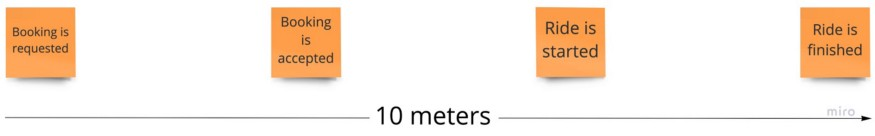
Рисунок 2 - Ключевые события.

Теперь участники могут начать заполнять промежутки между опорными точками и 
вокруг них.

Это самая важная часть всего штурма, где общая цель — поделиться максимальными 
знаниями предметной области от каждого из участников.

Постарайтесь сохранить хаос и помогите носителям знаний только записывать 
события и сразу же прикреплять их к стене без подтверждения со стороны других.
Даже если события выражены длинными предложениями, а не в прошедшем времени, 
или дублируют друг друга, не прерывайте поток обмена знаниями и дайте людям 
провести мозговой штурм.

Если вы видите темы для обсуждения, присоединяйтесь и поддерживайте их, отвечая 
на вопросы и решая проблемы. Сохраняйте процесс интерактивным, поддерживая 
максимально возможный уровень участия каждого в течение как минимум 20–30 
минут.

Помните, что события должны располагаться во времени слева направо. Напоминание 
людям о соблюдении порядка, хотя бы частичное, на первом этапе поможет создать 
более последовательный поток событий.

Примерно через 30 минут, в зависимости от размера вашей предметной области,
активность замедлится, и люди начнут просто смотреть в стену или вести обсуждения 
без какого-либо результата на стене. Это знак того, что нужно завершить первую 
фазу и перейти к следующей — прохождению.

## Прохождение или рассказ

На данный момент большая часть знаний о предметной области уже на стене. И ваша 
главная цель — очистить, упорядочить и структурировать ее, пройдя сквозь стену 
слева направо и вслух прочитав историю, написанную на стикерах, уточняя и 
задавая вопросы авторам — носителям знаний.

Если носители знаний сталкиваются с event storming в первый раз, то стикеры, 
скорее всего, будут выглядеть так, как на рисунке ниже. Здесь показана только 
часть стены, а ключевые события на предыдущем рисунке обведены здесь на рисунке 
3. Все пронумеровано только для того, чтобы было легче ссылаться на них в статье.

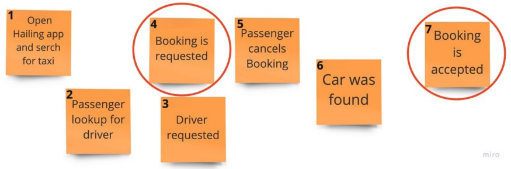
Рисунок 3 - Начинаем проход.

Как видите, большинство формулировок не соответствует правилу идеального 
события предметной области, то есть краткого утверждения в глаголе прошедшего 
времени. роме того, некоторые из них повторяются по смыслу и/или неправильно 
упорядочены и даже грамматически неверны. Давайте пройдемся по стене и исправим 
её.

1 и 2 повторяются, а 2 имеет больше смысла в предметной области. Кроме того, 2 
не совсем правильно, потому что ищется не Водитель, а Автомобиль. Его можно 
было бы переписать как «Автомобили ищутся» или «Автомобили ищутся пассажиром» 
или «Пассажир ищет автомобили». Упоминание Пассажира здесь важно, но не 
обязательно. Итак, давайте удалим 1 и заменим 2 на «Автомобили разыскиваются».

3 и 4 также дублируются. Кроме того, 3 не является правильным. Пассажир не 
запрашивает конкретного водителя, а просто запрашивает бронирование. Итак, 
давайте удалим 3 и оставим 4.

После очистки давайте попросим носителей знаний увеличить масштаб двух 
следующих стикеров и проверить поток.

Что-то пропущено или должно быть изменено здесь? Ну не надо быть экспертом, 
чтобы увидеть пропущенные события. И Владелец Продукта мог бы поправить вас, 
что одно событие перед поиском автомобиля — это «Введен адрес посадки». А одно 
после - «Выбран класс автомобиля».

Другой вопрос, который может возникнуть, почему мы осуществляем бронирование, а
не запрашиваем автомобиль, хотя ищется автомобиль. Это распространенный случай 
неоднозначности сущностей в любой сфере бизнеса. И семинары event storming всегда 
выигрывают от такого рода дискуссий. В данном конкретном случае кто-то, например,
UX/UI-дизайнер, может иметь твердое мнение, что с точки зрения Пассажира это 
Автомобиль, который нужно запросить. Но некоторые заинтересованные стороны могут 
возразить, что физический Автомобиль предоставляется с Водителем, 
Службой поддержки клиентов, Платежным шлюзом и многими другими деталями,
объединенными в единицу обслуживания, которую они привыкли называть Бронированием.

Итак, устоявшиеся термины **_Автомобиль_** и **_Бронирование_** являются важными 
дополнениями единого языка, которые я настоятельно рекомендую обновлять после 
каждого event storming. То, что стоит добавить в единый язык в этой статье выделено
**_жирным курсивом_**, и мы добавим эти термины туда позже в этой статье.

А пока давайте проясним значение **_Бронирование_** с помощью _Определения_, 
записанного на большом белом стикере. Вы можете увидеть его на рисунке 4 ниже. 
Мы подробно поговорим об _Определениях_ в ближайшее время, но сейчас давайте 
продолжим с потоком событий.

Давайте продолжим вслух читать историю, написанную на других стикерах на 
рисунке 3: «После запроса Бронирования Пассажир может отменить его»… звучит 
правдоподобно. Примечание №5 может быть переформулировано на событие 
«Бронирование отменено», которое совершает Пассажир.

Давайте еще раз прочитаем историю: «После запроса Бронирования Пассажир может 
его отменить»... звучит лучше.

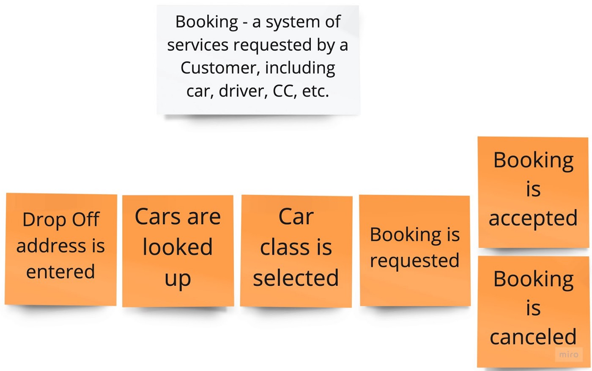

Как видите, Бронирование принято и Бронирование отменено, размещены параллельно, 
чтобы отразить два возможных потока событий.

## И опять же, каков порядок?

Что происходит после отмены Бронирования?
Возможна ли отмена только после запроса Бронирования?
Если никто не знает ответа на вопрос, то, возможно, мы могли бы уточнить 
это с экспертом.

> - _Конечно! Пассажиры могут отменить Бронирование в любой момент до прибытия 
> Водителя на_ **Место посадки**. _В пределах текущих рассматриваемых границ это 
> означает как до, так и после того как Бронирование принято Водителем_.
> 
> **Место посадки**? _Звучит как отправная точка маршрута перемещения Пассажира. Когда
> она выбирается? И вы только что упомянули о событии_ «Водитель прибыл»?
> 
> - _Да, мы забыли добавить событие_ «Выбрано место посадки» после «Выбран класс 
> автомобиля». «Водитель прибыл» происходит после того, как бронирование 
> принято, и до другого важного для бизнеса события — «Поездка началась».

Наконец, если Бронирование отменяется, Пассажир возвращается в начало процесса 
бронирования.

Давайте отразим это бизнес знание на диаграмме событий.

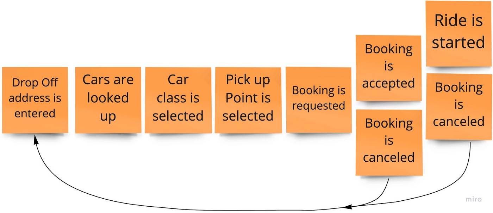
Рисунок 4 - Поток событий при осуществлении бронирования.

А мы продолжаем ходить вдоль стены и читать поток:

> - _После запроса Бронирования его можно принять или отменить..._
> 
> "Подождите!" - — сказал Менеджер по продажам — "По определению, Бронирование — это
> система услуг, запрошенных Пассажиром, включая Автомобиль, водителя, поддержку 
> КЦ и т. д. Итак, Водитель не подтверждает Бронирования, а **Заявки** — это то, как
> мы называем это."
> 
> - _Не могли бы вы написать определение Заявки на большом белом стикере и 
> прикрепить его к стене? Также, пожалуйста, уточните, когда и как появляется 
> Заявка_.
> 
> - _Создание любого_ **Бронирования** _приводит к созданию новой_ **Заявки**.

## Решение проблемы пересечения подобластей

Из первой статьи о DDD, [Стратегическое предметно-ориентированное проектирование](https://medium.com/@chatuev/ddd-for-microservices-4778a363c071), 
мы знаем, что "Если команда начинает использовать новый термин для выражения существующей
концепции или существующий термин используется для выражения нового понятия, то
это тревожный звоночек для команды о том, что границы подобласти перекрываются."

Первоначально в предметной области вызова такси термин **Бронирование** использовался 
как универсальный термин для обозначения услуги как в подобласти «Пассажир», 
так и в подобласти «Водитель». С развитием предметной области этот термин стал иметь более 
конкретное значение для каждой из подобластей Пассажир и Водитель и, таким 
образом, был разделён на **Бронирование** и **Заказ**.

Еще более наглядным примером того, как концепция разделяется по контекстуальным 
значениям, является последнее событие «Бронирование отменено». Есть два действующих 
лица, которые могут инициировать событие: Пассажир и Водитель. Очевидно, что 
одна и та же услуга вызова такси имеет для них очень разное значение. Грубо 
говоря:

* Используя интерфейс бронирования, Пассажир заказывает такси для перемещения 
  из точки А в точку Б и платит за это некоторую сумму, состоящую из выручки 
  Водителя, маржи Компании и дополнительных чаевых. Для пассажиров это 
  происходит в основном время от времени, по необходимости перемещаться из 
  пункта А в пункт Б.
* Используя другой интерфейс, Водитель выбирает заявки из списка. В 
  заявке указаны только выручка, пункты посадки и высадки, а также контактная 
  информация о пассажире. Для Водителя это работа, поэтому он занимается ею 
  регулярно.
  
Таким образом, последнее событие «Бронирование отменено» может быть инициировано
только Пассажиром, в то время как Водитель может инициировать событие «Заявка 
отменена». Водитель не взаимодействует напрямую с Бронированием, а только через
Заявку.

Давайте разделим это концептуальное разделение **Бронирования** и **Заявки** 
на стене.

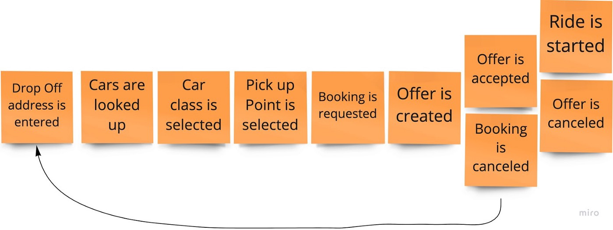

Event storming - очень полезен для выявления и документирования таких 
контекстуальных различий. Иногда эксперты в разных областях обнаруживают 
эволюцию концепции во время самой сессии. Объясняя значение понятия, эксперты 
дают разные определения и с удивлением обнаруживают, что они уже придают 
одному и тому же понятию разные контекстно-зависимые значения. Это происходит 
из-за растущей разобщенности между людьми, работающими в разных подобластях,
event storming — очень мощный инструмент для обеспечения согласованности и 
обмена знаниями.

Чтобы штурм был последовательным, добавляйте определения одно за другим по 
мере их появления.

Теперь давайте прикрепим их к стене и затем продолжим движение вдоль стены...

## Определения

Как упоминалось выше, большие белые стикеры с Определениями используются для 
выделения деловых терминов. В то время как оранжевые события полноправными 
составляющими в event storming, Определения формируют единый язык.

Во время семинара event storming, когда вы видите или слышите специфический 
для бизнеса термин, аббревиатуру или даже неформальный сленг, попросите 
кого-нибудь, кто упомянул об этом, записать его и прикрепить к стене над 
событиями. Попросив других сделать это, вы облегчите более глубокое вовлечение 
в процесс штурма и часто вызовете новые вопросы и дискуссии в группе участников.

Убедитесь, что определения являются явными, зависят от контекста и включают 
условия, роли и зависимости, если таковые имеются.

После семинара всегда добавляйте новые определения в единый язык. Я использую 
страницы с пересечениями, чтобы собрать единый язык для каждой из подобластей.
Скопировав условия со стены на страницу с пересечениями, поделитесь 
обновлениями с соответствующими пользователями, попросите подтвердить и 
обязательно напомните другим об использовании единого языка в разговорах,
других семинарах, макетах UX/UI, коде и везде в контексте бизнеса.

Ниже приведены определения, с которыми мы уже встречались.

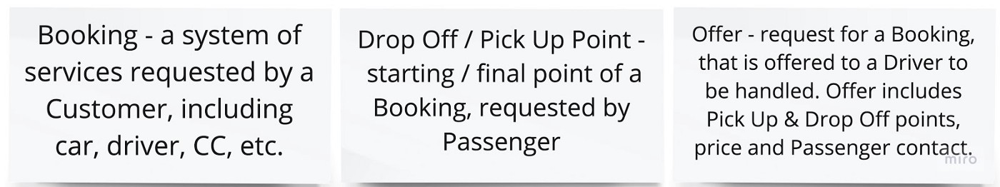

## ...Продолжаем движение по стене

> - _После того, как «Заявка принята», начинается поездка... Здесь определенно 
> упущено что-то важное_.
> 
> _Точно_, «Водитель прибыл». _Или, если он не прибыл, то мы называем это_ 
> «Отсутствие водителя на месте».

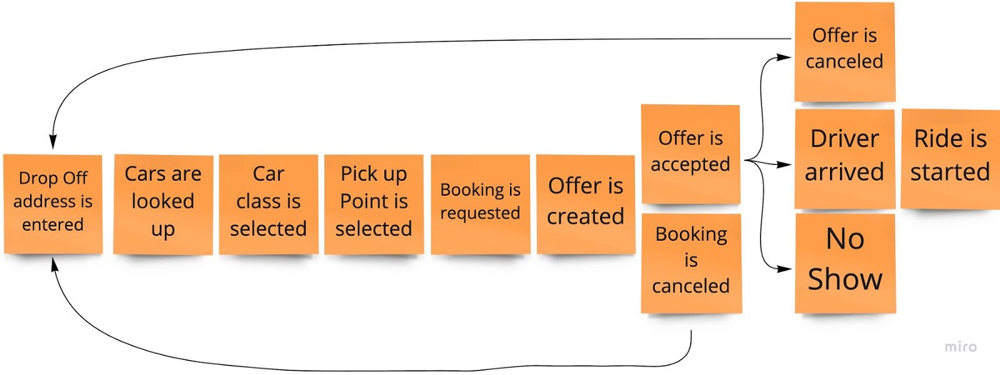

Обычно люди не имевшие раньше опыта с event storming, сосредотачиваются в 
основном на ключевых подобластях, таких как Бронирование и Заявка в службе 
вызова такси. В этом случае направляйте носителей знаний на вспомогательные 
подобласти, например, Уведомления и Платежи, и обнаруживайте происходящие там 
события.

После того как «_Заявка принята_» и/или «_Заявка отменена_» мы можем добавить 
событие «_Пассажир уведомлен_». А после «_Бронирование отменено_» мы можем 
добавить событие «_Водитель уведомлен_», но только в случае, если 
соответствующая Заявка уже принята Водителем. Такие условия документируются 
понятия как Набор критериев и требований, о котором мы поговорим чуть позже.

Ниже приведены некоторые примеры событий, происходящих в вспомогательных 
подобластях.

Я не буду включать их в общую картину, чтобы не перегружать повествование. 
Но в конце статьи будет приведен пример реального результата event storming.

## Команды

После того, как вы почувствуете, что большая часть знаний предметной области 
отражена в событиях на стене, сосредоточьтесь на Командах, которые запускают 
соответствующие События. Запишите Команды, важные для бизнеса, на голубой 
записке и поместите слева от События, которое они порождают.

Команда — это сообщение, которое представляет намерение пользователя и может 
быть выражено в виде действия, такого как «Запросить Бронирование», «Отменить 
Бронирование», «Запросить возврат средств» и т. д.

Давайте добавим их на нашу стену.

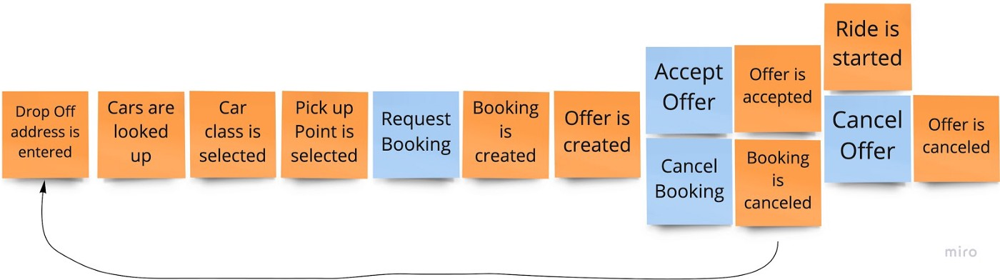

Помимо пользователей, команды также могут запускаться по времени, подтверждениями или 
внешними событиями.

Наиболее частыми триггерами Команд являются пользователи, и в event storming 
они моделируются с помощью шаблона Акторы.

## Акторы

Понятие Актор при event storming имитируется небольшим желтым стикером и 
определяет пользователя, который запускает определенную команду. Размер заметки 
меньше, чем в других случаях, например, для оранжевых событий или синих команд.

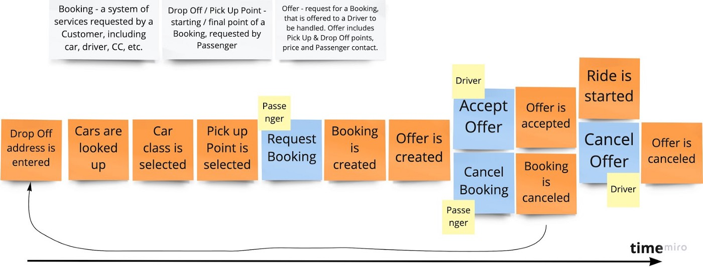
Рисунок 5 - Добавляем акторов.

Нам не нужно перегружать всю картину привязкой Актора к каждому событию, а 
только, чтобы устранить двусмысленность. Например, _Отмена Заявки_ может быть 
инициирована Водителем, а _Отмена бронирования_ — Пассажиром.

## Набор критериев и требований

Понятие Набор критериев и требований используется для документирования условий 
и требований для возникновения событий. Таким образом, на стене со штурмом
набор критериев и требований располагается между событием предметной области и
командой. Набор критериев и требований формализуется как «Всякий раз, когда... X,
тогда... Y» или «Если... X, то... Y».

В нашем случае это может звучать просто как «Каждый раз, когда создается 
Бронирование, затем создаётся Заявка».

Мы используем большой сиреневый стикер для набора критериев и требований.

Давайте добавим на стену определение **Заявки**, набора критериев и требований и 
соответствующего события «Заявка создана».

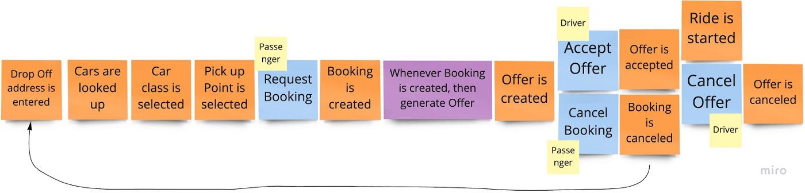

Вы можете заметить, что до того, как мы назвали событие _Бронирование запрошено_ 
вместо _Бронирование создано_. События, собранные во время event storming, 
должны отражать наиболее значимые события в бизнесе. А поскольку мы разделились
на «**Бронирование**» и «**Заявку**», событие _Бронирование создано_ звучит более 
бизнес-ориентированно. И в то же время он достаточно общий, чтобы осветить 
общую картину. Если бы у нас был event storming для всестороннего исследования 
только подобласти Бронирование, то цепочка событий могла бы выглядеть так:
_Бронирование запрошено_, _Бронирование проверено_, _Бронирование создано_ и т. д. 
Такие сессии, ориентированные на конкретную подобласть, имеет смысл запускать 
после масштабного штурма, пример которого мы рассматриваем.

Часто, особенно когда формат семинара является новым для участников, они могли 
знать, но непреднамеренно не делиться ценными знаниями. Предвидеть наличие 
знаний и способствовать их обмену — это навык. Попытайтесь получить его, 
сосредоточившись на предметной области и задавая вопросы.

> - _Правильно ли отражена отмена_ **Бронирования** _в_ **Заявке**?
> - _Да, при этом также отменяется_ **Заявка**
> - _Не могли бы вы задокументировать это правило на большом зеленом стикере: 
> «Всякий раз, когда Бронирование отменено, а Поездка еще не началась, отменить 
> соответствующую Заявку»._
> - _А что произойдет, если Водитель отменит Заявку?_
> - _То Бронирование отменяется._

Эти два правила очень простые. Но что, если у нас сложные условия ведения 
бизнеса?

По мнению наших экспертов в данной области, событие _Бронирование отменено_ 
может, в отличие от других отмен, повлечь за собой штраф для Пассажира. Например, 
в зависимости от времени, прошедшего после события «_Заявка принята_». Водитель 
также может быть оштрафован, если отменит заявку.

В event storming такие условия выражаются с помощью набора правил на зеленом или
салатовом стикере.

Давайте попросим наших экспертов из каждого подобласти «Пассажир» и 
«Водитель» подробно объяснить правила начисления штрафов. Они показаны ниже.

* Для Пассажира: если отмена бронирования производится, когда осталось меньше половины 
  времени до **_Времени посадки_**, то с пассажира взимается 10% от стоимости 
  Бронирования. 
  И, если это 3-я отмена за последние 24 часа, то штраф равен 50%.
* Для Водителя: если отмена заявки производится, когда осталось меньше 
  половины времени до **_Времени посадки_**, то оштрафовать Водителя на 20% от 
  стоимости Заявки.

С помощью приглашенных экспертов давайте прикрепим к стене правила отмены 
бронирования и новые определения. Правила отмены Заявки также следует добавить, 
но я опускаю их, чтобы изображение было легче читать.

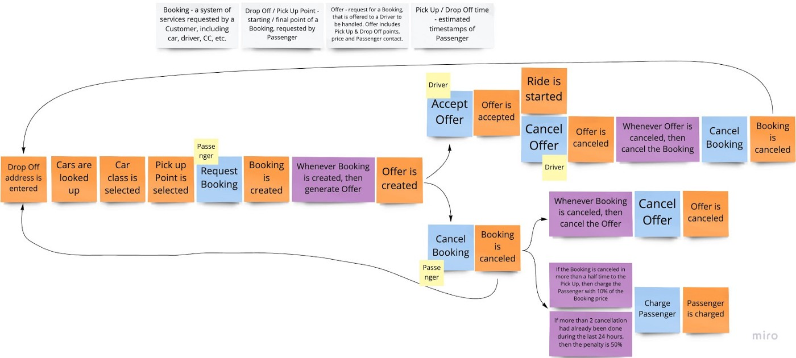
Рисунок 6 - Набор правил.

Когда поток событий разбивается как в случае «Заявка создана», полезно использовать 
стрелки, чтобы визуально разделить потоки и устранить беспорядок. В случае 
следующего разветвления, т.е. на «Поездка начата» и «Заявка отменена» 
стрелки лишние.

Очень важно понять и разъяснить другим, что разветвленные потоки независимы и 
только один из них выполняется в конкретный момент времени.

Таким образом, даже если «Бронирование отменено» размещено позже, чем 
«Поездка начата» по оси времени, это не означает, что они происходят друг за 
другом. Это два независимых потока, и только один из них активен после события
«Заявка принята».

## Комментарии

Иногда вам может понадобиться добавить описание в свободной форме к чему-либо 
в домене. Именно для этого используется понятие Комментарии. Комментарии 
пишутся на маленьком белом стикере и приклеиваются к другому понятию или просто
к определенному месту на стене.

Если у вас есть события, которые могут произойти в произвольном порядке, то 
ставьте их не друг за другом, а в одном потоке и добавляйте соответствующие 
комментарии. Представьте, Клиент может выбрать способ оплаты прямо перед запуском 
потока бронирования или непосредственно перед событием «Бронирование запрошено».

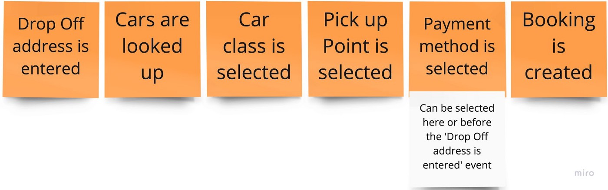

Ранее один из наших экспертов упомянул, что бронирование может быть отменено в 
любое время между событиями «Бронирование создано» и «Поездка начата». Чтобы 
сделать это знание явным, стоит использовать комментарии.

## Улучшения и перспективы сотрудничества

Одним из важных преимуществ интерактивного формата event storming является то, 
что он помогает выявлять несоответствия, точки для улучшения и находить новые
перспективы сотрудничества для развития предметной области. Такие моменты могут возникать в 
ходе дискуссий с противоречивыми мнениями или когда кто-то делится большим 
количеством новых для других знаний. Чтобы задокументировать это, в качестве 
понятия «Улучшения и перспективы сотрудничества» используется небольшой лиловый или пурпурный 
стикер.

Например, в стартапах на ранней стадии такие улучшения могут относиться к 
автоматизации, если обычные файлы, т.е. *.word или *.xlsx используются для 
хранения, обработки или обмена данными. Или улучшение может состоять в том, 
чтобы ввести диалоговый ИИ в подобласть обслуживания клиентов, чтобы сократить 
время ожидания.

Перспективы сотрудничества может заключаться в рекламе и продаже сопутствующих товаров и 
услуг клиенту. Например, большинство сервисов бронирования отелей после того, 
как клиенты уже оплатили основную услугу, предлагают забронировать автомобиль 
или экскурсию. Сервисы по продаже билетов используют аналогичную бизнес-модель.

Давайте вернемся на наш интерактивный семинар и послушаем диалог 
инженера-программиста и SMM-специалиста:

> - _Как отец и пользователь услуги вызова такси, во время бронирования мне не
> хватает возможности выбрать из тех водителей, у которых есть детское кресло._
> 
> - _У нас была такая возможность раньше, но потом её убрали, потому что любой 
> дополнительный шаг между открытием приложения и нажатием кнопки 
> «Подтвердить» снижает конверсию. Но сейчас мы работаем над тем, чтобы 
> предоставить эту возможность для Бронирований, в которых в качестве Места высадки
> указывают детские сады или школы._

> _Хорошо! Давайте добавим это на стену_

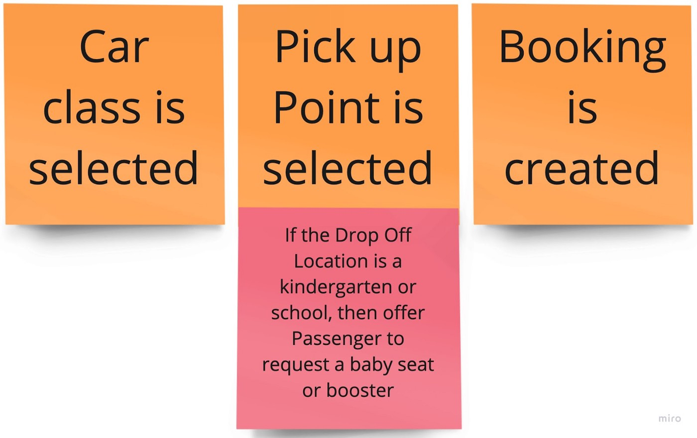

Кто-то может возразить, что возможность звучит как набор правил + событие. Но 
часто важно помнить, что штурм событий должен отражать текущее состояние вашей 
предметной области. Если вы хотите более подробно изучить будущее развитие, 
запустите штурм событий, сосредоточив внимание и задокументировав больше с 
помощью понятия «Улучшения и перспективы сотрудничества».

## Системы

Последней ценной темой, которую мы обнаружим в общей картине event storming, 
будут Системы.

Системой может быть все, что предоставляет решения в вашей предметной области,
например, развертываемый сервис, разработанный внутри вашей компании или 
сторонними поставщиками, с которыми ваша компания интегрирована. Примером 
внешней системы может быть служба электронной почты или служба 
push-уведомлений, отправляющая уведомления Пассажирам, 
служба оформления заказа, лист Excel, файловый хостинг Google, бизнес-страница 
Facebook или смартфон, с помощью которого Пассажир и Водитель могут звонить
друг другу.

Системы задокументированы с помощью большого розового стикера.

Ниже приведены две части, которые я отделил, чтобы не перегружать картинку, 
где вы можете увидеть примеры Систем: Последовательность при бронировании, 
система бронирования, система заявок.

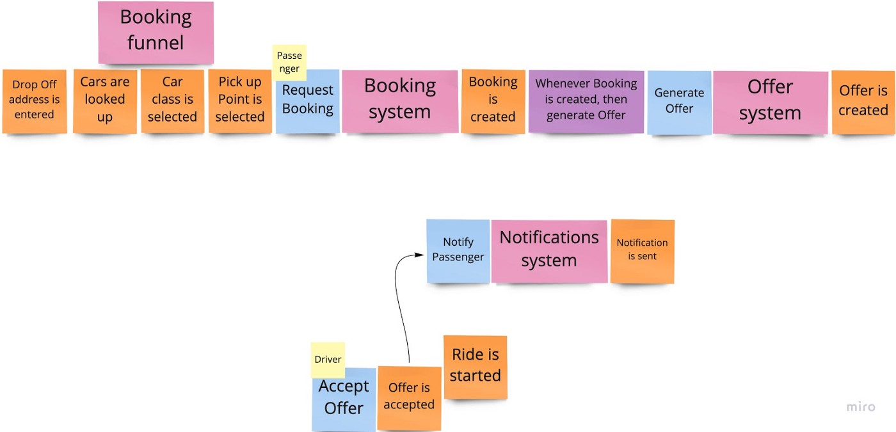
Рисунок 7 - Системы.

Кроме того, мы можем заметить случаи, когда команды инициируются системой, а не
человеком: «Создать заявку» и «Уведомить пассажира».

## Единый язык

Очень важным итогом семинара является единый язык. После каждого event storming
обязательно нужно поместить все собранные определения в специально отведенное 
место и согласовать их использование среди коллег, а также отразить единый язык в 
программном коде. Подробнее о роли UL вы можете узнать в предыдущей статье 
[Стратегический DDD](https://medium.com/@chatuev/ddd-for-microservices-4778a363c071).

## Заключение

Мы закончили первую часть исследования предметной области с помощью общей картины
Event Storming.

Он дает нам представление о нашей предметной области и раскрывает:

* поток данных, представленный событиями;
* выделяет точки для улучшений и перспектив сотрудничества;
* представляет собой интеграцию внутренних и внешних систем;
* помогает наполнить единый язык.

Чтобы дать вам более общую картину, ниже частичный результат нашего штурма.
Чтобы мыслить масштабно, представьте, что поток продолжается до тех пор, пока 
поездка не будет завершена и оценена. Затем подумайте о том, что в приложении 
для вызова такси есть не только такси, но и скутеры, велосипеды и другие виды 
транспорта. А теперь расширите предметную область в контексте B2C и B2B.

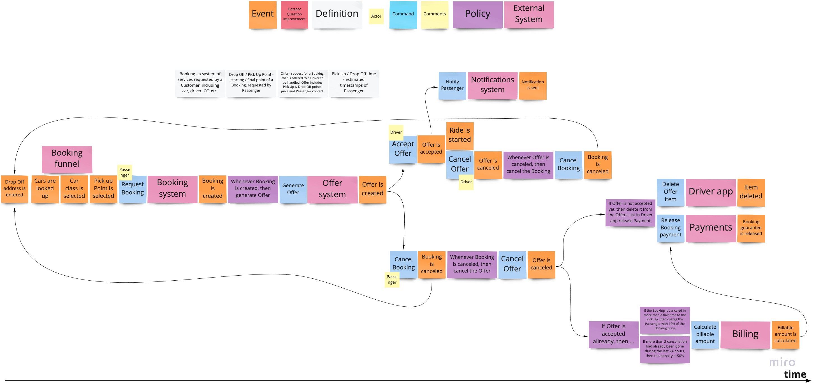

Следующим шагом в разработке микросервисов с использованием DDD является проведение
event storming для разработки программного обеспечения и формирование будущих 
микросервисов с использованием ограниченных контекстов и тактических шаблонов 
DDD.