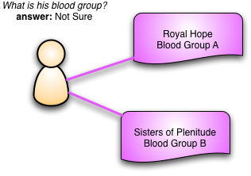
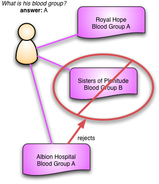
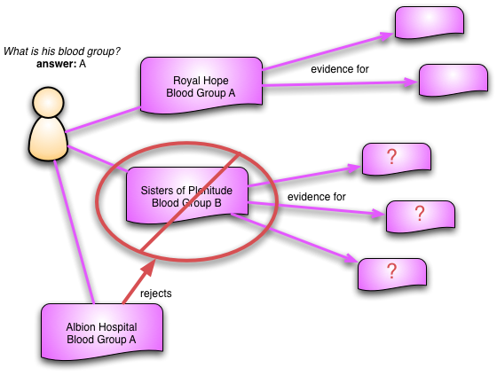

# Противоречивые наблюдения

7 декабря 2005

[Мартин Фаулер](https://martinfowler.com/)

[ПРЕДМЕТНО-ОРИЕНТИРОВАННОЕ ПРОЕКТИРОВАНИЕ](https://martinfowler.com/tags/domain%20driven%20design.html)
[ШАБЛОНЫ АНАЛИЗА](https://martinfowler.com/tags/analysis%20patterns.html)

Многие компьютерные системы созданы для хранения данных и превращения их в 
полезную информацию для людей. Когда мы делаем это, возникает естественное 
желание сделать эту информацию согласованной. В конце концов, какая польза от 
компьютерной системы, которая имеет двоякое мнение о вещах?

Но иногда компьютерные системы должны записывать противоречивые данные и 
помогать людям с этим справляться. Этот вопрос пришел мне в голову много лет 
назад, когда я работал в сфере здравоохранения в Национальной службе 
здравоохранения Великобритании. Мы создавали концептуальную модель оказания 
медицинской помощи — по сути, концептуальную схему электронной медицинской карты.

Вспоминая, можно сказать, что многие вещи я бы сейчас сделал по-другому.
Но одна вещь была особенно ценной и важной — модель во многом была результатом 
совместной работы меня, другого разработчика программного обеспечения, двух 
врачей и медсестры. Персонал больницы понимали модель и принимали активное участие 
в ее разработке, а не были просто пассивными обозревателями. В результате я думаю, 
что идеи, которые мы разработали, были особенно ценны в плане того, что 
практикующий врач хочет видеть в электронной медицинской карте.

Персонал больницы очень настаивал на необходимости сбора противоречивой 
информации. У меня может быть запись из госпиталя Королевской Надежды, о том, что
у меня группа крови А, и ещё одна запись от Сестер Изобилия, в которой говорится, 
что моя группа крови - В. Это явно чепуха, группы крови не меняются. Но это не 
значит, что мы не можем сохранить эти два бита данных. Без дальнейшего 
расследования мы не знаем, какой вариант из них правильный. Даже если мы проверим 
еще раз и подтвердим один из них, мы не можем просто отбросить плохой, поскольку 
он мог быть основой для дальнейших клинических действий. И, конечно же, существует 
много случаев, когда противоречие не столь очевидно. Возможно, мы никогда не 
сможем выяснить, какой из двух противоречащих друг другу битов данных был 
неправильным, или может произойти изменение с течением времени, что крайне 
маловероятно, но возможно.

Ключом к решению этой проблемы является представление моей группы крови не как 
атрибута класса Человек, а как полноценного самостоятельного класса, который мы 
назвали Наблюдением. Каждое наблюдение относится к конкретному пациенту, но 
также фиксирует такую информацию, как когда оно было сделано, кто его сделал и 
как оно было сделано.

Мы также сталкивались с наблюдениями, в которых говорилось об отсутствии чего-то,
а не о наличии. Таким образом, в некоторых ситуациях может быть невозможно 
определить мою группу крови, но можно сказать, что это не группа крови O. Это 
мы могли бы представить как наблюдение об отсутствии группы крови O (я понятия 
не имею насколько возможен или имеет научное обоснование такой пример, но быстро 
придумать реалистичные примеры может быть сложно). Часто наблюдение с отсутствием 
чего-то имеет решающее значение в диагностическом процессе.

Использование наблюдений меняет способ получения информации о пациенте. Вместо 
того, чтобы просто спрашивать группу крови пациента, мы смотрим на все 
наблюдения группы крови пациента. Если они все одинаковые, то мы просто 
используем это значение. Если они отличаются, нам нужно копнуть глубже.
Во многих случаях наблюдения заметно меняются с течением времени, поэтому мы 
можем просмотреть все наблюдения моего веса с течением времени, чтобы построить 
график изменения моего веса.

Хотя нам нужно сохранять противоречивые наблюдения, нам также нужно фиксировать, 
если мы считаем, что одно из них было ошибочным. Некоторые наблюдения, такие как 
сломанная нога, со временем станут неверными, но приведенный выше пример с 
группами крови, скорее всего, будет связан с ошибкой. В ошибочном случае мы 
имеем дело с противопоставлением (или опровержением) одного наблюдения другим.
Таким образом, мы могли бы провести ещё один тест в больнице Альбиона, который 
обнаружит, что у меня группа крови А, и это наблюдение отвергнет наблюдение 
Сестер Изобилия. Опровержение наблюдения говорит о том, что мы верим, что оно 
никогда не было правдой. Мы никогда не удаляем старое наблюдение, вместо этого 
мы помечаем его как опровергнутое и связываем его с наблюдением больницы Альбион.

Важным свойством информации является то, что она используется для управления 
поведением. Опровергнутое наблюдение может быть использовано в качестве
доказательства для дальнейших наблюдений или для оправдания вмешательств.
Сохранение этих ссылок в карте больного имеет важное значение, поскольку после 
опровержения наблюдения мы можем перейти по этим ссылкам для расследования 
последствий. Если наблюдение, которое мы только что отвергли, является важной 
частью свидетельства для другого наблюдения, его следует подвергнуть сомнению 
и, возможно, также опровергнуть. Наблюдения, таким образом, образуют цепочку 
улик, которые мы можем исследовать по мере того, как узнаем больше о 
пациенте.

В большинстве случаев, конечно, мы не используем такие сложные схемы. В основном 
мы программируем в мире, который, как нам кажется, непротиворечив. Но бывают 
моменты, когда мы должны отступить от этого удобного предположения. Когда это 
происходит, явные наблюдения становятся полезным инструментом.

(Если вам интересно узнать об этом подробнее, смотри главу 3 [Шаблоны анализа](https://martinfowler.com/books/ap.html). 
Я уверен, что написал бы ее лучше, если бы мне пришлось сделать это снова сейчас, 
но основные концепции, похоже, по-прежнему выполняются довольно хорошо. Я также 
хотел бы поблагодарить моих коллег по этой работе: Тому Кэрнсу, Энн Кейси, 
Марку Турсу и Хазиму Тимими).