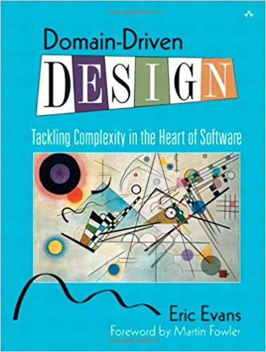

# Предметно-ориентированное проектирование

22 апреля 2020

[Мартин Фаулер](https://martinfowler.com/)

[ЭВОЛЮЦИОННЫЙ ДИЗАЙН](https://martinfowler.com/tags/evolutionary%20design.html)
[ПРЕДМЕТНО-ОРИЕНТИРОВАННОЕ ПРОЕКТИРОВАНИЕ](https://martinfowler.com/tags/domain%20driven%20design.html)
[АРХИТЕКТУРА ПРИЛОЖЕНИЯ](https://martinfowler.com/tags/application%20architecture.html)

Предметно-ориентированное проектирование - это подход к разработке программного 
обеспечения, в котором разработка сосредоточена на программировании модели 
предметной области, обеспечивающей глубокое понимание процессов и правил 
предметной области. Методика получила своё название благодаря книги Эрика Эванса 
2003 года, в которой описан подход с помощью каталога шаблонов. С тех пор сообщество 
практиков развило идеи, породив множество других книг и учебных курсов. Этот 
подход особенно подходит для сложных предметных областей, где необходимо 
организовать работу многих элементов с часто запутанной логикой.

Идея о том, что программные системы должны основываться на хорошо разработанной 
модели предметной области, существует по крайней мере столько, сколько я работаю 
в отрасли. Я многое узнал об этом мышлении от Джима Оделла, который развил этот 
стиль мышления с помощью моделирования данных, информационной инженерии и 
объектно-ориентированного анализа. Описание лежащей в основе предметной области 
было ключевой частью большой работы в сообществах баз данных и объектно-ориентированных 
программ на протяжении 1980-х и 1990-х годов.

Огромный вклад Эрика Эванса с помощью его книги заключался в разработке словаря 
для обсуждения этого подхода, определении ключевых концептуальных элементов, 
выходящих за рамки различных нотаций моделирования, которые доминировали в 
дискуссиях в то время. В основе этого лежала идея о том, что для разработки 
программного обеспечения для сложной предметной области нам необходимо создать 
[единый язык](https://martinfowler.com/bliki/UbiquitousLanguage.html), который встраивает предметную терминологию в программные системы, 
которые мы создаем. Хотя многие люди говорили о разработке таких моделей, они 
часто делались только на бумаге, и обычно ожидалось, что они будут сделаны 
заранее. DDD делает упор на выполнение их в программном обеспечении и их 
развитие в течение срока службы программного продукта. Эрик является ярым 
сторонником [экстремального программирования](https://martinfowler.com/bliki/ExtremeProgramming.html) и считает предметно-ориентированное 
проектирование естественным компонентом экстремального подхода к программированию — 
точку зрения, разделяемую большинством знакомых мне практиков экстремального 
программирования.

>  Книга Эрика Эванса 2003 года обязательна 
> к прочтению серьезным разработчикам программного обеспечения.

В книге введено понятие классификации объектов на Сущности, Объекты-значения и 
Объекты-сервисы — то, что я называю [классификацией Эванса](https://martinfowler.com/bliki/EvansClassification.html), и определение понятия 
[Агрегат](https://martinfowler.com/bliki/DDD_Aggregate.html). Я обнаружил, что они заполняют важный пробел в представлениях об 
объектах, которые ускользают как от языков программирования, так и от диаграммных 
обозначений. Особенно важной частью DDD является понятие стратегического дизайна — как 
организовать большие домены в сеть [ограниченных контекстов](https://martinfowler.com/bliki/BoundedContext.html). До этого момента я 
не видел, чтобы кто-то решал эту проблему каким-либо убедительным образом.

Хотя опыт работы Эрика связан с объектно-ориентированным сообществом, основные 
понятия предметно-ориентированного проектирования носят концептуальный характер и, 
таким образом, хорошо применимы к любому подходу в программировании, что особенно 
верно в отношении стратегических аспектов проектирования.

## Дальнейшее чтение

[Оригинальная книга Эрика](https://www.amazon.com/gp/product/0321125215/ref=as_li_tl?ie=UTF8&camp=1789&creative=9325&creativeASIN=0321125215&linkCode=as2&tag=martinfowlerc-20) имеет репутацию книги, которую трудно читать, но я 
искренне верю, что она окупает затраченные усилия и заслуживает места на книжной 
полке любого серьезного разработчика. [Книга Вона Вернона 2013 года](https://www.amazon.com/gp/product/0321834577/ref=as_li_tl?ie=UTF8&camp=1789&creative=9325&creativeASIN=0321834577&linkCode=as2&tag=martinfowlerc-20) — хороший 
следующий шаг, описывающий некоторые более поздние размышления и уделяющий 
особое внимание аспекту стратегического дизайна.