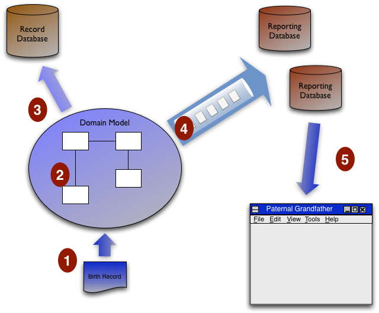

# Предварительное считывание данных

10 февраля 2009


[Мартин Фаулер](https://martinfowler.com/)

[ПРЕДМЕТНО-ОРИЕНТИРОВАННОЕ ПРОЕКТИРОВАНИЕ](https://martinfowler.com/tags/domain%20driven%20design.html)
[АРХИТЕКТУРА ПРИЛОЖЕНИЯ](https://martinfowler.com/tags/application%20architecture.html)

Одним из интересных докладов, который я посетил на конференции [QCon в Сан-Франциско](http://qconsf.com/), 
было сделан [Грегом Янгом](http://codebetter.com/blogs/gregyoung/) об определенной 
архитектуре, которую он использовал в недавней системе. Грег является большим 
поклонником [предметно-ориентированного проектирования](https://martinfowler.com/bliki/DomainDrivenDesign.html), в этом случае оно 
использовалось с системой, которая должна обрабатывать транзакций с высокой 
скоростью и предоставлять данные большому количеству пользователей. Было несколько 
вещей, которые мне показались интересными в его проекте , в частности, использование 
им [генерации событий](https://martinfowler.com/eaaDev/EventSourcing.html), но в этом посте я хочу остановиться только на одном 
аспекте — на том, что я назову "предварительное считывание данных".

Когда мы используем модель предметной области, мы используем ее, потому что она 
содержит сложную логику предметной области. Может быть полезно классифицировать 
эту логику предметной области на:

* **проверки**: проверяет, что ввод имеет смысл, а объекты можно использовать для 
  дальнейших действий.
* **команды**: инициируют некоторые действия, которые изменят состояние системы.
* **запросы**: выдают какую-то информацию, основываясь на сведениях, которые у нас есть.

Эти виды логики предметной области работают с обновлениями иначе, чем с чтениями. 
Давайте представим, что у нас есть генеалогическая система. Мы получаем 
обновление, которое является записью о рождении.

```
name: Bilbo Baggins
father: Bungo Baggins
mother: Belladonna Took
```

Когда мы отправляем эти данные, наша модель домена выполняет некоторую проверку 
(отец не совпадает с матерью). Она может создать некие команды (У Банго есть 
непогашенное наследство, на которое имел бы право Бильбо). А также запросы, но 
обычно только для выполнения проверок или команд (нам нужен список предков 
Бильбо, чтобы проверить что нет циклов в генеалогическом древе).

Когда мы читаем данные, обычно в игру вступает только логика запроса. Скажем, 
у нас есть запрос на отображение дедушки Бильбо по отцовской линии. Для этого 
требуется некоторая логика предметной области — знание того, что дед по отцовской 
линии является отцом отца. В большинстве систем мы запускаем эту логику чтения, 
когда получаем запрос на чтение. По сути, мы получаем запрос на чтение, обращаемся 
к базе данных для извлечения необработанных данных, запускаем любую необходимую 
логику и возвращаем результат (хотя можно использовать кэши, чтобы количество 
обращений).

Предварительное считывание данных работает совершенно по-другому. Здесь чтения 
вообще не используют основную базу данных. Вместо этого у нас есть одна или 
несколько баз данных [ReportingDatabase](https://martinfowler.com/bliki/ReportingDatabase.html), структурированных так же, как наши 
запросы на чтение. Любые запросы на чтение направляются непосредственно в них,
которые напрямую считывают данные и выдают их без участия логики предметной 
области.

Позвольте мне повторить это еще раз с помощью примера записи о рождении и этой 
диаграммы.



1. Мы получаем запись о рождении из пользовательского интерфейса.
2. Модель домена выполняет всю логику проверки и команд.
3. Модель предметной области обновляет основную информацию в базе данных записей.
4. Модель предметной области выполняет логику запроса, необходимую для всех 
   операций чтения (включая каждое отображение в пользовательском интерфейсе) и
   помещает сообщения об обновлении в очередь сообщений для заполнения баз 
   данных отчетов. Каждая база данных отчетов выбирает необходимые ей данные из 
   этих сообщений для обновления своих данных.
5. Запрос на чтение дедушки по отцовской линии поступает из пользовательского 
   интерфейса и удовлетворяется прямым чтением из таблицы дедушки по отцовской 
   линии в базе данных отчетов.

В случае Грега все это было сделано с помощью асинхронных сообщений, все входные 
данные обрабатывались как события ([Event Sourcing](https://martinfowler.com/eaaDev/EventSourcing.html)), модель предметной области 
обрабатывала сообщения из входной очереди и отправляла выходные события в 
выходные очереди для загрузки баз данных отчетов. Выполнение всего этого асинхронно 
помогает повысить общую производительность и масштабируемость. Это означает, что 
существует окно несоответствия, в котором вы можете выполнить обновление, немедленно 
выполнить чтение и не увидеть результат обновления, потому что вы щелкнули быстрее, 
чем сообщения могли быть обработаны. Эта асинхронная схема в конечном счете 
согласована по событию, но не строго согласована. Но такова природа зверя: в 
распределенной системе вы можете получить [согласованность или доступность, но 
не то и другое одновременно](http://www.allthingsdistributed.com/2008/12/eventually_consistent.html).

Теперь вы можете выполнять запросы с предварительным считыванием данных 
нераспределенным, строго согласованным образом. Я не могу навскидку вспомнить 
случай, когда я это видел. Я думаю, что вывод с предварительным чтением в основном 
становится привлекательным, когда вы имеете дело с распределёнными случаями с 
большой нагрузкой.

Предварительное считывание едва ли является чем-то новым. Этот метод старше меня 
(возможно, даже старше Рона Джеффриса), и большинство веб-сайтов с большими 
объемами постоянно заполняют базы данных данными запросов. Но это не та техника, 
которую я рассматриваю так часто, как следовало бы, и мне понравилось, как 
агрессивно Грег использовал ее в своем проекте.