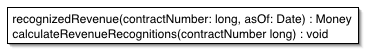

# Сценарий транзакции

_Организует бизнес-логику в процедуры, которые управляют каждая своим запросом._

Полное определение смотри в [Шаблонах корпоративных приложений](https://martinfowler.com/books/eaa.html)
на странице **110**

Большинство бизнес-приложений можно представить в виде набора транзакций. 
Какие-то из них выбирают данные, какие-то ‐ меняют. Каждое взаимодействие 
пользователя и системы содержит определённый набор действий. В некоторых случаях 
это может быть просто вывод данных из БД. В других случаях эти действия могут 
содержать в себе множество вычислений и проверок.

Шаблон Сценарий транзакции организует всю эту логику в одну процедуру, работая 
с БД напрямую или через тонкую обёртку. Каждая транзакция имеет свой
Сценарий транзакции, хотя общие подзадачи могут быть разбиты на процедуры.