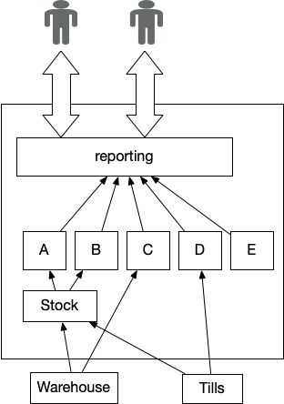

# Критический агрегатор

_Объединение данных из разных частей бизнеса для поддержки принятия важных решений_

Этот шаблон является частью «Шаблоны замены легаси».

19 января 2022

Ян Картрайт, Роб Хорн и Джеймс Льюис

***

СОДЕРЖАНИЕ
Как это работает
Когда использовать
Влияние легаси
Проблемы с всеобъемлющим критическим агрегатором

***

Бизнес-лидерам часто приходится принимать решения, на которые влияет широкий 
спектр деятельности всего предприятия. Например, производителю, понимающему из чего складывается
прибыль от реализации, может потребоваться информация о стоимости сырья, эксплуатационных 
расходах производственных мощностей, уровне продаж и ценах. Нужная информация, 
агрегированная по регионам, рынкам или по всей организации, должна быть доступна 
в понятной форме.

Критический агрегатор — это программный компонент, который знает, какие системы 
«посетить» для извлечения этой информации, какие файлы/таблицы/API проверять, 
как связать информацию из разных источников и бизнес-логику, необходимую для 
агрегирования этих данных. Он предоставляет эту информацию бизнес-лидерам через 
распечатанные таблицы, панель инструментов с диаграммами и таблицами или поток данных, 
который поступает в электронные таблицы потребителей.

По своей природе эти отчеты включают в себя получение данных из многих различных 
частей бизнеса, например, финансовых данных, данных о продажах, данных о клиентах 
и так далее. При реализации с использованием передовых практик, таких как 
инкапсуляция и разделение задач, это не создает особых архитектурных проблем. 
Однако мы часто сталкиваемся с определенными проблемами, когда это требование 
реализуется поверх устаревших систем, особенно монолитных приложений или 
хранилищ данных.

В устаревших реализациях этого шаблона почти всегда используется возможность 
доступа непосредственно к подкомпонентам для извлечения данных, которые ему 
нужны во время обработки. Это создает особенно неприятную связь, поскольку 
вышестоящие системы не могут развивать свои структуры данных из-за риска 
нарушить работу теперь [всеобъемлющего критического агрегатора](https://martinfowler.com/articles/patterns-legacy-displacement/critical-aggregator.html). 
Последствия такого провала особенно велики и очевидны из-за его критической 
роли в поддержке бизнеса и его лидеров.

Рисунок 1: Отчёт, используя всеобъемлющий агрегатор

## Как это работает

Во-первых, мы определяем какие входные данные необходимы для создания выходных 
данных, таких как отчет. Обычно исходные данные уже присутствуют в компонентах 
общей архитектуры. Затем мы создаем реализацию для «загрузки» исходных данных 
и обработки их для создания выходных данных. Главное здесь — убедиться, что мы 
не создаем тесную связанность со структурой исходных данных или не нарушаем инкапсуляцию 
существующего компонента, чтобы получить нужные нам данные. На уровне базы данных 
это может быть достигнуто с помощью ETL (извлечение, преобразование, загрузка) 
или с помощью API на уровне сервиса. Стоит отметить, что подходы ETL часто 
связаны либо с исходным, либо с конечным форматом; в долгосрочной перспективе 
это может стать препятствием для изменений.

Обработка может выполняться запись за записью, но для более сложных сценариев 
может потребоваться промежуточное состояние, когда следующий шаг обработки 
запускается после того, как эти промежуточные данные будут готовы. Таким образом, 
во многих реализациях используется конвейер, набор [потоков и фильтров](https://www.amazon.com/Pattern-Oriented-Software-Architecture-System-Patterns/dp/0471958697), при этом 
выходные данные одного шага становятся входными данными для следующего шага.

Своевременность данных является ключевым фактором, мы должны убедиться, что мы 
используем исходные данные в нужное время, например, после окончания торгового 
дня. Это может создать временные зависимости между агрегатором и исходными 
системами.

Один из подходов состоит в том, чтобы запускать события в определенное время, 
хотя этот подход уязвим для задержек в любой исходной системе. Например, 
запускайте агрегатор в 3 часа ночи, однако в случае задержки в каких-либо из
исходных систем, агрегированные результаты могут быть основаны на устаревших 
или поврежденных данных. Другой более надежный подход заключается в том, чтобы 
исходные системы отправляли или публиковали исходные данные, как только они 
были готовы, а агрегатор запускался, как только все данные были доступны. В 
этом случае агрегированные результаты задерживаются, но должны, по крайней 
мере, основываться на достоверных входных данных.

Мы также можем гарантировать, что исходные данные снабжены метками времени, хотя 
это зависит от исходных систем, которые уже имеют правильные данные о времени 
или их легко изменить, что может быть не так для устаревших систем. Если 
доступны данные с временными метками, мы можем применить более сложную 
обработку, чтобы обеспечить согласованные и достоверные результаты, такие как 
[значение версии](https://martinfowler.com/articles/patterns-of-distributed-systems/versioned-value.html).

## Когда использовать

Этот шаблон используется, когда у нас есть реальная потребность получить общее 
представление о многих различных частях или доменах в бизнесе, обычно когда нам 
нужно сопоставить данные из разных доменов в сводное представление или набор 
показателей, которые используются для поддержки принятия решений.

## Влияние легаси

Учитывая прошлые ограничения пропускной способности сети и скорости ввода-вывода, 
часто имело смысл размещать обработку данных на той же машине, что и хранилище 
данных. Для хранения больших объемов данных с разумным временем доступа часто 
требовалось специализированное оборудование, что привело к решениям с 
централизованным хранением данных. Сочетание этих двух недостатков привело к 
тому, что многие устаревшие реализации этого шаблона тесно связаны с исходными 
структурами данных, зависят от расписания и времени обновления данных, причем 
реализации часто выполняются на том же оборудовании, что и хранилище данных.

Получившийся [**всеобъемлющий критический агрегатор**](https://martinfowler.com/articles/patterns-legacy-displacement/critical-aggregator.html) уходит своими корнями во 
множество различных частей общей системы, что делает его очень сложным для 
извлечения. Вообще говоря, есть два подхода к его замене. Первый подход 
заключается в создании новой реализации критического агрегатора, что может 
быть осуществлено путем [перенаправления потока](https://martinfowler.com/articles/patterns-legacy-displacement/divert-the-flow.html) в сочетании с другими шаблонами, 
такими как [возврат к источнику](https://martinfowler.com/articles/patterns-legacy-displacement/revert-to-source.html). Альтернативный, более распространенный подход 
состоит в том, чтобы оставить агрегатор на месте, но использовать методы, такие
как [имитация легаси](https://martinfowler.com/articles/patterns-legacy-displacement/legacy-mimic.html) для предоставления необходимых данных во время замены. 
Очевидно, что со временем потребуется новая реализация.

## Проблемы с [всеобъемлющим критическим агрегатором](https://martinfowler.com/articles/patterns-legacy-displacement/critical-aggregator.html)

Для большинства устаревших реализаций критического агрегатора характерно 
отсутствие инкапсуляции исходных данных, при этом любая обработка напрямую 
зависит от структуры и формы различных форматов исходных данных. У них также 
плохое разделение задач из-за смешанного кода обработки и доступа к данным. 
Большинство реализаций написаны на языках пакетной обработки данных.

Антипаттерн характеризуется высокой степенью связанности внутри системы, 
особенно когда реализации напрямую обращаются к исходным данным без какой-либо 
инкапсуляции. Таким образом, любое изменение исходной структуры данных немедленно 
повлияет на обработку и выходные данные. Обычный подход к этой проблеме — 
заморозить форматы исходных данных или добавить процесс управления изменениями 
ко всем исходным данным. Этот процесс управления изменениями может стать очень 
сложным, особенно при наличии больших иерархий исходных данных и систем.

[Всеобъемлющий критический агрегатор](https://martinfowler.com/articles/patterns-legacy-displacement/critical-aggregator.html)
также плохо масштабируется по мере роста объема данных, 
поскольку отсутствие инкапсуляции делает проблематичным введение любой оптимизации 
или параллельной обработки, мы видим, что время выполнения увеличивается с 
объемом данных. Поскольку механизмы обработки и доступа к данным 
связаны друг с другом, это может привести к необходимости вертикального 
масштабирования всей системы. Это очень дорогой способ масштабирования обработки, 
которую, в лучше инкапсулированной системе, можно было бы выполнять на обычном 
оборудовании отдельно от любого хранилища данных.

[Всеобъемлющий критический агрегатор](https://martinfowler.com/articles/patterns-legacy-displacement/critical-aggregator.html), 
как правило, подвержен проблемам с синхронизацией. Несвоевременное обновление 
исходных данных может задержать агрегацию или привести к ее запуску на основе 
устаревших данных, что, учитывая критический характер агрегированных отчетов, 
может вызвать серьезные проблемы для бизнеса. Прямой доступ к исходным данным 
во время обработки означает, что реализации обычно имеют определенное «безопасное 
временное окно», в течение которого исходные данные должны быть актуальными, 
оставаясь при этом стабильными и неизменными. Эти временные окна обычно не 
навязываются системой (системами), а вместо этого часто являются соглашением, 
задокументированным в другом месте.

По мере увеличения продолжительности обработки это может создать временные ограничения 
для систем, создающих исходные данные. Если у нас есть фиксированное время в течении которого
должен быть готов окончательный результат, то любое увеличение времени обработки, 
в свою очередь, означает, что любые исходные данные должны быть актуальными и 
стабильными раньше. Эти различные временные ограничения делают проблематичным 
обработку данных из разных часовых поясов, поскольку любое ночное «безопасное 
временное окно» может начать перекрываться с обычным рабочим временем в других 
странах мира. Проблемы с синхронизацией и временем обработки являются очень распространенным 
источником ошибок и багов с этим шаблоном, их может быть сложно диагностировать.

Модификация и тестирование также затруднены из-за плохого разделения проблем 
между обработкой и доступом к исходным данным. Со временем этот код расширяется 
из-за добавления костылей для исправления ошибок, изменения формата исходных 
данных, а также включения любых новых функций. Обычно мы обнаруживаем, что 
большинство устаревших реализаций критического агрегатора находятся в «замороженном» 
состоянии из-за этих проблем, а также из-за бизнес-риска, связанного с тем, что
данные могут быть неправильными. Из-за сильной связанности любое замораживание 
изменений имеет тенденцию распространяться на исходные данные и, следовательно, 
на соответствующие исходные системы.

Мы также склонны видеть «раздутые» выходные данные агрегатора, поскольку, 
учитывая вышеперечисленные проблемы, часто бывает проще расширить существующий 
отчет, чтобы добавить новый фрагмент данных, чем создавать совершенно новый отчет.
Это увеличивает размер и сложность реализации, а также повышает важность 
каждого отчета для бизнеса. Это также может затруднить замену, поскольку 
сначала нам нужно обнаружить каждое использование выходных данных агрегатора, 
чтобы выяснить, существуют ли отдельные группы пользователей, чьи потребности 
можно было бы удовлетворить с помощью более простых и целенаправленных выходных 
данных.

Часто можно увидеть реализации этого (анти-)шаблона в языках COBOL и ассемблере, 
это демонстрирует как сложность замены, так и то, насколько важными могут быть 
выходные данные для бизнеса.

> Эта страница является частью статьи:
>
> Шаблоны замены легаси
> 
> Ян Картрайт, Роб Хорн и Джеймс Льюис
>
> 
>
> [Основная статья](https://martinfowler.com/articles/patterns-legacy-displacement/)
>
> Шаблоны
>
> [Критический агрегатор](https://martinfowler.com/articles/patterns-legacy-displacement/critical-aggregator.html)
> [Перенаправление потока](https://martinfowler.com/articles/patterns-legacy-displacement/divert-the-flow.html)
> [Извлечение важных рабочих процессов](https://martinfowler.com/articles/patterns-legacy-displacement/extract-product-lines.html)
> [Эквивалентный функционал](https://martinfowler.com/articles/patterns-legacy-displacement/feature-parity.html)
> [Имитация легаси](https://martinfowler.com/articles/patterns-legacy-displacement/legacy-mimic.html)
>
> ## Список значимых изменений
>
> 19 января 2022