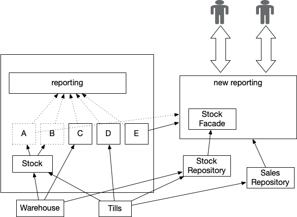

# Перенаправление потока

_В первую очередь перенаправьте межорганизационную деятельность, чтобы
она не использовала легаси_

СОДЕРЖАНИЕ
Как это работает
Сопоставление источников данных
Требования пользователя
Поймите, в каком виде создаются выходные данные
Доставка и тестирование
Переводим в продакшен
Мониторинг и оповещение
Когда использовать
Хранилища данных

Общей чертой устаревших систем является [критический агрегатор](https://martinfowler.com/articles/patterns-legacy-displacement/critical-aggregator.html), 
как следует из названия, он производит информацию, жизненно важную для ведения 
бизнеса, и, следовательно, не может быть нарушен. Однако в легаси 
этот шаблон почти всегда превращается в всеобъемлющую высокосвязанную реализацию, 
эффективно замораживая себя и вышестоящие системы.

.png)

Рисунок 1: Отчёт, используя всеобъемлющий агрегатор

Перенаправление потока — это стратегия, запускающая замену легаси, 
создавая новую реализацию критического агрегатора, которая, насколько это 
возможно, отделена от вышестоящих систем (источников данных), необходимых для 
работы. Как только эта новая реализация будет готова, мы сможем отключить 
устаревшую реализацию и, следовательно, получим гораздо больше свободы для 
изменения или перемещения различных восходящих источников данных.

Рисунок 2: Извлекаем критический агрегатор

Альтернативный подход к замене, когда у нас есть [критический агрегатор](https://martinfowler.com/articles/patterns-legacy-displacement/critical-aggregator.html), 
состоит в том, чтобы заменить его в последнюю очередь. Мы можем заменить 
вышестоящие системы, но нам нужно использовать [имитатор легаси](https://martinfowler.com/articles/patterns-legacy-displacement/legacy-mimic.html), чтобы 
агрегатор в рамках легаси продолжал получать нужные ему данные.

Любой вариант требует использования [переходной архитектуры](https://martinfowler.com/articles/patterns-legacy-displacement/transitional-architecture.html) с временными 
компонентами и интеграциями, необходимыми во время работы по замене, 
чтобы либо поддерживать агрегатор, остающийся на месте, либо передавать данные 
в новую реализацию.

## Как это работает

Перенаправление потока создаёт новую реализацию функционала, в данном примере 
это [критический агрегатор](https://martinfowler.com/articles/patterns-legacy-displacement/critical-aggregator.html). Первоначально эта реализация может получать данные 
из существующих легаси систем, например, с помощью шаблона [перехвата событий](https://martinfowler.com/articles/patterns-legacy-displacement/event-interception.html).
В качестве альтернативы может быть проще и полезнее получить данные из самих 
исходных систем с помощью [возврата к источнику](https://martinfowler.com/articles/patterns-legacy-displacement/revert-to-source.html). На практике мы видим 
комбинацию обоих подходов.

Агрегатор изменит источники данных, которые он использует, поскольку 
существующие вышестоящие системы и компоненты сами заменяются вместо устаревших, 
поэтому его зависимость от устаревших со временем снижается. Наша новая реализация 
агрегатора также может использовать возможности для улучшения формата, качества 
и своевременности данных по мере миграции исходных систем на новые реализации.

## Сопоставление источников данных

Если мы собираемся извлечь и повторно реализовать критический агрегатор, нам 
сначала нужно понять, как он связан с остальным унаследованным имуществом.
Это означает анализ и понимание конечного источника данных, используемых для 
агрегирования. Здесь важно помнить, что нам нужно добраться до конечной 
восходящей системы. Например, в то время как мы могли бы рассматривать мейнфрейм, 
скажем, как источник достоверной информации о продажах, сами данные могли бы 
исходить из кассовых систем в магазине.

Ключевым моментом является создание диаграммы, показывающей агрегатор вместе с 
зависимостями восходящего и нисходящего потоков. Здесь может хорошо работать 
контекстная диаграмма системы или что-то подобное; мы должны убедиться, что 
точно понимаем, какие данные поступают из каких систем и как часто. Обычно 
легаси решения являются узким местом в данных: дополнительные полезные 
данные из (более новых) исходных систем часто отбрасываются, поскольку их было 
слишком сложно собрать или представить в устаревших. Учитывая это, нам также 
необходимо зафиксировать, какие исходные данные отбрасываются и где.

## Требования пользователя

Очевидно, нам нужно понять, как функционал, который мы планируем "перенаправить"
используется конечными пользователями. В [критическом агрегаторе](https://martinfowler.com/articles/patterns-legacy-displacement/critical-aggregator.html) у нас часто есть 
очень большое количество пользователей для каждого отчета или метрики.
Это классический пример того, как [эквивалентный функционал](https://martinfowler.com/articles/patterns-legacy-displacement/feature-parity.html) может привести к перестройке
набора «раздутых» отчетов, которые на самом деле не соответствуют текущим 
потребностям пользователей. Упрощенный набор небольших отчетов и информационных 
панелей может быть лучшим решением.

Параллельный запуск может быть необходим, чтобы убедиться, что ключевые числа 
совпадают во время первоначальной реализации, что позволяет бизнесу убедиться, 
что все работает так, как ожидалось.

## Поймите, в каком виде создаются выходные данные

В идеале мы хотим понять, как создаются текущие выходные данные. Одной из методик
является использование диаграммы последовательности для документирования 
порядка приема и обработки данных в устаревшей системе или даже просто блок-схемы.
Однако при попытках создать полную картину существующей реализации нередко 
обнаруживается, что важная информация была упущена из виду. В некоторых случаях 
легаси код может быть единственной «документацией» о том, как все работает, и 
понять как это работает может быть очень сложно или дорогостояще.

Один из авторов работал с клиентом, который использовал экспорт из устаревшей системы 
вместе с очень сложной электронной таблицей для выполнения ключевых финансовых 
расчетов. В настоящее время никто в организации не знал, как это работает, к 
счастью, мы связались с недавно вышедшим на пенсию сотрудником. К сожалению, 
когда мы поговорили с ними, выяснилось, что они унаследовали электронную таблицу 
от предыдущего сотрудника десять лет назад, и, к сожалению, этот человек 
скончался несколько лет назад. Реверс-инжиниринг легаси отчета и (дважды измененной)
электронной таблицы Excel было более трудоемким, чем возвращение к первоначальным 
принципам и определение заново того, что должен делать расчет.

Хотя мы, возможно, не собираемся обеспечивать эквивалентный функционал
в замещающей конечной точке, нам по-прежнему нужны основные результаты, чтобы 
«согласоваться» с устаревшей версией. Используя наш пример агрегации, мы могли 
бы теперь создавать почасовые отчеты о продажах для магазинов, однако 
бизнес-руководителям по-прежнему нужны итоги на конец месяца, и они должны 
коррелировать с любыми существующими числами. Нам нужно работать с конечными 
пользователями, чтобы создать проработанные примеры ожидаемых результатов для 
заданных тестовых входных данных, это может быть жизненно важно для определения 
того, какая система, старая или новая, является «правильной» позже.

## Доставка и тестирование

Мы обнаружили, что этот шаблон хорошо подходит для итеративного подхода, когда 
мы создаем новый функционал по частям. В случае с критическим агрегатором это
означает предоставление каждого отчета постепенно, полностью перенося их в 
продакшен среду. Затем мы можем использовать [параллельную работу](https://www.thoughtworks.com/radar/techniques/parallel-run-with-reconciliation)
для мониторинга доставленных отчетов по мере того, как мы создаем оставшиеся,
в дополнение к тому, чтобы пользователи бета-версии давали ранние отзывы.

Наш опыт показывает, что многие устаревшие отчеты содержат необнаруженные 
проблемы и ошибки. Это означает, что новые результаты редко, если вообще 
когда-либо, совпадают с существующими. Если мы не полностью понимаем 
унаследованную реализацию, часто очень трудно понять причину несоответствия.
Одним из способов смягчения последствий является использование автоматизированного 
тестирования для ввода известных данных и проверки результатов на этапе реализации.
В идеале мы должны сделать это как с новыми, так и с устаревшими реализациями, 
чтобы мы могли сравнивать выходные данные для одного и того же набора известных 
входных данных. На практике, однако, из-за отсутствия устаревших тестовых сред и 
сложности ввода данных мы часто просто делаем это для новой системы, что 
является нашим рекомендуемым минимумом.

Обычно в устаревшей агрегации можно найти "костыли", очевидно, важно попытаться 
отследить их во время миграции. Самый распространенный пример — когда отчеты, 
необходимые руководству, на самом деле недоступны в устаревшей реализации, 
поэтому кто-то вручную манипулирует отчетами, чтобы создать фактические 
результаты, которые они видят — это часто занимает дни. Поскольку никто не 
хочет говорить руководству, что отчетность на самом деле не работает, они 
часто остаются в неведении, как на самом деле все работает.

## Переводим в продакшен

Как только мы убедимся, что функционал в новом агрегаторе верен, мы можем 
перенаправить пользователей на новое решение, это можно сделать поэтапно. Это 
может означать внедрение отчетов для ключевых групп пользователей, период 
параллельного запуска и, наконец, переход к ним с использованием только новых 
отчетов.

## Мониторинг и оповещение

Наличие правильного автоматизированного мониторинга и предупреждений жизненно 
важно для перенаправления потоков, особенно когда зависимости все еще находятся 
в устаревших системах. Вам необходимо следить за тем, чтобы обновления 
поступали так, как ожидалось, находятся в известных допустимых пределах, а 
также за тем, чтобы конечные результаты находились в допустимых пределах.
Выполнение этой проверки вручную может быстро стать большой работой и может 
создать источник ошибок и задержать продвижение вперед. В целом мы рекомендуем 
устранять любые проблемы с данными, обнаруженные в вышестоящих системах, 
поскольку мы хотим избежать повторного внедрения ранее используемых "костылей" 
в наше новое решение. В качестве дополнительной меры безопасности мы можем 
параллельно запустить обе системы на некоторое время и, выборочно используя 
инструменты согласования, создать предупреждение, если старая и новая 
реализации начнут слишком сильно отличаться.

## Когда использовать

Этот шаблон наиболее полезен, когда у нас есть сквозной функционал в 
унаследованной системе, которая, в свою очередь, имеет «восходящие» зависимости 
от других частей легаси. Наиболее распространенным примером является 
критический агрегатор. По мере того, как со временем добавляется все больше и 
больше функций, эти реализации могут стать не только критически важными для 
бизнеса, но и большими и сложными.

Часто используемый подход к этой ситуации заключается в том, чтобы оставить 
миграцию этих «агрегаторов» напоследок, поскольку очевидно, что они имеют 
сложные зависимости от других частей легаси. Это создает потребность в постоянном
обновлении легаси данными и событиями, когда мы находимся в процессе извлечения 
компонентов восходящего потока. В свою очередь, это означает, что пока мы не 
перенесем сам «агрегатор», эти новые компоненты останутся в некоторой степени 
связанными со структурами данных легаси и частотой обновления. У нас также 
есть большая (и часто важная) группа пользователей, которые вообще не видят 
никаких улучшений почти до конца общих усилий по миграции.

Перенаправление потока предлагает альтернативу этому подходу «оставить до 
конца», он может быть особенно полезен, когда стоимость и сложность продолжения 
работы с устаревшим агрегатором значительны, или когда соответствующие изменения 
бизнес-процессов означают, что отчеты, например, должны быть изменены и 
адаптированы во время миграции.

Повышение частоты обновления и своевременности данных часто является ключевым 
требованием при модернизации устаревших проектов. Перенаправление потока дает
возможность внести улучшения в эти области на раннем этапе проекта миграции, 
особенно если мы можем применить [возврат к источнику](https://martinfowler.com/articles/patterns-legacy-displacement/revert-to-source.html).

## Хранилища данных

Мы часто сталкиваемся с требованием «поддерживать хранилище данных» во время
миграции легаси, поскольку это место, где фактически создаются ключевые отчеты 
(или аналогичные). Если окажется, что хранилище данных само по себе является 
устаревшей системой, мы можем «перенаправить поток» данных из него на какое-то 
новое лучшее решение.

Несмотря на то, что новые системы могут обеспечивать идентичную передачу данных 
в хранилище, необходимо соблюдать осторожность, поскольку на практике мы снова 
связываем наши новые системы с устаревшим форматом данных вместе с сопутствующими 
компромиссами, "костылями" и, что очень важно, частотой обновления. Мы видели, 
как организации заменяли значительную часть легаси, но по-прежнему застревали в 
ведении бизнеса с легаси данными из-за зависимостей и проблем с их решением для
хранилища данных.

> Эта страница является частью статьи:
>
> Шаблоны замены легаси
>
> Ян Картрайт, Роб Хорн и Джеймс Льюис
>
> 
>
> [Основная статья](https://martinfowler.com/articles/patterns-legacy-displacement/)
>
> Шаблоны
>
> [Критический агрегатор](https://martinfowler.com/articles/patterns-legacy-displacement/critical-aggregator.html)
> [Перенаправление потока](https://martinfowler.com/articles/patterns-legacy-displacement/divert-the-flow.html)
> [Извлечение важных рабочих процессов](https://martinfowler.com/articles/patterns-legacy-displacement/extract-product-lines.html)
> [Эквивалентный функционал](https://martinfowler.com/articles/patterns-legacy-displacement/feature-parity.html)
> [Имитация легаси](https://martinfowler.com/articles/patterns-legacy-displacement/legacy-mimic.html)
>
> ## Список значимых изменений
>
> 19 января 2022