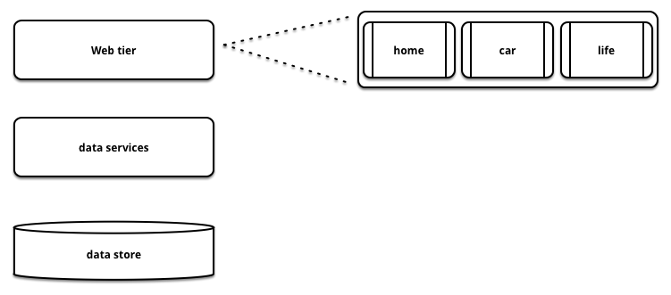
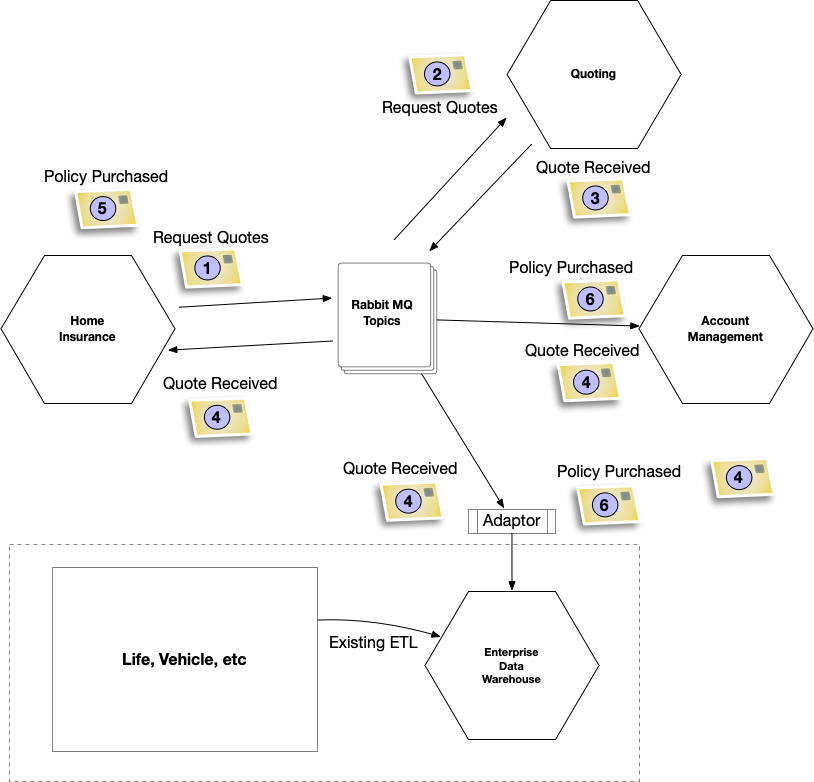

# Извлечение продуктовых линеек

_Определите и разделите системы по продуктовым линиям_

Этот шаблон является частью «Шаблоны замены легаси».

21 июля 2022

Ян Картрайт, Роб Хорн и Джеймс Льюис

СОДЕРЖАНИЕ

Как это работает
Когда использовать
Пример со страховкой

Многие приложения созданы для обслуживания нескольких продуктовых линеек в 
одной физической системе. Часто это обусловлено стремлением к повторному 
использованию. «Хм, потребительские кредиты очень похожи на бизнес-кредиты» 
или «одежда — это товар, как и шторы на заказ, насколько они могут 
отличаться?». Основная проблема, с которой мы сталкиваемся, заключается в 
том, что внешне логика работы выглядит одинаково, но она очень разная, когда дело 
доходит до деталей.

Со временем отдельные системы, обслуживающие несколько продуктов, могут стать 
слишком универсальными, а код будет развиваться для обработки всех возможных 
комбинаций всех возможных продуктов. Например, для универсальной системы, 
предназначенной для обработки n продуктов с n изменениями в каждом продукте, 
количество тестов, которое необходимо выполнить для проверки всех возможных 
комбинаций, равно n факториалу. Это число, которое быстро становится большим. 
Это также объясняет, почему многие из приложений этого типа, с которыми 
столкнулись авторы, имели очень мало автоматизированного покрытия тестами, 
вместо этого полагаясь на огромные, часто ручные регрессионные наборы. Просто 
невозможно протестировать столько разных кодовых путей.

Таким образом, проблема часто связана с экономикой. Трудно согласиться с тем, 
что разработка и поддержка системы для каждого продукта может быть более 
выгодной с экономической точки зрения, чем разработка и поддержка одной 
системы. Разбивая по продуктам, мы используем тот факт, что изменения в 
несколько продуктов могут быть внесены одновременно, и снижаем риск, избегая 
комбинаторного взрыва изменений, который может привести к появлению дефектов в 
нежелательных местах.

Конечно, это компромисс — нам не нужны отдельные приложения для красных брюк и 
черных брюк, но мы можем захотеть иметь одно приложение для готовых, а другое - для 
сделанных на заказ товаров или одно - для страхования жилья и другое - для страхования
домашних животных.

Также часто разные линейки продуктов имеют очень разные потоки создания 
ценности, как описано в разделе [Извлечение потоков создания ценности](https://martinfowler.com/articles/patterns-legacy-displacement/extract-value-streams.html).

> ### Что касается условных операторов
> 
> В другом примере из сферы розничных банковских услуг статический анализ 
> привел нас к классу Java с 61 вложенным оператором if. Это привело Даниэля 
> Терхорст-Норта к выводу, что не существует правильного количества вложенных 
> операторов if, поскольку если у вас есть один оператор if, совершенно 
> нормально добавить еще один, но если у вас их 60, что еще вы собираетесь 
> делать? По общему признанию, этот пример является патологическим, но он 
> иллюстрирует, как единая кодовая база, обслуживающая несколько продуктов — в 
> данном случае кредитов, — может развиваться, если мы не будем осторожны.

## Как это работает

**Определите продукт или линейку продуктов в системе.** Это сформирует тонкое разграничение 
для построения/миграции. Найдите весь функционал, который предоставляет 
существующая система, и сопоставьте их с новым продуктом. Мы склонны смотреть 
через разные призмы при определении функционала, данных, процессов, пользователей 
и т. д.

**Определите общий функционал.** Определите, есть ли у разных линеек продуктов 
общий функционал BusinessCapabilities. Есть несколько подходов к этому, которые 
мы рассмотрим в статье «Понимание возможностей вашего бизнеса». Мы советуем, 
как всегда, ценить использование, а не повторное использование, поэтому, если 
вы сомневаетесь, постарайтесь максимально ограничить количество общего функционала.

Выберите какую линейку отделить сначала. Какие линейки продуктов вы 
собираетесь разделить в первую очередь? Один из подходов, который нам нравится, — 
думать с точки зрения риска. Поняв риск для бизнеса, связанный с миграцией, мы 
часто предпочитаем использовать *вторую по степени риска линейку продуктов*.
Это может показаться нелогичным, и что мы должны сначала выбрать наименее 
рискованный вариант, но на самом деле мы хотели бы определить продукт, который 
достаточно содержателен, чтобы привлечь внимание бизнеса и заставить его 
расставить приоритеты в финансировании, но не настолько рискован, чтобы бизнес 
потерпел неудачу, если начнутся проблемы.

**Определите целевую архитектуру программного обеспечения.** Очень редко мы 
советуем замену «большим взрывом», что в данном случае означало бы создание 
всего программного обеспечения для всех продуктов одновременно. Вместо этого 
постарайтесь определить подходящую архитектуру для тонкого слоя, указанного на 
шаге 1.

**Определите свою стратегию технической миграции.** Как мы обсуждали в разделе о 
шаблонах миграции технологий, существует ряд различных вариантов, которые можно 
развернуть в зависимости от текущих ограничений. Если это простое веб-приложение, 
можно использовать ForkByUrl. В других случаях, когда подходит ForkingOnIngress, 
может быть лучше выбрать шаблон MessageRouter. Имейте в виду, что может 
потребоваться TransitionalArchitecture.

## Когда использовать

У вас есть система с легко идентифицируемыми линиями продуктов, которые 
выиграют от:

1. Разработки по отдельности. Разделение системы на отдельные продукты означает, 
   что команды могут быть сформированы вокруг отдельных продуктов, что позволяет 
   добиться прогресса без типичных проблем координации изменений, включая ад 
   слияния и длинные циклы регрессии.
2. Имеют разные нефункциональные характеристики. Вы хотите иметь возможность 
   предлагать разные SLO для каждого продукта. Например, разные требования к 
   нагрузке для данной задержки.
3. Различные скорости изменения. Некоторые линейки продуктов стабильны, 
   в то время как другие продукты находятся в стадии активного развития. 
   Разделение системы означает, что вы не рискуете внести изменения в стабильные 
   продукты.

## Пример со страховкой

В сфере страхования разные типы продуктов имеют очень разные характеристики. 
Например, страхование транспортных средств, как правило, предполагает большие 
объемы, но низкую маржу, тогда как страхование жилья — наоборот. Кроме того, 
здесь высокая конкуренция, поэтому очень важна возможность быстро вносить 
изменения. Одна страховая компания, с которой мы работали, разработала 
трехуровневую архитектуру, которая служила механизмом котировок для всех 
различных продуктов, предлагаемых страховщиком, включая линии транспортных 
средств, жизни, дома и домашних животных, как показано на рисунке 1.

## Поймите каких результатов, вы хотите достичь

> ## Проблема со слоями
> 
> В течение многих лет было принято думать в первую очередь об архитектуре 
> системы, а уже потом об архитектуре бизнеса или продукта. Это привело как к 
> преобладанию n-уровневых систем на предприятиях, так и к устаревшим продуктам 
> COTS. Многие системы, построенные таким образом, страдают от длительного 
> времени выполнения всех изменений, поскольку они должны быть скоординированы 
> на всех n уровнях.
> 
> В многоуровневых системах, которые обслуживают несколько продуктов, как 
> правило, невозможно масштабировать систему по-разному для каждой линейки 
> продуктов. Очень необычно, чтобы несколько продуктов имели одинаковые 
> нефункциональные характеристики. Это не означает, что многослойность вообще 
> плоха, на самом деле это [хорошая вещь для организации кодовых баз](https://martinfowler.com/bliki/PresentationDomainDataLayering.html).

Владельцы продукта для бизнеса все больше разочаровывались в том, что время 
подготовки к изменениям было долгим и становилось все более длинным. Они решили 
привлечь Thoughtworks, чтобы взглянуть на их архитектуру и процессы разработки, 
чтобы посмотреть, сможем ли мы определить, почему дела обстоят так плохо. Карта 
потока создания ценности для процесса разработки выявила ряд ограничений, которые 
способствовали резкому увеличению времени выполнения работ. В то время как каждая 
техническая область была отделена от других, различные области бизнеса были тесно 
связаны друг с другом. Это означало, что добавление нового требования к продукту 
«Транспорт» часто затрагивало «Дом», «Жизнь» и так далее. Эти изменения 
требовали как тщательного обдумывания, так и обширного регрессионного 
тестирования перед обычно сложным развертыванием. Многопродуктовая архитектура 
также накладывала ограничения на количество людей, способных безопасно работать 
с кодовой базой, что еще больше замедляло прогресс.

Наконец, из-за требований к объему линейки продуктов Vehicle и роста бизнеса 
используемое хранилище данных приходилось часто масштабировать, что требовало 
простоя для всех других продуктов, размещенных в системе.

## Решите, как разбить проблему на более мелкие части

В результате страховая компания решила перейти от многоуровневой архитектуры, 
организованной вокруг технических возможностей, к архитектуре, организованной 
по линейкам продуктов. Продукты уже определены: страхование автомобиля, дома, 
жизни и домашних животных. После того, как это стало понятно, были определены 
различный функционал, в котором они нуждались, например, отдельные наборы 
вопросов, котировки и учетная запись клиента, а также дополнительные технические 
возможности, такие как аутентификация и авторизация. Учетная запись клиента 
была определена как ключевой общий функционал, которую будут использовать все 
линейки продуктов, что является хорошим примером принятия подхода 
«Координация» из «Магического квадранта» EA, который более подробно описан в 
[Кольце всевластия](https://martinfowler.com/articles/patterns-legacy-displacement/one-true-ring.html).

Следующее, что нужно было сделать, это определить, с чего начать. В порядке 
доходов компании продуктовые линейки оценивались как «Автомобиль», «Дом», «Жизнь» 
и «Домашнее животное». В то время как с точки зрения количества клиентов порядок 
был обратным. В результате было решено, что страхование жилья будет первой 
линейкой продуктов, реализованной отдельно. Это сбалансированный риск для 
бизнеса, если что-то пойдет не так, с достаточным доходом, чтобы сделать 
выбор важным.

## Успешно разработать по частям

> На этой картинке многое происходит, но, по сути, она показывает очень высокий 
> уровень взаимодействия между подмножеством различного функционала, необходимого
> для продажи страховки клиенту.
> 
> 1. После того, как клиент заполнил множество вопросов, необходимых страховщикам 
>    для составления котировок, и отправил свою форму (известную в предметной области 
>    как «Риск»), приложение Home Insurance публикует команду RequestQuote.
> 2. Quoting Engine, подписанный на очередь в RabbitMQ, получает команду RequestQuote 
>    и выполняет свою работу (за кулисами отправляет ряд внутренних и внешних запросов 
>    к партнерам, брокерам и т. д.) В случае с этим страховщиком это включало 
>    отправку запросов различных типов и использование различных протоколов 
>    для более чем 40 других страховых компаний. Честно говоря, если бы для этого 
>    существовал стандарт, все было бы намного проще!
> 3. По мере получения ответов от нижестоящих систем события `QuoteReceived` 
>    передаются механизмом Quoteing Engine в другую очередь RabbitMQ.
> 4. Далее происходит ряд событий, поскольку ряд функционала в дополнение к 
>    системе страхования жилья заинтересованы в том, чтобы предложение было 
>    получено. К ним относятся функционал управления учетными записями и 
>    корпоративное хранилище данных (EDW). К счастью, этот функционал также 
>    подписан на правильную очередь и могут подхватывать эти события по мере 
>    необходимости.
> 5. Затем клиент может решить перейти к одному из предложений, чтобы фактически 
>    купить страховку, и щелкнуть, чтобы сделать это. В этот момент публикуется 
>    событие PolicyPurchased, и система страхования жилья хвалит себя за хорошо 
>    выполненную работу.
> 6. Наконец, любой другой функционал, заинтересованный в событии PolicyPurchased,
>    снова получают его через RabbitMQ и выполняют свои функции (сохраняют его 
>    для отчетности в случае EDW и для того, чтобы клиент мог легко получить его 
>    позже в случае управления учетной записью).
>
> Одним из приятных аспектов такого использования публикуемых бизнес-событий 
> была простота обновления зависимых систем, таких как хранилище данных. В этом 
> случае команда создала простой адаптер поверх EDW, который превращал то, что 
> происходит в новом мире, в звездную схему, необходимую для старого.

На приведенном выше рисунке показана архитектура, управляемая событиями, которую 
команда начала создавать. Связь с механизмом предложений и возможностями 
управления клиентами осуществлялась посредством событий, передаваемых по шине 
сообщений RabbitMQ. Эти события также передавались в существующее корпоративное 
хранилище данных для отчетности.

По мере того, как команда создавала новые системы рядом с существующей, велась 
подготовка к перекрытию трафика с устаревшей системы на новую. Одним из недостатков 
переноса всей линейки продуктов было то, что набор вопросов должен был быть 
реализован полностью, прежде чем клиенты могли быть переключены. Из-за этого 
ограничения новая система перешла в фазу бета-тестирования, где некоторым 
клиентам была предложена возможность подписаться на использование бета-версии. 
Те, кто согласился, также имели возможность оставить отзыв о новом внешнем виде. 
По мере того, как новая система постепенно совершенствовалась и добавлялись 
последние косметические функции, было принято окончательное решение, и клиенты 
были постепенно перенаправлены на новую систему в течение нескольких недель. 
Сначала один процент, затем пять, затем десять процентов и т. д. Это позволило 
команде и бизнесу поверить в то, что новая система работает так, как ожидалось, 
как с функциональной, так и с нефункциональной точки зрения. Наконец, новая 
система обслуживала сто процентов трафика по страхованию жилья. Затем команда 
перешла к постоянной разработке продукта.

## Изменить мышление организации, что позволит происходить этому на постоянной основе

После успеха первой миграции внимание было обращено на следующую задачу: отделение 
страхования транспортных средств с использованием того же подхода, и схема 
повторялась до тех пор, пока миграция не была завершена и старая система не 
была отключена.

Тем временем и постепенно вся техническая организация перешла от проектного 
подхода к разработке к продуктово-ориентированному. Это, конечно, были проблемы 
с прорезыванием зубов. Владение продуктом — это навык, который нужно развивать 
со временем, поэтому переход был постепенным. Они также приняли тот же подход к 
традиционным ИТ-операциям и под руководством технического директора и главного 
архитектора перешли к платформенному подходу к разработке продуктов для 
инфраструктуры по запросу, а затем к данным и аналитике.

> Эта страница является частью статьи:
>
> Шаблоны замены легаси
>
> Ян Картрайт, Роб Хорн и Джеймс Льюис
>
> 
>
> [Основная статья](https://martinfowler.com/articles/patterns-legacy-displacement/)
>
> Шаблоны
>
> [Критический агрегатор](https://martinfowler.com/articles/patterns-legacy-displacement/critical-aggregator.html)
> [Перенаправление потока](https://martinfowler.com/articles/patterns-legacy-displacement/divert-the-flow.html)
> [Извлечение важных рабочих процессов](https://martinfowler.com/articles/patterns-legacy-displacement/extract-product-lines.html)
> [Эквивалентный функционал](https://martinfowler.com/articles/patterns-legacy-displacement/feature-parity.html)
> [Имитация легаси](https://martinfowler.com/articles/patterns-legacy-displacement/legacy-mimic.html)
>
> ## Список значимых изменений
>
> 21 июля 2021