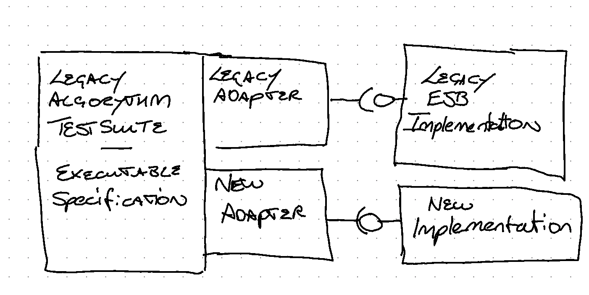

# Эквивалентный функционал

_Замените существующий функционал устаревшей системы, используя новый стек 
технологий._

Этот шаблон является частью «Шаблоны замены легаси».

27 июля 2021

Ян Картрайт, Роб Хорн и Джеймс Льюис

***

СОДЕРЖАНИЕ
Как это работает
Когда использовать
Альтернативные подходы
Пример: замена логистических систем
Пример: замена платформы организации электронной коммерции
Пример: удачная замена сервиса финансовых расчетов

***

Во многих случаях, когда мы разговариваем с ИТ-руководителями, мы слышим, что 
у них есть набор устаревших приложений, созданных с использованием технологий, 
которые скоро будут, если не уже устарели. Чаще всего эти системы размещаются в 
дорогостоящих центрах обработки данных, управляемых третьими сторонами и с 
негибкими контрактами. Эти приложения имеют решающее значение для успешной работы 
бизнеса, но в то же время являются одним из крупнейших источников бизнес и 
операционных рисков.

Все они слишком хорошо понимают, что есть шанс внести улучшения, оптимизировать 
процессы и открыть новые возможности. Однако сделать это полностью будет 
разрушительно и приведет к множеству зависимостей. Например, обязательства 
существующего функционала работы бизнеса, другие программы изменений и, не в 
последнюю очередь, существующие планы и бюджеты отделов, в которых работают 
конечные пользователи.

Один из подходов в этой ситуации — попытаться свести к минимуму влияние замены 
на всю организацию, «просто» заменив технологию, оставив все остальное «как 
есть». Этот подход часто называют эквивалентный функционал или «ловушкой 
эквивалентного функционала» теми, кто попробовал его.

Хотя эквивалентный функционал звучит как разумное предложение, мы на горьком 
опыте убедились, что люди сильно недооценивают требуемые усилия и, таким образом,
неправильно оценивают выбор между этой и другими альтернативами. Например, даже 
простое определение предметной области «как есть» может потребовать огромных 
усилий, особенно для устаревших систем, которые стали основой бизнеса.

Большинство устаревших систем со временем «раздулись», и многие функции не 
используются пользователями (50% согласно отчету Standish Group за 2014 г.), 
поскольку новые функции были добавлены без удаления старых. «Костыли» для решения для 
прошлых ошибок и ограничений стали «обязательными» требованиями для текущих 
бизнес-процессов, а способ работы пользователей определяется в большей степени 
ограничениями легаси, чем чем-либо еще. Восстановление этих функций — это не 
только пустая трата времени, но и упущенная возможность создать то, что действительно 
необходимо сегодня. Эти системы часто были определены 10 или 20 лет назад в 
рамках ограничений предыдущих поколений технологий, и очень редко имеет смысл 
копировать их «как есть».

Если эквивалентный функционал является действительным требованием, то этот шаблон 
описывает, что может потребоваться для достижения успеха. Это нелегкий путь, и 
к нему нельзя относиться легкомысленно.

## Как это работает

Эквивалентный функционал — это простая концепция. Создайте новую систему с более 
подходящим стеком технологий с точно такими же функциями и поведением, что и у 
существующей системы. Всякий раз, когда у кого-то возникает вопрос о том, что 
должна делать новая система, мы отвечаем на этот вопрос: «Делайте то, что 
делает существующая система». Чтобы знать, что системы эквивалентны, нам нужно 
полностью понимать, что делает текущая система, и иметь возможность убедиться, 
что новая система делает то же самое.

## Что входит в то, что делает старая система?

В первую очередь при реализации эквивалентного функционала создаётся техническое 
задание того, что делает текущая система. Вероятно, потребуется сочетание 
следующего:

## Системные опросы

#### Действия пользователя

Какие роли пользователей, какие функции (пункты меню) в системе они могут 
видеть, какие действия они могут выполнять. Для каждого пункта меню/действия — какие 
задействованы экраны, какие элементы данных, какую логику проверки можно увидеть. 
Каков наблюдаемый результат для пользователя, совершающего действие?

#### Пакетная обработка

Какие пакетные обработки определены в системе? Когда они запускаются, какую 
обработку они выполняют, каковы наблюдаемые результаты?

#### Интерфейсы и интеграции

Какие системы интегрированы?

* Какие интерфейсы эта система предоставляет своим клиентам, каковы контракты 
  (API, CFR, поведенческие ожидания/побочные эффекты)
* Какие интерфейсы использует эта система, что это за контракты?
* ищите системы или части систем, которые интегрированы через базы данных (см. 
  отчеты/данные и археология).
  
#### Основные алгоритмы

Хорошо известные бизнес-правила и расчеты, которые необходимо воспроизвести — 
инициированные действиями пользователя, пакетной обработкой.

#### Отчеты/данные

Какие отчеты создает система, в каком формате, из каких данных, когда и как 
часто?

Как данные изменяются в базе данных? Существуют ли триггеры, изменяющие данные, 
что их запускает и какие процедуры они запускают? Насколько глубока эта кроличья 
нора?

Какие другие системы имеют доступ к этим данным или интегрированы с ними? Каким 
образом они его изменяют и какое наблюдаемое поведение имеют эти изменения?

### Археология

Археология часто необходима, чтобы полностью понять, что делает система. Благодаря 
«археологическому процессу» вы узнаете, что изменение поля данных Y на экране A 
приводит к тому, что значение Z появляется в отчете C после выполнения пакетной 
обработки N. Выполнение этой археологии может потребовать значительных затрат 
времени и умственных способностей тех людей, которые имеют наибольший опыт 
работы с вашими легаси системами.

### Инструментарий - на основе данных, что используется?

Стоит потратить некоторое время на анализ существующих отчетов, таких как 
журналы доступа или другие системные журналы, чтобы понять, как используется 
текущая система. Если они недоступны, то некоторые инвестиции в 
инструментирование существующей системы могут обеспечить хорошую отдачу, 
поскольку это может позволить вам избежать ненужной работы, основанной на 
данных.

### Ценность функционала — можем ли мы отказаться от функционала с низкой ценностью?

Хотя мы пытаемся не обременять бизнес при внедрении этого шаблона, общение с 
пользователями, чтобы понять, какие функции имеют низкую ценность или не 
используются, может быть полезным для управления вашей предметной областью. 
Это вновь приведет к организационным воздействиям/изменениям, которых мы 
пытались избежать.

### Используйте тесты для обеспечения эквивалентного функционала — новая система делает то же, что и старая

Знать, что делает старая система, — это первая задача, но мы также должны быть 
уверены, что новая система действительно работает так же. Чтобы убедиться в этом 
с уверенностью, нам нужны тесты, чтобы доказать, что новая система действительно 
имеет эквивалентный функционал. Ниже приведен список областей, в которых необходимо 
будет провести тестирование.

#### То что пользователь использует и пользовательский опыт

Используйте приемочные тесты, чтобы убедиться, что созданные вами функции ведут 
себя так, как ожидается с точки зрения пользователя. Будьте осторожны, чтобы не 
полагаться на них как на основной подход к проверке, поскольку они находятся 
высоко в пирамиде тестирования. Кроме того, помните, что разделение системы на 
пользовательские функции, экраны и потоки может легко привести к слишком 
большому количеству таких типов тестов.

Тестирование поведения пользовательского интерфейса (включая проверку на 
стороне клиента) выполняется относительно просто: щелкните здесь, ожидайте 
увидеть некоторое состояние, введите данные здесь, щелкните здесь, ожидайте 
увидеть другое состояние. Используйте соответствующий инструментарий для 
выбранной вами технологии — фреймворки unit тестирования для приложения 
SPA или что-то вроде Cypress для более традиционного приложения, отображаемого 
на стороне сервера.

Там, где это важно (например, в пользовательском интерфейсе, оптимизированном 
для опытных пользователей), тестирование макета (и внешнего вида/ощущения) 
сложнее, но есть инструменты, которые могут помочь (например, Galen с Selenium).

Для удобства использования и внешнего вида вы, вероятно, будете полагаться на 
исследовательское тестирование.

> Примечание: [тестовая пирамида](https://martinfowler.com/articles/practical-test-pyramid.html) — это метафора, которая говорит нам группировать 
> тесты программного обеспечения по слоям с разной степенью детализации. Это 
> также дает представление о том, сколько тестов у нас должно быть в каждой из 
> этих групп. Хотя концепция тестовой пирамиды существует уже некоторое время, 
> команды все еще пытаются правильно применить ее на практике, и ее рекомендации 
> применимы и здесь, где есть ряд потенциальных ловушек, которые могут склонить 
> вас к другой форме.

### Бизнес-логика — основные алгоритмы

Для основных алгоритмов и основной бизнес-логики убедитесь, что вы создали набор 
unit тестов для этих частей существующей системы. Они предоставят исполняемые 
спецификации бизнес-логики/алгоритма, которые, как известно, успешно работают в 
существующей системе. Затем можно использовать модифицированный подход TDD, 
который включает перенос этих тестов в новый технологический стек, что дает 
высокую уверенность в новой реализации. Существует риск, связанный не правильным 
переносом тестов — тестирование мутаций может предоставить некоторые дополнительные 
гарантии — одинаковые мутации вызывают одинаковые сбои в старой и новой реализациях.

### Интерфейсы - как поставщик услуг и как потребитель услуг

В качестве поставщика услуг: создайте набор тестов для выполнения в заменяемой 
существующей системе — исполняемый контракт. Выполните эти же тесты для новой 
системы замены, проверяя соответствие контракту. Остерегайтесь ловушки, когда 
объем этих тестов становится слишком большим, как в случае с пользовательским 
интерфейсом.

Как клиент: используйте тестовые макеты, чтобы убедиться, что вы взаимодействуете 
с предоставляемыми службами ожидаемым образом. Как и в случае с основной 
бизнес-логикой, перенесите эти макеты в новый технологический стек, чтобы новая 
реализация продолжала взаимодействовать с предоставленной системой таким же 
образом. Кроме того, используйте заглушки внешних систем, чтобы предоставить 
известные наборы данных для ваших новых тестов.

В обоих случаях: прокси могут быть полезным инструментом для обеспечения 
эквивалентного функционала/взаимодействий. Внедрив прокси в канал связи, можно 
записать взаимодействие со старой системой. Вы можете использовать эти записи 
для:

* Воспроизведения сообщения от клиентов и проверки реакции новой системы
* Создания заглушки, которые могут воспроизводить известные хорошие ответы

Базы данных и отчеты: это может быть очень сложно — как и тесты пользовательского 
интерфейса, остерегайтесь вершины пирамиды. Здесь база данных/отчеты — это другой 
тип интерфейса. Для их успешного тестирования потребуется много тестовых данных, 
которые обычно сложно создавать/управлять.

### Внедрение и отслеживание прогресса

После того как завершен обзор системы для определения предметной области и
создан комплексный набор тестов, обеспечивающий исполняемую спецификацию 
поведения, ваша реализация может быть продолжена с относительной уверенностью. 
Но как отслеживать прогресс?

#### По пункту меню/действию пользователя
(или другим частям, выявленным при обследовании системы) Это может быть опасно, 
поскольку существует риск того, что объекты, которые вы отслеживаете, могут 
быть разделены по уровням (или архитектурным понятиям). Разделение по 
архитектурным слоям серьезно влияет на получение ценности и снижает видимость 
прогресса. (т. е. никакое значение не разблокируется и не происходит _реального_ 
прогресса до тех пор, пока функционал не будет доставлена сверху вниз).

Ключевым предположением здесь является то, что элемент или действие могут сами 
по себе приносить пользу конечным пользователям. К сожалению, это часто не так, 
мы можем выполнить 80% отдельных шагов процесса, но все равно не сможем завершить 
весь бизнес-процесс в новой системе. К сожалению, это распространенная ситуация, 
когда сообщается о высоком уровне завершенности, но при этом невозможно протестировать 
или выпустить пригодное для использования программное обеспечение.

#### Вертикальные срезы

Обеспечьте лучшую прозрачность хода выполнения, но вполне вероятно, что 
вертикальные срезы не будут результатом системных обзоров. Таким образом, 
необходимо выполнить сопоставление — дополнительная работа и риск того, что 
требования не будут учтены.

#### Сквозные процессы
Отслеживайте ход выполнения на основе полной миграции отдельных бизнес-процессов 
в новое решение, поэтому тест становится следующим: может ли процесс быть 
полностью завершен в новой системе. Это можно комбинировать с отслеживанием 
действий пользователя, описанным выше, но только в том случае, если мы 
гарантируем, что работа, выполняемая для выполнения отдельных шагов процесса, 
имеет приоритет для «владеющего» бизнес-процесса.

Авторы предпочитают, чтобы определение выполненной работы для любой части 
включало (где это возможно) полную сквозную область действия на всех уровнях.

## Когда использовать

Выше мы представили наше мнение о том, что требуется для правильного применения 
этого шаблона и повышения ваших шансов на успех. Если целью является
эквивалентный функционал, то требуется значительная работа, связанная с 
определением того, что требуется с точки зрения функционала, и дополнительная 
работа, связанная с обеспечением того, чтобы цель эквивалентного функционала 
была достигнута посредством тестирования.

Как правило, это шаблон, который мы не рекомендуем. На самом деле, Thoughtworks 
дошла до того, что поместила эту модель на паузу в нашем технологическом радаре. 
Мы рассматриваем эту модель как огромную упущенную возможность. Часто старые 
системы со временем раздувались, и многие функции не использовались 
пользователями (50% согласно отчету Standish Group за 2014 год), а 
бизнес-процессы развивались с течением времени. Замена этих функций - пустая 
трата времени. Вместо этого постарайтесь собраться с силами, чтобы сделать шаг 
назад и понять, что в настоящее время нужно пользователям, и расставить 
приоритеты этих потребностей по сравнению с бизнес-результатами и показателями.

Однако мы видели несколько случаев, когда этот шаблон частично применим.

* **Высокооптимизированные пользовательские интерфейсы для опытных пользователей** — 
  хорошие кандидаты для воссоздания один-в-один. В качестве примера рассмотрим 
  агентов, использующих горячие клавиши для выполнения сделок на высокой 
  скорости. Чтобы быть эффективными в своей работе, им могут потребоваться 
  сверхоптимизированные пользовательские интерфейсы, которые позволяют им 
  работать, используя только клавиатуру. Чтобы овладеть навыками, может 
  потребоваться значительное время, и изменения, которые приводят к снижению 
  эффективности, недопустимы.
* **Поведение, основанное на хорошо известных спецификациях.** Другим примером 
  использования шаблона могут быть системы, поддерживающие инженерное или 
  научное моделирование. Например, в случае решателя для конечно-элементного 
  анализа заданный ввод должен выдавать заданный вывод — законы физики не 
  меняются в рамках проекта модернизации.

Можно возразить, что в обоих этих случаях потребность в эквивалентном 
функционале несколько локализована — под этим я подразумеваю ограничение 
конкретной частью системы. Сомнительно, чтобы подход к управлению объемом 
модернизации всей системы ограничивался этими локализованными вариантами 
использования.

Но эти случаи, хотя и действительные, все же являются исключительными. В 
подавляющем большинстве мы видели, как создание эквивалентного функционала были 
рассказом о разочаровании. Затраты и усилия, необходимые для правильного 
понимания существующих функций, растут как грибы, что приводит к срезанию 
углов, и хотя некоторые из них являются неиспользуемыми функциями, которые 
следует вырезать, обычно некоторые жизненно важные функции также могут попасть 
под нож. Если все идет хорошо, бизнес платит приличную сумму денег за 
отсутствие улучшения поддержки бизнеса. Это не очень хорошая история, когда 
предприятия знают, что их будущее зависит от более эффективного использования 
технологий.

## Альтернативные подходы

* [Извлечение продуктовых линеек](https://martinfowler.com/articles/patterns-legacy-displacement/extract-product-lines.html) или 
  извлечение потоков создания ценности - это шаблоны, которые дают стратегии 
  для выявления тонких срезов в существующей системе. Одно из ключевых отличий 
  заключается в том, что они оба предлагают способы сократить цикл обратной 
  связи, позволяя отключать элементы легаси гораздо раньше.
* Взгляд на [ценность для бизнеса](https://martinfowler.com/bliki/value-architectural-attribute.html) и обеспечение того, чтобы она была представлена 
  в любых архитектурных решениях, часто может выявить проблемы с подходами, 
  основанными на эквивалентном функционале.
* Более «целостные» подходы могут помочь выявить проблемы с эквивалентным 
  функционалом, рассматривая технологии и бизнес-процессы как часть одной и 
  той же проблемы. В частности, в случае эквивалентного функционала это часто 
  может показать, что текущие бизнес-процессы являются следствием "костылей" и 
  компромиссов, требуемых устаревшей технологией. Просто замена технологии 
  оставит как минимум половину проблемы нерешенной.
* Беседа с пользователями может помочь обнаружить, что существующие 
  бизнес-процессы больше не соответствуют целям. В одном случае, всего за 
  несколько дней наблюдения за существующим персоналом, стало ясно, что 
  эквивалентный функционал не подходит, поскольку текущие процессы были нарушены, 
  всегда полезно поговорить с конечными пользователями.
  
## Пример: замена логистических систем

Логистическая организация разработала план замены устаревшего программного 
обеспечения, используемого для приема, планирования маршрута и доставки посылок.
В рамках этого они согласовали инициативу под руководством ИТ с относительно 
низким уровнем взаимодействия с заинтересованными сторонами бизнеса. 
Технологическая точка зрения заключалась в том, что они могли просто добиться 
«эквивалентного функционала», решив тем самым свою насущную потребность в 
замене устаревших технологий. В рамках этой программы была проведена большая 
работа по замене системы приема посылок от клиентов. Мы становимся вовлеченными 
ближе к концу этой части программы.

Мы чувствовали, что низкий уровень взаимодействия с заинтересованными сторонами 
бизнеса представляет риск для программы, особенно когда мы слышали от другого 
проекта, что бизнес был разочарован усилиями по разработке. В рамках этого мы 
поговорили с ключевыми заинтересованными сторонами, включая финансовый отдел. 
Именно тогда мы узнали о проведенном обзоре, который показал, что лишь 
относительно небольшой процент клиентов приносил организации прибыль. В свою 
очередь, это означало, что только небольшое подмножество «типов пакетов» было 
прибыльным, многие из них теряли деньги организации из-за особых требований к 
обработке. Таким образом, у бизнеса был план прекратить обработку этих 
пакетов.

Выяснилось, что очень много усилий в проекте «эквивалентного функционала» было 
потрачено именно на те пакеты, те самые, которые, по словам бизнеса, им больше 
не нужны. Бизнес надеялся, что процессы и, следовательно, программное 
обеспечение будут намного проще без этих сложных пограничных случаев. В этом 
случае «эквивалентный функционал» привел к тому, что большое количество 
времени и денег было потрачено на выполнение требований, которых у бизнеса 
больше не было, что еще больше подорвало репутацию ИТ в глазах бизнеса.

## Пример: замена платформы организации электронной коммерции

Эта организация пережила период быстрого роста, но в течение нескольких лет не 
уделяла приоритетное внимание расходам на ИТ, что создало относительно срочную 
необходимость замены многих элементов текущего решения. Например, в определенные 
периоды им приходилось снижать количество продаж, чтобы избежать перегрузки 
основных систем, что вряд ли идеально с точки зрения бизнеса.

Многие из ключевых бизнес-операций обрабатывались одним и тем же мейнфреймом, 
который был первоначально введен в эксплуатацию в самые первые дни их операций 
электронной коммерции. Извлечение элементов из этой системы явно должно было 
быть технически сложным. В то же время бизнес-лидеры, увидев несколько 
провалившихся проектов, хотели свести к минимуму любые дальнейшие сбои в работе 
своего персонала. Еще одна проблема заключалась в том, что текущие процессы и 
системы чрезвычайно затрудняли определение приоритетности линейки продуктов для 
миграции, если использовался более поэтапный подход. Короче говоря, было очень 
трудно понять, какие вещи, которые они продавали, приносили деньги, а какие нет, 
поэтому казалось, что единственный вариант — переместить все сразу. Основываясь 
на этих проблемах, было принято решение, что простое копирование того, что у 
них было, было лучшим подходом с наименьшим риском.

Учитывая, что текущие бизнес-процессы, на первый взгляд, были реализованы 
вместе на одном мейнфрейме, это означало, что областью «эквивалентного 
функционала» были, по сути, все основные действия и процессы всего бизнеса. Они 
предприняли попытку задокументировать процессы «как есть» для системы замены, 
планируя, что это будет использоваться в качестве входных данных для процесса 
выбора поставщика.

Вскоре стало ясно несколько вещей. Во-первых, это действительно должно было 
быть почти каждое отдельное действие, которое делал бизнес, каждая попытка 
документировать функциональность «как есть» раскрывала больше вещей, которые 
необходимо было включить, чтобы обеспечить «эквивалентный функционал». 
Во-вторых, из-за исторических "костылей", многих лет меняющихся требований 
наряду со многими нерешенными багами последнее, чего хотели настоящие люди, 
работавшие с легаси системой, получить то же самое. Это почти всегда усложняло 
их работу и было основным источником ошибок и задержек. Наконец, из-за багов и 
"костылей" стало ясно, что несколько ключевых процессов на самом деле 
выполнялись «вне системы» в электронных таблицах, созданных вручную. Ключевые 
бизнес-данные извлекались из мэйнфрейма, использовались для запуска 
бизнес-процесса через электронную таблицу, а затем уже измененные данные 
загружались на мейнфрейм.

В этот момент стало ясно, что эквивалентный функционал становится слишком 
рискованным, а объем работ постоянно растет. Это было обнаружено до завершения 
процесса сбора требований, и не было четкой даты окончания этой работы.
Наше участие прекратилось на этом этапе, поскольку мы чувствовали, что 
продолжение разработки «эквивалентного функционала» было слишком рискованным и 
не принесет того, что нужно бизнесу, не в последнюю очередь потому, что 
отсутствие ключевых бизнес-показателей сделало невозможным определение 
приоритетов любого более поэтапного подхода. Несколько лет спустя они все еще
продолжали собирать требования как всё должно работать, намного превышая 
первоначальные сроки.

Отсутствие правильных метрик и способности расставлять приоритеты элементов 
функциональности с точки зрения бизнеса часто может вынуждать организации 
придерживаться подхода «эквивалентного функционала». В данном случае мы 
полагаем, что первоначальные усилия по сбору ключевых бизнес-показателей для 
различных линеек продуктов могли предложить пути решения проблемы. Это отличная 
иллюстрация того, что вы не можете принимать правильные технические решения без 
правильного бизнес-контекста и его участия.

## Пример: удачная замена сервиса финансовых расчетов

Одна из наших команд работала в крупной финансовой организации. Они хотели 
модернизировать существующий сервис, который выполнял сложные финансовые расчеты. 
Спецификация финансовых расчетов была исправлена, интерфейс к сервису был 
аналогичен, только технология нуждалась в обновлении — от реализации J2EE 
Session EJB до SOAP Web Service в последней (на тот момент) версии Java.

Команда создала богатый набор тестов для существующей реализации с четким 
разделением обязанностей по настройке, выполнению и предположениям.

Рисунок 1: Тесты для эквивалентного функционала

После того, как тесты были созданы используемый адаптер можно было заменить с 
минимальным риском, и была создана новая реализация, имеющая те же 
характеристики в плане работы, что и старая система.

> Эта страница является частью статьи:
>
> Шаблоны замены легаси
>
> Ян Картрайт, Роб Хорн и Джеймс Льюис
>
> 
>
> [Основная статья](https://martinfowler.com/articles/patterns-legacy-displacement/)
>
> Шаблоны
>
> [Критический агрегатор](https://martinfowler.com/articles/patterns-legacy-displacement/critical-aggregator.html)
> [Перенаправление потока](https://martinfowler.com/articles/patterns-legacy-displacement/divert-the-flow.html)
> [Извлечение важных рабочих процессов](https://martinfowler.com/articles/patterns-legacy-displacement/extract-product-lines.html)
> [Эквивалентный функционал](https://martinfowler.com/articles/patterns-legacy-displacement/feature-parity.html)
> [Имитация легаси](https://martinfowler.com/articles/patterns-legacy-displacement/legacy-mimic.html)
>
> ## Список значимых изменений
>
> 27 июля 2021