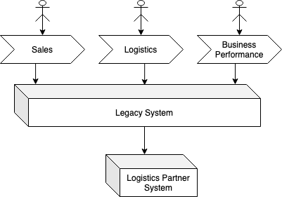
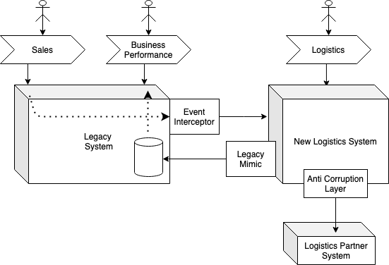
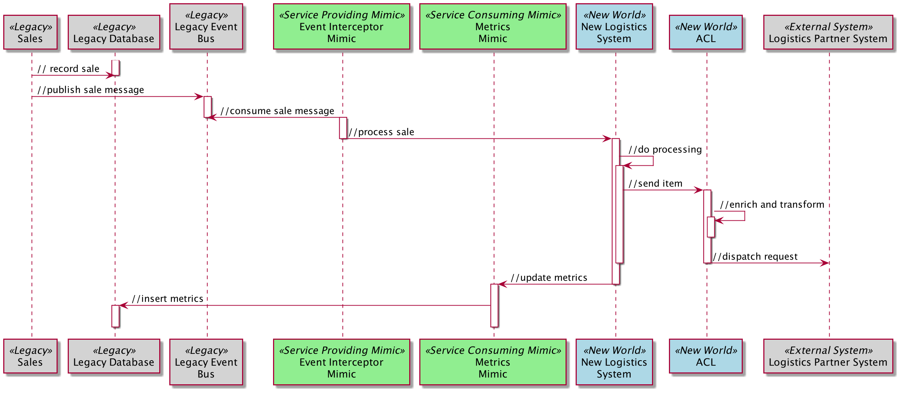

# Имитация легаси

_Новая система взаимодействует с легаси системой таким образом, что старая 
система не знает о каких-либо изменениях._

Этот шаблон является частью «Шаблоны замены легаси».

12 января 2022

Ян Картрайт, Роб Хорн и Джеймс Льюис

*** 

СОДЕРЖАНИЕ

Как это работает
Когда использовать

***

При постепенной замене легаси систем новыми, будет невозможно четко изолировать 
новый мир от старого. [Переходная архитектура](https://martinfowler.com/articles/patterns-legacy-displacement/transitional-architecture.html) требует, чтобы новый мир предоставлял 
данные (или какое-либо другое взаимодействие), чтобы «всё работало».

В этом случае новая система должна соответствовать какому-то существующему 
(часто неявному) контракту, и, таким образом, новая система должна стать
имитацией легаси.

## Как это работает

Изучая техническую архитектуру устаревшей системы и примерно представляя новую 
архитектуру, а также понимая существующие и будущие бизнес-процессы, можно 
обнаружить и использовать места разделения, позволяющие разбить проблему на 
части.

Паттерн Legacy Mimic является средством реализации этих разделений и является 
следствием различных подходов к делению.

Имитатор легаси часто реализует шаблон [Предохранительный уровень](https://martinfowler.com/bliki/DomainDrivenDesign.html)
из книги Предметно-ориентированное проектирование Эрика Эванса. В игре задействованы 
аналогичные силы, так как цель [Предохранительного уровня]:

> Создайте "изолирующий слой", который бы предоставлял клиентам нужные функции в 
> понятиях их собственной модели предметной области. Такой уровень будет общаться 
> с друrими системами через их существующие интерфейсы, что потребует лишь 
> незначительной или вовсе никакой модификации этих других систем. Внутри же 
> уровня будет идти необходимая трансляция в обе стороны между двумя моделями.

Подобно [Предохранительному уровню](https://martinfowler.com/bliki/DomainDrivenDesign.html), реализация имитации легаси обычно использует
сервисы, адаптеры, трансляторы и фасады.

Существует как минимум 2 типа имитации, которые мы обычно видим, и их легче
всего объяснить с точки зрения предоставления или потребления услуг.

**Имитатор, осуществляющий работу вместо легаси сервиса** будет инкапсулировать 
новую реализацию за легаси интерфейсом. Легаси компоненты смогут взаимодействовать 
с ним, используя легаси интерфейс, и не будут знать, что они взаимодействуют с 
этой новой реализацией.

**Имитатор, передающий информацию в легаси сервис,** будет сотрудничать с 
легаси системами, которые еще не были заменены, используя их существующие 
легаси интерфейсы. Опять же, это взаимодействие будет прозрачным для старой 
системы.

## Когда использовать

Чтобы дополнительно проиллюстрировать эти различные типы имитаций, на этом рисунке
показана монолитная легаси система, которая поддерживает 3 бизнес-процесса — продажи,
логистика и эффективность бизнеса. 

Рассматриваемый вариант заключается в использовании [извлечения потоков создания 
ценности](https://martinfowler.com/articles/patterns-legacy-displacement/extract-value-streams.html) 
для функций логистики. Это может привести к следующей переходной архитектуре:

Для того, чтобы новая логистическая система могла осуществлять продаж, 
предлагается использовать перехватчик событий ([Event Interception](https://martinfowler.com/articles/patterns-legacy-displacement/event-interception.html)).
В этом примере перехватчик событий является примером имитатора, осуществляющего 
работу вместо легаси сервиса - он соответствует легаси интерфейсу (потребляет 
легаси событий).

Для того чтобы процесс Эффективности работы бизнеса продолжал функционировать,
снова предлагается использовать шаблон имитатор легаси, но на этот раз в качестве
имитатора, передающего информацию в легаси сервис. Он реплицирует необходимые 
показатели логистики в устаревшую базу данных отчетов (в соответствии со схемой 
и семантикой устаревшей базы данных).

Оба компонента не сохранятся в рамках новой архитектуры системы — они 
являются переходными.

Существующая система партнеров по логистике по-прежнему должна быть 
интегрирована, поэтому в новой системе логистики используется Предохранительный
уровень. Поскольку она сохранится, она не считается имитационным (или 
переходным), а [Предохранительный уровень](https://martinfowler.com/bliki/DomainDrivenDesign.html) используется, чтобы модель предметной
области новой системы логистики, не была скомпрометирована моделью, используемой 
этой внешней системой.

> Эта страница является частью статьи:
>
> Шаблоны замены легаси
>
> Ян Картрайт, Роб Хорн и Джеймс Льюис
>
> 
>
> [Основная статья](https://martinfowler.com/articles/patterns-legacy-displacement/)
>
> Шаблоны
>
> [Критический агрегатор](https://martinfowler.com/articles/patterns-legacy-displacement/critical-aggregator.html)
> [Перенаправление потока](https://martinfowler.com/articles/patterns-legacy-displacement/divert-the-flow.html)
> [Извлечение важных рабочих процессов](https://martinfowler.com/articles/patterns-legacy-displacement/extract-product-lines.html)
> [Эквивалентный функционал](https://martinfowler.com/articles/patterns-legacy-displacement/feature-parity.html)
> [Имитация легаси](https://martinfowler.com/articles/patterns-legacy-displacement/legacy-mimic.html)
>
> ## Список значимых изменений
>
> 12 января 2022