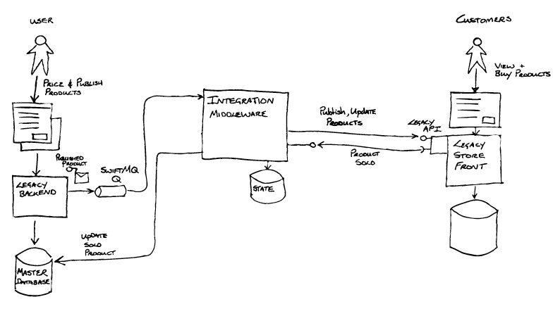
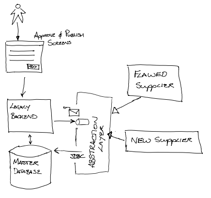
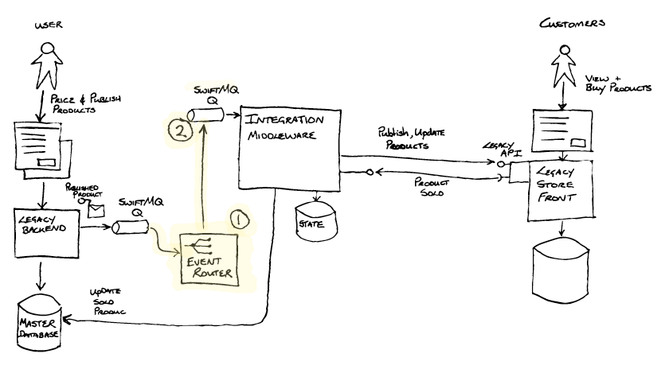
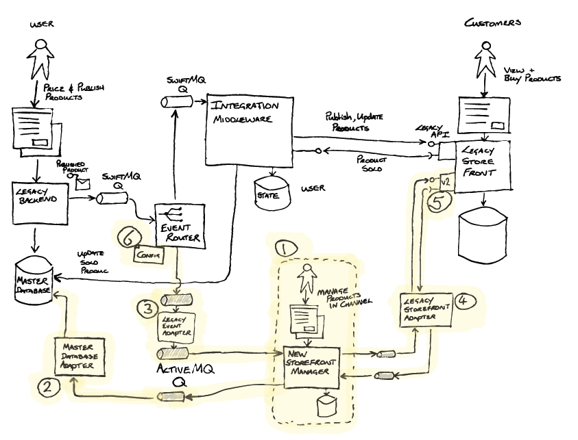
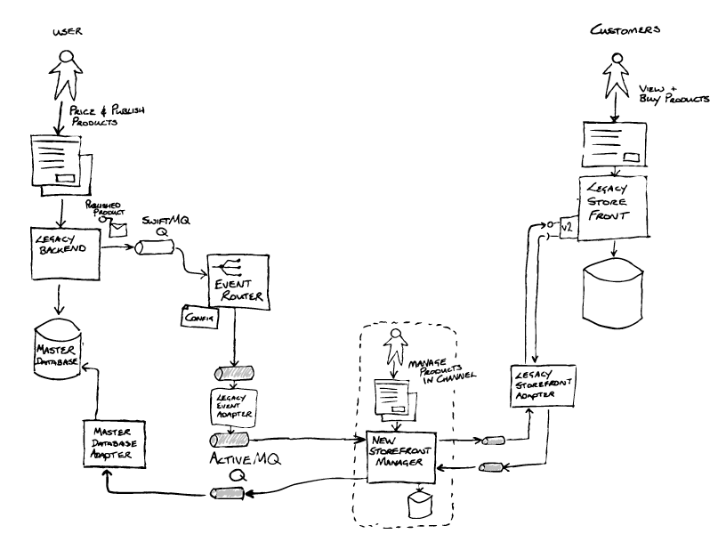
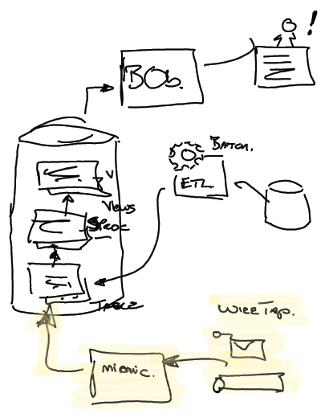

# Шаблоны замены легаси

## Эффективная модернизация устаревших программных систем

_Столкнувшись с необходимостью замены существующих программных систем, организации 
часто попадают в цикл незавершенных технологических замен. Наш опыт научил нас 
ряду шаблонов, которые позволяют нам разорвать этот цикл, полагаясь на: 
преднамеренное признание желаемых результатов замены устаревшего программного 
обеспечения, разделение этой замены на части, постепенное предоставление этих 
частей и изменение мышления организации, чтобы она поняла, что изменение 
является неизменной реальностью._

20 января 2022

***

[Ян Картрайт](https://www.linkedin.com/in/ian-cartwright-282952/)

Ян Картрайт — технический директор Thoughtworks, где он применяет свой 
двадцатилетний опыт работы в качестве архитектора и практического разработчика, 
чтобы помочь клиентам улучшить свои технические возможности.

[Роб Хорн](https://www.linkedin.com/in/rob-horn)

Роб Хорн — технический директор Thoughtworks. Опытный и увлеченный своим делом 
технический консультант и гибкий практик, он провел около 15 из своей 25-летней 
карьеры, работая с клиентами над задачами, связанными с модернизацией легаси в финансовом, 
социальном, туристическом и государственном секторах.

[Джеймс Льюис](https://bovon.org/)
Джеймс Льюис — технический директор Thoughtworks и член Консультативного совета 
по технологиям. Он тратит свое время на консультирование клиентов по архитектуре 
распределенных систем и организационному дизайну, когда он не выступает на 
конференциях по тем же темам.

СОДЕРЖАНИЕ

Однообразные попытки замены легаси
Разрываем цикл
Поймите результаты, которых вы хотите достичь
Снижение стоимости изменений
Улучшение бизнес-процесса
Отказаться от старой системы
Неизбежное нарушение
Новые технологии
Решите, как разбить проблему на более мелкие части
С чего начать
Успешно добавить части
Изменить мышление организации, что позволит происходить этому на постоянной основе
Пример: Удаление ПО промежуточного слоя интеграции
Понимание результатов
Разбираем проблему: первый разделение и рефакторинг
Успешно добавить части: наращивание функциональности, соблюдение контракта
Успешно добавить части (продолжение): переход к онлайн-сервису — использование 
второго разделения
Изменить мышление организации, что позволит происходить этому на постоянной основе
Заключительные мысли
БОКОВЫЕ ПАНЕЛИ
Мы хотим быть как Нетфликс
Event Storming — швейцарский нож современного отображения реального мира в процессы
Самый трудный сдвиг — это сдвиг парадигмы

ШАБЛОНЫ

[Критический агрегатор](https://martinfowler.com/articles/patterns-legacy-displacement/critical-aggregator.html)
[Перенаправление потока](https://martinfowler.com/articles/patterns-legacy-displacement/divert-the-flow.html)
[Извлечение важных рабочих процессов](https://martinfowler.com/articles/patterns-legacy-displacement/extract-product-lines.html)
[Эквивалентный функционал](https://martinfowler.com/articles/patterns-legacy-displacement/feature-parity.html)
[Имитация легаси](https://martinfowler.com/articles/patterns-legacy-displacement/legacy-mimic.html)

[АРХИТЕКТУРА ПРЕДПРИЯТИЯ](https://martinfowler.com/tags/enterprise%20architecture.html)
[ЭВОЛЮЦИОННЫЙ ДИЗАЙН](https://martinfowler.com/tags/evolutionary%20design.html)
[РЕАБИЛИТАЦИЯ НАСЛЕДИЯ](https://martinfowler.com/tags/legacy%20rehab.html)

***

Мы потратили большую часть последних нескольких десятилетий, помогая крупным 
организациям перестраивать их устаревшие системы. При этом мы многое узнали о 
том, что работает, и увидели множество путей, ведущих к неудаче. Мы решили 
уделить некоторое время тому, чтобы записать то, что мы узнали, в виде различных 
шаблонов, которые мы видели.

Эта статья выступает в качестве концентратора для этих шаблонов. Слишком часто 
мы видели организации, застрявшие в пути незавершенных усилий по замене легаси. 
Мы считаем, что ключом к разрыву этого цикла являются четыре действия, 
где ряд из них выполняется последовательно, но в основном итеративно на 
протяжении всей жизни компании. Мы используем эти действия в качестве нашей 
основной структуры для организации описываемых шаблонов.

Мы всегда считали, что эффективная разработка программного обеспечения предполагает 
постепенный релиз важного функционала, и мы думаем, что это же относится и 
к написанию статей, [особенно в эпоху Интернета](https://martinfowler.com/bliki/EvolvingPublication.html). Мы начали с этой описательной 
статьи и будем постепенно добавлять шаблоны по мере того, как будем описывать 
их детали, а также другие примеры, показывающие, как они комбинируются. Мы не 
можем обещать каких-либо дат, так как наш приоритет - это работа с клиентами, 
которым надо заменить устаревшие системы. Если вам интересно узнать о других 
частях этой работы по мере их появления, о них будет сообщаться в [ленте Мартина в 
Твиттере](https://www.twitter.com/martinfowler) и в [RSS ленте](https://martinfowler.com/feed.atom) этого сайта.

***

## Однообразные попытки замены легаси

Мы работали со многими организациями, которые неоднократно пытались удалить 
устаревшие системы. В одной достаточно типичной организации они прошли через целый 
ряд 3-5-летних программ модернизации. Каждый раз они определяли новый технологический 
подход, а затем работали над этим новым подходом в рамках большой многолетней 
программы модернизации.

В какой-то момент во время каждой программы они попадали в кризисную точку, 
когда меняющиеся потребности бизнеса превышали их текущую техническую стратегию и, 
следовательно, вызывали необходимость начинать все сначала. Там, где они использовали
каскадный "взрывной" подход к разрабатываемой программе, это означало отказ от большей 
части работы. В других случаях с более поэтапными подходами к доставке подход 
заключался в том, чтобы просто добавить слой немного более новых технологий 
поверх уже существующих сложных взаимодействий. В обоих сценариях они не смогли 
вывести из эксплуатации какой-либо устаревший стек, ключевые бизнес-цели по 
экономии затрат и снижению рисков остались невыполненными, что является слишком 
распространенным результатом для многих усилий по замене устаревшего обеспечения.

В их неоднократных неудачах сыграли роль несколько ключевых факторов.

Во-первых, плохие результаты, которые они видели, были в значительной степени 
результатом деятельности организации; в частности, это руководство, структура и 
методы работы. Они думали, что, просто выбрав более новые технологии, но 
оставив все остальное более или менее неизменным, они получат отличные от 
прошлого результаты. Оглядываясь назад, это было явно нереально.

Во-вторых, модернизация должна была быть осуществлена в рамках большой программы 
изменений, включающей в себя ряд проектов и групп. Эти проекты никак не 
перекликались с текущими бизнес-требованиями. Таким образом, выполнение 
текущих бизнес-требований продолжалось для существующими системами, в 
то время как новые проектные группы выполняли требования, согласованные в 
начале программы замены.

Со временем они увидели увеличивающийся разрыв между тем, что действительно 
нужно бизнесу, и тем, что было утверждено в начале программы. Чем дольше работала 
каждая программа, тем острее этот разрыв между планом программы и текущими и 
будущими потребностями. Хотя для добавления новых требований к программе 
существовали процессы управления изменениями, они отнимали огромное количество 
времени и, из-за предварительных контрактов с поставщиками, были непомерно дорогими.

Третьим ключевым фактором нескольких неудач было стремление к [полной 
функциональной аналогии](https://martinfowler.com/articles/patterns-legacy-displacement/feature-parity.html) с 
существующим набором систем и бизнес-процессов. Эти попытки начались с обещания 
дать бизнесу именно то, что у них есть сегодня, за счёт использования новых 
"улучшенных" технологий. Потерпев к тому времени несколько неудач и опасаясь 
сбоев, бизнес-лидеры сочли, что это стратегия с меньшим риском. Проблема здесь 
заключалась даже в том, чтобы определить и согласовать текущую функциональность 
«как есть», что потребовало огромных усилий, и это привело к плану с большим 
единым "взрывным" релизом с введением в эксплуатацию.

Наши наблюдения, сделанные в этой и многих других организациях, заключаются в 
том, что технология составляет не более 50% проблемы наследия, а методы работы, 
организационная структура и лидерство так же важны для успеха.

***

## Разрываем цикл

Ясно, что необходимо вырваться из цикла "замены устаревших технологий в программах". 
Короче говоря, организации должны иметь возможность продолжать удовлетворять 
потребности бизнеса, одновременно заменяя устаревшие технологии, и все это 
на фоне ускорения технологических изменений и ужесточения конкуренции.

Мы обнаружили ряд подходов, которые могут помочь в решении этих проблем. Они 
помогают разбить проблему на более мелкие части, чтобы обеспечить выполнение 
новых требований параллельно с усовершенствованием технологий. В целом их 
можно разделить на четыре категории:

1. Поймите результаты, которых вы хотите достичь
2. Решите, как разбить проблему на более мелкие части
3. Успешно добавьте эти части
4. Изменить мышление организации, что позволит происходить этому на постоянной основе

### Поймите результаты, которых вы хотите достичь

Для организации жизненно важно согласовать результаты, которых она хочет достичь 
при работе с устаревшей системой. Хотя это может показаться очевидным, слишком 
часто разные части организации могут иметь совершенно разные взгляды на желаемые 
результаты. Большинство инициатив по модернизации легаси предполагают достижение 
несколько результатов, которые мы перечисляем ниже, но важно определить, какие 
из них являются приоритетными, прежде чем приступать.

#### Снижение стоимости изменений

Ключевым моментом для многих организаций при принятии решения об отказе от легаси 
является то, что желаемые бизнес-изменения начинают стоить гораздо больше, чем 
любые ожидаемые выгоды, либо из-за альтернативных издержек (задержек), либо 
из-за затрат на внедрение. Тревожным звоночком будет трата недель и десятков или
сотен тысяч долларов, чтобы внести изменения в веб-сайт, которые приведут лишь к 
небольшому увеличению эффективности бизнеса.

На этом этапе часто уже невозможно оправдать внесение каких-либо изменений, 
которые не приносят большой отдачи от инвестиций. Другими словами, состояние 
технологии начало диктовать размер изменений, которые может внести бизнес. Для 
многих организаций имеет разницу внести изменения в бизнес-требования или
инициировать более крупный проект. Эти более крупные проекты затем становятся 
магнитами для всех небольших изменений, которые ранее не были оправданы, что 
увеличивает их масштабы, стоимость и риск.

#### Улучшение бизнес-процесса

Мы видели много примеров, когда бизнес-процессы развивались вместе с легаси 
системами, процессы стали тесно связаны с тем, как система работает, с ограничениями 
в системе, и часто обходные пути «вне системы», формируют бизнес-процессы, 
которым люди следуют, чтобы выполнять свою работу.

Одним из примеров, который мы видели, является система регистрации на рейс авиакомпании, 
в которой использовались терминалы с «зеленым экраном». Из-за ограничений в легаси 
системе процесс должен был выполняться в строгом порядке, что означало, что 
исправления или ошибки означали запуск процесса регистрации заново. Кроме того, 
изначально авиакомпания не предлагала стыковочные рейсы, когда это было добавлено, 
это должно было выполняться как отдельный рабочий процесс в устаревшей системе 
из-за ограничений этой технологии. Таким образом, если при регистрации пассажир 
не упомянул, что у него стыковочный рейс, был выполнен неправильный процесс, 
включая печать неправильных багажных бирок, и только после этого система 
помечала стыковочный рейс. Работу сотрудников стойки регистрации и удобство 
пассажиров можно было бы значительно улучшить, изменив процесс, но это было 
невозможно из-за устаревшей системы.

Учитывая это, неудивительно, что обновление и изменение бизнес-процессов, в 
свою очередь, требует изменений в том, как работает поддерживающая технология.
Попытка изменить рабочие процессы без изменения технологии часто приводит к 
работе «вне системы», когда люди прибегают к извлечению данных в электронные 
таблицы или тому подобному, работая с ними там, прежде чем импортировать данные 
обратно в легаси систему.

В одной организации весь процесс заказа товаров в наличии фактически выполнялся 
в базе данных Microsoft Access, работающей на ПК руководителей групп. Они были 
разочарованы, поскольку легаси система не могла поддерживать новые методы работы 
их поставщиков. Они выполняли импорт и экспорт данных несколько раз в неделю, в 
то время как остальная часть организации видела устаревшие цифры, поскольку 
никто не понимал, как что происходит.

Здесь стоит отметить, что требования к замещающей системе для поддержки 
импорта и экспорта данных часто могут быть первопричиной такого обходного пути.

#### Отказаться от старой системы

Необходимость вывода старой системы из эксплуатации является распространенной 
причиной модернизации легаси системы. Это часто связано с проблемами поддержки 
устаревшего оборудования или программного обеспечения, такими как увеличение 
затрат на поддержку и истечение срока действия контрактов на поддержку как для 
оборудования, так и для программного обеспечения.

Мы сочли полезным рассматривать вывод старых систем из эксплуатации через 
призму бизнеса. Таким образом, система, построенная на старой технологии, сама 
по себе не является достаточным основанием для замены. Вместо этого нам нужно 
посмотреть на её влияние на бизнес, приводит ли её использование к растущим 
эксплуатационным расходам или риску, из-за отсутствия поддержки или знаний о 
системе.

В то время как некоторые организации хорошо планируют амортизацию старых 
технологий, многие, похоже, игнорируют эту проблему, пока она не достигнет 
критической точки. В свою очередь, это подталкивает организации к подходам к 
модернизации, которые являются вариантами с минимальными изменениями или 
быстрыми победами, обычно это антишаблоны, и мы опишем некоторые из этих ловушек 
позже.

На протяжении многих лет мы были шокированы тем, как много крупных организаций 
используют в своем бизнесе неподдерживаемое оборудование и программное 
обеспечение. Покупка запасных частей на eBay — удивительно распространенная 
история. Если у вас есть устаревшая технология, стоит провести соответствующий 
опрос и создать календарь с различными датами прекращения поддержки.

Хотя многие организации рассматривают вывод старых систем из эксплуатации как 
ключевой результат модернизации легаси систем, нередко можно обнаружить, что на 
самом деле этого не происходит, а легаси системы все еще используются в конце
концов, а связанные с ними бизнес-цели остаются невыполненными.

#### Неизбежное влияние внешнего фактора

Для некоторых организаций фактический переломный момент в борьбе с легаси может 
возникнуть из-за внешнего фактора, такого как изменение нормативно-правовой базы, 
появление нового конкурента-«стартапа» или существенное изменение существующего 
конкурента. Часто в этот момент, когда мы сталкиваемся с необходимостью изменений, 
становится ясно, что, чтобы дать достойный ответ, необходимо слишком 
много деньг и времени.

Внешнее событие — это то, что дает понять руководству организации, что у него 
больше нет возможности вносить изменения пропорциональные затратам.

#### Новые технологии

Внедрение новых технологий не должно быть причиной модернизации легаси систем, 
простое наличие новых технологий ради них самих редко является ключевой целью 
любой организации. Скорее, их следует выбирать таким образом, чтобы 
он наилучшим образом отвечал текущим и будущим потребностям бизнеса. Проблема 
здесь в том, что темпы технологических изменений ускоряются, «полезный» срок 
службы технологии становится короче. Фактическое определение «полезности» 
зависит от организации, но в целом нам необходимо учитывать такие вещи, как:

* Позволяет получить конкурентное преимущество
* Соответствует предложениям конкурентов или рынка
* Позволяет быстрее осуществлять изменения
* Уменьшает стоимость изменений
* Имеет более низкую стоимость эксплуатации

Выбор, который мы делаем сегодня в отношении наилучшей и наиболее полезной 
технологии, скорее всего, будет заменен лучшими альтернативами в относительно 
короткие сроки. Это делает принятие правильного решения о поиске технологии 
для удовлетворения будущих потребностей потенциально очень рискованным.

Хороший подход здесь состоит в том, чтобы не делать выбор, который нельзя 
легко «переделать» за 2-3 года. Это имеет значение как для выбора технологии, 
так и для общего дизайна и подхода. Выбор огромной платформы со сроком окупаемости 
5-10 лет трудно оправдать, если мы признаем этот ускоряющийся темп изменений.

> #### Мы хотим быть как Нетфликс
> 
> Одна проблема, с которой мы сталкивались несколько раз, — это то, что мы 
> называем «Netflix Envy». Именно здесь технологические лидеры организации 
> зацикливаются на том, чтобы быть похожими на Netflix или какую-либо другую 
> крупную успешную технологическую компанию. Это означает, что они пытаются 
> подражать способам работы или выбирают одни и те же технологические решения. 
> Хотя это может быть уместно, если они также занимаются потоковой передачей 
> фильмов, часто это приводит к выбору неподходящих технологий. Эти технологии 
> часто имеют возможность масштабирования, но также имеют более высокую степень 
> сложности и стоимости, которые просто не нужны большинству предприятий.

### Решите, как разбить проблему на более мелкие части

В широком смысле это включает в себя поиск правильных мест разъединения в 
текущей бизнес-архитектуре и технической архитектуре. Важно учитывать, как 
элементы текущего решения соотносятся с различными бизнес-возможностями. Для 
устаревших систем это обычно означает изучение того, как одно крупное 
техническое решение удовлетворяет нескольким бизнес-потребностям, а затем 
рассмотреть возможность извлечения отдельных потребностей для независимой 
доставки с использованием нового решения. В идеале они должны доставляться с 
минимальными зависимостями друг от друга.

Частым недостатком является то, что найти эти места разъединения слишком сложно.
Хотя мы согласны с тем, что поначалу это сложно, мы обнаружили, что это лучший 
подход, чем альтернативы, которые слишком часто приводят к релизу функциональных 
аналогов или взрывному релизу. Мы также заметили, что многие организации 
исключают такой подход, потому что рассматривают технологию или бизнес-процессы 
изолированно. Изменение только одной части технологии или независимое обновление 
только одного бизнес-процесса, скорее всего, потерпит неудачу, но если мы сможем 
рассмотреть, а затем внедрить их вместе, это и есть способ двигаться вперед шаг 
за шагом.

#### С чего начать

Модернизация легаси оборудования может показаться самым пугающим предложением в 
начале пути. Как и в любом путешествии, мы должны сначала попытаться понять, в 
каком направлении идти. Кроме того, как и все путешествия, вы должны начать с 
того места, где находитесь. Одна из распространенных проблем, с которыми мы 
сталкиваемся, заключается в том, что мы часто начинаем с леса, не видя что 
впереди и, следовательно, не имея представления о том, в каком направлении 
двигаться. Итак, первый шаг — залезть на дерево и хорошенько осмотреться! Это 
означает максимально полное понимание текущих систем и архитектуры в кратчайшие 
сроки. Часто это очень сложно сделать, и легко увязнуть в слишком большом 
количестве деталей.

К счастью, существует ряд действительно полезных инструментов, которые можно использовать 
совместно, чтобы получить достаточно хорошее понимание, чтобы делать дальше. Подробное 
обсуждение этих инструментов подробно тема другой статьи, но их сводный список будет 
включать в себя [Event Storming](http://ziobrando.blogspot.com/2013/11/introducing-event-storming.html), 
[Wardley Mapping](https://blog.gardeviance.org/2015/02/an-introduction-to-wardley-value-chain.html), Business Capability Mapping и 
Domain Mapping. Обратите внимание, что в этом списке мы в первую очередь смотрим 
на то, как бизнес-концепции отображаются в архитектуре системы, и, в свою очередь, 
понимаем, как эта [архитектура поддерживает создание ценности](https://martinfowler.com/articles/value-architectural-attribute.html). Это представление 
часто отсутствует, особенно в устаревших системах.

> #### Event Storming - швейцарский нож cовременного отображения реального мира в процессы
> 
> Об этой методике написано много, и авторы считают ее очень универсальным 
> инструментом, который можно использовать в различных контекстах. Действительно, 
> авторы использовали его для отображения потока создания функционала и 
> визуализации пути к продакшену в дополнение к отображению бизнес-процессов и 
> предметных областей.

<table>
  <tr>
    <td colspan="2">Шаблоны понимания проблемы</td>
  </tr>
  <tr>
    <td>Определите функции, которые необходимы бизнесу</td>
    <td>Определите стабильные части системы, чтобы структурировать команды и программное обеспечение вокруг них.</td>
  </tr>
  <tr>
    <td>Создайте план работ</td>
    <td>Определите стабильные части системы, чтобы структурировать команды и программное обеспечение вокруг них.</td>
  </tr>
  <tr>
    <td>Картографирование потоков создания ценности</td>
    <td>Понятие, которое описывает как пользователям выполнить свою работу</td>
  </tr>
  <tr>
    <td>Event Storm</td>
    <td>Методика, используемая для понимания бизнес-процессов</td>
  </tr>
</table>

В частности, мы обнаруживаем, что люди часто останавливают исследовательскую 
деятельность на границах унаследованных систем, "дальше страшно", остановлюсь тут.
Не пересекая границы и не понимая, как устаревшие системы поддерживают (или 
препятствуют) бизнес-процессам и действиям, сложно найти и разделить систему на части.

Другим часто упускаемым из виду и очень ценным источником информации являются 
сами пользователи систем. На самом деле, по опыту авторов, именно здесь вы часто 
можете найти удивительное количество полезного материала и особенно выявить 
множество обходных путей и теневую ИТ-экосистему, которая обычно создается вокруг 
старых систем, то есть базы данных Access и электронные таблицы Excel с версиями, 
которые на самом деле позволяют вести бизнес. Картирование пути клиента, 
создание схемы обслуживания и картографирование потока создания ценности — это 
инструменты, которые с успехом использовались для выявления такого рода деталей.

<table>
  <tr>
    <td colspan="2">Шаблоны разбиения проблемы</td>
  </tr>
  <tr>
    <td>Извлечь пути движения товара</td>
    <td>Определить и разделить системы по рабочим процессам</td>
  </tr>
  <tr>
    <td>Извлечь потоки ценности</td>
    <td>Определить и разделить ключевые потоки ценности</td>
  </tr>
  <tr>
    <td>Эквивалентный функционал</td>
    <td>Замените существующий функционал устаревшей системы, используя новый стек технологий</td>
  </tr>
  <tr>
    <td>Единственный источник истины</td>
    <td>Разделите проблему, определив уникальные и общие функции бизнеса</td>
  </tr>
</table>

### Успешно создаём части

Потребность в более быстрых изменениях и возможность поэтапно доставлять и 
независимо изменять элементы бизнеса без больших зависимостей часто приводит к 
«гибким» подходам к доставке наряду с архитектурой, основанной на микросервисах. 
Непрерывная доставка становится обязательной для этих отдельно развертываемых 
компонентов. Что делает эту задачу сложной, помимо обычной поставки программного 
обеспечения, так это поиск стратегий сокращения, сосуществования и, в конечном 
счете, замены элементов существующего крупного решения. Существует несколько 
успешных стратегий, включая параллельный запуск, разветвление при входе и 
перенаправление потока.

<table>
  <tr>
    <td colspan="2">Шаблоны доставки</td>
  </tr>
  <tr>
    <td>Критический агрегатор</td>
    <td>Объединение данных из разных частей бизнеса для поддержки принятия важных решений</td>
  </tr>
  <tr>
    <td>Канареечный релиз</td>
    <td>Разверните изменение для подмножества пользователей</td>
  </tr>
  <tr>
    <td>Временная остановка системы</td>
    <td>Приостановить обычную деятельность при переходе на новую систему</td>
  </tr>
  <tr>
    <td>Возвращение к истокам</td>
    <td>Определите исходный источник данных и выполните интеграцию с ним.</td>
  </tr>
  <tr>
    <td>Переходная архитектура</td>
    <td>Разбиение проблемы и реализация по частям означает, что состояние системы 
    эволюционирует. Состояния и временные элементы, созданные для их поддержки, 
    будут удалены, как только легаси будет полностью заменён.</td>
  </tr>
  <tr>
    <td>Перенаправление потока</td>
    <td>В первую очередь перенаправьте межорганизационную деятельность так,
    чтобы она не использовала легаси систему</td>
  </tr>
  <tr>
    <td>Запуск вслепую</td>
    <td>Вызовите новую функцию бекенда без использования результатов, чтобы 
    оценить ее влияние на производительность.</td>
  </tr>
  <tr>
    <td>Имитация легаси</td>
    <td>Новая система взаимодействует с легаси системой таким образом, что
    старая система не подозревает о каких-либо изменениях.</td>
  </tr>
  <tr>
    <td>Перехват событий</td>
    <td>Перехватывать любые изменения состояния системы и направлять некоторые 
    из них на новый компонент</td>
  </tr>
</table>

### Изменить мышление организации, что позволит происходить этому на постоянной основе

Если мы сделаем шаг назад и посмотрим на весь процесс реализации новых бизнес-требований, 
мы быстро увидим, что это лишь частично технологическая проблема. Если мы будем 
использовать новые технологии, чтобы сократить время и стоимость разработки 
решений, мы обнаружим любые проблемы, связанные с согласованием требований и 
внедрением изменений в продакшен.

> ### Самый трудный сдвиг — это сдвиг парадигмы
> 
> Спустя 20 лет после того, как Эли Голдратт, легендарный консультант по менеджменту, 
> опубликовал книгу [«Цель»](https://en.wikipedia.org/wiki/The_Goal_(novel)), он принял участие в интервью для журнала Fortune 
> Small Business, где его спросили, почему так много организаций медленно меняются. 
> Его ответ состоял в том, чтобы объяснить, что большинство людей сделают все 
> возможное, чтобы избежать столь фундаментальных изменений, какими была Теория 
> Ограничений в то время. Он продолжает объяснять, что они сделают все 
> возможное, чтобы избежать смены парадигмы.
> 
> Далее он предполагает, что для успешного изменения парадигмы необходимы три 
> вещи:
> 
> 1. Должно быть реальное давление для улучшения результатов
> 2. Все остальное в рамках той же парадигмы уже опробовано и,
> 3. Кто-то помог им сделать первый шаг

Нам нужна организационная структура и изменения процессов, чтобы в полной мере 
воспользоваться преимуществами более совершенной технологии, и, согласно «закону 
Конвея», нам также нужна архитектура для нашей технологии, которая способствует этому.
Если команды и их коммуникации организованы вокруг существующего устаревшего 
решения и процессов, нам может потребоваться их реорганизация с использованием 
[обратного маневра Конвея](https://www.thoughtworks.com/radar/techniques/inverse-conway-maneuver), 
чтобы соответствовать новому решению и его архитектуре.

Устаревшие системы могут ограничивать возможности внедрения более современных 
инженерных методов, особенно тех, которые связаны с экстремальным программированием 
и непрерывной доставкой. При замене устаревших систем важно убедиться, что 
изменились методы работы, чтобы гарантировать, что мы не вернемся к системе, 
которая медленна, сложна и дорога в изменении.

Легаси также является продуктом организационной культуры и лидерства, и без 
кардинальных изменений вы должны ожидать тех же результатов, что и раньше.
Мы наблюдали, как многие усилия по модернизации легаси терпят неудачу из-за 
«корпоративных антител», которые замечают что-то новое и действуют, чтобы 
отвергнуть это в организации.

Приведу лишь один пример того, как большая организация может отвергнуть изменения; 
мы работали с очень крупной телекоммуникационной компанией, которая хотела создать 
программное обеспечение для мобильных телефонов. Все руководство понимало, что 
это означает гораздо более быстрые циклы обратной связи и более частые 
изменения, чем в существующих программах, ориентированных на стационарную 
инфраструктуру.

Хотя руководство понимало это, никаких изменений в существующую рабочую практику 
или в менеджмент среднего звена, которые управляли этими процессами, не вносилось.
Таким образом, продолжали использовать существующие способы внесения изменений.
В конце концов, команды разработчиков программного обеспечения тратили больше 
времени на заполнение форм контроля изменений и посещение совещаний по контролю 
изменений, чем на создание программного обеспечения. «Корпоративные антитела» 
успешно сработали, чтобы отвергнуть новый способ работы.

Организационные изменения — это большая тема, по которой уже доступно много 
литературы, ключевая проблема с легаси часто связана со временем. Немногие 
организации могут позволить себе отложить устаревшую модернизацию, пока они 
переделывают (или перестраивают для жертв аутсорсинга) весь свой подход к 
доставке наряду со своей организационной структурой и ключевыми бизнес-процессами.
Хотя более широкая тема преобразования организации выходит за рамки нашей 
компетенции, мы рекомендуем некоторые стратегии для применения и защиты новых 
способов работы в контексте легаси. Если вы просто измените легаси и больше 
ничего не сделаете, будет справедливо ожидать, что вы снова замените легаси 
через несколько лет.

<table>
  <tr>
    <td colspan="2">Шаблоны текущих организационных изменений</td>
  </tr>
  <tr>
    <td>Стройте с возможностью будущих изменений</td>
    <td>Создавайте замену легаси так, чтобы мы могли продолжить работу после ее запуска.</td>
  </tr>
  <tr>
    <td>Защищенная пилотная программа</td>
    <td>Создать пилотную программу для новой работы и отделить ее от обычного процесса корпоративного управления.</td>
  </tr>
  <tr>
    <td>Новая компания</td>
    <td>Создайте совершенно новую компанию, чтобы следить за изменениями рынка</td>
  </tr>
</table>

Безусловно существуют и другие стратегии и подходы к трансформации организации,
мы только выделили эти два, так как они в какой-то степени позволяют начать работу 
по модернизации легаси оборудования раньше, чем позже.

***

## Пример: Удаление ПО промежуточного слоя интеграции

В этом примере описывается, как одна из наших групп использовала ряд шаблонов
модернизации легаси для успешной замены ПО промежуточного слоя интеграции,
критически важного для работы бизнеса в рамках более крупной программы
модернизации легаси. Они объединили шаблоны и рефакторинг, чтобы успешно 
управлять рисками для бизнеса и облегчить пошаговое изменение.

### Понимание результатов

Задача, с которой столкнулась наша команда, заключалась в том, как заменить ПО 
промежуточного слоя интеграции, которое не поддерживалось, трудно изменялось и 
обходилось очень дорого, новым поддерживаемым и гибким решением для бизнеса. Не 
нарушая и не подвергая риску существующие бизнес-операции. Рассматриваемое 
промежуточное ПО использовалось для интеграции между серверной системой и 
магазином. Вместе эти системы отвечали за ежедневную продажу дорогостоящих 
уникальных товаров стоимостью в десятки миллионов фунтов стерлингов.

Эта работа была высокоприоритетной частью более широкой программы. Были заменены 
все серверные системы, поддерживающие бизнес, и через пару лет фронтенд магазина 
также должен был пройти программу модернизации.

Итак, в соответствии с шагом 1 выше были определены бизнес-результаты, которых 
должна была достичь команда:

1. Улучшить бизнес-процесс:
   Как? ПО промежуточного слоя интеграции содержало значительный объем логики, 
   включая основные для бизнеса правила, например, по какому каналу продавать товар 
   или как и когда представлять товар для продажи на витрине магазина. Эту существующую 
   систему было очень трудно изменить, она душила бизнес-инновации, а недостатки в 
   логике приводили к таким проблемам, как периоды, когда товар даже не 
   продавался!
   
2. Отказаться от старой системы как можно скорее
   Почему? Сократить существующие (и растущие) расходы на лицензии и поддержку. 
   Кроме того, чтобы снизить риск для бизнеса, связанный с использованием критически 
   важных функций на устаревших технологиях промежуточного программного обеспечения и 
   баз данных.
   

> Системная обработка высокого уровня: пользователи индивидуально управляли ценообразованием 
> и публикацией товаров, используя экраны в устаревшей серверной системе. Для 
> каждого опубликованного товара эта система будет помещать сообщение в очередь SwiftMQ.
> ПО промежуточного слоя интеграции будет использовать это сообщение, создавать 
> свое собственное представление о состоянии товара и вызывать устаревший 
> API-интерфейс SOAP на фронтенде магазина, чтобы опубликовать его. Со временем
> ПО промежуточного слоя интеграции будет обновлять состояние товара с помощью 
> API, чтобы изменить способ доступности товара клиентам (например, изменить 
> товар с «только доступен для просмотра» на «новое поступление» и т. д.). 
> Когда покупатель приобретал товар, старый фронтенд магазина вызывал API, 
> предоставляемый ПО промежуточного слоя интеграции. ПО промежуточного слоя 
> обновит своё собственное состояние товара и основную базу данных устаревшей 
> системы информацией о продаже.

## Разбираем проблему: первый разделение и рефакторинг

Во время [начального этапа](https://martinfowler.com/articles/lean-inception/) команда 
провела семинар с людьми, которые хорошо разбирались в устаревшей системе, чтобы 
совместно визуализировать как существующую, так и будущую программную архитектуру. 
Сделав это, они нашли технический стык, который можно было использовать для 
интеграции на основе обмена сообщениями между устаревшей серверной частью и
ПО промежуточного слоя. Серверная часть Legacy, устаревшее приложение J2EE, 
помещала сообщения «опубликовать товар» в очередь, предоставляемую очень старой 
версией SwiftMQ. Шаблон [перехвата событий](https://martinfowler.com/articles/patterns-legacy-displacement/event-interception.html) 
был бы полезен здесь, и, если бы он был реализован как [маршрутизатор на основе содержимого](http://www.enterpriseintegrationpatterns.com/ContentBasedRouter.html), 
он позволил бы управлять маршрутизацией сообщений из устаревшего бэкэнда и 
создать параметр, позволяющий маршрутизировать сообщения в новые системы.

ПО промежуточного слоя интеграции также обрабатывало сообщения, поступающие из
фронтенда магазина (например, о продажах товаров), используя JDBC для 
непосредственного обновления состояния в основной базе данных минуя устаревшую 
серверную часть. Вместе асинхронный обмен сообщениями через SwiftMQ и обновления 
базы данных JDBC сформировали интерфейс между устаревшей серверной частью и
ПО промежуточного слоя интеграции.

Хотя в то время это не было замечено, команда смогла использовать шаблон 
[Branch by Abstraction](https://martinfowler.com/bliki/BranchByAbstraction.html) 
в масштабе подсистемы в качестве стратегии для замены устаревшего 
промежуточного ПО. Уровень абстракции — это очереди и JDBC. Убедившись, что 
новая реализация соответствует этому уровню абстракции, ее можно заменить на 
«искусственного поставщика», не влияя на бизнес-операции.

Первое, что сделала команда, — реализовала перехват событий, добавив маршрутизатор 
событий посредством рефакторинга.

Маршрутизатор событий (1) был создан с учетом трех основных возможностей:

> Высокоуровневая обработка в системе: здесь был выбран термин [рефакторинг](https://martinfowler.com/books/refactoring.html), 
> поскольку структура системы была изменена без каких-либо заметных изменений 
> в поведении. Теперь, когда товар публикуется пользователем, устаревшая 
> серверная система по-прежнему помещает сообщение публикации в очередь SwiftMQ.
> Вместо ПО промежуточного слоя интеграции, маршрутизатор событий теперь использует 
> сообщение из этой очереди и помещает его без изменений в другую 
> очередь SwiftMQ. ПО промежуточного слоя интеграции использует сообщение из 
> этой другой очереди, изменение, которое было возможно внести с помощью простого 
> параметра конфигурации.

1. Чтобы извлечь сообщения из одной очереди SwiftMQ и поместить их в другую 
   очередь SwiftMQ (2). Простое изменение одного параметра конфигурации позволило
   ПО промежуточного слоя интеграции использовать сообщения из этой новой 
   очереди (2). 
   В целом рефакторинг оставил наблюдаемое поведение системы без изменений,
   но маршрутизатор событий теперь стал частью переходной архитектуры, будучи 
   вставленным в конвейер обработки сообщений.

2. Идея маршрутизатора событий заключалась в том, чтобы с помощью конфигурации 
   осуществлять маршрутизацию сообщений в альтернативное место назначения, что 
   позволит новой реализации обрабатывать публикуемые сообщения. [Перехват событий](https://www.martinfowler.com/bliki/EventInterception.html)

3. Маршрутизатор событий также будет мостом от старой технологии SwiftMQ к новой 
   технологии ActiveMQ, выбранной для новой архитектуры.

Внедрение маршрутизатора событий было не таким простым, как могло бы быть.
Интеграция со SwiftMQ была проблематичной из-за отсутствия доступных драйверов/библиотек, 
и этот подход несколько раз подвергался сомнению. Команда поняла ценность возможностей, 
которые открывает этот подход, завершила работу и запустила ее в продакшен.
Они наблюдали за новым компонентом в реальной системе и были настроены на 
постепенное расширение его возможностей с помощью новых конвейеров 
[непрерывной доставки](https://martinfowler.com/bliki/ContinuousDelivery.html).

## Успешно добавить части: наращивание функциональности, соблюдение контракта

Новый Менеджер фронтенда магазина (1) теперь создавался командой итеративно.
Что касается этого примера, эта создание включала адаптер главной базы данных (2), 
реализующий шаблон Legacy Mimic. Это было необходимо как часть уровня абстракции 
для обновления основной базы данных информацией о продажах, полученной с фронтенда 
магазина. Поскольку маршрутизатор событий не преобразовывал сообщения, был 
создан легаси адаптер событий (3) (преобразователь сообщений) для преобразования 
сообщений в новый формат, не раскрывая старый мир новому и согласовывая его с 
принципами новой архитектуры. Адаптер легаси фронтенда (4) также был реализован 
между новым менеджером фронтенда магазина(1) и легаси фронтендом, чтобы 
изолировать новую реализацию от будущих изменений, которые произойдут при 
замене фронтенда.

В легаси фронтенд магазина (5) было добавлено новое API, которое должен был
использовать новый менеджер фронтенда магазина. Кроме того, была добавлена 
функционал, позволяющий отправлять обратные вызовы для товаров, опубликованных 
в новом API, на новый адаптер менеджера фронтенда магазина (4). Важно отметить, 
что это позволило параллельно работать легаси и новой реализации.

## Успешно добавить части (продолжение): переход к онлайн-сервису — использование второго разделения

Со всеми компонентами бизнес смог протестировать новое решение, но как развернуть 
его в реальном сервисе **с управляемым риском**.

Для этого они воспользовались еще одним разделением — на этот раз с 
использованием паттерна «Деление по товару». Маршрутизатор событий был усовершенствован, 
в него была добавлена настраиваемая маршрутизация (6) по типу товара, а также по 
уникальным идентификаторам товара. Команда смогла протестировать публикацию, 
управление и продажу отдельных товаров по идентификатору, а затем со временем 
настроить маршрутизатор для все большего числа типов товаров, существенно 
увеличив процент товаров, обрабатываемых новым решением.

Когда все товары обрабатывались новыми системами, устаревшее ПО промежуточного 
слоя интеграции было выведено из эксплуатации, что привело к значительной 
экономии фунтов стерлингов на лицензиях, поддержке и плате за размещение в 
центре обработки данных.

> Высокоуровневая обработка в системе: если бизнес не указал иное, обработка 
> конкретного товара продолжалась, как и раньше. Для товаров, которые бизнес 
> был счастлив направить через новую систему, обработка теперь была следующей.
> Сообщение о публикации было помещено в очередь SwiftMQ. Маршрутизатор событий 
> проверял полезные данные сообщения и производителя товара. В соответствии с 
> настройками он поместит это сообщение без изменений в очередь ActiveMQ. Легаси 
> адаптер событий преобразовал сообщение в бизнес-событие, соответствующее 
> принципам новой архитектуры. Приложение новый менеджер фронтенда магазина 
> будет хранить собственное представление товара и пересылать командное сообщение 
> через очередь для публикации товара. Адаптер легаси фронтенда использует эту 
> команду и вызывает новый API версии 2 в легаси фронтенде.
> 
> В соответствии с требованиями бизнеса пользователи теперь могут управлять 
> тем, как товары представлены на фронтенде, в дополнение к тому, что менеджер 
> может изменять с течением времени, выдавая новые команды.
> 
> Когда товар (опубликованный через v2 API) продается, легаси фронтенд магазина 
> обращается к API, предоставляемый адаптером легаси фронтенда, который 
> преобразует вызов в бизнес-событие и помещает это событие в очередь ActiveMQ. 
> Эти события используются новым менежжером фронтенда магазина и адаптером 
> основой базы данных. Новый менеджер фронтенда обновляет свое внутреннее 
> состояние товара, а адаптер основной базы данных обновляет легаси основную 
> базу данных информацией о продаже.

## Изменить мышление организации, что позволит происходить этому на постоянной основе

Наши команды уже работали с клиентом в другой части организации и уже успешно 
заменили другую легаси систему.

На инженерном уровне во всей организации непрерывная доставка и хорошие методы 
обеспечения качества стали установленной нормой, а архитектура в стиле микросервисов 
позволила регулярно и независимо развертывать контейнерные сервисы на облачной 
платформе.

Команды этой новой программы, работающие с новыми заинтересованными сторонами, должны 
были поставить эту другую часть бизнеса на тот же путь «agile и CD», и ранние релизы 
с управлением рисками позволили заслужить доверие. Со временем стало возможным 
продемонстрировать, как новые методы проектирования и обеспечения качества, 
включая CD, снижают те же самые риски, которые исторически приводили к более 
высоким уровням бюрократии и управления. Таким образом, менее частые релизы с 
более широким охватом также были вытеснены более мелкими, более частыми 
развертываниями с большей степенью уверенности и переключаемыми релизами для 
бизнеса, когда они были готовы принять изменение мышления.

## Заключительные мысли

Конечно, требования к сложности и интеграции были значительно выше, чем 
предполагалось в приведенной выше упрощенной истории. Пример необходимости
глубокого исследования представился вскоре после тестирования новой реализации 
в продакшене. Ряд критических для бизнеса отчетов с управленческой информацией 
не совпадал — товары «терялись».

После долгих поисков команда обнаружила, что база данных, используемая в
ПО промежуточного слоя интеграции (для хранения состояния длительных 
бизнес-транзакций), реплицировалась в хранилище данных организации. С помощью ряда
задач в фоновом режиме, хранимых процедур и представлений эти данные стали 
доступны для использования в критически важных для бизнеса отчетах о KPI.

Требовались дополнительные имитаторы легаси, чтобы эти отчеты не ломались.
Команда использовала шаблон [Wire Tap](http://www.enterpriseintegrationpatterns.com/WireTap.html) 
для сообщений о продажах, поступающих с фронтенда магазина, и с помощью JDBC 
вводила данные в соответствующие таблицы в хранилище данных. Эти дополнительные 
имитации также стали частью переходной архитектуры и будут удалены, когда это 
будет возможно.

Подход Branch by Abstraction и использование шаблонов и практик, описанных выше, 
было направлено на снижение риска.

Использование перехвата событий (техническое разделение), имитация легаси и 
переходной архитектуры позволило клиенту решить проблему. Затем разделение по
товарам (бизнес разделение) в данном случае по типам товаров, позволила точно 
контролировать более широкое развертывание и дальнейшее управление рисками.
В целом такой подход позволил бизнесу приступить к замене системы в удобном для 
них темпе.

Такой подход позволял управлять рисками, но имел свою цену. Таким образом, 
следует рассмотреть вопрос: «Какое значение бизнес придает этому снижению риска?»
Будучи явным и количественным, это позволит команде отслеживать инвестиции против него.
Маршрутизатор событий и имитаторы легаси были частью инвестиций в переходную 
архитектуру, предназначенную для управления рисками. Их роль заключалась в 
создании возможностей, позволяющих управлять рисками. Такая работа может быть 
очень легко воспринята как «лишняя» и, следовательно, по возможности на неё 
будут избегать затрат. Будьте четкими и прозрачными в этом компромиссе между 
«стоимостью снижения риска» и «стоимостью переходной архитектуры».

***

## Благодарности

Билл Коддинг, Крис Форд, Джеймс Эммотт, Киф Моррис, Марк Тейлор, Миган Уотерс, 
Питер Гиллард-Мосс, Ребекка Парсонс и Саймон Браннинг обсуждали черновики этих 
шаблонов в наших внутренних списках рассылки. Джеймс Эммотт предложил в названии 
слово «замена».

Фотография нового и старого манчестерских трамваев, использованная в иллюстрации 
к статье, сделана [Picasa](https://commons.wikimedia.org/wiki/File:T68_and_M5000.JPG), 
обрезана и откорректирована по цветам.

## Список значимых изменений

20 января 2022: Перенаправление потока

19 января 2022: Критический агрегатор

12 января 2022: Имитация легаси

27 июля 2021: Эквивалентный функционал

21 июля 2021: Извлечение рабочих процессов

20 июля 2021: Опубликованы модели замены легаси