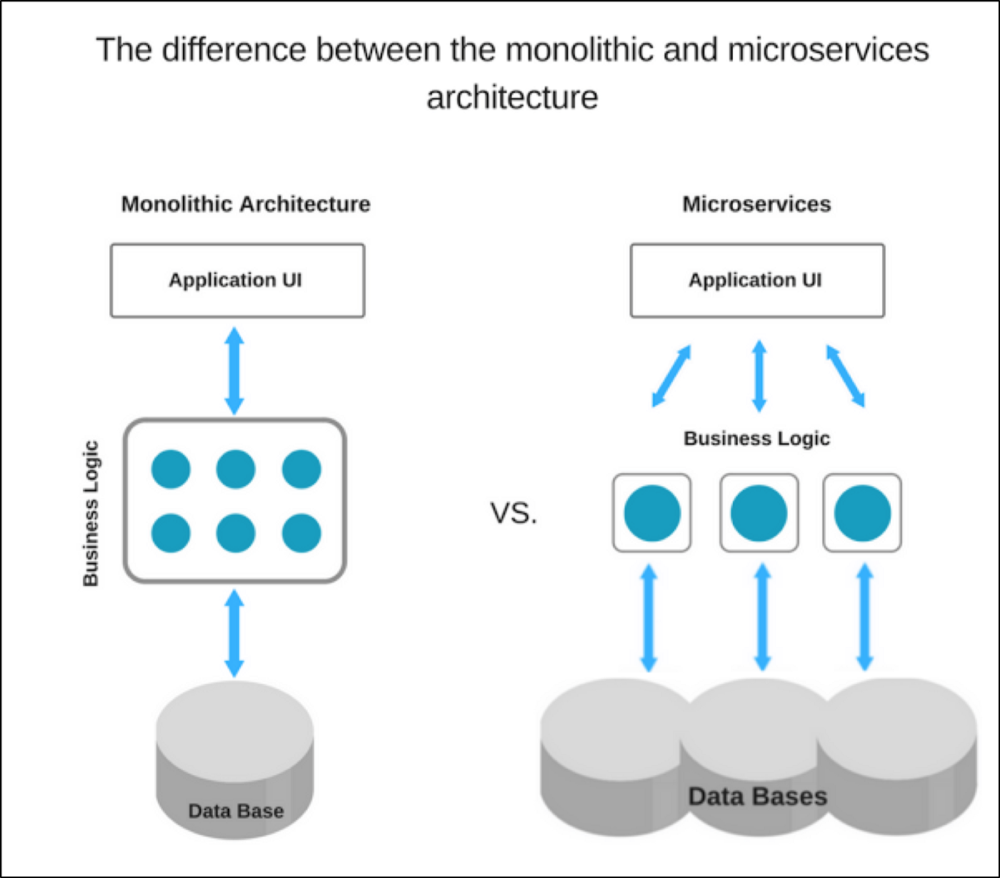

# Введение в монолитную архитектуру и архитектуру микросервисов

[Оригинал](https://medium.com/koderlabs/introduction-to-monolithic-architecture-and-microservices-architecture-b211a5955c63)

## Монолитная архитектура

Монолит означает объединение всего в единое целое. Монолитное приложение 
описывает одноуровневое программное приложение, в котором различные компоненты 
объединены в единую программу на одной платформе. Компонентами могут быть:

* Авторизация — отвечает за авторизацию пользователя.
* Представление — отвечает за обработку HTTP-запросов и ответ в формате HTML 
  или JSON/XML (для API-интерфейсов веб-сервисов).
* Бизнес-логика — бизнес-логика приложения.
* слой для работы с базами данных - объекты доступа к данным, отвечающие за 
  доступ к базе данных.
* Интеграция приложений — интеграция с другими сервисами (например, через 
  обмен сообщениями или REST API). Или интеграция с любыми другими источниками 
  данных.
* Модуль уведомлений — отвечает за отправку уведомлений по электронной почте, 
  когда это необходимо.

## Пример монолитного подхода

Рассмотрим пример приложения электронной коммерции, которое авторизует клиента,
принимает заказ, проверяет количество товара на складе, разрешает оплату 
и отправляет заказанные товары. Это приложение состоит из нескольких 
компонентов, включая пользовательский интерфейс электронного магазина для 
клиентов (веб-просмотр магазина), а также некоторые серверные службы для 
проверки количества товара на складе, разрешения и проведения платежей и 
доставки заказов.

Несмотря на наличие разных компонентов/модулей/сервисов, приложение создается и 
развертывается как одно приложение для всех платформ (например, настольных, 
мобильных и планшетных) с использованием СУБД в качестве источника данных. 
[Преимущества и недостатки монолитной архитектуры](https://articles.microservices.com/monolithic-vs-microservices-architecture-5c4848858f59).

**Преимущества:**

* Простота разработки — в начале проекта гораздо проще использовать монолитную 
  архитектуру.
* Просто проверить. Например, вы можете реализовать сквозное тестирование, 
  просто запустив приложение и протестировав пользовательский интерфейс с 
  помощью Selenium.
* Простота развертывания. Вы должны скопировать упакованное приложение на 
  сервер.
* Простое горизонтальное масштабирование путем запуска нескольких копий за 
  балансировщиком нагрузки.

**Недостатки:**

* Сопровождение. Если приложение слишком большое и сложное для полного понимания, 
  сложно быстро и правильно вносить изменения.
* Размер приложения может замедлить время запуска.
* Вы должны повторно развертывать все приложение при каждом обновлении.
* Монолитные приложения также могут быть сложно масштабировать, когда различные 
  модули имеют конфликтующие требования к ресурсам.
* Надежность — ошибка в любом модуле (например, утечка памяти) потенциально 
  может привести к сбою всего процесса. Более того, поскольку все экземпляры 
  приложения идентичны, эта ошибка влияет на доступность всего приложения.
* Независимо от того, насколько простыми могут показаться начальные этапы, 
  в монолитные приложения трудно внедрять новые и передовые технологии. 
  Поскольку изменения в языках или фреймворках влияют на все приложение, 
  требуется тщательная работа с деталями приложения, поэтому это требует больших
  затрат времени и усилий.

## Архитектура микросервисов

Микросервисы — это подход к разработке приложений, при котором большое 
приложение строится как набор модульных сервисов (т. е. слабо связанных 
модулей/компонентов). Каждый модуль поддерживает определенную бизнес-цель и 
использует простой, четко определенный интерфейс для связи с другими наборами 
сервисов.

Вместо совместного использования одной базы данных, как в монолитном приложении, 
каждый микросервис имеет свою собственную базу данных. Наличие базы данных для 
каждой службы необходимо, если вы хотите извлечь выгоду из микросервисов, 
потому что это обеспечивает **слабую связанность**. Каждый из сервисов имеет свою 
базу данных. Более того, сервис может использовать тот тип базы данных, 
который лучше всего подходит для его нужд.

Рассмотрим тот же пример приложения электронной коммерции, которое состоит из 
нескольких компонентов/модулей. Определим каждый компонент/модуль как 
отдельную **слабосвязанный** сервис в зависимости от требований, которые могут 
взаимодействовать друг с другом в зависимости от сценария. У нас могут быть 
следующие сервисы, чтобы приложение полностью выполняло поставленные перед ним 
задачи:

* Служба авторизации — отвечает за авторизацию клиента.
* Служба заказов — принимает заказ и обрабатывает его.
* Служба каталогов — управляйте товарами и проверяйте их наличие.
* Служба корзины — управление пользовательской корзиной, эта служба может 
  использовать службу каталогов в качестве источника данных.
* Платежный сервис — управление и разрешение платежей.
* Сервис доставки — отправляет заказанные товары.

**Преимущества:**

* Микросервисы Обеспечивают непрерывную доставку и развертывание больших и 
  сложных приложений.
* Улучшенная тестируемость — сервисы меньше по размеру и быстрее тестируются.
* Улучшенная развертываемость — сервисы можно развертывать независимо.
* Это позволяет распределить нагрузку, связанную с разработкой между несколькими 
  командами. Каждая команда отвечает за один или несколько сервисов. Каждая 
  команда может разрабатывать, развертывать и масштабировать свои сервисы 
  независимо от всех других команд.
* Каждый микросервис относительно мал.
* Удобно для понимания разработчика.
* IDE работает быстрее, делая разработчиков более продуктивными.
* Приложение запускается быстрее, что повышает продуктивность разработчиков и 
  ускоряет развертывание.
* Улучшенная изоляция неисправностей. Например, если в одной службе есть утечка 
  памяти, то затронута будет только эта служба. Другие службы продолжают 
  обрабатывать запросы. Для сравнения, один неисправный компонент монолитной 
  архитектуры может вывести из строя всю систему.
* Микросервисы устраняют любые долгосрочные обязательства перед стеком 
  технологий. При разработке нового сервиса вы можете выбрать новый стек 
  технологий. Точно так же при внесении серьезных изменений в существующую 
  службу вы можете переписать ее, используя новый стек технологий.

**Недостатки:**

* Разработчики должны сталкиваются с дополнительной сложностью из-за создания распределенной 
  системы.
* Инструменты разработчика/IDE ориентированы на создание монолитных приложений 
  и не предоставляют явной поддержки для разработки распределенных приложений.
* Тестирование сложнее по сравнению с монолитными приложениями. Разработчики 
  должны реализовать механизм межсервисного взаимодействия.
* Реализация сценариев использования, охватывающих несколько сервисов, без 
  использования распределенных транзакций затруднена.
* Реализация сценариев использования, охватывающих несколько сервисов, требует 
  тщательной координации между командами.
* Сложность развертывания. В продакшен среде также существует операционная 
  сложность развертывания и управления системой, состоящей из множества различных 
  типов служб.
* Повышенное потребление памяти. Архитектура микросервисов заменяет N 
  экземпляров монолитных приложений NxM экземплярами сервисов. Если каждый сервис
  работает в своем контейнере, что обычно необходимо для изоляции экземпляров, 
  то накладные расходы возрастают в M раз по количеству контейнеров.

## Заключение

Что ж, у обоих подходов есть свои плюсы и минусы, но это зависит от каждого 
сценария или требований к продукту/проекту и от того, какой компромисс вы 
выберете. Поскольку монолитный подход лучше всего подходит для приложений с
тонким клиентом, рекомендуется сначала принять монолитный подход и, в зависимости 
от потребностей/требований, постепенно переходить к подходу микросервисов.

## Ссылки:

1. [Сравнение монолитной и микросервисной архитектуры](https://articles.microservices.com/monolithic-vs-microservices-architecture-5c4848858f59)
2. [Монолитная архитектура](http://microservices.io/patterns/monolithic.html)
3. [Микросервисная архитектура](http://microservices.io/patterns/microservices.html)

