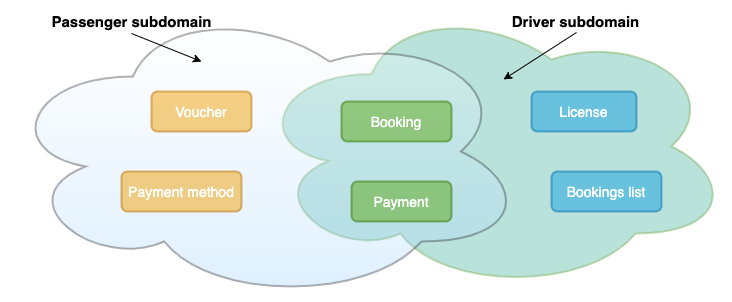
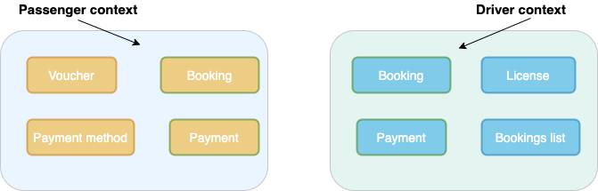
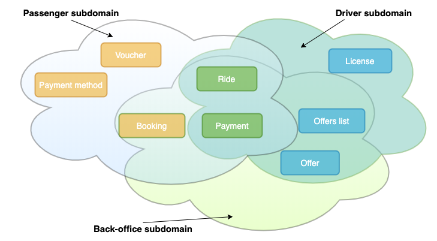

## Стратегическое предметно-ориентированное проектирование

[Оригинал](https://medium.com/@chatuev/ddd-for-microservices-4778a363c071)

Архитектура на основе микросервисов стала стандартом для проектирования 
модульной масштабируемой архитектуры программного обеспечения. В определенный 
момент роста многие компании сталкиваются с проблемами разделения монолитных 
приложений на микросервисы. Один из самых сложных этапов в таких задачах — как 
правильно определить обязанности каждого микросервиса, что не позволит им 
разрастись в кучу более мелких монолитов. И как осуществлять взаимодействие между
микросервисами, сохраняя при этом высокий уровень обслуживаемости и возможности 
развития.

В этом цикле статей об использовании DDD для проектирования микросервисов я 
хотел бы поделиться своим опытом внедрения предметно-ориентированного проектирования
в технических компаниях и его интеграции в процесс разработки программного 
обеспечения.

Эти статьи могут помочь вам использовать DDD не только для разделения монолитов 
или проектирования архитектуры на основе микросервисов, но и для улучшения 
структуры и взаимодействия команд инженеров.

## Вступление

Предметно-ориентированное проектирование - это философия , методология и набор
шаблонов, используемых для разработки программного обеспечения для сложных 
предметных областей бизнеса.

Приступая к разработке программного обеспечения, многие сначала думают о 
структурах данных, чтобы спроектировать таблицы БД и связанные с ними классы и 
модули.

Но DDD предлагает отразить знания о вашей бизнес-области в разработке 
программного обеспечения, используя набор методик и шаблонов проектирования.

В качестве примера давайте рассмотрим упрощенное приложение для вызовов такси,
похожее на Uber.

**Пассажир** осуществляет **Бронирование**. А **Водитель** отслеживает и принимает **Бронирования**
из **списка Бронирований**.

Как можно разработать приложение на основе структур данных?

На первый взгляд, у нас одна и та же структура данных Бронирование, используемая в 
двух приложениях: Пассажир и Водитель. Местоположение, способ оплаты и стоимость
Бронирования предоставляются обеим сторонам. Таким образом, все решение может 
быть оформлено как набор связанных таблиц с таблицей Bookings в качестве основной.

Затем мы добавляем соответствующие программные блоки кода: модули, классы и 
интерфейсы.

Поскольку данные, которые должны быть представлены пользователям обоих типов, 
имеют много общего, код может частично иметь общие интерфейсы и общее 
поведение. Таким образом, мы разработаем приложение вызова такси как единую 
всеобъемлющую модель.

Это может быть опасно, потому что с ростом сложности из-за увеличения 
количества сущностей и их взаимосвязей, каждая конкретная концепция «Пассажир» 
и «Водитель» потребует функциональности с более конкретными обязанностями.

Например, для пассажира Бронирование может иметь такие атрибуты как адрес, где 
его нужно подобрать и цена. Адрес подбора — это текущая точка, где пассажир 
ожидает такси и физическое начало поездки. Цена включает всё, учитывая сборы
владельцев приложения и плату водителю и обрабатывается как денежный перевод со
счёта Пассажира на счет приложения.

Но для Водителя Адрес подбора — это всего лишь промежуточная точка, а начальная точка
поездки — это та, где он принял Бронирование. Цена, показанная Пассажиру, не 
видна Водителю, ему отображается какое-то её составляющая.

Мы видим, что данные, связанные с конкретным Бронированием требуют большого
количества предварительной обработки, прежде чем они будут представлены разным 
сторонам, и имеют различное значение в зависимости от контекста.

**Без тщательного проектирования система может превратиться в большой ком грязи — 
монолитное приложение, состоящее из сильно связанных модулей со слабо связными 
элементами.**

Сложность обслуживания таких монолитов экспоненциально возрастает со временем.

Часто мы имеем дело с устаревшими частями, которые просто работают, но знания 
о логике работы со временем теряются или исчезают с конкретными инженерами, 
уже покинувшими команду.

В отличие от подхода, основанного на схеме данных, давайте попробуем отразить
предметную область бизнеса в программных системах с помощью шаблонов 
проектирования, ориентированных на предметную область. DDD решает сложности в
предметной области бизнеса, объединяя экспертов предметной области из пространства 
задач и инженеров, которые будут реализовывать пространство решений.

По своей сути DDD состоит из стратегического и тактического проектирования.

Стратегическое проектирование — это набор принципов и шаблонов для поддержания 
целостности модели, выделения модели из предметной области и работы с 
несколькими моделями. Стратегическое проектирование очень полезно для 
разделения большой и сложной бизнес-задачи на несколько частей с четкими 
границами и конкретными обязанностями, а также для построения высокоуровневой 
топологии проектирования программного обеспечения.

Тактическое проектирование — это набор шаблонов проектирования и строительных 
блоков, которые можно использовать для абстрагирования компонентов программного 
обеспечения низкого и среднего уровня. Тактические паттерны очень удобны для 
обращения к программному коду и имеют дело с классами и модулями. Цель 
тактического проектирования состоит в том, чтобы усовершенствовать результат 
применения стратегических паттернов до стадии, на которой его можно 
преобразовать в работающий код.

Domain-Driven Design — это эволюционирующий процесс, состоящий из повторяющихся 
циклов применения стратегического и тактического проектирования. Вы начинаете 
со стратегического проектирования, а затем тактического.

Эта статья в основном посвящена пространстве задач и тому, как его рост 
решается с помощью DDD стратегического проектирования.

## Стратегическое проектирование

**Предметной область** бизнеса - это проблема, которую мы пытаемся решить с помощью 
программного обеспечения. Итак, предметная область — это пространство задач
или _то_, что с ней связано.

Предметную область можно разделить на **подобласти**, например, Бронирование, Учётные записи,
Управление идентификацией.

**Модель предметной области** — это абстракция предметной области, которая включает 
в себя поведение и данные, необходимые для удовлетворения бизнес-требований.
Итак, **модель предметной области** — это пространство решений, или то как мы 
собираемся решать бизнес-задачу.

Модель предметной области состоит из **ограниченных контекстов** — составляющих решения.

Ограниченный контекст — это семантически связанная с контекстом граница.
Это означает, что внутри границ каждый компонент модели программного обеспечения
имеет определенное значение и выполняет определенные функции. Компоненты внутри 
ограниченного контекста зависят от контекста и семантически мотивированы.

> Ограниченный контекст — это семантическая контекстная граница. Это значит, что в пределах 
> Ограниченного контекста каждый компонент программного обеспечения имеет 
> определенное значение и делает определенные вещи.
>
> @ Вон Вернон Предметно-ориентированное проектирование Самое основное

## Проектирование пространства задач

Сначала, чтобы структурировать предметную область, мы разделим её на подобласти,
чтобы модульно разделить проблемное пространство. Разделение предметной области 
на поддомены — не простая задача. Основные проблемы с разделением связаны с 
границами: как определить границы каждого контекста, их перекрывающиеся области 
и как работать с этими областями.

В пространстве задач в нашем примере приложения для вызова такси на высшем 
уровне у нас будут две подобласти: приложение «Пассажиры» и приложение 
«Водители».

В подобласти «Пассажир» клиент создает запрос на Бронирование. Клиенты могут 
использовать ваучеры и управлять способами оплаты.

В подобласти «Водитель» лицензированный Водитель принимает Бронирование из 
списка и управляет соответствующей физической поездкой.

Рисунок 1 - Пространство задач приложения вызова такси

Чтобы спроектировать пространство решений, нам нужно сопоставить каждую 
подобласть с соответствующим **ограниченным контекстом**.

## Проектируем пространство решений

В DDD подобласть в пространстве задач идеально сопоставляется 1-к-1 с 
ограниченным контекстом в **пространстве решений**.

Давайте сначала решим самую сложную часть, пересечение подобластей. Первый 
вариант решения проблемы пересечения — это шаблон Shared Kernel (общее ядро).
Shared Kernel используется, когда несколько связанных контекстов могут совместно 
использовать одну или несколько общих сущностей. Использование общего ядра в 
нашем случае будет означать прямое сопоставление _подобластей_ и _концепций_ на
рисунке 1 в _ограниченные контексты_ и _сущности_ с общим Бронированием и 
Оплатой.

Второй вариант — это отдельный ограниченный контекст, содержащий определенные 
сущности. С точки зрения микросервисной архитектуры второй вариант обычно 
более предпочтителен и устойчив в долгосрочной перспективе, поскольку любая 
единица кода стремится к единому принципу ответственности.

На рисунке 2 пространство задач приложения вызова такси разделено на отдельные
сущности, находящиеся внутри своих собственных разделенных ограниченных 
контекстов.

Рисунок 2 - Пространство решений приложения вызова такси

Со временем приложение вызова такси будет разрастаться. Мы обновляем различные 
подобласти и концепции внутри них. Существующие концепции, такие как 
Бронирование и/или список заказов, также могут быть расширены в новую подобласть
Бэк-офис. Даже весь продукт может распространяться на рынок B2B. В результате
пространство задач становится сложным и требует дальнейших итераций исследования 
и сопоставления с ограниченными контекстами. Таким образом, при дальнейших 
итерациях развития бизнеса нам нужно пересмотреть пространство задач, чтобы 
найти новые подобласти и снова применить Стратегический DDD.

## Как обнаружить новые подобласти?

Если команда начинает использовать новый термин для выражения существующей 
концепции или существующий термин используется для выражения нового понятия, то
это тревожный звоночек для команды о том, что границы подобласти перекрываются.

Растущая предметная область выражаемая в устной форме и используемая совместно 
с расширяющимся **словарем** терминов, относящихся к предметной области, называется
**единым языком**. **Единый язык** документируется и **озвучивается всеми сотрудниками** 
рассматриваемой области, участвующими в процессе разработки программного 
обеспечения. Перефразируя он называется **единым**, потому что повсеместно используется
инженерами и экспертами в предметной области.

**Единый язык** — это то, что определяет **ограниченные контексты**, поэтому развивающийся 
язык формирует модель предметной области.

Остановимся подробнее на вызове такси и в качестве примера воспользуемся понятием
Бронирования:

* пассажир осуществляет бронирование с атрибутами: имя пассажира, место посадки, 
  место высадки, класс автомобиля, цена, способ оплаты и т. д.
* запрос на бронирование инициирует создание заказа, который добавляется в список 
  заказов, отслеживаемых водителем и бек-офисом. В предложении есть **цена** для 
  водителя, **количество** пассажиров, **специальные требования**, личные данные пассажира,
  такие как **телефон**, **имя** и **тариф**.
* водитель принимает заказ и начинает физическую **Поездку**, чтобы забрать Пассажира 
  и предоставить услугу по перевозке из пункта А в Б. У **Поездки** есть **время 
  прибытия**, **время начала**, **продолжительность**, **конечная цена** и многое другое.

Учитывая эволюцию поведения и атрибутов, понятие Бронирование начинает иметь
разные значения в подобластях «Пассажир», «Водитель» и недавно появившемся 
поддомене «Бэк-офис». Таким образом, **Бронирование** естественным образом 
трансформируется и может быть разделен на **Бронирование**, **Поездку** и **Заказ**.

Следующая итерация пространства задач выглядит как показано на рисунке 3.

Рисунок 3 Эволюция приложения вызова такси

Развиваясь дальше, весь бизнес может выйти на рынок B2B, что приведёт к новым 
значениям существующих понятий и эволюции подобластей. На каждой итерации 
определения предметной области крайне важно сделать богаче единый язык, чтобы 
новые понятия и подобласти были обнаружены и отражены в будущем проекте системы.

Понятия и подобласти эволюционировавшего пространства задач затем снова 
сопоставляются с сущностями и ограниченными контекстами в пространстве решений.

Подведём итоги тому, чему мы научились.

**Единый язык** и **ограниченный контекст** являются **стратегическими 
шаблонами** в **DDD**.

Стратегические шаблоны используются для разработки крупных моделей предметных 
областей, описываемых **единым языком**, на котором говорят в их конкретных 
**ограниченных контекстах**.

> В нескольких словах можно сказать, что предметно-ориентированное проектирование 
> прежде всего подразумевает моделирование единого языка в четко определенном 
> ограниченном контексте.
>
> @ Вон Вернон Предметно-ориентированное проектирование Самое основное
 
Как видите, подход DDD требует, чтобы эксперты в области бизнеса и 
инженеры-программисты работали сообща при обнаружении проблем и разработке 
решений. Это окупается четким пониманием предметной области бизнеса и четкими 
и конкретными обязанностями будущих программных компонентов.

## Заключение

Стратегические шаблоны DDD используются для разработки абстракций моделей 
предметной области, включающих поведение и данные. Собирая и используя единый
язык, мы можем обнаруживать изменения в существующих и рождение новых
подобластей. Структурируя Ограниченные контексты и их отношения, мы можем 
построить высокоуровневую топологию модульного проекта программного обеспечения.
Модульная структура помогает создавать микросервисы с четкими обязанностями и, 
таким образом, повышает удобство обслуживания и возможности развития системы.

После сказанного возникает ещё больше вопросов.

В [следующей статье мы поговорим о семинаре **Event Storming**](https://medium.com/@chatuev/big-picture-event-storming-7a1fe18ffabb), который помогает 
облегчить сотрудничество между экспертами в предметной области и инженерами и 
создать единый язык.

Далее, используя результаты Event Storming, мы построим **карту контекста**, 
которая поможет точно определить обязанности и взаимодействие между 
микросервисами.