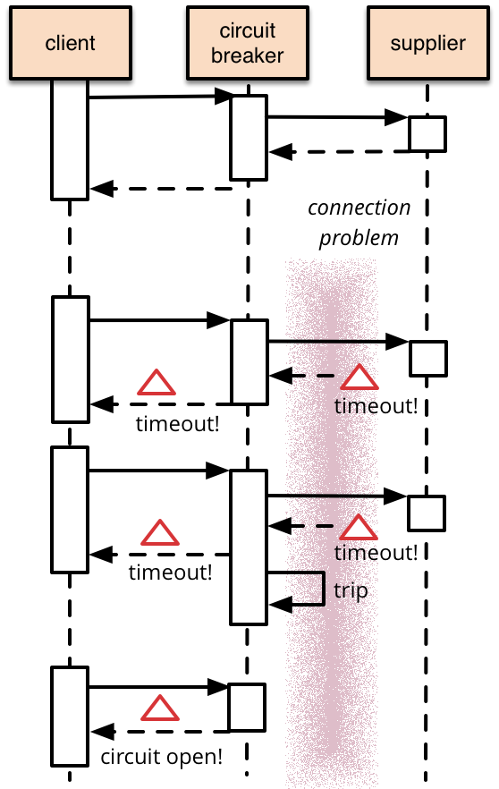

# CircuitBreaker (Предохранители)

6 марта 2014


[Мартин Фаулер](https://martinfowler.com/)

[НЕПРЕРЫВНАЯ ДОСТАВКА](https://martinfowler.com/tags/continuous%20delivery.html)
[АРХИТЕКТУРА ПРИЛОЖЕНИЯ](https://martinfowler.com/tags/application%20architecture.html)

Для программных систем характерно выполнять удаленные вызовы к программному 
обеспечению, работающему в разных процессах, возможно, на разных машинах в сети. 
Одно из больших различий между вызовами в памяти и удаленными вызовами заключается 
в том, что удаленные вызовы могут завершаться сбоем или зависать без ответа до 
тех пор, пока не будет достигнуто некоторое время ожидания. Что еще хуже, если 
у вас есть много вызовов от не отвечающего поставщика, тогда у вас могут 
закончиться критические ресурсы, что приведет к каскадным сбоям в нескольких 
системах. В своей превосходной книге [Release It](https://www.amazon.com/gp/product/0978739213/ref=as_li_tl?ie=UTF8&camp=1789&creative=9325&creativeASIN=0978739213&linkCode=as2&tag=martinfowlerc-20) Майкл Найгард популяризировал 
шаблон Circuit Breaker, чтобы предотвратить такой катастрофический каскад.

Основная идея Предохранителя очень проста. Вы заключаете вызов защищенной функции 
в объект Предохранитель, который отслеживает сбои. Как только число сбоев достигает 
определенного порога, Предохранитель срабатывает, и для всех последующих вызовов
Предохранитель возвращают ошибку, при этом защищенный вызов вообще не выполняется. 
Обычно вам также понадобится какое-то контрольное оповещение, если сработает
Предохранитель.



Вот простой пример такого поведения в Ruby, защита от тайм-аутов.

Я установил Предохранитель в блоке ([Lambda](https://martinfowler.com/bliki/Lambda.html)), 
который является защищенным вызовом.

Предохранитель сохраняет блок, инициализирует различные параметры (пороги, 
тайм-ауты и мониторинг) и переводит Предохранитель в замкнутое состояние.

```
class CircuitBreaker...

  attr_accessor :invocation_timeout, :failure_threshold, :monitor
  def initialize &block
    @circuit = block
    @invocation_timeout = 0.01
    @failure_threshold = 5
    @monitor = acquire_monitor
    reset
  end
```

Вызов Предохранителя вызовет базовый блок, если цепь замкнута, но вернет ошибку, 
если она разомкнута.

```
# client code
    aCircuitBreaker.call(5)


class CircuitBreaker...

  def call args
    case state
    when :closed
      begin
        do_call args
      rescue Timeout::Error
        record_failure
        raise $!
      end
    when :open then raise CircuitBreaker::Open
    else raise "Unreachable Code"
    end
  end
  def do_call args
    result = Timeout::timeout(@invocation_timeout) do
      @circuit.call args
    end
    reset
    return result
  end
```

Если мы получаем тайм-аут, мы увеличиваем счетчик отказов, успешные вызовы 
сбрасывают его обратно на ноль.

```
class CircuitBreaker...

  def record_failure
    @failure_count += 1
    @monitor.alert(:open_circuit) if :open == state
  end
  def reset
    @failure_count = 0
    @monitor.alert :reset_circuit
  end
```

Я определяю состояние Предохранителя, сравнивая количество отказов с порогом

```
class CircuitBreaker...

  def state
     (@failure_count >= @failure_threshold) ? :open : :closed
  end
```

Этот простой Предохранитель позволяет избежать выполнения защищенного вызова, 
когда цепь разомкнута, но потребуется внешнего вмешательства для его сброса, 
когда все снова будет хорошо. Это разумный подход к электрическим предохранителем 
в зданиях, но для программных автоматических выключателей мы можем 
сделать так, чтобы автоматический выключатель сам определял, работают ли удаленные 
вызовы снова. Мы можем реализовать это поведение самосброса, повторив попытку 
защищенного вызова через соответствующий интервал и сбросив Предохранитель, если 
он будет успешным.


Создание Предохранителя такого типа означает добавление порога для попытки 
сброса и создание переменной для хранения времени последней ошибки.

```
class ResetCircuitBreaker...

  def initialize &block
    @circuit = block
    @invocation_timeout = 0.01
    @failure_threshold = 5
    @monitor = BreakerMonitor.new
    @reset_timeout = 0.1
    reset
  end
  def reset
    @failure_count = 0
    @last_failure_time = nil
    @monitor.alert :reset_circuit
  end
```

Теперь присутствует третье состояние — полуоткрытое — это означает, что Предохранитель 
готов сделать реальный вызов в качестве пробы, чтобы увидеть, устранена ли проблема.

```
class ResetCircuitBreaker...

  def state
    case
    when (@failure_count >= @failure_threshold) && 
        (Time.now - @last_failure_time) > @reset_timeout
      :half_open
    when (@failure_count >= @failure_threshold)
      :open
    else
      :closed
    end
  end
```

Вызов в полуоткрытом состоянии приводит к пробному вызову, который 
либо сбрасывает Предохранитель в случае успеха, либо перезапускает тайм-аут, если 
нет.

```
class ResetCircuitBreaker...

  def call args
    case state
    when :closed, :half_open
      begin
        do_call args
      rescue Timeout::Error
        record_failure
        raise $!
      end
    when :open
      raise CircuitBreaker::Open
    else
      raise "Unreachable"
    end
  end
  def record_failure
    @failure_count += 1
    @last_failure_time = Time.now
    @monitor.alert(:open_circuit) if :open == state
  end
```

Этот пример является простым пояснительным, на практике Предохранители предоставляют 
гораздо больше функций и параметров. Часто они защищают от ряда ошибок, которые 
могут возникнуть при защищенном вызове, таких как сбои сетевого подключения.
Не все ошибки должны отключать цепь, некоторые должны выдавать нормальные отказы 
и рассматриваться как часть обычной логики.

При большом трафике у вас могут возникнуть проблемы со многими вызовами, просто 
ожидающими начального тайм-аута. Поскольку удаленные вызовы часто бывают 
медленными, рекомендуется размещать каждый вызов в отдельном потоке, 
используя [future или promise](http://en.wikipedia.org/wiki/Futures_and_promises), чтобы обрабатывать результаты, когда они вернутся. 
Беря эти потоки из пула потоков, вы можете организовать Предохранитель, 
когда пул потоков будет исчерпан.

В примере показан простой способ отключения Предохранителя — счетчик, который 
сбрасывается при успешном вызове. Более сложный подход может учитывать частоту 
ошибок, отключаясь, когда вы получаете, скажем, 50% отказов. У вас также могут 
быть разные пороговые значения для разных ошибок, например пороговое значение 
10 для тайм-аутов и 3 для сбоев подключения.

Пример, который я показал, представляет собой Предохранитель для синхронных 
вызовов, но Предохранители также полезны для асинхронной связи. Обычный метод 
здесь — поставить все запросы в очередь, которую поставщик потребляет на своей 
скорости — полезный метод, позволяющий избежать перегрузки серверов. В этом 
случае цепь разрывается, когда очередь заполняется.

Сами по себе Предохранители помогают сократить ресурсы, затрачиваемые на 
операции, которые могут завершиться неудачно. Вы избегаете ожидания тайм-аутов 
для клиента, а разорванная цепь позволяет избежать нагрузки на проблемный сервер. 
Я говорю здесь об удаленных вызовах, которые являются обычным случаем для Предохранителя, 
но их можно использовать в любой ситуации, когда вы хотите защитить 
части системы от сбоев в других частях.

Предохранители полезно использовать для мониторинга. Любое изменение состояния 
должно регистрироваться, а Предохранители должны раскрывать подробности своего 
состояния для более глубокого мониторинга. Поведение Предохранителя часто является 
хорошим источником предупреждений о более серьезных проблемах в окружении. 
Оперативный персонал должен иметь возможность отключать или сбрасывать Предохранитель.

Предохранители сами по себе ценны, но клиенты, использующие их, должны реагировать 
на отказы. Как и при любом удаленном вызове, вам необходимо подумать, что делать 
в случае сбоя. Сбой выполняемой операции или есть обходные пути, 
которые вы можете реализовать? Авторизация кредитной карты может быть поставлена 
в очередь, чтобы обработать ее позже, неспособность получить некоторые данные 
можно смягчить, показывая некоторые устаревшие данные, которые можно использовать
для отображения.

## Дальнейшее чтение

Технический блог Netflix содержит много полезной информации о повышении надежности 
систем с большим количеством сервисов. [Их Dependency Command](http://techblog.netflix.com/2012/02/fault-tolerance-in-high-volume.html) говорит об использовании
Предохранителей и ограничении пула потоков.

У Netflix есть [Hystrix](https://github.com/Netflix/Hystrix/) с открытым исходным кодом, сложный инструмент для работы 
с задержкой и отказоустойчивостью для распределенных систем. Он включает в себя 
реализацию шаблона Circuit Breaker с ограничением пула потоков.

Существуют и другие реализации шаблона Circuit Breaker с открытым исходным 
кодом на [Ruby](http://github.com/wsargent/circuit_breaker/tree/master), [Java](https://github.com/Comcast/jrugged), 
[Grails Plugin](http://www.grails.org/plugin/circuit-breaker), [C#](http://timross.wordpress.com/2008/02/10/implementing-the-circuit-breaker-pattern-in-c/), 
[AspectJ](http://github.com/sptz45/circuit-breaker/tree/master) и [Scala](http://github.com/FaKod/Circuit-Breaker-for-Scala).

## Благодарности

Павел Шпак заметил и сообщил об ошибке в коде примера