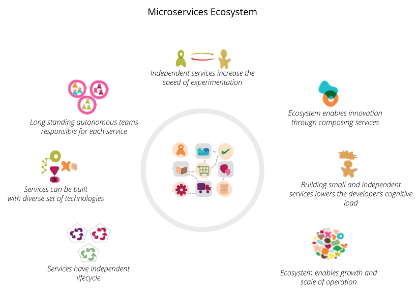
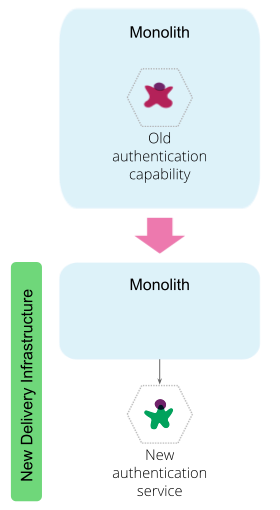

# Как разбить монолит на микросервисы

## Что и когда разъединять

_Поскольку монолитные системы становятся слишком большими, чтобы с ними можно 
было работать, многие предприятия стремятся разбить их на архитектурный стиль 
микросервисов. Это стоящая инициатива, но не легкое. Мы узнали, что для того, 
чтобы сделать это хорошо, нам нужно начать с простого сервиса, а затем 
расширить сервисы, основанные на вертикальных возможностях, важных для 
бизнеса и подверженных частым изменениям. Сначала эти сервисы должны быть 
большими и, желательно, не зависеть от остального монолита. Мы должны 
гарантировать, что каждый шаг миграции представляет собой атомарное улучшение 
общей архитектуры._

24 апреля 2018

*** 

Жамак — главный консультант по технологиям в Thoughtworks, специализирующийся 
на архитектуре распределенных систем и стратегии цифровых платформ в Enterprise. 
Она является членом Консультативного совета по технологиям Thoughtworks и 
участвует в создании Радара технологий Thoughtworks.

Содержание

Назначение экосистемы микросервисов
Путеводитель
Разминка с помощью простого и достаточно не связанного функционала
Минимизация зависимости от монолита
Раннее разделение слипшегося функционала
Вертикальное разделение и раннее разъединение данных
Разделите то, что важно для бизнеса, и то, что часто меняется
Разделите функционал, а не код
Сначала макро, затем микро
Миграция с помощью атомарных эволюционных шагов

[МИКРОСЕРВИСЫ](https://martinfowler.com/tags/microservices.html)

[РЕКОНСТРУКЦИЯ LEGACY](https://martinfowler.com/tags/legacy%20rehab.html)

Миграция монолитной системы в [экосистему микросервисов](https://martinfowler.com/articles/microservices.html) — это грандиозное 
путешествие. У тех, кто отправляется в этот путь, есть такие устремления, как 
увеличение масштабов деятельности, ускорение темпов изменений и избежание 
высокой стоимости изменений. Они хотят увеличить количество своих команд, 
позволяя им приносить пользу параллельно и независимо друг от друга. Они хотят 
быстро экспериментировать с основными возможностями своего бизнеса и быстрее 
получать прибыль. Они также хотят избежать высоких затрат, связанных с внесением 
изменений в существующие монолитные системы.

Решение о том, какой функционал отделить, когда и как выполнять пошаговую 
миграцию, является одной из архитектурных задач, связанных с разделением 
монолита на экосистему микросервисов. В этой статье я делюсь несколькими 
методиками, которые могут помочь группам разработки — разработчикам, 
архитекторам, техническим менеджерам — принимать решения по декомпозиции на 
протяжении всего пути.

Чтобы эти методики было проще понять, я использую в качестве примера 
многоуровневое онлайн-приложение для розничной торговли. Это приложение тесно 
связывает взаимодействие с пользователем, бизнес-логику и уровень данных.
Причина, по которой я выбрала этот пример, заключается в том, что его архитектура 
имеет характеристики монолитных приложений, которыми пользуются многие компании, 
а его технологический стек достаточно современен, чтобы оправдать декомпозицию 
вместо полного переписывания и замены.

***

## Назначение экосистемы микросервисов

Прежде чем приступить к работе, очень важно, чтобы у всех было общее 
представление об [экосистеме микросервисов](https://martinfowler.com/articles/microservices.html). Экосистема микросервисов — это 
платформа сервисов, каждый из которых инкапсулирует бизнес-возможности. 
Бизнес-функционал представляют собой то, что бизнес делает в конкретной области 
для выполнения своих целей и обязанностей. Каждый микросервис предоставляет API, 
который разработчики могут узнать и использовать самостоятельно. Микросервисы 
имеют независимый жизненный цикл. Разработчики могут создавать, тестировать и 
выпускать каждый микросервис независимо друг от друга. Экосистема микросервисов 
навызывает организационную структуру автономных давно существующих команд, 
каждая из которых отвечает за один или несколько сервисов. Вопреки общему мнению 
и «микро» в микросервисах, размер каждого сервиса имеет наименьшее значение и 
может варьироваться в зависимости от операционной зрелости организации. Как 
выразился Мартин Фаулер, «микросервисы — это название, а не описание».

_Рисунок 1. Сервисы инкапсулируют бизнес, предоставляют данные и 
функциональные возможности через самообслуживаемое API_

***

## Путеводитель

Прежде чем углубляться в руководство, важно знать, что декомпозиция 
существующей системы на микросервисы сопряжена с высокими общими затратами и 
может потребовать много итераций. Разработчикам и архитекторам необходимо 
тщательно оценить, является ли декомпозиция существующего монолита правильным 
путем и являются ли сами микросервисы [правильным направлением](https://martinfowler.com/articles/microservice-trade-offs.html). Прояснив это, 
давайте пройдемся по руководству.

## Разминка с помощью простого и достаточно не связанного функционала

Для перехода к микросервисам требуется минимальный уровень оперативной готовности.
Для этого требуется доступ по запросу к среде развертывания, создание новых 
типов конвейеров непрерывной доставки для независимого создания, тестирования и 
развертывания исполняемых сервисов, а также возможность защищать, отлаживать и 
контролировать распределенную архитектуру. Зрелость оперативной готовности 
требуется независимо от того, создаем ли мы услуги с нуля или разбираем 
существующую систему. Дополнительные сведения об этой оперативной готовности 
смотри в статье Мартина Фаулера о [предварительных требованиях к микросервисам](https://martinfowler.com/bliki/MicroservicePrerequisites.html). 
Хорошая новость заключается в том, что со времени статьи Мартина технология 
работы с микросервисной архитектурой быстро развивалась. Это включает в себя 
создание [Service Mesh](https://www.thoughtworks.com/radar/techniques/service-mesh), выделенного 
уровня инфраструктуры для запуска быстрой, надежной и безопасной сети микросервисов, 
[систем оркестровки контейнеров](https://www.thoughtworks.com/radar/platforms/kubernetes) для обеспечения более высокого уровня абстракции 
инфраструктуры развертывания и развития систем непрерывной доставки, таких как 
[GoCD](https://www.gocd.org/kubernetes/?gclid=EAIaIQobChMIwu-o1_3E2gIVjcVkCh3XUAkoEAAYASAAEgJPQ_D_BwE), 
для создания, тестирования и развертывания микросервисов как контейнеры.

Я предлагаю разработчикам и операционным группам создать базовую инфраструктуру, 
конвейеры непрерывной доставки и систему управления API для первого и 
второго сервиса, которые они разделяют или создают новые. Начните с функционала, 
который достаточно отделен от монолита, он не требуют изменений во многих 
клиентских приложениях, которые в настоящее время используют монолит и, возможно, 
не нуждается в хранилище данных. На данным этапе команды доставки оптимизируют 
проверку своих подходов к доставке, повышают квалификацию членов команды и 
создают минимальную инфраструктуру, необходимую для предоставления независимо 
развертываемых безопасных сервисов, которые предоставляют API самообслуживания. 
Например, для онлайн-приложения розничной торговли первым сервисом может быть 
сервис «аутентификации конечных пользователей», которую монолит может вызывать 
для аутентификации конечных пользователей, а вторым сервисом может быть сервис 
«профиль клиента», фасадный сервис, предоставляющий лучшее представление о 
клиентах для новых клиентских приложений.

Сначала я рекомендую отделить простые пограничные сервисы. Далее мы применяем 
другой подход, разделяющий функционал, глубоко встроенный в монолитную систему. 
Я советую сначала использовать пограничные сервисы, потому что в начале пути 
самый большой риск для групп доставки заключается в том, что они не смогут 
правильно управлять микросервисами. Поэтому полезно использовать пограничные 
сервисы для отработки необходимых [эксплуатационных требований](https://martinfowler.com/bliki/MicroservicePrerequisites.html). Разобравшись с 
этим, они смогут решить ключевую проблему расщепления монолита.

_Рисунок 2. Разминка с помощью простой возможности с небольшим радиусом изменения 
для повышения нашей оперативной готовности_

## Минимизация зависимости от монолита

В качестве основополагающего принципа команды доставки должны свести к минимуму 
зависимости вновь созданных микросервисов от монолита. Основным преимуществом 
микросервисов является быстрый и независимый цикл релизов. Наличие зависимостей 
от монолита — данных, логики, API — связывает сервис с циклом релизов монолита, 
препятствуя этому преимуществу. Часто основной мотивацией для отказа от монолита 
является высокая стоимость и медленный темп изменения заблокированных в нем 
функционала, поэтому мы хотим постепенно двигаться в направлении, которое 
отделяет этот основной функционал, удаляя зависимости от монолита. Если команды 
будут следовать этому правилу при встраивании функционала в свои собственные 
сервисы, то вместо этого они обнаружат зависимости в обратном направлении, от 
монолита к сервисам. Это желательное направление зависимости, поскольку оно не 
замедляет темпы изменений для новых сервисов.

Рассмотрим розничную онлайн-систему торговли, где «покупка» и «рекламные 
акции» являются основным функционалом. «Купить» использует «рекламные акции» в процессе 
оформления заказа, чтобы предложить покупателям лучшие акции, на которые они 
имеют право, учитывая товары, которые они покупают. Если нам нужно решить, 
какой из этих двух функционалов разделить следующим, я предлагаю начать сначала 
с отделения «рекламных акций», а затем «купить». Потому что в таком порядке мы 
минимизируем зависимости от монолита. В этом порядке «покупка» сначала остается 
заблокированной в монолите с зависимостью от нового микросервиса «рекламные
акции».

Следующие рекомендации предлагают другие способы определения порядка, в котором 
разработчики отделяют сервисы. Это означает, что они не всегда могут избежать 
зависимостей от монолита. В тех случаях, когда новый сервис заканчивается 
обратным вызовом монолита, я предлагаю предоставить новый API из монолита и 
получить доступ к API через [предохранительный](https://martinfowler.com/articles/refactoring-external-service.html#SeparatingTheYoutubeDataStructureIntoAGateway) уровень в новом сервисе, чтобы 
убедиться, что концепции монолита не проникли в новый сервис. Стремитесь 
определить API, отражающий четко определенные концепции и структуры предметной 
области, даже если внутренняя реализация монолита может быть иной. В этом 
неудачном случае команды доставки будут нести затраты и трудности из-за
изменений монолита, при тестировании и релизе новых сервисов, связанных с релизом 
монолита.

_Рисунок 3. Сначала отделите сервис, не требующую зависимости, от монолита и 
минимизируйте зависимости от монолита_

## Раннее разделение слипшегося функционала

Я предполагаю, что к этому моменту команды доставки уже умеют создавать 
микросервисы и готовы решать сложные проблемы. Однако они могут оказаться 
ограниченными функционалом, которые они могут отделить дальше без зависимости 
от монолита. Первопричиной этого часто является функционал внутри монолита, 
который является перетекающим, нечетко определенной как концепция предметной 
области, от которой зависят многие функциональные возможности монолита. Чтобы 
иметь возможность развиваться, разработчикам необходимо идентифицировать 
слипшийся функционал, разложить их на четко определенные концепции предметной 
области, а затем [преобразовать](https://en.wikipedia.org/wiki/Reification) эти концепции предметной области в отдельные 
сервисы.

Например, в веб-монолите понятие «(веб)-сеанс» является одним из наиболее 
распространенных связующих факторов. В примере с розничной торговлей в Интернете 
сеанс часто представляет собой область памяти с многочисленными атрибутами, начиная от 
пользовательских предпочтений в разных частях предметной области, таких как предпочтения 
по доставке и оплате, до намерений и взаимодействий пользователей, таких как 
недавно посещенные страницы, выбранные продукты и список пожеланий. Если мы не 
займемся отделением, деконструкцией и материализацией текущего понятия «сеанса», 
нам будет трудно отделить многие из будущих функциональных возможностей, 
поскольку они будут переплетены с монолитом из-за перетекающей концепции сеанса.
Я также не рекомендую создавать «сессионный» сервис вне монолита, так как это 
просто приведет к такой же сильно связанности, которая в настоящее время существует в 
монолитном процессе, только хуже, вне процесса и по сети.

Разработчики могут постепенно извлекать микросервисы из слипшегося функционала, 
по одному сервису за раз. Например, сначала реорганизуйте «список желаний 
клиента» и извлеките его в новый сервис, затем реорганизуйте «платежные 
предпочтения клиента» в другой микросервис и повторите.

_Рисунок 4. Определите наиболее связанную концепцию и разделите, разберите и 
материализуйте в конкретные сервисы предметной области_

>  Используйте инструменты анализа зависимостей и структурного кода, такие как 
> [Structure101](http://structure101.com/), чтобы определить наиболее связанный и сдерживающий функционал 
> в монолите

## Вертикальное разделение и раннее разъединение данных

Основной движущей силой отделения функциональных возможностей от монолита 
является возможность релиза их независимо друг от друга. Этот первый принцип 
должен лежать в основе каждого решения, которое разработчики принимают 
относительно того, как выполнять развязку. Монолитная система часто состоит из 
сильно интегрированных слоев или даже нескольких систем, которые необходимо 
выпускать вместе и которые имеют хрупкие взаимозависимости. Например, в системе 
онлайн-торговли монолит, состоящий из одного или нескольких клиентских приложений 
для онлайн-покупок, серверной системы, реализующей многие бизнес-возможности, с 
централизованно интегрированным хранилищем данных для хранения состояния.

Большинство попыток разделения начинаются с извлечения компонентов, с которыми 
сталкивается пользователь, и нескольких фасадных сервисов, чтобы предоставить 
удобные для разработчиков API-интерфейсы для современных пользовательских 
интерфейсов, в то время как данные остаются заблокированными в одной схеме и 
системе хранения. Хотя этот подход дает некоторые быстрые результаты, такие как 
более частое изменение пользовательского интерфейса, когда дело доходит до основных 
возможностей, группы доставки могут двигаться только так же быстро, как самая 
медленная часть, монолит и его монолитное хранилище данных. Проще говоря, без 
разделения данных архитектура не является микросервисами. Хранение всех данных 
в одном и том же хранилище данных противоречит характеристике [децентрализованного 
управления данными](https://martinfowler.com/articles/microservices.html#DecentralizedDataManagement) микросервисов.

Стратегия заключается в перемещении возможностей по вертикали, отделении основных 
возможностей от связанных с ними данных и перенаправлении всех интерфейсных 
приложений на новые API.

Наличие нескольких приложений, пишущих и считывающих данные в и из централизованного 
хранилища, является основным препятствием для разделения данных вместе со сервисом.
Команды доставки должны внедрить стратегию миграции данных, которая подходит 
для их окружения, в зависимости от того, могут ли они перенаправить и перенести 
все устройства чтения/записи данных одновременно или нет. [Четырехэтапная стратегия 
миграции данных](https://robertheaton.com/2015/08/31/migrating-bajillions-of-database-records-at-stripe) Stripe применима ко многим окружениям, где требуется 
поэтапная миграция приложений, которые интегрируются через базу данных, в то 
время как все изменяемые системы должны работать непрерывно.

_Рисунок 5: Возможность извлечения данных вместе с микросервисом, предоставляющим новый 
интерфейс, изменяет и перенаправляет потребителей на новый API_

>  Избегайте анти-паттерна, 
> когда отделяются только фасады, отделяется только бекенд сервис и никогда не 
> отделяются данные.

## Разделите то, что важно для бизнеса, и то, что часто меняется

Отделить функционал от монолита сложно. Я слышал, как Нил Форд использовал 
аналогию со сложными операциями на органах. В онлайн-приложении для розничной 
торговли извлечение функционала включает в себя тщательное извлечение данных, 
логики, компонентов, ориентированных на пользователя, и перенаправление их в 
новый сервис. Поскольку это нетривиальный объем работы, разработчикам 
необходимо постоянно оценивать стоимость развязки по сравнению с преимуществами, 
которые они получают, например, более быстрая разработка и масштабирование.
Например, если целью групп доставки является ускорение модификаций существующего
функционала, заблокированных в монолите, они должны определить функционал, 
которая больше всего модифицируется, чтобы ее убрать. Разделите части кода, 
которые постоянно претерпевают изменения и получают наибольшее внимание от разработчиков 
и больше всего ограничивают их в быстрой доставке функционала. Команды доставки 
могут анализировать коммита кода, чтобы выяснить, что исторически изменилось 
больше всего, и наложить это на дорожную карту продукта и портфолио, чтобы понять 
наиболее желательный функционал, которые будут привлекать внимание в ближайшем 
будущем. Им нужно поговорить с бизнес-менеджерами и менеджерами по продуктам, 
чтобы понять отличительные возможности, которые действительно важны для них.

Например, в онлайн-системе розничной торговли «персонализация клиента» — это 
функционал, которая подвергается многочисленным экспериментам, чтобы обеспечить 
наилучший опыт для клиента, и является хорошим кандидатом на разделение. Это 
функционал, которая имеет большое значение для бизнеса, обслуживания клиентов 
и часто изменяется.

_Рисунок 6: Определите и отделите наиболее важный функционал: он создаёт наибольшую 
ценность для бизнеса и клиентов, при этом регулярно меняясь._

>  Используйте 
> инструменты анализа социального кода, такие как CodeScene, чтобы найти самые 
> часто изменяемые компоненты. Обязательно отфильтруйте сигнал от шума, если 
> система сборки меняет или автоматически генерирует код при каждом коммите. 
> Наложите часто изменяемый код на предстоящие изменения дорожной карты продукта 
> и найдите точку пересечения, чтобы отделить его.

## Разделите функционал, а не код

Всякий раз, когда разработчики хотят извлечь сервис из существующей системы, у 
них есть два способа сделать это: извлечь код или переписать функционал.

Часто по умолчанию извлечение сервиса или декомпозиция монолита представляются 
как случай повторного использования существующей реализации как есть и выделения 
её в отдельный сервис. Отчасти потому, что у нас есть когнитивное предубеждение 
в отношении кода, который мы разрабатываем и пишем. Затраченные усилия, каким бы 
болезненным ни был процесс или несовершенным результат, вызывает в нас любовь к 
нему. На самом деле это известно как [эффект ИКЕА](https://en.wikipedia.org/wiki/IKEA_effect). К сожалению, это предубеждение 
будет сдерживать попытки по разделению монолита. Это заставляет разработчиков и, 
что более важно, технических менеджеров игнорировать высокую стоимость и низкую 
ценность извлечения и повторного использования кода.

В качестве альтернативы у групп доставки есть возможность переписать функционал 
и отказаться от старого кода. Переписывание дает им возможность пересмотреть 
бизнес-требования, инициировать диалог с бизнесом, чтобы упростить унаследованный 
процесс и бросить вызов старым предположениям и ограничениям, которые со 
временем встроились в систему. Это также дает возможность обновить технологию, 
внедрив новую услугу с помощью языка программирования и стека технологий, 
которые наиболее подходят для этой конкретной услуги.

Например, в системе розничной торговли возможность «ценообразования и 
акционных предложений» представляет собой интеллектуально сложный фрагмент кода. Он 
позволяет динамически настраивать и применять правила ценообразования и
акционных предложений, предоставляя скидки и предложения на основе различных 
параметров, таких как поведение клиентов, лояльность, наборы продуктов и т. д.

Этот функционал, возможно, является хорошим кандидатом для повторного 
использования и извлечения. Напротив, «профиль клиента» — это простой [CRUD](https://en.wikipedia.org/wiki/Create,_read,_update_and_delete) функционал, 
который в основном состоит из шаблонного кода для сериализации, обработки 
хранения и настройки, поэтому она является хорошим кандидатом на переписывание 
и удаление.

По моему опыту, в большинстве сценариев декомпозиции командам лучше переписать 
возможность как новый сервис и удалить старый код. Это связано с высокой стоимостью 
и низкой ценностью повторного использования по следующим причинам:

* Существует большое количество шаблонного кода, который имеет дело с 
  зависимостями от окружения, такими как доступ к конфигурации приложения во 
  время выполнения, доступ к хранилищам данных, кэширование, и построен с 
  использованием старых фреймворков. Большую часть этого шаблонного кода 
  необходимо переписать. Новая инфраструктура для размещения микросервиса сильно 
  отличается от окружения выполнения приложений, существовавшей десятилетиями, 
  и для нее потребуется совершенно другой тип шаблонного кода.
* Весьма вероятно, что существующий функционал не основан на четких концепциях 
  предметной области. Это приводит к передаче или хранению структур данных, 
  которые не отражают новые модели предметной области и требуют серьезной 
  реструктуризации.
* Долгоживущий устаревший код, прошедший множество итераций изменений, может 
  иметь высокий уровень [токсичности кода](https://erik.doernenburg.com/2008/11/how-toxic-is-your-code) и низкую ценность для повторного 
  использования.

Если функция не актуальна, не связана с четкой концепцией предметной области и 
не обладает высокой интеллектуальной собственностью, я настоятельно рекомендую 
переписать и удалить старый код.

_Рисунок 7: Повторно используйте и извлеките код с высокой ценностью и низкой 
токсичностью, перепишите и удалите код с низкой ценности и высокой токсичностью_

>  Используйте инструменты 
> анализа токсичности кода, такие как [CheckStyle](http://checkstyle.sourceforge.net/), чтобы принять решение о 
> переписывании или повторном использовании.

## Сначала макро, затем микро

Нахождение границ предметной области в унаследованном монолите — это и искусство, 
и наука. Как правило, хорошей отправной точкой является применение методов 
предметно-ориентированного проектирования для поиска [ограниченных контекстов](https://martinfowler.com/bliki/BoundedContext.html), 
определяющих границы микросервисов. Признаюсь, слишком часто я вижу 
гиперкоррекцию от большого монолита к очень маленьким сервисам, дизайн которых 
вдохновлен и управляется существующим нормализованным представлением данных.
Такой подход к определению границ сервисов почти всегда приводит к кембрийскому 
взрыву большого количества [анемичных сервисов](https://www.martinfowler.com/bliki/AnemicDomainModel.html) 
для CRUD ресурсов. Для многих новичков микросервисной архитектуры это создает 
окружение с высоким уровнем сцепления, которая в конечном итоге не проходит 
тест на независимый релиз и исполнение сервисов. Это создает распределенную систему, 
которую трудно отлаживать, распределенную систему, которая нарушает границы 
транзакций и, следовательно, трудно поддерживать согласованность, систему, 
которая слишком сложна для операционной зрелости организации. Хотя существуют [некоторые 
эвристики](https://www.youtube.com/watch?v=UfQTNtbq170) того, насколько «микро» должен быть микросервис: размер команды, 
время на переписывание сервиса, сколько поведения он должен инкапсулировать и т. д.
Мой совет заключается в том, что размер зависит от того, сколько сервисов 
группы разработчиков и девопсов могут независимо отправлять в релиз, контролировать и 
управлять. Начните с более крупных сервисов вокруг логической концепции 
предметной области и разбейте сервис на несколько, когда команды будут готовы.

Например, в примере разбиения системы розничной торговли разработчики могут начать
с одной услуги «купить», которая инкапсулирует как содержимое «корзины для покупок», 
так и функционал покупки этой корзины, т. е. «оформление заказа». По мере того, 
как будет расти способность команды формировать небольшие команды и выпускать 
большее количество сервисов, они могут отделить «корзину для покупок» от 
«оформление заказа» в отдельный сервис.

Рисунок 8: Разделите систему на макро сервисы, используя большие концепции предметной области и, 
когда будете готовы, разбейте сервисы на концепции предметной области меньшего 
размера

>  Используйте [модель 
> зрелости Ричардсона L3](https://martinfowler.com/articles/richardsonMaturityModel.html) и гиперссылки, чтобы в будущем обеспечить разделение 
> сервисов, без влияния на вызывающих абонентов, т. е. вызывающий 
> абонент узнает, как оформить заказ, ничего об этом не зная заранее.

## Миграция с помощью атомарных эволюционных шагов

Идея растворить унаследованный монолит в воздухе, разделив его на прекрасно 
спроектированные микросервисы, является чем-то вроде мифа и, возможно, 
нежелательна. Любой опытный инженер может поделиться историями о попытках миграции 
и модернизации устаревшей системы, которые планировались и инициировались с 
чрезмерным оптимизмом в отношении полного завершения и в лучшем случае были 
прекращены в достаточно подходящий момент времени. От долгосрочных планов таких 
начинаний отказываются, потому что макроэкономические условия меняются: у 
программы заканчиваются деньги, организация переключает свое внимание на что-то 
другое или руководство, поддерживающее ее, уходит. Таким образом, в реальности это
должно определяться тем, как команды подходят к переходу от монолита к микросервисам.
Я называю этот подход «миграцией атомарными шагами эволюции архитектуры», когда 
каждый шаг миграции должен приближать архитектуру к ее целевому состоянию.
Каждая единица эволюции может быть маленьким шагом или большим скачком, но она 
атомарна, либо завершается, либо возвращается к исходному состоянию. Это особенно 
важно, поскольку мы применяем итеративный и поэтапный подход к улучшению общей 
архитектуры и разделению сервисов. Каждое приращение должно привести нас к 
лучшему с точки зрения цели архитектуры. Используя понятие функции приспособленности 
[эволюционной архитектуры](https://www.thoughtworks.com/books/building-evolutionary-architectures), функция приспособленности архитектуры после каждого 
атомарного шага миграции должна генерировать значение, более близкое к цели 
архитектуры.

Позвольте мне проиллюстрировать этот момент на примере. Представьте себе, что 
цель микросервисной архитектуры — увеличить скорость разработчиков, 
модифицирующих всю систему для получения материальных благ. Команда решает 
отделить аутентификацию конечного пользователя в отдельный сервис на основе 
протокола OAuth 2.0. Этот сервис предназначен как для замены того, как 
существующее клиентское приложение (старой архитектуры) аутентифицирует конечного 
пользователя, так и для микросервисов новой архитектуры, проверяющих конечного 
пользователя. Назовем этот шаг в эволюции «внедрением сервиса аутентификации». 
Один из способов ввести новый сервис — сначала выполнить следующие шаги:

(1) Создайте службу аутентификации, реализующую протокол OAuth 2.0.

(2) Добавьте новый путь аутентификации в серверную части монолита, чтобы вызвать 
сервис аутентификации для аутентификации конечного пользователя, от имени 
которого он обрабатывает запрос.

Если команда остановится на этом и перейдет к созданию какого-либо другого 
сервиса или функции, они оставят общую архитектуру в состоянии повышенной 
энтропии. В этом состоянии есть два способа аутентификации пользователя: новый 
базовый путь OAuth 2.0 и старый путь на основе пароля/сеанса клиента. На данный 
момент команды на самом деле далеки от своей общей цели — быстрее вносить изменения. 
Любой новый разработчик монолитного кода должен иметь дело с двумя путями кода, 
повышенной когнитивной нагрузкой на понимание кода и более медленным процессом 
его изменения и тестирования.

Вместо этого команда может включить следующие этапы в нашу элементарную 
единицу эволюции:

(3) Замените старую аутентификацию на основе пароля/сеанса клиента на путь 
OAuth 2.0.

(4) Удалите старый путь аутентификации из монолита

На данный момент мы можем утверждать, что команды приблизились к целевой 
архитектуре.

Рисунок 9. Эволюция архитектуры в сторону микросервисов с атомарными этапами 
эволюции архитектуры, когда после каждого шага общая архитектура улучшается 
для достижения своей цели, даже если промежуточные изменения кода могут еще 
больше отдалить ее от конечной цели

>  В состав атомарной 
> единицы разложения монолита входят:
> 
> * отделение нового сервиса
> * перенаправление всех потребителей на новый сервис
> * удаление старого кода в монолите
> 
> Анти-шаблон: отделите новый сервис, используйте для новых потребителей и 
> никогда не отказывайтесь от старого

Я часто сталкиваюсь с тем, что команды заканчивают миграцию функционала из 
монолита и заявляют о своей победе, как только новый функционал создан не удаляя 
старый код, антипаттерн, описанный выше. Основными причинами этого являются (а) 
ориентация на краткосрочные выгоды от внедрения новой возможности и (б) общий 
объем усилий, необходимых для отказа от старых реализаций при столкновении с 
конкурирующими приоритетами для создания новых функций. Чтобы поступать правильно, 
нам нужно стремиться к тому, чтобы атомарные шаги были как можно меньше.

Мигрируя с таким подходом, мы можем разбить путь на более мелкие шаги. Мы можем 
спокойно остановиться, восстановится и пережить это долгий путь, сразив монолит.

***

## Значительные изменения

24 апреля 2018: Впервые опубликовано