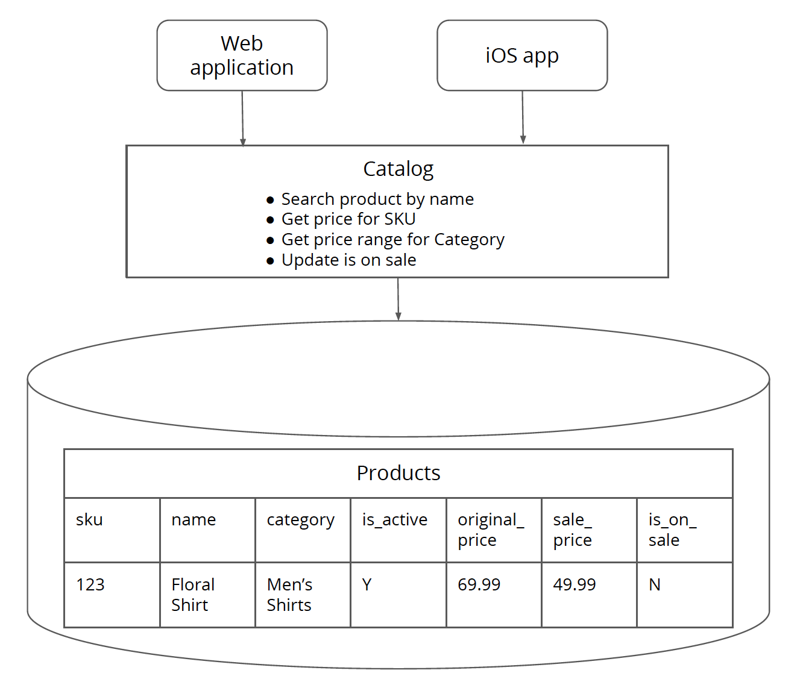
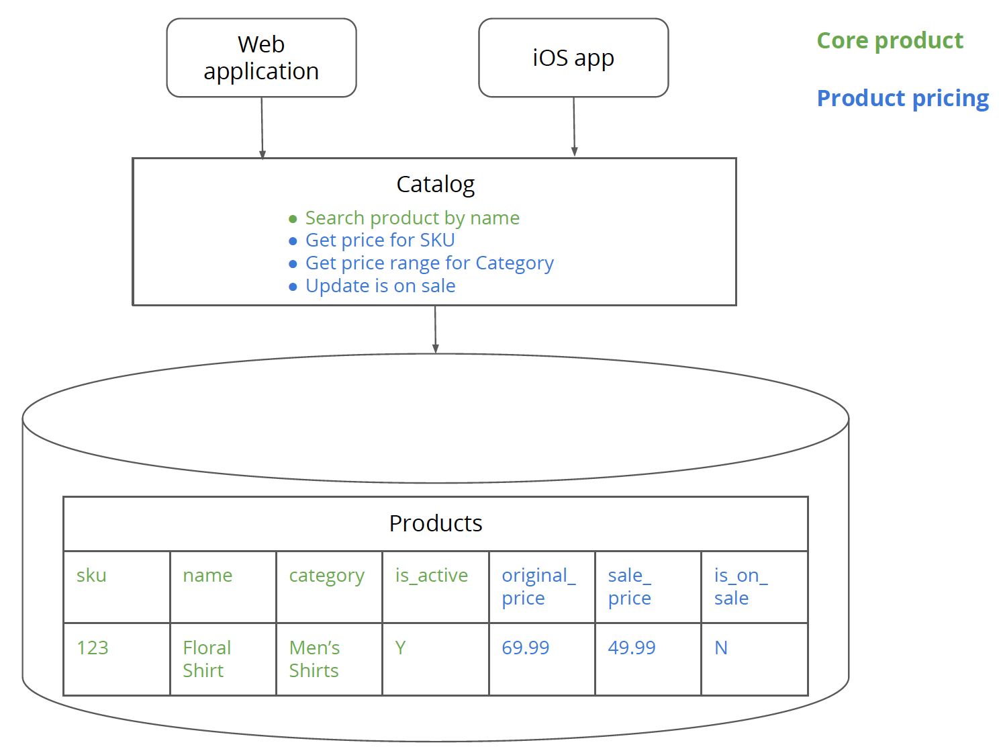
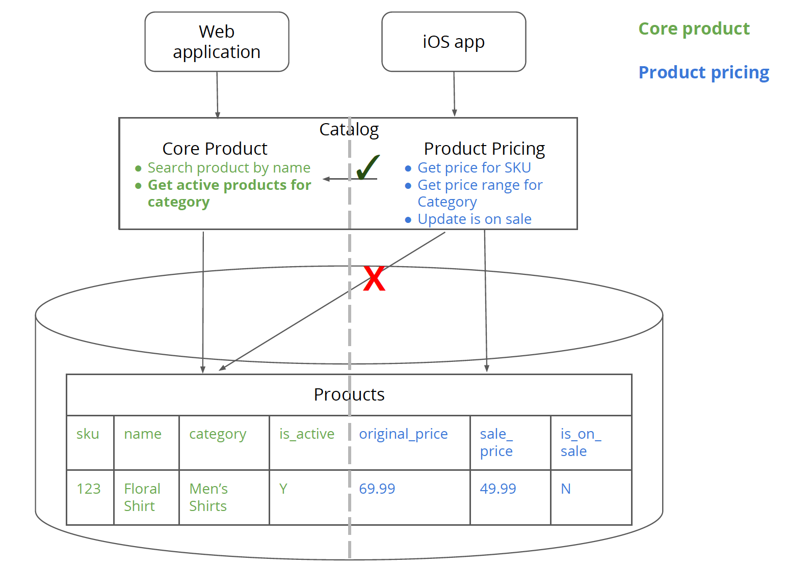
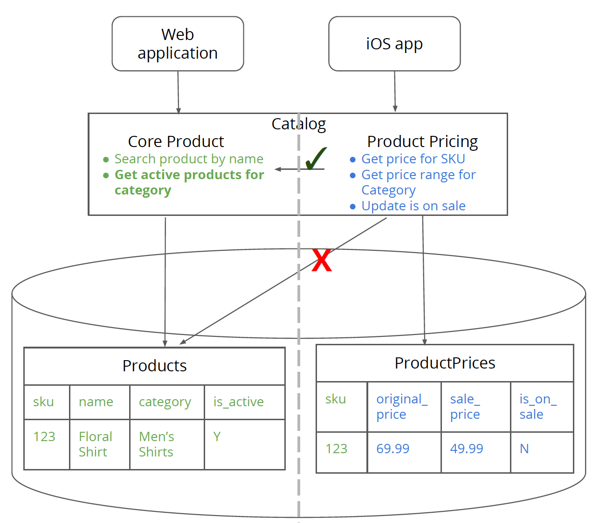
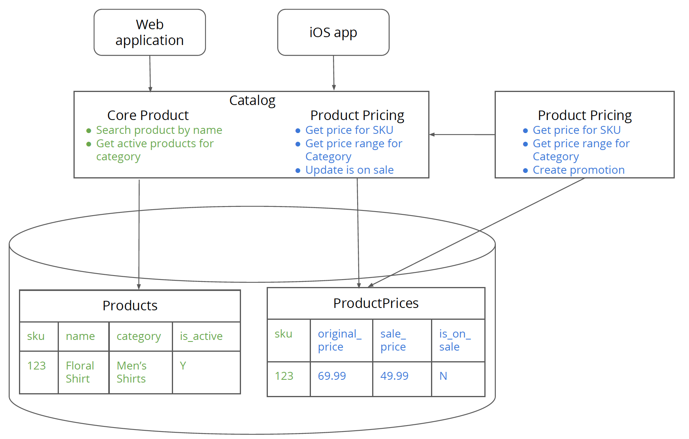
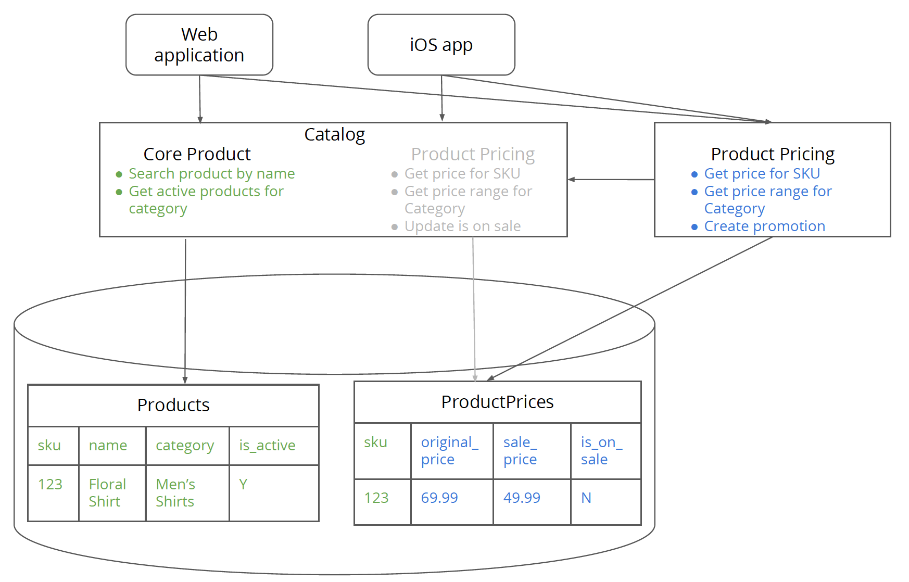
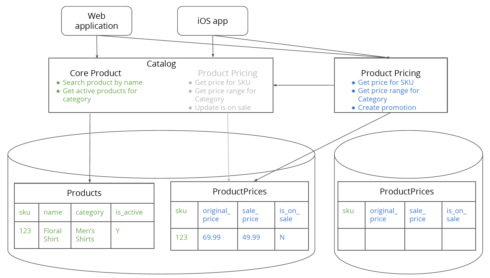
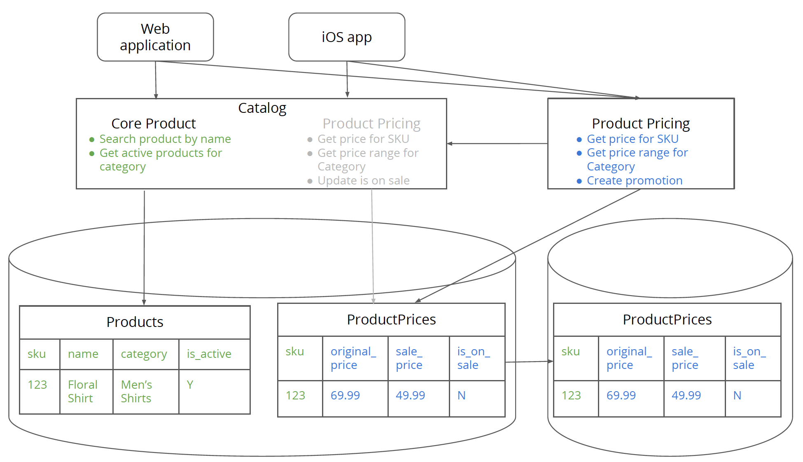
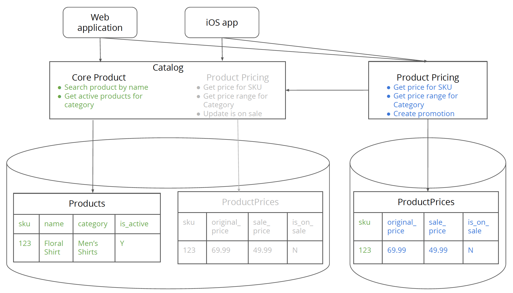
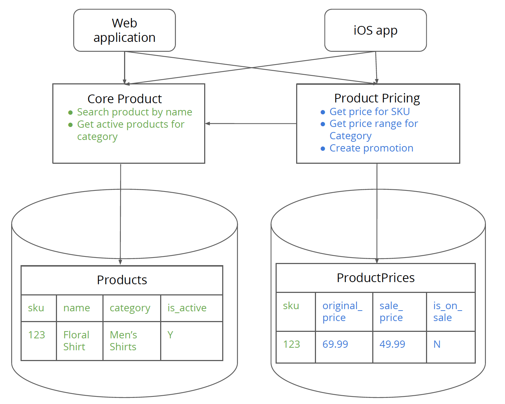

# Как извлечь сервис, управляющий большим объёмом данных, из монолита

_При разбиении монолитов на более мелкие сервисы самое сложное — разбить данные, 
находящиеся в базе данных монолита. Для извлечения сервиса, управляющий большим объёмом данных, 
полезно выполнить ряд шагов, которые всегда сохраняют единственную копию данных 
для записи. Шаги начинаются с логического разделения существующего монолита: 
разделение поведения сервиса в отдельный модуль, затем выделение данных в 
отдельную таблицу. Эти элементы могут быть отдельно перемещены в новый автономный 
сервис._

30 августа 2018

[](https://computellect.com/)
[Прафул Тодкар](https://computellect.com/)

Прафул Тодкар — главный консультант компании Thoughtworks, специализирующийся на 
создании крупномасштабных распределенных программных систем для бизнеса. Создавая 
программное обеспечение, он любит делать две вещи: как можно быстрее приносить 
пользу бизнесу и создавать простые, элегантные решения сложных проблем. 
Еще лучше, когда он может совмещать их.

[МИКРОСЕРВИСЫ](https://martinfowler.com/tags/microservices.html)
[РЕКОНСТРУКЦИЯ LEGACY](https://martinfowler.com/tags/legacy%20rehab.html)

Содержание

Основные принципы извлечения сервисов
Имейте единственную копию данных для записи на протяжении всего перехода
Соблюдайте принцип «атомарного шага эволюции архитектуры»
Этапы извлечения сервиса
Шаг 1. Определите логику и данные, связанные с новым сервисом
Шаг 2. Создайте логическое разделение для логики нового сервиса в монолите
Шаг 3. Создайте новые таблицы для поддержки логики нового сервиса в монолите
Шаг 4. Создайте новый сервис, использующий таблицы в монолитной базе данных
Шаг 5. Перенаправьте клиентов на новый сервис
Шаг 6. Создайте базу данных для нового сервиса
Шаг 7. Синхронизируйте данные из монолита с новой базой данных
Шаг 8. Направьте новый сервис на новую базу данных
Шаг 9. Удалите из монолита логику и схему, относящиеся к новому сервису
Заключение

В отрасли происходит серьезный сдвиг от монолитов к более мелким сервисам. Основная
причина, по которой организации инвестируют в этот сдвиг, заключается в том, 
что небольшие сервисы, основанные на бизнес-возможностях, повышают производительность 
разработчиков. Команды, отвечающие за этим небольшие сервисы, могут быть 
«хозяевами своей судьбы», что означает, что они могут развивать свои сервисы 
независимо от других сервисов в системе.

При разбиении монолитов на более мелкие сервисы самое сложное — разбить данные, 
находящиеся в базе данных монолита. Относительно легко разбить логику монолита 
на более мелкие части, продолжая при этом подключаться к той же базе данных.
В этом случае база данных по существу является [IntegrationDatabase](https://www.martinfowler.com/bliki/IntegrationDatabase.html), которая 
создает видимость распределенной системы, которая может развиваться независимо, 
но на самом деле представляет собой единую [сильно связанную](https://computellect.com/2018/01/04/types-of-coupling-when-integrating-via-the-database/) систему на уровне 
базы данных. Чтобы сервисы были по-настоящему независимыми и, таким образом, 
команды могли быть «хозяевами своей судьбы», им также необходимо иметь 
независимую базу данных — схему и соответствующие данные для сервиса.

В этой статье я буду говорить о методике, который представляет собой серию шагов 
для извлечения богатого данными сервиса из монолита с минимальным нарушением 
работы потребителей сервиса.

***

## Основные принципы извлечения сервисов

Прежде чем мы слишком углубимся в реальную методику, я хотел бы поговорить о 
двух основных принципах, которые имеют решающее значение при извлечении сервисов.
Это помогает обеспечить плавный и безопасный переход от мира, в котором у вас 
есть монолит, к множеству более мелких сервисов.

### Имейте единственную копию данных для записи на протяжении всего перехода

В сервисе, извлекаемой во время перехода, у нас будет единственная
копия данных для записи. Наличие нескольких копий, которые клиенты могут 
записывать, может привести к конфликтам записи. Конфликт записи возникает, когда 
одна и та же часть данных записывается несколькими клиентами одновременно. 
Логика обработки конфликта записи сложна — это может означать выбор такой логика, 
как «последняя запись выигрывает», которая может привести к нежелательным 
результатам с точки зрения клиента. Это также может означать информирование 
клиента, у которого произошла ошибка записи, и его действия по исправлению 
положения. Написание такой логики чревато осложнениями, и этого лучше избегать.

Описанная здесь методика извлечения сервиса гарантирует, что в любой момент времени
для извлекаемого сервиса существует единственная копия записи, чтобы избежать 
сложностей, возникающих при управлении конфликтами записи.

### Соблюдайте принцип «атомарного шага эволюции архитектуры»

Мой коллега Жамак Дехгани ввел термин [«атомарный шаг эволюции архитектуры»](https://martinfowler.com/articles/break-monolith-into-microservices.html#MigrateInAtomicEvolutionarySteps), 
который представляет собой серию шагов, предпринятых атомарно (все или ничего) 
во время миграции архитектуры. В конце серии шагов архитектура дает обещанные 
результаты. Если шаги не выполняются полностью (оставлены на полпути), архитектура 
находится в худшем состоянии, чем состояние, в котором вы начали. Например, 
если вы решите извлечь сервис и в конечном итоге извлечете только логику, но не 
данные, вы все еще связаны на уровне базы данных, что вводит связь между 
разработкой и работой системы. Это вносит значительную сложность и, возможно, 
сильно усложняет разработку и отладку, чем если бы это был единый монолит.

В приведенной ниже методике извлечения сервиса рекомендуется выполнить все шаги,
перечисленные для данного сервиса. Одно из самых больших препятствий в методике 
извлечения сервисов на самом деле не техническое, а организационное согласование, 
чтобы все существующие клиенты монолита могли перейти на новый сервис. Это будет 
в дальнейшем объяснено на шаге 5.

***

## Этапы извлечения сервиса

Теперь давайте погрузимся в фактическую методику извлечения сервиса. Для упрощения
выполнения шагов, будем использовать пример, чтобы понять, как работает извлечение 
сервиса.

Допустим, у нас есть монолитная система каталогов, которая предоставляет нашей 
платформе электронной коммерции информацию о товарах. Со временем система 
каталогов превратилась в монолит, что означает, что наряду с основной информацией 
о товаре, такой как название товара, название категории и связанная логика, 
она также поглотила логику и данные о ценах на товар. Не существует четких 
границ между основной частью системы, связанной с товаром, и ценовой частью 
системы.

Более того, скорость изменений (скорость внесения изменений в систему) в 
ценовой части системы намного выше, чем другая информация о товаре. Шаблоны доступа 
к данным также различаются для двух частей системы. Цены на товар меняются 
гораздо более динамично, чем его основные атрибуты. Таким образом, имеет 
смысл вытащить ценовую часть системы из монолита в отдельный сервис, который 
можно развивать самостоятельно.

Что делает извлечение цен привлекательным в отличие от основного функционала товара, так 
это то, что цена является «листовой» зависимостью в каталоге-монолите. Основной 
функционал товара также зависит от других функций в монолите, таких как 
инвентаризация товаров, маркетинг товаров и т. д., которые не показаны здесь 
для простоты. Если бы вы вытащили основной функционал товар в виде сервиса - это означало бы 
одновременное разрывание слишком большого количества «соединений» в монолите, 
что может сделать процесс миграции довольно рискованным. Для начала вы хотите 
выделить ценную бизнес-возможность, которая является листовой зависимостью в 
монолитном графе зависимостей, например функционал работы с ценами.

> Одной из сложных частей извлечения сервисов является нахождение границ внутри 
> монолита, которые представляют сервисы. Вы можете найти руководство по поиску 
> границ сервиса [здесь](https://www.thoughtworks.com/insights/blog/well-factored-approach-securing-roi-your-service-investment-part-three).



_Рисунок 1: Каталог-монолит состоит из логики приложения и базы данных для основного функционала
товара, а также его цен. У каталога-монолита существует два клиента — веб-приложение 
и приложение для iOS._

## Исходное состояние кода

Ниже показано начальное состояние кода для системы каталогов. Очевидно, что коду
недостаёт "беспорядка" реального мира, определяющий сложность такой системы.
Однако он достаточно сложен, чтобы продемонстрировать суть рефакторинга, 
предполагающего извлечение сервиса с большим объемом данных из монолита. Мы
увидим как приведенный ниже код подвергается рефакторингу в ходе выполнения 
шагов.

Код состоит из сервиса каталогов, представляющий интерфейс, который монолит 
предоставляет своим клиентам. Он использует класс productRepository для извлечения 
и сохранения состояния из базы данных. Класс Product - это простой класс с данными
(являющийся примером [AnemicDomainModel](https://www.martinfowler.com/bliki/AnemicDomainModel.html)),
который содержит информацию о товаре. Простые классы с данными явно являются 
анти-шаблоном, но они не основная тема этой статьи, так что в этом примере мы 
обойдемся ими. Sku, Price и CategoryPriceRange — это «типы-идентификаторы».

```
class CatalogService…

  public Sku searchProduct(String searchString) {
      return productRepository.searchProduct(searchString);
  }

  public Price getPriceFor(Sku sku) {
      Product product = productRepository.queryProduct(sku);
      return calculatePriceFor(product);
  }

  private Price calculatePriceFor(Product product) {
      if(product.isOnSale()) return product.getSalePrice();
      return product.getOriginalPrice();
  }

  public CategoryPriceRange getPriceRangeFor(Category category) {
      List<Product> products = productRepository.findProductsFor(category);
      Price maxPrice = null;
      Price minPrice = null;
      for (Product product : products) {
          if (product.isActive()) {
              Price productPrice = calculatePriceFor(product);
              if (maxPrice == null || productPrice.isGreaterThan(maxPrice)) {
                  maxPrice = productPrice;
              }
              if (minPrice == null || productPrice.isLesserThan(minPrice)) {
                  minPrice = productPrice;
              }
          }
      }
      return new CategoryPriceRange(category, minPrice, maxPrice);
  }

  public void updateIsOnSaleFor(Sku sku) {
      final Product product = productRepository.queryProduct(sku);
      product.setOnSale(true);
      productRepository.save(product);
  }
```

Давайте сделаем наш первый шаг к тому, чтобы вытащить сервис «Цена на товары» 
из каталога-монолита.

## Шаг 1. Определите логику и данные, связанные с новым сервисом

Первый шаг заключается в определении данных и логики, связанных с сервисом цен 
товаров, которая находится в монолите. В нашем приложении «Каталог» есть 
таблица «Товары», в которой находятся основные атрибуты товара, такие как название,
артикул, имя_категории и флаг is_active (указывающий, является ли товар активным 
или снят с производства). Каждый товар относится к категории товаров. Категория 
товара — это группа товаров. Например, в категории «Мужские рубашки» есть такие 
товары, как «Рубашка с цветочным принтом» и «Рубашка под смокинг». Существует 
основная логика, связанная с товара, например, поиск товара по названию в монолите.

В таблице «Товары» также есть поля, связанные с ценами, такие как `original_price`, 
`sale_price` и флаг `is_on_sale`, который указывает, продается ли товар со скидкой 
или нет. Монолит содержит логику, связанную с ценообразованием, такую как расчет 
цены товара и обновление флага `is_on_sale`. Получение ценового диапазона для 
категории нам также интересна, так как это в первую очередь логика ценообразования 
товара, но в неё включена также некоторая основная логика товара.



_Рисунок 2: Основного логика и данные товара выделены зеленым цветом, тогда как 
данные и логика ценообразования товара — синим._

Это тот же самый код, который мы видели ранее, за исключением того, что теперь 
он имеет цветовую кодировку, чтобы показать части кода, которые входят в основную 
логику товара или логику ценообразования товара.

```
class CatalogService…

  public Sku searchProduct(String searchString) {
      return productRepository.searchProduct(searchString);
  }

  public Price getPriceFor(Sku sku) {
      Product product = productRepository.queryProduct(sku);
      return calculatePriceFor(product);
  }

  private Price calculatePriceFor(Product product) {
      if(product.isOnSale()) return product.getSalePrice();
      return product.getOriginalPrice();
  }

  public CategoryPriceRange getPriceRangeFor(Category category) {
      List<Product> products = productRepository.findProductsFor(category);
      Price maxPrice = null;
      Price minPrice = null;
      for (Product product : products) {
          if (product.isActive()) {
              Price productPrice = calculatePriceFor(product);
              if (maxPrice == null || productPrice.isGreaterThan(maxPrice)) {
                  maxPrice = productPrice;
              }
              if (minPrice == null || productPrice.isLesserThan(minPrice)) {
                  minPrice = productPrice;
              }
          }
      }
      return new CategoryPriceRange(category, minPrice, maxPrice);
  }

  public void updateIsOnSaleFor(Sku sku) {
      final Product product = productRepository.queryProduct(sku);
      product.setOnSale(true);
      productRepository.save(product);
  }
```

## Шаг 2. Создайте логическое разделение для логики нового сервиса в монолите

Шаги 2 и 3 касаются логического разделения логики и данных для сервиса 
ценообразования товаров, продолжая при этом работать в монолите. По сути, вы 
изолируете данные о ценах на товары и логику от более крупного монолита, 
прежде чем фактически отделить их в новый сервис. Преимущество такого подхода
заключается в том, что если вы неправильно определите границы сервиса 
ценообразования товара (логика или данные), тогда будет намного проще 
рефакторить ваш код, пока вы находитесь в той же монолитной кодовой базе, по сравнению 
с вариантом извлечения в новый сервис и рефакторинга "по ходу".

В рамках шага 2 мы создадим классы сервисов, в которых будет находиться логика
ценообразования товара и основная логика с названиями `ProductPricingService` и 
`CoreProductService` соответственно. Эти классы сервисов будут 
сопоставляться один к одному с нашими «физическими» сервисами — ценообразованием
товара и основной логикой товара, как вы увидите на последующих этапах. Мы также 
создадим отдельные классы для репозиториев — `ProductPriceRepository` и 
`CoreProductRepository`. Они будут использоваться для доступа к данным о ценах
на товары и основным данным о товарах из таблицы «Товары» соответственно.

Ключевым моментом, который следует учитывать на этом этапе, является то, что
`ProductPricingService` или `ProductPriceRepository` не должны обращаться к таблице 
`Products` для получения основной информации о товаре. Вместо этого любую информацию, 
связанную с товаром, код ценообразования товара должен получать строго через 
`CoreProductService`. Вы увидите пример этого в рефакторинге метода 
`getPriceRangeFor` ниже.

Не допускает объединения таблиц, принадлежащих к основному функционалу товара, с 
таблицами, относящимися к ценообразованию. Точно так же в базе данных не должно 
быть «жестких» ограничений между основными данными о товарах и их ценах, таких 
как внешние ключи или триггеры базы данных. Все объединения, а также ограничения 
должны быть перемещены на логический уровень из уровня базы данных. К сожалению, это 
легче сказать, чем сделать, и это одна из самых сложных вещей, но абсолютно 
необходимая для разбиения базы данных.

Нужно сказать, что основные данные о товаре и их цена имеют общий идентификатор —
артикул товара для уникальной идентификации товара в двух частях системы вплоть 
до уровня базы данных. Этот «межсистемный идентификатор» будет использоваться 
для обмена данными между сервисами (как показано на последующих этапах), и поэтому 
важно выбирать этот идентификатор с умом. Должен существовать только один сервис,
которому принадлежит межсистемный идентификатор. Все остальные сервисы должны 
использовать идентификатор в качестве ссылки, но не изменять его. Он неизменяемый с
их точки зрения. Сервис, лучше всего подходящий для управления жизненным 
циклом объекта, для которого создан идентификатор, должен владеть идентификатором.
Например, в нашем случае сервис основного функционала товара управляет жизненным 
циклом товара и, следовательно, владеет идентификатором SKU.

> Имеет смысл использовать естественный ключ, такой как SKU, когда он представлен 
> единственным атрибутом и чем-то постоянно использующимся в предметной области.
> Возможно, имеет смысл использовать суррогатный ключ, когда нет единого атрибута 
> для уникальной идентификации объекта, такого как созданный системой идентификатор 
> клиента для идентификации клиента.



Рисунок 3: Логическое разделение логики основного товара и логики ценообразования 
при подключении к одной и той же таблице «Товары».

Ниже приведен рефакторинг кода. Вы увидите только что созданный 
`ProductPricingService`, который содержит только логику относящуюся к ценообразованию.
У нас также есть `productPriceRepository`, чтобы обращаться к конкретным данным о 
ценах в таблице `Products`. Вместо класса данных `Product` теперь у нас есть классы 
данных `ProductPrice` и `CoreProduct` для хранения соответствующих данных о ценах и 
основных данных товара.

Функции `getPriceFor` и `calculatePriceFor` достаточно просто преобразовать, чтобы 
они работали с новым классом `productPriceRepository`.

```
class ProductPricingService…

  public Price getPriceFor(Sku sku) {
      ProductPrice productPrice = productPriceRepository.getPriceFor(sku);
      return calculatePriceFor(productPrice);
  }

  private Price calculatePriceFor(ProductPrice productPrice) {
      if(productPrice.isOnSale()) return productPrice.getSalePrice();
      return productPrice.getOriginalPrice();
  }
```

Логика получения ценового диапазона для категории более сложна, поскольку необходимо 
знать, какие товары принадлежат к категории, а этот функционал находится в 
основной части приложения. Метод `getPriceRangeFor` вызывает метод 
`getActiveProductsFor` в `coreProductService`, чтобы получить список активных 
товаров для данной категории. Здесь следует отметить, что поскольку `is_active` 
является атрибутом основных данных товара, мы переместили проверку 
`isActive` в `coreProductService`.

```
class ProductPricingService…

  public CategoryPriceRange getPriceRangeFor(Category category) {
      List<CoreProduct> products = coreProductService.getActiveProductsFor(category);

      List<ProductPrice> productPrices = productPriceRepository.getProductPricesFor(mapCoreProductToSku(products));

      Price maxPrice = null;
      Price minPrice = null;
      for (ProductPrice productPrice : productPrices) {
              Price currentProductPrice = calculatePriceFor(productPrice);
              if (maxPrice == null || currentProductPrice.isGreaterThan(maxPrice)) {
                  maxPrice = currentProductPrice;
              }
              if (minPrice == null || currentProductPrice.isLesserThan(minPrice)) {
                  minPrice = currentProductPrice;
              }
      }
      return new CategoryPriceRange(category, minPrice, maxPrice);
  }

  private List<Sku> mapCoreProductToSku(List<CoreProduct> coreProducts) {
      return coreProducts.stream().map(p -> p.getSku()).collect(Collectors.toList());
  }
```

Вот как выглядит новый метод `getActiveProductsFor` для получения активных 
товаров из заданной категории.

```
class CoreProductService…

  public List<CoreProduct> getActiveProductsFor(Category category) {
      List<CoreProduct> productsForCategory = coreProductRepository.getProductsFor(category);
      return filterActiveProducts(productsForCategory);
  }

  private List<CoreProduct> filterActiveProducts(List<CoreProduct> products) {
      return products.stream().filter(p -> p.isActive()).collect(Collectors.toList());
  }
```

В этом случае мы сохранили проверку `isActive` в классе сервиса, но ее можно 
легко перенести в запрос к базе данных. На самом деле такой тип рефакторинга с 
разделением функционала на несколько сервисов часто позволяет легко обнаружить 
возможности переноса логики в запрос к базе данных и, таким образом, сделать 
код более производительным.

Логика `updateIsOnSale` также довольно прямолинейна и должна быть 
реорганизована, как показано ниже.

```
class ProductPricingService…

  public void updateIsOnSaleFor(Sku sku) {
      final ProductPrice productPrice = productPriceRepository.getPriceFor(sku);
      productPrice.setOnSale(true);
      productPriceRepository.save(productPrice);
  }
```

Метод `searchProduct` использует только что созданный `coreProductRepository` для 
поиска товара.

```
class CoreProductService…

  public Sku searchProduct(String searchString) {
      return coreProductRepository.searchProduct(searchString);
  }
```

CatalogService (интерфейс верхнего уровня по отношению к монолиту) будет 
реорганизован, чтобы делегировать вызовы сервисных методов соответствующему 
сервису — `CoreProductService` или `ProductPricingService`. Это важно, чтобы мы 
не нарушали действующие контракты с клиентами монолита.

Метод `searchProduct` делегируется в `coreProductService`.

```
class CatalogService…

  public Sku searchProduct(String searchString) {
      return coreProductService.searchProduct(searchString);
  }
```

Методы, связанные с ценообразованием, делегируются в `productPricingService`.

```
class CatalogService…

  public Price getPriceFor(Sku sku) {
      return productPricingService.getPriceFor(sku);
  }

  public CategoryPriceRange getPriceRangeFor(Category category) {
      return productPricingService.getPriceRangeFor(category);
  }

  public void updateIsOnSaleFor(Sku sku) {
      productPricingService.updateIsOnSaleFor(sku);
  }
```

## Шаг 3. Создайте новые таблицы для поддержки логики нового сервиса в монолите

В рамках этого шага вы разделите данные, связанные с ценообразованием, в новую 
таблицу — ProductPrices. В конце этого шага логика ценообразования товаров 
должна обращаться непосредственно к таблице ProductPrices, а не к таблице 
Products. Для получения любой необходимой информации из таблицы «Продукты», 
относящейся к основной информации о товаре, она должна проходить через уровень 
логики основного товара. Этот шаг должен привести к изменениям кода только в 
классе `productPricingRepository`, но не в каких-либо других классах, особенно в 
классах сервиса.

Важно отметить, что этот шаг включает перенос данных из таблицы `Products` в 
таблицу `ProductPrices`. Убедитесь, что столбцы в новой таблице выглядят точно 
так же, как столбцы, связанные с ценами на товары, в таблице `Products`. Это 
сделает код репозитория простым и упростит миграцию данных. Если вы возникли 
ошибки после того, как `productPricingRepository` стал работать с новой таблицей, вы 
можете вернуть старый код, чтобы `productPricingRepository` опять обращался к 
таблице `Products`. Вы можете удалить поля, связанные с ценами на товары, из 
таблицы `Products` после успешного завершения этого шага.

По сути, то, что мы делаем здесь, — это миграция базы данных, которая включает в
себя разделение таблицы на две таблицы и перемещение данных из исходной таблицы 
во вновь созданную таблицу. Мой коллега Прамод Садаладж написал целую книгу по 
[рефакторингу баз данных](https://www.martinfowler.com/books/refactoringDatabases.html), которую вам следует прочитать, если вам интересно 
узнать больше об этой теме. В качестве краткого справочника вы можете обратиться 
к статье [«Эволюционное проектирование базы данных»](https://www.martinfowler.com/articles/evodb.html) Прамода и Мартина Фаулера.

В конце этого шага вы сможете получить информацию о возможном влиянии нового сервиса 
на систему в целом с точки зрения функциональных и кросс-функциональных требований, 
особенно производительности. У вас будет возможность увидеть влияние на 
производительность "объединения данных в памяти" на логическом уровне. В нашем 
случае getPriceRangeFor выполняет объединение данных в памяти об основной информации о 
товаре и информацией о его ценах. Объединение данных в памяти на логическом уровне 
всегда будет дороже, чем выполнение этих соединений на уровне базы данных, но 
это стоимость несвязанных систем данных. Если производительность снижается на 
этом этапе, она будет ухудшаться, когда данные будут передаваться туда-сюда 
между физическими сервисами по сети. Если требования к производительности (или 
любые другие требования в этом отношении) не выполняются, вероятно, вам придется 
переосмыслить границы сервиса. По крайней мере, клиенты (веб-приложение и 
приложение для iOS) в значительной степени прозрачны для этого изменения, 
поскольку мы еще не изменили ни одно из клиентских взаимодействий. Это позволяет 
быстро и недорого поэкспериментировать с границами сервисов, что является 
прекрасной возможностью на этом шаге.



_Рисунок 4: Логическое разделение логики и данных основной информации о товаре и 
логики и данных его ценообразования_

## Шаг 4. Создайте новый сервис, использующий таблицы в монолитной базе данных

На этом шаге вы создаёте новый «физический» сервис для ценообразования товаров 
с логикой из `ProductPricingService`, но при этом используете таблицу `ProductPrices` 
в монолитной базе данных. Обратите внимание, что на этом этапе вызов 
`CoreProductService` из `ProductPricingService` будет сетевым вызовом и приведет к 
снижению производительности, а также к необходимости решать проблемы, связанные 
с удаленными вызовами, такими как тайм-ауты, которые должны обрабатываться 
соответствующим образом.

Это может быть хорошей возможностью создать «достоверную для бизнеса» абстракцию 
сервиса ценообразования товара, чтобы вы моделировали сервис, представляющий 
бизнес-намерения, а не механику решения. Например, когда бизнес-пользователь 
обновляет флаг `updateIsOnSale`, он на самом деле создает «рекламную акцию» в 
системе для данного товара. Ниже показано, как выглядит `updateIsOnSaleFor` 
после рефакторинга. В рамках этого изменения мы также добавили возможность 
указывать цену со скидкой, которая раньше была недоступна. Это также может 
быть подходящим моментом для упрощения интерфейса путем переноса части сложности, 
связанной со сервисом, обратно в сервис, которая могла просочиться в клиентов. 
Это было бы долгожданным изменением с точки зрения потребителей сервиса.

> Реальные бизнес-абстракции моделируют интерфейс абстракции так, как бизнес 
> думает об абстракции. Они моделируют бизнес-намерения, а не механику решения. 
> Они скрывают сложность — предметную и техническую, и тем самым снижают 
> когнитивную нагрузку на команды, использующие абстракцию. Они также позволяют 
> командам, создающим абстракцию, развивать ее независимо, не допуская утечки 
> ненужной сложности из абстракции.

```
class ProductPricingService…

  public void createPromotion(Promotion promotion) {
      final ProductPrice productPrice = productPriceRepository.getPriceFor(promotion.getSku());
      productPrice.setOnSale(true);
      productPrice.setSalePrice(promotion.getPrice());
      productPriceRepository.save(productPrice);
  }
```

Однако ограничение заключается в том, что изменения не должны требовать изменения
структуры таблицы или семантики данных каким-либо образом, поскольку это нарушит
существующую функциональность в монолите. Как только сервис будет полностью 
извлечен (на шаге 9), вы можете с радостью изменить базу данных по своему 
усмотрению, поскольку в этом нет ничего плохого, как и в изменении кода на 
логическом уровне.

Возможно, вы захотите внести эти изменения до того, как перейдете к другим 
клиентам, потому что изменение интерфейса сервиса может быть дорогостоящим и 
трудоемким процессом, особенно в крупной организации, поскольку для быстрого 
перехода к новому интерфейсу требуется согласие различных потребителей сервиса. 
Более подробно это будет обсуждаться на следующем шаге. Вы можете безопасно 
выпустить эту новый сервис ценообразования в продакшен окружение и 
протестировать ее. Клиентов на данную услугу пока нет. Кроме того, на этом 
этапе не меняются клиенты монолита — веб-приложение и приложение для iOS.



_Рисунок 5: Новый "физический" сервис ценообразования товаров, которая указывает 
на таблицу `ProductPrices` в монолите и зависит от монолита, когда обращается к 
основному функционалу товара_

## Шаг 5. Перенаправьте клиентов на новый сервис

На этом этапе клиенты монолита, заинтересованные в функциях ценообразования 
товара, должны перейти на новый сервис. Работа на этом этапе будет зависеть от 
двух вещей. В первую очередь это будет зависеть от того, насколько изменился 
интерфейс между монолитом и новым сервисом. Во-вторых, и, возможно, более сложное 
с организационной точки зрения, способность (возможность) клиентских команд 
своевременно завершить этот шаг.

Если этот шаг затянется, вполне вероятно, что архитектура останется в полузавершенном 
состоянии, когда часть клиентов будет указывать на новый сервис, а часть — на 
монолит. то, возможно, оставляет архитектуру в худшем состоянии, чем до того, 
как вы начали. Вот почему принцип «атомарного шага эволюции архитектуры», который 
мы обсуждали ранее, важен. Убедитесь, что существует организационная согласованность 
со всеми клиентами нового сервиса для своевременного перехода на новую сервис, 
прежде чем начинать миграцию. Очень легко отвлечься на другие высокоприоритетные 
дела, оставив архитектуру в полусыром состоянии.

Хорошей новостью является то, что не все клиенты сервиса должны мигрировать в 
одно и то же время или координировать свою миграцию друг с другом. Однако перед 
переходом к следующему шагу важно выполнить миграцию всех клиентов. Если этого 
еще не сделано, вы можете ввести некоторый мониторинг на уровне сервиса для 
методов, связанных с ценообразованием, для выявления «отстающих в миграции» — 
потребителей услуг, которые не перешли на новый сервис.

Теоретически, вы могли бы работать над некоторыми из следующих шагов до того, 
как клиенты мигрируют, особенно над следующим, который включает в себя создание 
базы данных цен, но ради простоты я рекомендую двигаться последовательно, 
насколько это возможно.



_Рисунок 6: Клиенты монолита, заинтересованные в функционале ценообразования, 
перешли на новый сервис._

## Шаг 6. Создайте базу данных для нового сервиса

Этот шаг относительно прост, если вы создаете базу данных ценообразования, 
отражающую структуру таблицы в монолите. Может возникнуть соблазн создать 
совершенно новую схему ценообразования, пока вы находитесь в процессе создания 
нового сервиса. Но наличие совершенно новой схемы усложняет миграцию данных на 
более поздних этапах. Это также означает, что новый сервис ценообразования 
должна будет поддерживать две разные схемы — одну из монолита, другую из новой 
базы данных. Я бы рекомендовал не усложнять задачу — сначала извлечь сервис 
ценообразования (выполнив все шаги, упомянутые здесь), а затем провести рефакторинг 
внутренней части сервиса. После того, как база данных ценообразования изолирована, 
ее изменение должно быть таким же, как изменение любого кода в сервисе, поскольку 
ни один из клиентов не будет напрямую обращаться к базе данных ценообразования.



_Рисунок 7: Создана новая автономная база цен._

## Шаг 7. Синхронизируйте данные из монолита с новой базой данных

На этом шаге вы синхронизируете данные из монолитной базы данных для таблиц 
ценообразования с новой базой данных. Синхронизация данных между монолитом и 
новой базой данных сервиса выполняется достаточно просто, если схема в новой 
базе данных совпадает с таблицами ценообразования в монолите. По сути, это то же 
самое, что настроить базу данных ценообразования в качестве «реплики для чтения» 
монолитной базы данных (только для таблиц, связанных с ценообразованием). Это 
обеспечит актуальность данных в новой базе данных ценообразования.

Теперь вы готовы подключить сервис ценообразования к новой базе данных на 
следующем шаге.



_Рисунок 8: Данные синхронизированы между таблицами в монолите, связанными с ценами на 
товары, и таблицами в новой базе данных._

## Шаг 8. Направьте новый сервис на новую базу данных

Прежде чем приступить к этому шагу, абсолютно необходимо, чтобы все клиенты 
монолита, которых интересует информация о ценах, перешли на новый сервис. В 
противном случае вы можете столкнуться с конфликтами записи, нарушающие 
принцип «иметь единственную копию данных для записи», который мы обсуждали ранее. 
После того как все клиенты перейдут на новый сервис, вы перенаправляете сервис 
ценообразования на новую базу данных. По сути, вы переключаете соединение с 
монолитной базой данных на новую базу данных.

Одним из преимуществ такого проектирования является то, что вы можете легко 
переключить соединение обратно на старую базу данных, если заметите какие-либо 
проблемы. Одна из возможных проблем заключается в том, что код в новом сервисе 
зависит от некоторых таблиц/полей, которых нет в новой базе данных, а они 
существуют только в старой базе данных. Это может произойти из-за того, что вы 
не смогли определить эти данные на шаге 1. Это может произойти с чем-то вроде 
«справочных» данных, например, поддерживаемых валют. После того, как вы успешно 
решите эти проблемы, вы можете перейти к следующему шагу.

> Настоятельно рекомендуется настроить [конвейер непрерывной доставки](https://martinfowler.com/bliki/ContinuousDelivery.html). Это может 
> пригодиться по двум причинам. Во-первых, запуск набора [характеристических 
> тестов](https://michaelfeathers.silvrback.com/characterization-testing) в рамках 
> конвейера может помочь убедиться, что общее поведение системы сохраняется на 
> протяжении всего процесса. Во-вторых, после того, как изменения 
> были внесены, и если вы заметили какие-либо проблемы с системой в продакшен 
> среде, вы можете относительно быстро и без стресса вернуться к предыдущей 
> версии.



_Рисунок 9: Сервис ценообразования продуктов перенаправлен на новую базу данных._

## Шаг 9. Удалите из монолита логику и схему, относящиеся к новому сервису

На этом шаге вы удаляете логику и схему, связанные с ценообразованием, из монолита. 
Слишком часто команды оставляют старые таблицы в базе данных навсегда, потому 
что они беспокоятся, что «они могут когда-нибудь им понадобиться». Создание 
резервной копии всей базы данных может помочь развеять некоторые из этих 
опасений.

На данный момент все, что делает `CatalogService`, — это делегирует вызовов 
основных методов продукта в `CoreProductService`, поэтому мы можем удалить этот
уровень косвенности и позволить клиентам напрямую вызывать `CoreProductService`.



Рисунок 10: Основной продукт содержит только логику и данные, связанные с 
основным продуктом, тогда как ценообразование продукта имеет данные и логику, 
связанные с ценообразованием. Они взаимодействуют друг с другом только через 
логический слой.

## Заключение

Вот и все! Мы только что отделили от монолита сервис, управляющий большим объёмом данных. 
Йухуууу!

Когда вы сделаете это в первый раз, возникнут значительные трудности и 
полученные ценные уроки вы сможете использовать при следующем извлечении сервиса.
При первом извлечении сервиса лучше не объединять шаги, даже если это может 
показаться заманчивым. Делая шаг за шагом, процесс разрушения монолита становится 
менее пугающим, безопасным и предсказуемым. Как только вы достигли определенного 
уровня мастерства в этой методике, вы можете начать оптимизировать процесс на 
основе ваших знаний.

Разбейте этот монолит! Удачи!

***

## Благодарности

Я хотел бы поблагодарить Мартина Фаулера за размещение этой статьи и 
великодушие за время, потраченное на рецензирование этой статьи. Его комментарии 
к обзору действительно подняли эту статью на новый уровень. Я также хотел бы 
поблагодарить [Хорхе Ли](https://github.com/jrglee) за критический комментарий. Я хотел бы поблагодарить моих 
коллег из Thoughtworks Джоуи Герру, Мэтта Ньюмана, Ванессу Тауэрс, Ран Сяо и 
Кулдипа Сингха за их комментарии в нашем внутреннему списку рассылки.

## Список значимых изменений

30 августа 2018: опубликована остальная часть статьи.

29 августа 2018: опубликованы шестой и седьмой шаг.

28 августа 2018: опубликован пятый шаг.

27 августа 2018: опубликован четвертый шаг.

25 августа 2018: опубликован третий шаг.

24 августа 2018: опубликован второй шаг.

23 августа 2018: опубликован первый шаг