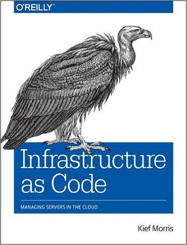
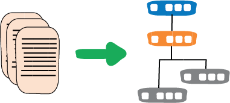

# Инфраструктура как код

[Мартин Фаулер](https://martinfowler.com/)

[НЕПРЕРЫВНАЯ ДОСТАВКА](https://martinfowler.com/tags/continuous%20delivery.html)
[МИКРОСЕРВИСЫ](https://martinfowler.com/tags/microservices.html)

>  [Книга Кифа Морриса](https://www.amazon.com/gp/product/1491924357/ref=as_li_tl?ie=UTF8&camp=1789&creative=9325&creativeASIN=1491924357&linkCode=as2&tag=martinfowlerc-20) является ключевой для более подробного изучения того, 
> как использовать инфраструктуру как код, чтобы воспользоваться преимуществами 
> перехода от железного века к облачному.

Инфраструктура как код — это подход к определению вычислительной и сетевой 
инфраструктуры с помощью исходного кода, который затем можно рассматривать как 
любую программную систему. Такой код можно хранить в системе управления версиями, 
чтобы обеспечить возможность аудита и [ReproducibleBuilds](https://martinfowler.com/bliki/ReproducibleBuild.html), подвергать 
тестированию и полному циклу [ContinuousDelivery](https://martinfowler.com/bliki/ContinuousDelivery.html).
Это подход, который использовался в течение последнего десятилетия для работы с 
получившими популярность платформами [облачных вычислений](https://martinfowler.com/bliki/CloudComputing.html) и станет основным способом управления 
вычислительной инфраструктурой в следующем.

Я вырос в [железном веке](https://www.thoughtworks.com/insights/blog/infrastructure-code-iron-age-cloud-age), когда 
релиз нового серверного приложения означал поиск некоторого физического 
оборудования для его запуска, настройку этого оборудования для поддержки 
потребностей приложения и развертывание этого приложения на оборудовании.
Получение этого оборудования обычно было дорогим, но и длительным, обычно дело 
нескольких месяцев. Но сейчас мы живем в эпоху облачных вычислений, когда запуск 
нового сервера занимает считанные секунды, для чего требуется не более, чем 
подключение к Интернету и кредитная карта. Это **динамическая инфраструктура**, в 
которой программные команды используются для создания серверов (часто виртуальных 
машин, но могут быть и установки на «голом железе»), выделения и демонтажа — и 
все это без использования отвертки.

## Практики

Инфраструктура как код основана на нескольких практиках:

* **Используйте файлы определения:** вся конфигурация определяется в исполняемых 
  файлах определения конфигурации, таких как сценарии оболочки, плейбуки Ansible, 
  рецепты Chef или манифесты Puppet. Ни в коем случае никто не должен заходить на 
  сервер и вносить коррективы на лету. Любая такая переделка чревата созданием 
  [SnowflakeServers](https://martinfowler.com/bliki/SnowflakeServer.html), поэтому 
  ее следует выполнять только при разработке кода, который действует как постоянное 
  определение. Это означает, что применение обновления с кодом должно быть быстрым. 
  К счастью, компьютеры быстро выполняют код, что позволяет им предоставлять сотни 
  серверов быстрее, чем любой человек.
* **Самодокументированные системы и процессы:** вместо инструкций в документах, 
  которые люди должны выполнять с обычным уровнем человеческой надежности, код 
  более точен и последовательно выполняется. При необходимости из этого кода может 
  быть сгенерирована другая удобочитаемая документация.
* **Используйте СКВ для всего:** держите весь этот код в системе контроля версий. 
  Таким образом, каждая конфигурация и каждое изменение записываются для аудита, и 
  вы можете создавать [воспроизводимые сборки](https://martinfowler.com/bliki/ReproducibleBuild.html) для диагностики проблем.
* **Постоянно тестируйте системы и процессы:** тесты позволяют компьютерам быстро 
  находить множество ошибок в конфигурации инфраструктуры. Как и в любой современной 
  программной системе, вы можете настроить [DeploymentPipelines](https://martinfowler.com/bliki/DeploymentPipeline.html) для своего кода 
  инфраструктуры, что позволит вам практиковать [непрерывную доставку](https://martinfowler.com/bliki/ContinuousDelivery.html) изменений 
  инфраструктуры.
* **Небольшие изменения, а не пакеты:** чем больше обновление инфраструктуры, 
  тем больше вероятность того, что оно будет содержать ошибку, и тем сложнее 
  обнаружить эту ошибку, особенно если взаимодействуют несколько ошибок. Небольшие 
  обновления облегчают поиск ошибок и их легче исправить. При смене инфраструктуры 
  [частота уменьшает сложность](https://martinfowler.com/bliki/FrequencyReducesDifficulty.html).
* **Обеспечьте постоянную доступность служб:** все больше систем не могут позволить 
  себе простои для обновлений или исправлений. Такие методы, как [BlueGreenDeployment](https://martinfowler.com/bliki/BlueGreenDeployment.html) и 
  [ParallelChange](https://martinfowler.com/bliki/ParallelChange.html), позволяют выполнять небольшие обновления без потери 
  доступности.

## Преимущества

Все это позволяет нам использовать динамическую инфраструктуру, легко запуская 
новые серверы и безопасно избавляясь от серверов при их замене новыми 
конфигурациями или при снижении нагрузки. Создание новых серверов — это просто случай 
запуска сценария для создания необходимого количества экземпляров сервера. Этот 
подход хорошо подходит для [PhoenixServers](https://martinfowler.com/bliki/PhoenixServer.html) и 
[ImmutableServers](https://martinfowler.com/bliki/ImmutableServer.html).

Использование кода для определения конфигурации сервера означает большую 
согласованность между серверами. При ручном обеспечении различные интерпретации 
неточных инструкций (не говоря уже об ошибках) приводят к серверам-снежинкам с 
немного отличающимися конфигурациями, что часто приводит к сложным ошибкам, 
которые трудно отлаживать. Такие трудности часто усугубляются непоследовательным 
мониторингом, и опять же использование кода гарантирует, что мониторинг также 
является непротиворечивым.

Что наиболее важно, использование конфигурационного кода делает изменения более 
безопасными, позволяя обновлять приложения и системное программное обеспечение 
с меньшим риском. Ошибки могут быть обнаружены и устранены быстрее, а в худшем 
случае изменения могут быть возвращены к последней рабочей конфигурации.

Если ваша инфраструктура определена как код с контролируемой версией, это 
помогает в обеспечении соответствия и аудита. Каждое изменение в вашей конфигурации 
может быть зарегистрировано и не подвержено ошибочному ведению записей.

Все это становится все более важным, поскольку вам нужно обслуживать больше 
серверов, что делает инфраструктуру как код необходимой возможностью, если вы 
переходите к серьезному внедрению [микросервисов](https://martinfowler.com/microservices). Методы 
«Инфраструктура как код» эффективно масштабируются для управления большими 
кластерами серверов, как при настройке серверов, так и при определении того, как 
они должны взаимодействовать.

## Благодарности

Этот пост основан на работах и многих беседах с [Кифом Моррисом](http://kief.com/), который написал 
[исчерпывающую книгу](https://www.amazon.com/gp/product/1491924357/ref=as_li_tl?ie=UTF8&camp=1789&creative=9325&creativeASIN=1491924357&linkCode=as2&tag=martinfowlerc-20) по этому вопросу. Список практик взят прямо из этой книги

Анантападманабхан Ранганатан, Данило Сато, Кетан Падегаонкар, Пиюш Шривастава, 
Рафаэль Гомес, Ранджан Д. Сакалли, Сина Джахангиризаде и Шриватса Катта обсуждали 
черновики этого поста в нашем внутреннем списке рассылки.