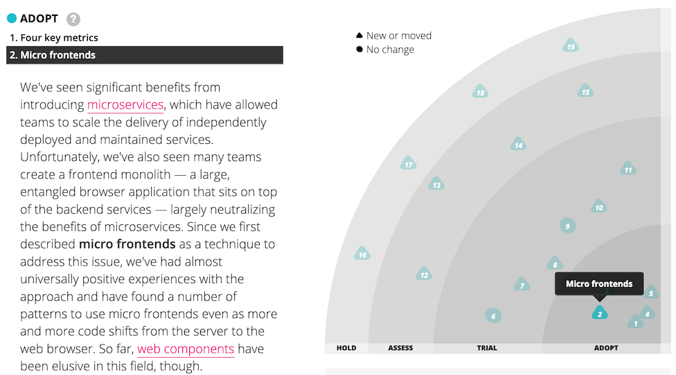
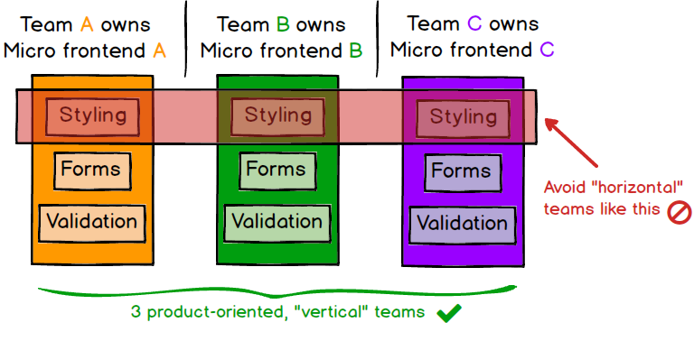
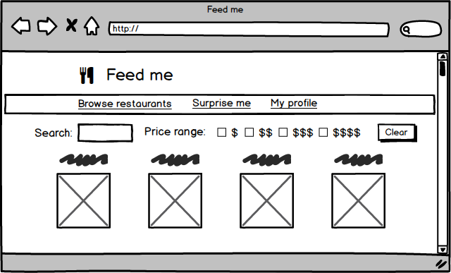
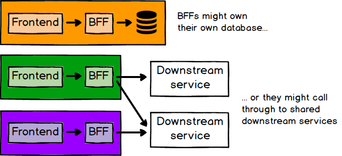
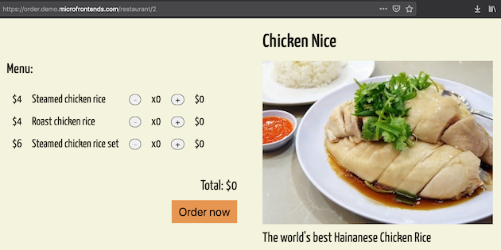
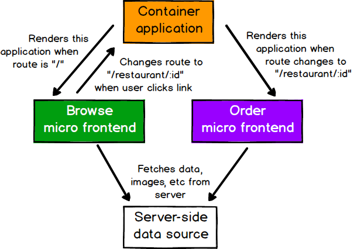

# Микро фронтенды

Хорошая фронтенд-разработка — это сложно. Масштабировать фронтенд-разработку, 
чтобы несколько команд могли одновременно работать над большим и сложным продуктом, 
еще сложнее. В этой статье мы опишем недавнюю тенденцию разбивать фронтенд 
монолиты на множество более мелких и более управляемых частей, а также то, как 
эта архитектура может повысить эффективность и результативность команд, работающих 
над кодом фронтенда. Мы не только поговорим о различных преимуществах и затратах, 
но и рассмотрим некоторые из доступных вариантов реализации, а также углубимся в 
полный пример приложения, демонстрирующий методику.

19 июня 2019

***

[](https://camjackson.net/)

[Кэм Джексон](https://camjackson.net/)

Кэм Джексон — фулстек веб-разработчик и консультант в Thoughtworks, особенно 
заинтересованный в том, как крупные организации масштабируют свои процессы и 
методы разработки фронтенда. Он работал с клиентами из разных отраслей и стран, 
помогая им создавать веб-приложения более эффективно и результативно.

[АРХИТЕКТУРА ПРИЛОЖЕНИЯ](https://martinfowler.com/tags/application%20architecture.html)
[ФРОНТЕНД](https://martinfowler.com/tags/front-end.html)
[МИКРОСЕРВИСЫ](https://martinfowler.com/tags/microservices.html)

Содержание

Преимущества
Постепенное обновление
Простые, несвязанные кодовые базы
Независимое развертывание
Автономные команды
Резюме
Пример
Интеграционные подходы
Состав шаблона на стороне сервера
Интеграция во время сборки
Интеграция во время выполнения через iframe
Интеграция во время выполнения через JavaScript
Интеграция во время выполнения через веб-компоненты
Стилизация
Общие библиотеки компонентов
Связь между приложениями
Взаимодействие с бекендом
Тестирование
Пример с подробностями
Контейнер
Микрофронтенды
Связь между приложениями через маршрутизацию
Общий контент
Инфраструктура
Недостатки
Размер полезной нагрузки
Различия в окружении
Операционная сложность и сложность управления
Вывод

***

В последние годы популярность [микросервисов](https://martinfowler.com/articles/microservices.html) резко возросла, и многие организации 
используют этот архитектурный стиль, чтобы избежать ограничений больших монолитных 
серверных частей. Хотя об этом стиле создания серверного программного обеспечения 
написано много, многие компании продолжают бороться с монолитными кодовыми базами 
фронтенда.

Возможно, вы хотите создать прогрессивное или адаптивное веб-приложение, но не 
можете найти простой способ начать интегрировать эти функции в существующий код. 
Возможно, вы хотите начать использовать новые функции языка JavaScript (или один 
из множества языков, которые могут компилироваться в JavaScript), но не можете 
встроить необходимые инструменты сборки в существующий процесс сборки. Или, 
может быть, вы просто хотите масштабировать свою разработку, чтобы несколько 
команд могли работать над одним продуктом одновременно, но связанность и сложность 
существующего монолита означают, что все наступают друг другу на пятки. Все это 
реальные проблемы, которые могут негативно повлиять на вашу способность эффективно 
предоставлять клиентам высококачественные услуги.

В последнее время мы видим, что все больше и больше внимания уделяется общей 
архитектуре и организационным структурам, которые необходимы для сложной современной 
веб-разработки. В частности, мы наблюдаем появление методик для разложения монолитов 
фронтендов на более мелкие и простые фрагменты, которые можно разрабатывать, 
тестировать и развертывать независимо друг от друга, но при этом они по-прежнему 
выглядят для клиентов как единый связный продукт. Мы называем эту технику микро-фронтендами, 
которые мы определяем как:

> «Архитектурный стиль, в котором независимые фронтенды составляют единое целое»

В ноябрьском выпуске журнала Thoughtworks за 2016 год мы перечислили 
[микрофронтенды](https://www.thoughtworks.com/radar/techniques/micro-frontends) как технику, с которой организации должны считаться. Позже мы 
перевели его в пробную версию и, наконец, в Adopt, что означает мы рассматриваем 
его как проверенный подход, который вы должны использовать, когда это имеет смысл.


Рисунок 1 - Микрофронтенды несколько раз появлялись на техническом радаре.

Некоторые из ключевых преимуществ, которые мы увидели в микрофронтендах:

* меньшие, более сплоченные и удобные в сопровождении кодовые базы
* более масштабируемые организации с несвязанными автономными командами
* возможность обновлять, обновлять или даже переписывать части фронтенда
  более поэтапно, чем это было возможно ранее

Неслучайно эти основные преимущества являются одними из тех, которые могут 
предоставить микросервисы.

Конечно, когда речь идет об архитектуре программного обеспечения, бесплатных 
обедов не бывает — за все приходится платить. Некоторые реализации микрофронтенда 
могут привести к дублированию зависимостей, увеличивая количество байтов, которые 
должны загрузить наши пользователи. Кроме того, резкое увеличение автономии 
команды может привести к фрагментации в работе вашей команды. Тем не менее мы 
считаем, что этими рисками можно управлять и что преимущества микрофронтендов 
часто перевешивают недостатки.

***

## Преимущества

Вместо того, чтобы определять микрофронтенды с точки зрения конкретных 
технических подходов или деталей реализации, мы делаем акцент на возникающих 
атрибутах и преимуществах, которые они дают.

## Постепенное обновление

Для многих организаций это начало пути к микрофронтендам. Старый, большой фронтенд 
монолит сдерживается техническим стеком прошлых лет или кодом, написанным под 
давлением релиза, и это доходит до того, что заманчиво полностью переписать. 
Чтобы избежать [опасностей](https://www.joelonsoftware.com/2000/04/06/things-you-should-never-do-part-i/) 
полного переписывания, мы бы предпочли [приостанавливать](https://martinfowler.com/bliki/StranglerApplication.html)
старое приложение по частям, а тем временем продолжать предоставлять нашим 
клиентам новые функции, не отягощая монолит.

Это часто приводит к архитектуре микрофронтенда. Как только одна команда получит 
опыт создания функции на всем пути к продакшену путём небольших изменений в старой 
системе, другие команды также захотят присоединиться. Существующий код по-прежнему 
нуждается в поддержке, и в некоторых случаях может иметь смысл продолжать 
добавлять в него новые функции, но теперь выбор есть.

Конечным результатом здесь является то, что нам предоставляется больше свободы 
для принятия индивидуальных решений по отдельным частям нашего продукта, а также 
для постепенного обновления нашей архитектуры, наших зависимостей и нашего 
пользовательского опыта. Если в нашем основном фреймворке произойдет серьезное 
критическое изменение, каждый микро-фронтенд можно будет обновить, когда это 
будет целесообразно, вместо того, чтобы заставлять мир останавливаться и 
обновлять все сразу. Если мы хотим поэкспериментировать с новой технологией или 
новыми способами взаимодействия, мы можем делать это более изолированно, чем раньше.

## Простые, несвязанные кодовые базы

Исходный код для каждого отдельного микрофронтенда по определению будет намного 
меньше, чем исходный код одного монолитного фронтенда. Эти небольшие кодовые базы, 
как правило, проще и легче для разработчиков. В частности, мы избегаем сложности, 
возникающей из-за непреднамеренной и неуместной связи между компонентами, которые 
не должны знать друг о друге. Рисуя более толстые линии вокруг [ограниченных 
контекстов](https://martinfowler.com/bliki/BoundedContext.html) приложения, мы затрудняем возникновение такой случайной связи.

Конечно, одно высокоуровневое архитектурное решение (т. е. «давайте сделаем 
микрофронтенды») не заменит старый добрый чистый код. Мы не пытаемся освободить 
себя от необходимости думать о нашем коде и прилагать усилия для его качества. 
Вместо этого мы пытаемся упасть в [яму успеха](https://blog.codinghorror.com/falling-into-the-pit-of-success/), делая плохие решения трудными, 
а хорошие легкими. Например, совместное использование моделей предметной области 
в ограниченных контекстах становится более сложным, поэтому разработчики с 
меньшей вероятностью будут это делать. Точно так же микрофронтенды подталкивают 
вас к тому, чтобы вы четко и обдуманно относились к тому, как данные и события 
передаются между различными частями приложения, что мы должны были сделать в 
любом случае!

## Независимое развертывание

Как и в случае с микросервисами, ключевое значение имеет возможность независимого 
развертывания микрофреймворков. Это уменьшает объём любого заданного развертывания, 
что, в свою очередь, снижает связанный с этим риск. Независимо от того, как и где 
размещается код фронтенда, у каждого микрофронтенда должен быть собственный 
конвейер непрерывной доставки, который создает, тестирует и развертывает его на 
всем пути к продакшену. Мы должны быть в состоянии развернуть каждый 
микрофронтенд, очень мало задумываясь о текущем состоянии других кодовых баз 
или конвейеров. Не имеет значения, находится ли старый монолит в фиксированном, 
ручном, ежеквартальном цикле релизов или соседняя команда добавила наполовину 
законченный или сломанный функционал в свою основную ветку. Если данный 
микрофронтенд готов к запуску в производство, он должен быть в состоянии это 
сделать, и это решение должно приниматься командой, которая его создает и 
поддерживает.


Рисунок 2. Каждый микрофронтенд развертывается в продакшен среде независимо. 

## Автономные команды

Преимущество более высокого порядка, связанное с разделением наших кодовых баз и
наших циклов релиза, заключается в том, что мы проделали долгий путь к полностью 
независимым командам, которые могут владеть частью продукта от идеи до производства 
и далее. Команды могут полностью владеть всем, что им нужно для предоставления 
необходимых результатов клиентам, что позволяет им двигаться быстро и эффективно. 
Чтобы это работало, наши команды должны формироваться вокруг вертикальных срезов 
бизнес-функций, а не технических возможностей. Простой способ сделать это — разделить 
продукт на основе того, что увидят конечные пользователи, чтобы каждый микро фронтенд
инкапсулировал одну страницу приложения и полностью принадлежал одной команде. Это 
обеспечивает более высокую сплоченность работы команд, чем если бы команды формировались 
вокруг технических или «горизонтальных» задач, таких как стилизация, формы или 
проверка входных данных.


Рисунок 3. Каждое приложение должно принадлежать одной команде

## Резюме

Короче говоря, микрофронтенды — это нарезка больших и страшных вещей на более 
мелкие, более управляемые части, а затем четкое определение зависимостей между 
ними. Наш выбор технологий, наши кодовые базы, наши команды и наши процессы 
релизов должны иметь возможность работать и развиваться независимо друг от друга, 
без чрезмерной координации.

***

## Пример

Представьте себе веб-сайт, на котором клиенты могут заказать еду с доставкой. На 
первый взгляд это довольно простая концепция, но есть удивительное количество 
деталей, если вы хотите сделать это хорошо:

* Должен быть лендинг, на которой клиенты могут просматривать и искать рестораны. 
  Рестораны должны быть доступны для поиска и фильтрации по любому количеству 
  атрибутов, включая цену, кухню или то, что клиент заказал ранее.
* Каждому ресторану нужна собственная страница, на которой отображаются позиции 
  его меню и где клиент может выбрать, что он хочет поесть, со скидками, специальными 
  предложениями и особыми пожеланиями.
* У клиентов должна быть страница профиля, где они могут просматривать историю 
  своих заказов, отслеживать доставку и настраивать способы оплаты.



Рисунок 4. Веб-сайт доставки еды может иметь несколько достаточно сложных страниц.

Каждая страница достаточно сложна, чтобы мы могли легко оправдать создание 
специальной команды для каждой из них, и каждая из этих команд должна иметь 
возможность работать над своей страницей независимо от всех других команд. Они 
должны иметь возможность разрабатывать, тестировать, развертывать и поддерживать 
свой код, не беспокоясь о конфликтах или координации с другими командами. Наши 
клиенты, тем не менее, должны видеть единый бесшовный веб-сайт.

В оставшейся части этой статьи мы будем использовать пример этого приложения везде, 
где нам потребуется пример кода или случаев использования.

***

## Интеграционные подходы

Учитывая довольно расплывчатое определение выше, существует множество подходов, 
которые можно с полным основанием назвать микрофронтендами. В этом разделе мы 
покажем несколько примеров и обсудим их компромиссы. Существует довольно 
естественная архитектура, которая проявляется во всех подходах — обычно для 
каждой страницы в приложении есть микро-фронтенд, и есть одно **приложение-контейнер**, 
которое:

* отображает общие элементы страницы, такие как хедер и футер;
* решает сквозные проблемы, такие как аутентификация и навигация;
* объединяет различные микрофронтенды на странице и сообщает каждому 
  микрофронтенду, когда и где отображать себя


Рисунок 5. Обычно вы можете определить свою архитектуру из визуальной структуры 
страницы.

## Состав шаблона на стороне сервера

Мы начнём с явно не нового подхода к разработке фронтенда — рендеринга 
HTML на сервере из нескольких шаблонов или фрагментов. У нас есть файл index.html, 
который содержит все общие элементы страницы, а затем использует серверные 
команды include для подключения содержимого, специфичного для страницы, из 
файлов-фрагментов HTML:

```html
<html lang="en" dir="ltr">
  <head>
    <meta charset="utf-8">
    <title>Feed me</title>
  </head>
  <body>
    <h1>🍽 Feed me</h1>
    <!--# include file="$PAGE.html" -->
  </body>
</html>
```

Мы обрабатываем этот файл с помощью Nginx, настроив переменную $PAGE путем 
сопоставления с запрашиваемым URL-адресом:

```
server {
    listen 8080;
    server_name localhost;

    root /usr/share/nginx/html;
    index index.html;
    ssi on;

    # Перенаправляем с главной страницы / на /browse
    rewrite ^/$ http://localhost:8080/browse redirect;

    # Решаем какой HTML фрагмент вставить, основываясь на URL
    location /browse {
      set $PAGE 'browse';
    }
    location /order {
      set $PAGE 'order';
    }
    location /profile {
      set $PAGE 'profile'
    }

    # Все страницы сайта отображаются с помощью index.html
    error_page 404 /index.html;
}
```

Это достаточно стандартный способ на стороне сервера. Причина, по которой мы 
могли бы по праву назвать это микрофронтендом, заключается в том, что мы разделили 
наш код таким образом, что каждая часть представляет собой автономную концепцию 
предметной области, которую может реализовать независимая команда. Что здесь не 
показано, так это то, как эти различные файлы HTML попадают на веб-сервер, но 
предполагается, что каждый из них имеет собственный конвейер развертывания, 
который позволяет нам осуществлять изменения на одной странице, не затрагивая и 
не думая о любой другой странице.

Для еще большей независимости может быть отдельный сервер, отвечающий за 
рендеринг и обслуживание каждого микрофронтенда, с одним сервером перед ними, 
который отправляет запросы другим. При тщательном кэшировании ответов это 
можно сделать, не влияя на задержку.


Рисунок 6. Каждый из этих серверов можно создать и развернуть независимо.

Этот пример показывает, что микрофронтенды не обязательно являются новой 
методикой и не должны быть сложными. Пока мы внимательно относимся к тому, как 
наши дизайнерские решения влияют на автономию наших кодовых баз и наших команд, 
мы можем добиться многих из тех же преимуществ независимо от нашего 
технического стека.

## Интеграция во время сборки

Один из подходов, который мы иногда встречаем, заключается в публикации каждого 
микрофронтенда в виде пакета, а приложение-контейнер включает их все в качестве 
зависимой библиотеки. Вот как может выглядеть `package.json` контейнера для 
нашего примера приложения:

```json
{
  "name": "@feed-me/container",
  "version": "1.0.0",
  "description": "A food delivery web app",
  "dependencies": {
    "@feed-me/browse-restaurants": "^1.2.3",
    "@feed-me/order-food": "^4.5.6",
    "@feed-me/user-profile": "^7.8.9"
  }
}
```

Сначала кажется, что это имеет смысл. Как обычно, он создает единый развертываемый 
пакет Javascript, что позволяет нам дедуплицировать общие зависимости из наших 
различных приложений. Однако такой подход означает, что мы должны перекомпилировать 
и выпустить каждый отдельный микрофронтенд, чтобы выпустить изменение в любой 
отдельной части продукта. Как и в случае с микросервисами, мы видели достаточно 
проблем, вызванных таким **поэтапным процессом релиза**, поэтому мы настоятельно 
рекомендуем не использовать такой подход в микрофронтендах.

Потратив все усилия на разделение нашего приложения на отдельные кодовые базы, 
которые можно разрабатывать и тестировать независимо друг от друга, давайте не 
будем повторно вводить всю эту связь на этапе релиза. Мы должны найти способ 
интегрировать наши микрофронтенды во время выполнения, а не во время сборки.

## Интеграция во время выполнения через iframe

Один из самых простых подходов к совместной компоновке приложений в браузере — 
скромный iframe. По своей природе фреймы позволяют легко создавать страницы из 
независимых подстраниц. Они также обеспечивают хорошую степень изоляции с точки 
зрения стилей и глобальных переменных, не мешающих друг другу.

```html
<html>
  <head>
    <title>Feed me!</title>
  </head>
  <body>
    <h1>Welcome to Feed me!</h1>

    <iframe id="micro-frontend-container"></iframe>

    <script type="text/javascript">
      const microFrontendsByRoute = {
        '/': 'https://browse.example.com/index.html',
        '/order-food': 'https://order.example.com/index.html',
        '/user-profile': 'https://profile.example.com/index.html',
      };

      const iframe = document.getElementById('micro-frontend-container');
      iframe.src = microFrontendsByRoute[window.location.pathname];
    </script>
  </body>
</html>
```

Как и в случае с [includes на стороне сервера](https://martinfowler.com/articles/micro-frontends.html#Server-sideTemplateComposition), создание страницы из фреймов не 
является новой методикой и, возможно, не кажется чем-то захватывающим. Но если 
мы вернемся к основным преимуществам микрофронтендов, [перечисленным ранее](https://martinfowler.com/articles/micro-frontends.html#Benefits), 
iframes в основном отвечают всем требованиям, если мы внимательно относимся к 
тому, как мы делим приложение и структурируем наши команды.

Мы часто видим большое нежелание выбирать iframe. Хотя часть этого нежелания, 
кажется, вызвана сложившимся мнением, что iframes считаются «дурным тоном», существует несколько 
веских причин, по которым люди избегают их. Упомянутая выше простая изоляция 
делает их менее гибкими, чем другие варианты. Создание интеграции между различными 
частями приложения может быть затруднено, поэтому они усложняют маршрутизацию, 
историю и глубокие ссылки, а также создают дополнительные проблемы для обеспечения 
полной адаптивности вашей страницы.

## Интеграция во время выполнения через JavaScript

Следующий подход, который мы опишем, является, вероятно, наиболее гибким и 
наиболее часто применяемым командами. Каждый микрофронтенд подключается к странице 
с помощью тега <script> и при загрузке предоставляет глобальную функцию в 
качестве точки входа. Затем приложение-контейнер определяет, какой микрофронтенд 
следует смонтировать, и вызывает соответствующую функцию, чтобы сообщить 
микрофронтенду, когда и где отображать себя.

```html
<html>
  <head>
    <title>Feed me!</title>
  </head>
  <body>
    <h1>Welcome to Feed me!</h1>

    <!-- These scripts don't render anything immediately -->
    <!-- Instead they attach entry-point functions to `window` -->
    <script src="https://browse.example.com/bundle.js"></script>
    <script src="https://order.example.com/bundle.js"></script>
    <script src="https://profile.example.com/bundle.js"></script>

    <div id="micro-frontend-root"></div>

    <script type="text/javascript">
      // These global functions are attached to window by the above scripts
      const microFrontendsByRoute = {
        '/': window.renderBrowseRestaurants,
        '/order-food': window.renderOrderFood,
        '/user-profile': window.renderUserProfile,
      };
      const renderFunction = microFrontendsByRoute[window.location.pathname];

      // Having determined the entry-point function, we now call it,
      // giving it the ID of the element where it should render itself
      renderFunction('micro-frontend-root');
    </script>
  </body>
</html>
```

Приведенный выше пример, очевидно, примитивен, но он демонстрирует основной подход.
В отличие от интеграции во время сборки, мы можем развернуть каждый из файлов 
bundle.js независимо. И, в отличие от iframe, у нас есть полная гибкость для 
создания интеграции между нашими микрофронтендами, как нам нравится. Мы могли бы 
расширить приведенный выше код разными способами, например, загружать каждый 
пакет JavaScript только по мере необходимости или передавать данные при 
рендеринге микрофронтенда.

Гибкость этого подхода в сочетании с возможностью независимого развертывания 
делает его нашим выбором по умолчанию и тем, который мы чаще всего видели в 
реальном мире. Мы рассмотрим его более подробно, когда перейдем к 
[полному примеру](https://martinfowler.com/articles/micro-frontends.html#TheExampleInDetail).

## Интеграция во время выполнения через веб-компоненты

Одним из вариантов предыдущего подхода является определение для каждого 
микрофронтенда пользовательского HTML-элемента для создания экземпляра контейнера 
вместо определения глобальной функции для вызова контейнера.

```html
<html>
  <head>
    <title>Feed me!</title>
  </head>
  <body>
    <h1>Welcome to Feed me!</h1>

    <!-- These scripts don't render anything immediately -->
    <!-- Instead they each define a custom element type -->
    <script src="https://browse.example.com/bundle.js"></script>
    <script src="https://order.example.com/bundle.js"></script>
    <script src="https://profile.example.com/bundle.js"></script>

    <div id="micro-frontend-root"></div>

    <script type="text/javascript">
      // These element types are defined by the above scripts
      const webComponentsByRoute = {
        '/': 'micro-frontend-browse-restaurants',
        '/order-food': 'micro-frontend-order-food',
        '/user-profile': 'micro-frontend-user-profile',
      };
      const webComponentType = webComponentsByRoute[window.location.pathname];

      // Having determined the right web component custom element type,
      // we now create an instance of it and attach it to the document
      const root = document.getElementById('micro-frontend-root');
      const webComponent = document.createElement(webComponentType);
      root.appendChild(webComponent);
    </script>
  </body>
</html>
```

Конечный результат здесь очень похож на предыдущий пример, главное отличие 
состоит в том, что вы выбираете способ через «веб-компонент». Если вам нравится 
спецификация веб-компонента и вам нравится идея использования возможностей, 
предоставляемых браузером, то это хороший вариант. Если вы предпочитаете 
определять свой собственный интерфейс между приложением-контейнером и 
микрофронтендами, вы можете предпочесть предыдущий вариант.

***

## Стилизация

CSS как язык по своей сути является глобальным, наследуемым и каскадным, 
традиционно без модульной системы, пространства имен или инкапсуляции. Некоторые 
из этих возможностей уже доступны, но поддержка браузера часто отсутствует.
Применительно к микрофронтендам многие из этих проблем усугубляются. Например, 
если в микрофронтенде одной команды есть таблица стилей, в которой указано 
`h2 { color: black; }`, а у другой `h2 { color: blue; }`, и оба этих селектора 
привязаны к одной и той же странице, то кто-то будет разочарован! Это не новая 
проблема, но она усугубляется тем фактом, что эти селекторы были написаны разными 
командами в разное время, а код, вероятно, разбросан по разным репозиториям, 
что затрудняет его обнаружение.

За прошедшие годы было изобретено много подходов, чтобы сделать CSS более 
управляемым. Некоторые предпочитают использовать строгое соглашение об именах, 
такое как BEM, чтобы гарантировать, что селекторы применяются только там, где 
они предназначены. Другие, предпочитающие не полагаться только на дисциплину 
разработчиков, используют препроцессор, такой как SASS, вложенность селекторов 
которого можно использовать как разновидность пространства имен. Более новый подход 
заключается в программном применении всех стилей с помощью модулей CSS или одной 
из различных библиотек CSS-in-JS, что гарантирует прямое применение стилей только 
в тех местах, которые задумал разработчик. Или, для более платформенного подхода, 
теневой DOM также предлагает изоляцию стилей.

Подход, который вы выберете, не имеет большого значения, пока вы найдете способ 
гарантировать, что разработчики смогут писать свои стили независимо друг от 
друга и будут уверены, что их код будет вести себя предсказуемо при объединении 
в одно приложение.

***

## Общие библиотеки компонентов

Выше мы упоминали, что важна визуальная согласованность между микрофронтендами, и 
один из подходов к этому — разработать библиотеку общих повторно используемых 
компонентов пользовательского интерфейса. В целом мы считаем, что это хорошая 
идея, хотя ее трудно реализовать хорошо. Основными преимуществами создания такой 
библиотеки являются сокращение усилий за счет повторного использования кода и 
визуальная согласованность. Кроме того, ваша библиотека компонентов может служить 
живым руководством по стилю и может стать отличной точкой сотрудничества между
разработчиками и дизайнерами.

Одна из самых частых ошибок — создать слишком много таких компонентов слишком 
рано. Заманчиво создать [Foundation Framework](https://martinfowler.com/bliki/FoundationFramework.html) со 
всеми общими визуальными элементами, которые потребуются во всех приложениях.
Однако опыт говорит нам, что трудно, если вообще возможно, угадать, какими должны 
быть API-интерфейсы компонентов, прежде чем вы начнете их использовать в реальном 
мире, что приводит к большому беспорядку в компоненте на ранних этапах жизни. По этой 
причине мы предпочитаем позволять командам создавать свои собственные компоненты 
в своих кодовых базах по мере необходимости, даже если изначально это приводит к 
некоторому дублированию. Позвольте шаблонам проявиться естественным образом, и как 
только API компонента станет очевидным, вы сможете [собрать](https://martinfowler.com/bliki/HarvestedFramework.html) повторяющийся код в 
общую библиотеку и быть уверенными, что у вас есть что-то проверенное.

Наиболее очевидными кандидатами на совместное использование являются "простейшие"
визуальные примитивы, такие как значки, метки и кнопки. Мы также можем делиться 
более сложными компонентами, которые могут содержать значительный объем логики 
пользовательского интерфейса, например, раскрывающееся поле поиска с 
автозаполнением. Или сортируемая, фильтруемая, разбитая на страницы таблица.
Однако убедитесь, что ваши общие компоненты содержат только логику пользовательского 
интерфейса, а не бизнес-логику или логику предметной области. Когда логика 
предметной области помещается в разделяемую библиотеку, это создает высокую 
степень связанности между приложениями и увеличивает сложность внесения изменений.
Так, например, вы обычно не должны пытаться поделиться ProductTable, который 
будет содержать всевозможные предположения о том, что такое «продукт» и как он 
должен себя вести. Такое моделирование предметной области и бизнес-логика 
относятся к прикладному коду микрофронтендов, а не к общей библиотеке.

Как и в случае с любой общей внутренней библиотекой, существуют некоторые каверзные 
вопросы, связанные с ее владением и управлением. Одна модель заключается в утверждении, что 
как общим активом им владеют «все», хотя на практике это обычно означает, что 
им никто не владеет. Он может быстро превратиться в мешанину непоследовательного 
кода без четких соглашений или технического видения. С другой стороны, если 
разработка разделяемой библиотеки будет полностью централизована, между людьми, 
которые создают компоненты, и людьми, которые их используют, будет большой разрыв.
Лучшие модели, которые мы видели, — это те, в которых каждый может внести свой 
вклад в библиотеку, но есть [тот](https://martinfowler.com/bliki/ServiceCustodian.html) (человек или группа), кто отвечает за обеспечение 
качества, согласованности и достоверности этих вкладов. Работа по обслуживанию 
общей библиотеки требует сильных технических навыков, а также навыков работы с 
людьми, необходимых для развития сотрудничества между многими командами.

***

## Связь между приложениями

Один из самых распространенных вопросов, касающихся микрофронтендов, — как 
заставить их взаимодействовать друг с другом. В общем случае, мы рекомендуем, чтобы они 
взаимодействовали как можно меньше, так как это часто приводит к неуместной 
связанности, которого мы стремимся избежать в первую очередь.

Тем не менее часто требуется некоторый уровень взаимодействия между приложениями.
[Пользовательские события](https://developer.mozilla.org/en-US/docs/Web/Guide/Events/Creating_and_triggering_events) позволяют микрофронтендам взаимодействовать косвенно, 
что является хорошим способом минимизировать прямое взаимодействие, хотя и усложняет 
определение и обеспечение соблюдения контракта, существующего между микрофронтендами.
В качестве альтернативы реактивная модель с передачей обратных вызовов и данных вниз 
(в данном случае "вниз" - это означает от приложения-контейнера к микрофронтендам) 
также является хорошим решением, которое делает контракт более явным. Третьим 
вариантом является использование адресной строки в качестве механизма связи, 
который мы рассмотрим [более подробно позже](https://martinfowler.com/articles/micro-frontends.html#Cross-applicationCommunicationViaRouting).

Какой бы подход мы ни выбрали, мы хотим, чтобы наши микрофронтенды общались, 
отправляя сообщения или события друг другу, и избегали какого-либо общего 
состояния. Точно так же, как совместное использование базы данных микросервисами, 
как только мы делимся нашими структурами данных и моделями предметной области, мы 
создаем огромное количество связей, и вносить изменения становится чрезвычайно 
сложно.

> Если вы используете `redux`, стандартный подход состоит в том, чтобы иметь 
> единое глобальное общее хранилище для всего приложения. Однако, если 
> предполагается, что каждый микрофронтенд должен быть отдельным автономным 
> приложением, то для каждого из них имеет смысл иметь собственное `redux` хранилище.
> В документации `Redux` даже упоминается [«изоляция приложения Redux как компонента 
> в более крупном приложении»](https://redux.js.org/faq/store-setup#can-or-should-i-create-multiple-stores-can-i-import-my-store-directly-and-use-it-in-components-myself) 
> в качестве веской причины для создания нескольких хранилищ.

Как и в случае со стилями, здесь могут работать несколько разных подходов.
Самое главное — долго и упорно думать о том, какую связь вы вводите, и как вы будете 
поддерживать этот контракт с течением времени. Как и в случае с интеграцией между 
микросервисами, вы не сможете вносить критические изменения в свои интеграции 
без скоординированного процесса обновления между различными приложениями и 
командами.

Вы также должны подумать о том, как вы будете автоматически проверять, что интеграция 
не прерывается. Функциональное тестирование — это один из подходов, но мы предпочитаем 
ограничивать количество функциональных тестов, которые мы пишем, из-за затрат на 
их реализацию и поддержку. В качестве альтернативы вы можете реализовать некоторую 
форму [контрактов, ориентированных на потребителя](https://martinfowler.com/articles/consumerDrivenContracts.html), чтобы каждый микрофронтенд 
мог указывать, что он требует от других микрофронтендов, без необходимости 
фактической интеграции и запуска их всех в браузере вместе.

***

## Взаимодействие с бекендом

Если у нас есть отдельные команды, работающие независимо над фронтенд-приложениями, 
как насчет бэкэнд-разработки? Мы твердо верим в ценность футстек команд, которые 
отвечают за разработку своего приложения от визуального кода до разработки API, а 
также кода базы данных и инфраструктуры. Одна из методик, которая помогает здесь, — это 
шаблон [BFF](https://samnewman.io/patterns/architectural/bff/), где каждое фронтенд приложение имеет соответствующий бекенд, 
цель которого — исключительно обслуживать потребности этого фронтенда. Хотя 
методика BFF изначально мог означать выделенные серверные части для каждого фронтенд канала 
(веб, мобильный и т. д.), его можно легко расширить, чтобы обозначить серверную 
часть для каждого микрофронтенда.

Здесь нужно учитывать множество переменных. BFF может быть автономным со своей 
собственной бизнес-логикой и базой данных или может быть просто агрегатором 
нижестоящих сервисов. При наличии нижестоящих сервисов может иметь или не иметь 
смысла для команды, отвечающей за микрофронтенд и его BFF, также отвечать за 
некоторые из этих сервисов. Если у микрофронтенда существует только один API, с 
которым он взаимодействует, и этот API достаточно стабилен, то создание BFF 
может вообще не иметь большого смысла. Основной принцип здесь заключается в том, 
что команда, создающая конкретный микрофронтенд, не должна ждать, пока другие 
команды создадут что-то для нее. Таким образом, если каждая новая функция, 
добавленная в микрофронтенд, также требует изменений в бэкэнде, это веский 
аргумент в пользу BFF, принадлежащего той же команде.



Рисунок 7. Существует множество различных способов структурирования ваших связей 
между фронтендом и бекендом.

Другой часто задаваемый вопрос: как пользователь микрофронтендного приложения 
должен быть аутентифицирован и авторизован на сервере? Очевидно, что наши клиенты 
должны аутентифицировать себя только один раз, поэтому аутентификация обычно 
относится к категории сквозных задач, которыми должно владеть приложение-контейнер. 
Контейнер, вероятно, имеет какую-то форму входа, через которую мы получаем какой-то 
токен. Этот токен будет принадлежать контейнеру и может быть введен в каждый 
микрофронтенд при инициализации. Наконец, микрофронтенд может отправить токен с 
любым запросом, который он делает на сервер, и сервер может выполнить любую 
требуемую проверку.

***

## Тестирование

Мы не видим большой разницы между монолитными фронтендами и микрофронтендами, 
когда дело доходит до тестирования. В общем, любые стратегии, которые вы используете 
для тестирования монолитного фронтендами, могут быть воспроизведены для каждого 
отдельного микрофронтенда. То есть каждый микрофронтенд должен иметь свой комплексный 
набор автоматических тестов, обеспечивающих качество и корректность кода.

Тогда очевидным пробелом будет интеграционное тестирование различных микрофронтендов 
с приложением-контейнером. Это можно сделать с помощью предпочитаемого вами инструмента 
функционального/сквозного тестирования (например, Selenium или Cypress), но не 
заходите слишком далеко; функциональные тесты должны охватывать только аспекты, 
которые не могут быть протестированы на более низком уровне [пирамиды 
тестирования](https://martinfowler.com/bliki/TestPyramid.html). Под этим мы 
подразумеваем использование unit тестов для покрытия вашей низкоуровневой 
бизнес-логики и логики отображения, а затем использование функциональных тестов 
только для проверки правильности сборки страницы. Например, вы можете загрузить 
полностью интегрированное приложение по определенному URL-адресу и утверждать, 
что на странице присутствует жестко заданный заголовок соответствующего микрофронтенда.

Если существуют случаи использования, которые охватывают несколько микрофронтендов, то вы можете 
использовать функциональное тестирование, чтобы покрыть их, но сфокусируйте 
функциональные тесты на проверке интеграции фронтендов, а не на внутренней 
бизнес-логике каждого микрофронтенда, которая уже должна быть было покрыта 
unit тестами. [Как упоминалось выше](https://martinfowler.com/articles/micro-frontends.html#Cross-applicationCommunication), контракты, ориентированные на потребителя, 
могут помочь напрямую определить взаимодействия, которые происходят между микрофронтендами, 
без ненадежных интеграционных сред и функционального тестирования.

***

## Пример с подробностями

Большая часть оставшейся статьи является подробным объяснением одного из способов 
реализации приложения, используемого нами в качестве примера. В основном мы 
сосредоточимся на том, как контейнерное приложение и микрофронтенды [интегрируются 
вместе с помощью JavaScript](https://martinfowler.com/articles/micro-frontends.html#Run-timeIntegrationViaJavascript), так как это, вероятно, самая интересная и сложная часть.
Вы можете увидеть конечный результат, развернутый вживую, на 
[https://demo.microfrontends.com](https://demo.microfrontends.com/), а полный исходный код - на 
[Github](https://github.com/micro-frontends-demo).


Рисунок 8. Лендинг страница 'browse' демонстрационного приложения, созданного с 
использованием микрофронтендов

Демонстрация создана с использованием React.js, хотя стоит отметить, что у 
React нет монополии на эту архитектуру. Микрофронтенды могут быть реализованы с 
помощью множества различных инструментов или фреймворков. Мы выбрали React из-за 
его популярности и хорошо его знаем.

## Контейнер

Мы начнем с [контейнера](https://github.com/micro-frontends-demo/container), так как это точка входа для наших клиентов. Давайте 
посмотрим, что мы можем узнать о нём из его package.json:

```json
{
  "name": "@micro-frontends-demo/container",
  "description": "Entry point and container for a micro frontends demo",
  "scripts": {
    "start": "PORT=3000 react-app-rewired start",
    "build": "react-app-rewired build",
    "test": "react-app-rewired test"
  },
  "dependencies": {
    "react": "^16.4.0",
    "react-dom": "^16.4.0",
    "react-router-dom": "^4.2.2",
    "react-scripts": "^2.1.8"
  },
  "devDependencies": {
    "enzyme": "^3.3.0",
    "enzyme-adapter-react-16": "^1.1.1",
    "jest-enzyme": "^6.0.2",
    "react-app-rewire-micro-frontends": "^0.0.1",
    "react-app-rewired": "^2.1.1"
  },
  "config-overrides-path": "node_modules/react-app-rewire-micro-frontends"
}
```

Из зависимостей от `react` и `react-scripts` мы можем сделать вывод, что это 
приложение React.js, созданное с помощью [`create-react-app`](https://facebook.github.io/create-react-app/).
Более интересно то, чего там _нет_: любого упоминания о микрофронтендах, которые 
мы собираемся собрать вместе, чтобы сформировать наше окончательное приложение.
Если бы мы указали их здесь как зависимости библиотек, мы бы пошли по пути 
интеграции во время сборки, что, как [упоминалось ранее](https://martinfowler.com/articles/micro-frontends.html#Build-timeIntegration), может привести к проблематичной
связанности в нашем цикле релизов.

> В версии 1 `react-scripts` на одной странице могло сосуществовать несколько 
> приложений без конфликтов, но версия 2 использует некоторые функции webpack, 
> которые приводят к ошибкам, когда два или более приложения пытаются отобразить 
> себя на одной странице. По этой причине мы используем `react-app-rewired`, чтобы 
> переопределить некоторые внутренние конфигурации webpack для `react-scripts`.
> Это исправляет эти ошибки и позволяет нам продолжать полагаться `react-scripts`
> для управления нашими инструментами сборки.

Чтобы увидеть, как мы выбираем и отображаем микроФронтенд, давайте посмотрим 
на `App.js`. Мы используем [React Router] для сопоставления текущего URL-адреса 
с заранее заданными списком маршрутов и отображаем соответствующий компонент:

```jsx
<Switch>
  <Route exact path="/" component={Browse} />
  <Route exact path="/restaurant/:id" component={Restaurant} />
  <Route exact path="/random" render={Random} />
</Switch>
```

Компонент `Random` не так интересен — он просто перенаправляет страницу на случайно 
выбранный URL-адрес ресторана. Компоненты `Browse` и `Restaurant` выглядят следующим 
образом:

```jsx
const Browse = ({ history }) => (
  <MicroFrontend history={history} name="Browse" host={browseHost} />
);
const Restaurant = ({ history }) => (
  <MicroFrontend history={history} name="Restaurant" host={restaurantHost} />
);
```

В обоих случаях мы отображаем компонент `MicroFrontend`. Помимо объекта истории 
(который станет важным позже), мы указываем уникальное имя приложения и хост, с 
которого можно загрузить его пакет. Этот URL-адрес, задаваемый в конфигурации, 
будет выглядеть примерно так: http://localhost:3001 при локальном запуске или 
https://browse.demo.microfrontends.com в продакшен.

Выбрав микрофронтенд в `App.js`, теперь мы будем рендерить его в `MicroFrontend.js`, 
который является просто еще одним компонентом React:

```jsx
class MicroFrontend extends React.Component {
  render() {
    return <main id={`${this.props.name}-container`} />;
  }
}
```

> Это не весь класс, мы увидим вскоре остальные его методы.

При рендеринге все, что мы делаем, — это помещаем элемент-контейнер на страницу 
с идентификатором, уникальным для микрофронтенда. Здесь мы указываем нашему 
микрофронтенду где рендерить себя. Мы используем React `componentDidMount` в 
качестве триггера для загрузки и монтирования микрофронтенда:

_класс MicroFrontend..._
```jsx
componentDidMount() {
    const { name, host } = this.props;
    const scriptId = `micro-frontend-script-${name}`;

    if (document.getElementById(scriptId)) {
      this.renderMicroFrontend();
      return;
    }

    fetch(`${host}/asset-manifest.json`)
      .then(res => res.json())
      .then(manifest => {
        const script = document.createElement('script');
        script.id = scriptId;
        script.src = `${host}${manifest['main.js']}`;
        script.onload = this.renderMicroFrontend;
        document.head.appendChild(script);
      });
  }
```

> `componentDidMount` — это метод жизненного цикла компонентов React, который 
> вызывается фреймворком сразу после того, как экземпляр нашего компонента был 
> впервые «смонтирован» в DOM.

Сначала мы проверяем, был ли загружен соответствующий скрипт с уникальным 
идентификатором, и в этом случае мы можем просто отрендерить его немедленно.
Если нет, мы извлекаем файл `assets-manifest.json` с соответствующего хоста, чтобы 
найти полный URL-адрес основного скрипта сборки. После того, как мы задали 
URL-адрес скрипта, всё, что осталось, — это прикрепить его к документу с помощью 
обработчика `onload`, который отобразит микрофронтенд:

_класс MicroFrontend..._
```jsx
renderMicroFrontend = () => {
    const { name, history } = this.props;

    window[`render${name}`](`${name}-container`, history);
    // E.g.: window.renderBrowse('browse-container', history);
  };
```

В приведенном выше коде мы вызываем глобальную функцию, называемую как-то вроде 
`window.renderBrowse`, которая была помещена туда только что скаченным скриптом.
Мы передаем ему идентификатор элемента <main>, где микрофронтенд должен отображать 
себя, и объект истории, который мы скоро объясним. **Сигнатурой этой глобальной 
функции является ключевой контракт между приложением-контейнером и микрофронтендами.**
Именно здесь должна происходить любая коммуникация или интеграция, поэтому 
если его сделать достаточно легковесным упрощается его обслуживание и добавление 
новых микрофронтендов в будущем. Всякий раз, когда мы хотим сделать что-то, что 
потребует изменения этого кода, мы должны долго и хорошо подумать о том, что 
это означает для связи наших кодовых баз и поддержания контракта.

Последнее о чём хотелось бы сказать, это об элементе который занимается очисткой.
Когда наш компонент `MicroFrontend` размонтируется (удаляется из DOM), мы также 
хотим размонтировать соответствующий микрофронтенд. Для этой цели существует 
соответствующая глобальная функция, определенная каждым микрофронтендом, которую 
мы вызываем из соответствующего метода жизненного цикла React:

_класс MicroFrontend..._
```jsx
componentWillUnmount() {
    const { name } = this.props;

    window[`unmount${name}`](`${name}-container`);
  }
```

Что касается собственного содержимого, все, что контейнер отображает напрямую, — это 
заголовок верхнего уровня и панель навигации сайта, поскольку они постоянны на 
всех страницах. CSS для этих элементов был тщательно написан, чтобы гарантировать, 
что он будет стилизовать только элементы в заголовке, поэтому он не должен 
конфликтовать с каким-либо кодом стилей в микрофронтендах.

Это всё что касается контейнерного приложения! Оно довольно приметивно, но 
предоставляет нам оболочку, которая может динамически загружать наши микрофронтенды 
во время выполнения и склеивать их во что-то связанное на одной странице. Эти 
микрофронтенды можно независимо развернуть на всем пути от создания до 
продакшена, не внося изменений ни в какой другой микрофронтенд, ни в сам 
контейнер.

## Микрофронтенды

Логичным местом для продолжения этой истории будет глобальная функция рендеринга, 
на которую мы постоянно ссылаемся. Главная страница нашего приложения представляет 
собой фильтруемый список ресторанов, точка входа в которую выглядит так:

```jsx
import React from 'react';
import ReactDOM from 'react-dom';
import App from './App';
import registerServiceWorker from './registerServiceWorker';

window.renderBrowse = (containerId, history) => {
  ReactDOM.render(<App history={history} />, document.getElementById(containerId));
  registerServiceWorker();
};

window.unmountBrowse = containerId => {
  ReactDOM.unmountComponentAtNode(document.getElementById(containerId));
};
```

Обычно в приложениях `React.js` вызов `ReactDOM.render` находится на самом верхнем 
уровне, а это означает, что как только этот файл скрипта загружается, он 
немедленно начинает рендеринг в жестко запрограммированный элемент DOM. Для 
этого приложения нам нужно иметь возможность контролировать, когда и где 
происходит рендеринг, поэтому мы заключаем его в функцию, которая получает 
идентификатор элемента DOM в качестве параметра, и мы присоединяем эту функцию 
к глобальному объекту `window`. Мы также видим соответствующую функцию 
размонтирования, которая используется для очистки.

Хотя мы уже видели, как вызывается эта функция, когда микрофронтенд интегрирован 
в приложение-контейнер, одним из важнейших критериев успеха здесь является 
то, что мы можем разрабатывать и запускать микрофронтенды независимо друг от друга. 
Таким образом, каждый микрофронтенд также имеет свой собственный `index.html` со 
встроенным скриптом для рендеринга приложения в «автономном» режиме вне контейнера:

```html
<html lang="en">
  <head>
    <title>Restaurant order</title>
  </head>
  <body>
    <main id="container"></main>
    <script type="text/javascript">
      window.onload = () => {
        window.renderRestaurant('container');
      };
    </script>
  </body>
</html>
```



Рисунок 9. Каждый микрофронтенд можно запускать как отдельное приложение вне 
контейнера.

С этого момента микрофронтенды в основном являются простыми стандартными 
приложениями React. Приложение ['browse'](https://github.com/micro-frontends-demo/browse) запрашивает список ресторанов с сервера,
предоставляет элементы `<input>` для поиска и фильтрации ресторанов и отображает 
элементы `<Link>` React Router, которые ссылаются на страницу определенного ресторана. 
В этот момент мы переключаемся на второй микрофронтенд ['order'](https://github.com/micro-frontends-demo/restaurant-order), 
который отображает один ресторан с его меню.



Рисунок 10. Эти микрофронтенды взаимодействуют только путём изменения маршрута, 
а не напрямую.

Последнее, что стоит упомянуть о наших микрофронтендах, это то, что они оба 
используют styled-components для всех своих стилей. Эта библиотека CSS-in-JS 
позволяет легко связать стили с определенными компонентами, поэтому мы гарантируем, 
что стили микрофронтенда не будут влиять на контейнер или другой микрофронтенд.

## Связь между приложениями через маршрутизацию

[Ранее мы упоминали](https://martinfowler.com/articles/micro-frontends.html#Cross-applicationCommunication), что 
взаимодействие между приложениями должно быть сведено к минимуму. В этом примере 
единственное требование, которое у нас есть, это то, что страница просмотра должна 
сообщить странице ресторана, какой ресторан загрузить. Здесь мы увидим, как мы 
можем использовать маршрутизацию на стороне клиента для решения этой проблемы.

Все три приложения React, задействованные здесь, используют React Router для 
декларативной маршрутизации, но инициализируются двумя немного разными способами. 
Для контейнерного приложения мы создаем `<BrowserRouter>`, который внутренне 
создает экземпляр объекта `history`. Это тот же объект `history`, который мы ранее 
игнорировали. Мы используем этот объект для манипулирования историей на стороне 
клиента, а также можем использовать его для связывания нескольких React 
маршрутизаторов вместе. Внутри наших микрофронтендов мы инициализируем Router 
следующим образом:

```jsx
<Router history={this.props.history}>
```

В этом случае вместо того, чтобы позволить React Router создать экземпляр другого 
объекта истории, мы предоставляем ему экземпляр, который был передан 
приложением-контейнером. Все экземпляры `<Router>` теперь связаны, поэтому 
изменения маршрута, инициированные в любом из них, будут отражаться во всех них. 
Это дает нам простой способ передавать «параметры» из одного микрофронтенда в 
другой через URL-адрес. Например, в микрофронтенде 'browse' у нас есть такая 
ссылка:

```jsx
<Link to={`/restaurant/${restaurant.id}`}>
```

При нажатии на эту ссылку маршрут будет обновлен в контейнере, который увидит 
новый URL-адрес и определит, что микрофронтенд ресторана должен быть смонтирован 
и отображён. Собственная логика маршрутизации этого микрофронтенда затем извлечет 
идентификатор ресторана из URL-адреса и отобразит правильную информацию.

Надеемся, что этот пример демонстрирует гибкость и мощь скромного URL-адреса. 
Помимо того, что это полезно для обмена и создания закладок, в этой конкретной 
архитектуре это может быть полезным способом взаимодействия с 
микрофронтендами. Использование URL-адреса страницы для этой цели решает множество 
проблем:

* Его структура представляет собой четко определенный открытый стандарт.
* Он глобально доступен для любого кода на странице.
* Его ограниченный размер способствует отправке лишь небольшого количества данных.
* Он ориентировано на пользователя, что поощряет структуру, которая точно 
  моделирует предметную область.
* Он декларативен, а не императивен, т.е. "мы находимся здесь", а не 
  "пожалуйста, сделайте это"
* Он вынуждает микрофронтенды взаимодействовать косвенно, позволяя им ничего 
  не знать и не зависеть друг от друга непосредственно

При использовании маршрутизации в качестве способа связи между микрофронтендами 
выбранные нами маршруты составляют **контракт**. В данном случае мы гарантируем, что
ресторан можно просмотреть по адресу `/restaurant/:restaurantId`, и мы не можем 
изменить этот маршрут, не обновив все приложения, которые на него ссылаются.
Учитывая важность этого контракта, у нас должны быть автоматизированные тесты, 
которые проверяют, что контракт соблюдается.

## Общий контент

Хотя мы хотим, чтобы наши команды и наши микрофронтенды были как можно более 
независимыми, есть некоторые вещи, которые должны быть общими. Ранее мы писали 
о том, как [совместно используемые библиотеки компонентов](https://martinfowler.com/articles/micro-frontends.html#SharedComponentLibraries) могут помочь обеспечить 
согласованность между микрофронтендами, но для этой небольшой демонстрации 
использование библиотеки компонентов было бы излишним. Поэтому вместо этого у 
нас есть небольшой [репозиторий с общим контентом](https://github.com/micro-frontends-demo/content), 
включая изображения, данные JSON и CSS, которые передаются по сети всем 
микрофронтендам.

Существует ещё одна вещь, которую мы можем разделить между микрофронтендами:
библиотечные зависимости. Как мы [вскоре опишем](https://martinfowler.com/articles/micro-frontends.html#PayloadSize), дублирование зависимостей — распространенный 
недостаток микрофронтендов. Несмотря на то, что совместное использование этих 
зависимостей между приложениями сопряжено со своими трудностями, для этого 
демонстрационного приложения стоит поговорить о том, как это можно сделать.

Первый шаг — выбрать, какими зависимостями будут общими. Быстрый анализ нашего 
скомпилированного кода показал, что около 50% пакетов используют react и 
react-dom. В дополнение к их размеру, эти две библиотеки являются нашими самыми 
«основными» зависимостями, поэтому мы знаем, что все микрофронтенды могут получить 
выгоду из их извлечения. Наконец, это стабильные, зрелые библиотеки, которые 
обычно вносят критические изменения только в основные версии, поэтому усилия по 
обновлению между приложениями не должны быть слишком сложными.

Что касается фактического извлечения, все, что нам нужно сделать, это пометить 
библиотеки как [внешние](https://webpack.js.org/configuration/externals/) в нашей конфигурации webpack, что мы можем сделать с 
помощью повторного связывания, аналогичного [описанному ранее](https://martinfowler.com/articles/micro-frontends.html#TheContainer).

```jsx
module.exports = (config, env) => {
  config.externals = {
    react: 'React',
    'react-dom': 'ReactDOM'
  }
  return config;
};
```

Затем мы добавляем пару тегов `script` в каждый файл `index.html`, чтобы подгрузить две 
библиотеки из нашего сервера общего содержимого.

```jsx
<body>
  <noscript>
    You need to enable JavaScript to run this app.
  </noscript>
  <div id="root"></div>
  <script src="%REACT_APP_CONTENT_HOST%/react.prod-16.8.6.min.js"></script>
  <script src="%REACT_APP_CONTENT_HOST%/react-dom.prod-16.8.6.min.js"></script>
</body>
```

Совместное использование кода между командами — это всегда сложная задача. Нам 
нужно убедиться, что мы делимся только тем, что мы действительно хотим сделать 
общим, и что мы хотим изменить сразу в нескольких местах. Однако если мы будем 
осторожны в отношении того, чем мы делимся, а чем нет, то можно получить 
реальную выгоду.

## Инфраструктура

Приложение размещено на AWS с базовой инфраструктурой (сегменты S3, дистрибутивы 
CloudFront, домены, сертификаты и т. д.), подготовленной одновременно с использованием 
[централизованного репозитория](https://github.com/micro-frontends-demo/infra) кода Terraform. Каждый микрофронтенд имеет собственный 
исходный репозиторий с собственным конвейером непрерывного развертывания в 
[Travis CI](https://travis-ci.org/micro-frontends-demo/), который создает, тестирует и развертывает свои статические ресурсы в 
этих S3 бакетах. Это уравновешивает удобство централизованного управления 
инфраструктурой с гибкостью независимого развертывания.

Обратите внимание, что каждый микрофронтенд (и контейнер) получает собственный бакет. 
Это означает, что он может свободно управлять тем, что туда входит, и нам не 
нужно беспокоиться о конфликтах имен объектов или конфликтующих правилах управления 
доступом от другой команды или приложения.

***

## Недостатки

В начале этой статьи мы упомянули, что у микрофронтендов существуют компромиссы, как 
и в любой другой архитектуре. Упомянутые преимущества имеют свою цену, которую 
мы рассмотрим здесь.

## Размер полезной нагрузки

Независимо созданные JavaScript пакеты могут привести к дублированию общих 
зависимостей, увеличивая количество байтов, которые мы должны отправить по сети 
нашим конечным пользователям. Например, если каждый микрофронтенд включает в 
себя собственную копию React, то мы вынуждаем наших клиентов загружать React n 
раз. Существует [прямая связь](https://developers.google.com/web/fundamentals/performance/why-performance-matters/) между производительностью страницы и 
вовлеченностью/конверсией пользователей, и большая часть мира работает в 
интернет-инфраструктуре намного медленнее, чем в высокоразвитых городах, поэтому 
у нас есть много причин заботиться о размерах загрузки.

Этот вопрос решить непросто. Существует внутреннее противоречие между нашим 
желанием позволить командам самостоятельно компилировать свои приложения, чтобы 
они могли работать автономно, и нашим желанием создавать наши приложения таким 
образом, чтобы они могли иметь общие зависимости. Один из подходов заключается 
в том, чтобы выделить общие зависимости из наших скомпилированных пакетов, [как 
мы описали](https://martinfowler.com/articles/micro-frontends.html#CommonContent) для демонстрационного приложения. Однако, как только мы пойдем по 
этому пути, мы снова введем некоторую связь во время сборки с нашими 
микрофронтендами. Теперь между ними существует неявный контракт, в котором 
говорится: «Мы все должны использовать именно эти версии этих зависимостей». 
Если есть критическое изменение в зависимости, нам может понадобиться большая 
скоординированная работа по обновлению и однократное событие фиксированного 
релиза. Это все, чего мы пытались избежать с помощью микрофронтендов!

Эту проблему сложно решить, но это еще не все плохие новости. Во-первых, 
даже если мы решим ничего не делать с повторяющимися зависимостями, возможно, 
что каждая отдельная страница все равно будет загружаться быстрее, чем если бы 
мы создали единый монолитный фронтенд. Причина в том, что, компилируя каждую 
страницу независимо, мы эффективно реализовали собственную форму разделения 
кода. В классических монолитах при загрузке любой страницы приложения мы часто 
загружаем исходный код и зависимости каждой страницы одновременно. При независимой 
сборке любая отдельная загрузка страницы будет загружать только исходный код и 
зависимости этой страницы. Это может привести к более быстрой начальной загрузке 
страниц, но более медленной последующей навигации, поскольку пользователям 
приходится повторно загружать одни и те же зависимости на каждой странице. Если 
мы дисциплинированно не раздуваем наши микрофронтенды ненужными зависимостями или 
если мы знаем, что пользователи обычно используют только одной или двух 
страниц в приложении, мы вполне можем добиться чистого прироста производительности, 
даже с дублированием зависимостей.

В предыдущем абзаце много «может быть» и «возможно», что подчеркивает тот факт, что 
каждое приложение всегда будет иметь свои уникальные характеристики производительности. 
Если вы хотите точно знать, как конкретное изменение повлияет на производительность, 
ничто не заменит проведение реальных измерений, в идеале — в продакшен среде. Мы 
видели, как команды мучались из-за нескольких дополнительных килобайт JavaScript 
только для того, чтобы загрузить мегабайты изображений с высоким разрешением 
или выполнить дорогостоящие запросы к очень медленной базе данных. Поэтому, хотя 
важно учитывать влияние каждого архитектурного решения на производительность, 
убедитесь, что вы знаете, где находятся по-настоящему узкие места.

## Различия в окружении

Мы должны быть в состоянии разработать один микрофронтенд, не думая обо всех 
других микрофронтендах, разрабатываемых другими командами. Возможно, мы даже 
сможем запустить наш микрофронтенд в «автономном» режиме, на пустой странице, а 
не внутри приложения-контейнера, в котором он будет размещаться в продакшен 
среде. Это может значительно упростить разработку, особенно когда реальный 
контейнер представляет собой сложную унаследованную кодовую базу, что часто 
бывает, когда мы используем микрофронтенды для постепенного перехода от старого 
мира к новому. Однако существуют риски, связанные с разработкой в среде, которая 
сильно отличается от продакшен. Если наш контейнер во время разработки ведет 
себя не так, как продакшен, то мы можем обнаружить, что наш микрофронтенд 
неисправен или ведет себя по-другому при развертывании в продакшен среде. Особую 
озабоченность вызывают глобальные стили, которые могут быть привнесены контейнером 
или другими микрофронтендами.

Решение здесь ничем не отличается от любой другой ситуации, когда нам приходится 
беспокоиться о различиях в окружающей среде. Если мы разрабатываем локально в 
среде, которая не похожа на продакшен, нам необходимо убедиться, что мы регулярно 
интегрируем и развертываем наш микрофронтенд в средах, похожих на продакшен, и 
мы должны проводить тестирование (ручное и автоматизированное) в этих средах, 
чтобы выявляйте проблемы с интеграцией как можно раньше. Это не решит проблему 
полностью, но, в конечном счете, это еще один компромисс, который мы должны 
взвесить: стоит ли повышение производительности упрощенной среды разработки 
риска проблем с интеграцией? Ответ будет зависеть от проекта!

## Операционная сложность и сложность управления

Последний недостаток — это прямая параллель с микросервисами. Как более распределенная 
архитектура, микрофронтенды неизбежно приведут к тому, что у вас будет больше 
вещей для управления — больше репозиториев, больше инструментов, больше конвейеров 
сборки/развертывания, больше серверов, больше доменов и т. д. Поэтому, прежде 
чем использовать такую архитектуру, вы должны ответить на несколько вопросов:

* Достаточно ли у вас средств автоматизации, чтобы реально выделить дополнительную 
  необходимую инфраструктуру и управлять ею?
* Будут ли ваши процессы разработки, тестирования и релиза фронтенда 
  масштабироваться для многих приложений?
* Устраивают ли вас решения, связанные с инструментами и методами разработки, 
  которые становятся более децентрализованными и менее контролируемыми?
* Как вы обеспечите минимальный уровень качества, согласованности или управляемости 
  в своих многочисленных независимых кодовых базах фронтенда?

Мы, вероятно, могли бы написать еще целую статью, обсуждающую эти темы. Главное, 
что мы хотим подчеркнуть, это то, что когда вы выбираете микрофронтенды, по 
определению вы предпочитаете создавать множество мелких вещей, а не одну большую 
вещь. Вам следует подумать, достаточно ли у вас технической и организационной 
зрелости, чтобы принять такой подход, не создавая хаоса.

***

## Вывод

По мере того, как кодовые базы фронтендов с годами становятся все более сложными, 
мы видим растущую потребность в более масштабируемых архитектурах. Нам нужно уметь 
проводить четкие границы, устанавливающие правильные уровни связанности и 
согласованности между техническими и предметными объектами. Мы должны иметь 
возможность масштабировать поставку программного обеспечения между независимыми, 
автономными командами.

Хотя это далеко не единственный подход, мы видели много реальных случаев, когда 
микрофронтенды обеспечивают эти преимущества, и мы смогли постепенно применять 
эту технику как к устаревшим кодовым базам, так и к новым. Независимо от того, 
является ли микрофронтенд правильным подходом для вас и вашей организации, мы 
можем только надеяться, что это будет частью продолжающейся тенденции, когда к 
проектированию и архитектуре фронтенда относятся со всей серьезностью, которой, 
как мы знаем, они заслуживают.

***

## Благодарности

Огромное спасибо Чарльзу Корну, Энди Марксу и Виллему Ван Кетвичу за их тщательные 
рецензии и подробные отзывы.

Спасибо также Биллу Коддингу, Майклу Штрассеру и Ширишу Падалкару за их вклад 
во внутренний список рассылки Thoughtworks.

Спасибо Мартину Фаулеру за его отзыв и за то, что он разместил эту статью на своем 
веб-сайте.

И, наконец, спасибо Эвану Ботчеру и Лиау Фенди за их воодушевление и поддержку.

## Список значимых изменений

19 июня 2019 г.: Опубликована последняя часть с недостатками

17 июня 2019 г.: Опубликована часть с примером

13 июня 2019 г.: Опубликована часть с разделами от стилизации до тестирования.

11 июня 2019 г.: Опубликована часть о подходах к интеграции.

10 июня 2019 г.: Опубликована первый часть: касающаяся преимуществ