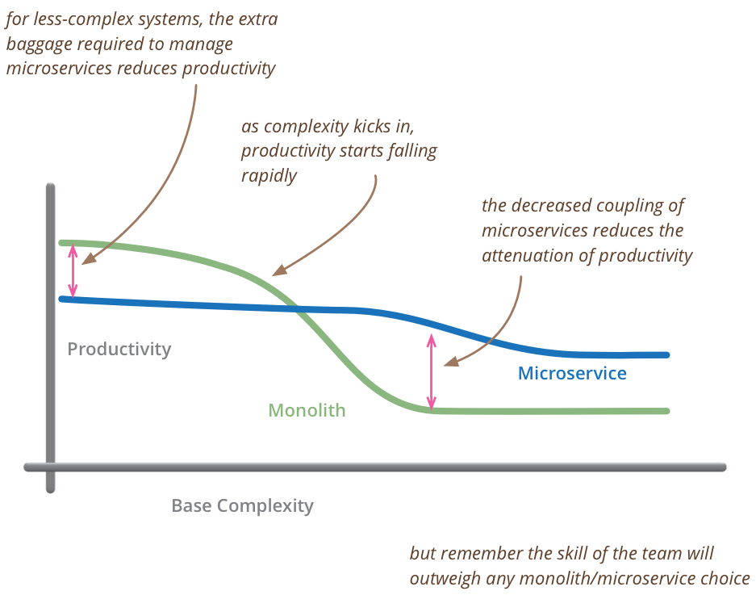

# Руководство по микросервисам

Путеводитель по материалам на martinfowler.com о микросервисах. Мартин Фаулер
21 авг 2019

Короче говоря, архитектурный стиль микросервисов — это подход к разработке 
отдельного приложения в виде **набора небольших сервисов**, каждый из которых 
**работает в своем собственном процессе** и взаимодействует, используя упрощенные 
механизмы, часто HTTP API ресурсов. Эти сервисы **строятся с учетом 
бизнес-возможностей** и могут быть **независимо развернуты** с помощью полностью 
автоматизированного механизма развертывания. Существует **минимум 
централизованного управления** этими сервисами, которые могут быть написаны на 
разных языках программирования и использовать разные технологии хранения данных.

— [Джеймс Льюис и Мартин Фаулер (2014)](https://martinfowler.com/articles/microservices.html)

В конце 2013 года, услышав все дискуссии в своих кругах о микросервисах, я 
забеспокоился, что нет четкого определения микросервисов (то, что создало 
много проблем для SOA). Так я встретился со своим коллегой Джеймсом Льюисом, 
который был одним из наиболее опытных практиков этого стиля. Вместе мы написали

статью, чтобы дать [четкое определение стиля микросервисов](https://martinfowler.com/articles/microservices.html), что мы и сделали, 
перечислив общие характеристики архитектур микросервисов, которые мы видели в 
реальных условиях.

* Разделение на компоненты с помощью сервисов;
* Организован вокруг бизнес-возможностей;
* Продукты, а не проекты;
* Умные конечные точки и тупые конвейеры;
* Децентрализованное управление;
* Децентрализованное управление данными;
* Автоматизация инфраструктуры;
* Проектирование с учётом отказов;
* Эволюционное проектирование.

Мы также рассмотрели распространенные вопросы, такие как «насколько большим может быть 
микросервис» и «в чем разница между микросервисами и сервис-ориентированной 
архитектурой». Статья усилила интерес к микросервисам.

«Использовать, не использовать?

…и что же это вообще такое?»

В своем коротком вступительном слове (~ 25 минут) я привожу наиболее важные 
определяющие характеристики, сравниваю микросервисы с монолитами и описываю 
жизненно важные вещи, которые нужно сделать перед запуском первой 
микросервисной системы.

***

## Когда следует использовать микросервисы?

У любого архитектурного стиля есть компромиссы: сильные и слабые стороны, 
которые мы должны оценивать в соответствии с используемым контекстом. Это, 
безусловно, относится к микросервисам. Хотя это полезная архитектура — во 
многих, даже в большинстве ситуаций, было бы лучше использовать монолит.

Микросервисы дают преимущества...

* Строгие границы модулей. Микросервисы укрепляют модульную структуру, что 
  особенно важно для больших команд.
* Независимое развертывание. Простые службы легче развертывать, и, поскольку 
  они автономны, с меньшей вероятностью вызовут системные сбои в случае сбоя.
* Разнообразие технологий: микросервисы позволяют использовать несколько 
  языков, сред разработки и технологий хранения данных.

...но за это приходится платить

* Распределенностью. Распределенные системы сложнее программировать, поскольку 
  удаленные вызовы выполняются медленно и всегда подвержены риску сбоя.
* Согласованность по событиям: поддерживать строгую согласованность чрезвычайно 
  сложно для распределенной системы, а это означает, что каждый должен обеспечивать 
  согласованностью по событиям.
* Операционная сложность: вам нужна опытная операционная команда для управления 
  множеством сервисов, которые регулярно повторно развёртываются.

(из [Компромиссов при использовании микросервисов](https://martinfowler.com/articles/microservice-trade-offs.html))

[Микросервис Премиум](https://martinfowler.com/bliki/MicroservicePremium.html)

[Архитектурный стиль микросервисов](https://martinfowler.com/articles/microservices.html) был горячо обсуждаемой темой в прошлом году.
На недавней конференции [O'Reilly по программной архитектуре](http://softwarearchitecturecon.com/sa2015) казалось, что на
каждой сессии говорили о микросервисах. Достаточно, чтобы эта тема была у всех
на слуху и все о ней говорили. Одним из последствий этого является то, что мы
видели команды, которые слишком стремились использовать микросервисы, не
понимая, что микросервисы создают сложность сами по себе. Это увеличивает
стоимость и риск проекта, что часто приводит к серьезным проблемам.

Мартин Фаулер 13 мая 2015

[Читать далее](https://martinfowler.com/bliki/MicroservicePremium.html)

[Микросервисы](https://martinfowler.com/tags/microservices.html)

***
[Сначала монолит](https://martinfowler.com/bliki/MonolithFirst.html)

Когда я слышал истории о командах, использующих [архитектуру микросервисов](https://martinfowler.com/articles/microservices.html), я
заметил общую закономерность.

1. Почти все успешные истории микросервисов начинались с монолита, который стал
   слишком большим и был разбит.
2. Почти во всех случаях, когда я слышал о системе, созданной как микросервисная
   система с нуля, она заканчивалась серьезными проблемами.

Это заставило многих моих коллег утверждать, что **вам не следует начинать
новый проект на микросервисах, даже если вы уверены, что ваше приложение
будет достаточно большим, чтобы оно того стоило**.

Мартин Фаулер 3 июня 2015

[Читать далее](https://martinfowler.com/bliki/MonolithFirst.html)

[Эволюционное проектирование](https://martinfowler.com/tags/evolutionary%20design.html)
[Микросервисы](https://martinfowler.com/tags/microservices.html)
***
[Не начинайте с монолита](https://martinfowler.com/articles/dont-start-monolith.html)

За последние несколько месяцев я неоднократно слышал, что единственный способ
создать успешную архитектуру микросервисов — начать с монолита. Перефразируя
Саймона Брауна: если вы не можете построить хорошо структурированный монолит,
почему вы думаете, что можете создать хорошо структурированный набор микросервисов?
Самое последнее — и, как обычно, очень убедительное — изложение этого аргумента
исходит от Мартина Фаулера на этом самом сайте. Поскольку у меня была возможность
прокомментировать более ранний черновик его статьи, у меня было время подумать
об этом. И я так и сделал, особенно потому, что я обычно соглашаюсь с ним, и
некоторые другие, чьи взгляды я обычно разделяю, похоже, тоже с ним согласны.

Я твердо убежден, что начинать с монолита обычно совершенно неправильно.

Стефан Тилков 9 июня 2015

[Читать далее](https://martinfowler.com/articles/dont-start-monolith.html)

[Микросервисы](https://martinfowler.com/tags/microservices.html)
***
[Требования к микросервису](https://martinfowler.com/bliki/MicroservicePrerequisites.html)

Когда я говорю с людьми об использовании [архитектурного стиля микросервисов](https://martinfowler.com/articles/microservices.html), я
слышу много оптимизма. Разработчикам нравится работать с небольшими модулями, и
они рассчитывают на лучшую модульность, чем в случае монолитов. Но, как и в
любом архитектурном решении, здесь есть компромиссы. В частности, микросервисы
имеют серьезные последствия для операций, которым теперь приходится работать с
экосистемой небольших сервисов, а не с одним четко определенным монолитом.
Следовательно, если у вас нет определенных базовых компетенций, вам не следует
использовать стиль микросервисов.

Мартин Фаулер 28 августа 2014

[Читать далее](https://martinfowler.com/bliki/MicroservicePrerequisites.html)

[Микросервисы](https://martinfowler.com/tags/microservices.html)

***
[Микросервисы и первый закон распределенных объектов](https://martinfowler.com/articles/distributed-objects-microservices.html)

В книге Шаблоны корпоративных приложений я сказал не «распределяйте
свои объекты». Противоречит ли этот совет моему интересу к микросервисам?

Мартин Фаулер 13 августа 2014

[Читать далее](https://martinfowler.com/articles/distributed-objects-microservices.html)

[ПРОЕКТИРОВАНИЕ API](https://martinfowler.com/tags/API%20design.html)
[МИКРОСЕРВИСЫ](https://martinfowler.com/tags/microservices.html)

***
[Интервью с Сэмом Ньюманом о микросервисах](https://gotopia.tech/bookclub/episodes/moving-to-microservices-with-sam-newman-and-martin-fowler)

goto Conferences попросили меня взять интервью у Сэма Ньюмана по поводу его книги
«От монолитов до микросервисов». Это превратилось в общий разговор о 
микросервисах и о том, когда их использовать. Сэм считает, что тремя основными 
причинами являются: возможность независимого развертывания, изоляция данных и 
отражение организационной структуры. Я более скептически отношусь к первому, но 
считаю данные и людей сложными частями разработки программного обеспечения.

Мартин Фаулер 4 сентября 2020

[Читать далее](https://gotopia.tech/bookclub/episodes/moving-to-microservices-with-sam-newman-and-martin-fowler)

[ИНТЕРВЬЮ](https://martinfowler.com/tags/interviews.html)
[МИКРОСЕРВИСЫ](https://martinfowler.com/tags/microservices.html)

***

## Создание микросервисов

Архитектуры микросервисов довольно новы, но мне повезло, что мы работали с 
ними в Thoughtworks с момента их появления. Для связного описания того, как 
лучше всего с ними работать, лучшим введением является книга Сэма Ньюмана 
«Создание микросервисов», которую он написал на основе нашего опыта и других 
опубликованных отчетов.

[Стратегии тестирования в микросервисной архитектуре](https://martinfowler.com/articles/microservice-testing)

За последние несколько лет в сервисных архитектурах произошел сдвиг в
сторону более мелких, более сфокусированных «микро» сервисов. У этого подхода
есть много преимуществ, таких как возможность независимого развертывания,
масштабирования и обслуживания каждого компонента и параллельная разработка
несколькими командами. Однако, как только это дополнительное сетевое разделение
будет введено, стратегии тестирования, которые применялись для работающих монолитных
приложений, должны быть пересмотрены. Здесь мы планируем обсудить ряд подходов к 
управлению дополнительной сложностью тестирования нескольких независимо 
развертываемых компонентов, а также то, как сделать так, чтобы тесты и приложение 
оставались правильными, несмотря на наличие нескольких команд, каждая из которых 
выступает в качестве обслуживающего персонала для разных сервисов.

Тоби Клемсон ПРЕЗЕНТАЦИЯ 18 ноября 2014

[Читать далее](https://martinfowler.com/articles/microservice-testing)

[ПОПУЛЯРНОЕ](https://martinfowler.com/tags/popular.html) 
[ТЕСТИРОВАНИЕ](https://martinfowler.com/tags/testing.html)
[МИКРОСЕРВИСЫ](https://martinfowler.com/tags/infodecks.html)
[ПРЕЗЕНТАЦИЯ](https://martinfowler.com/tags/microservices.html)

*** 

[Как разбить монолит на микросервисы](https://martinfowler.com/articles/break-monolith-into-microservices.html)

Поскольку монолитные системы становятся слишком большими, чтобы с ними можно
было работать, многие предприятия стремятся разбить их на архитектурный стиль
микросервисов. Это стоящая инициатива, но не легкое. Мы узнали, что для того,
чтобы сделать это хорошо, нам нужно начать с простого сервиса, а затем
расширить сервисы, основанные на вертикальных возможностях, важных для
бизнеса и подверженных частым изменениям. Сначала эти сервисы должны быть
большими и, желательно, не зависеть от остального монолита. Мы должны
гарантировать, что каждый шаг миграции представляет собой атомарное улучшение
общей архитектуры.

Жамак Дехгани Статья 24 апреля 2018

[Читать далее](https://martinfowler.com/articles/break-monolith-into-microservices.html)

[МИКРОСЕРВИСЫ](https://martinfowler.com/tags/microservices.html)
[РЕКОНСТРУКЦИЯ LEGACY](https://martinfowler.com/tags/legacy%20rehab.html)

***
[Микро фронтэнды](https://martinfowler.com/articles/micro-frontends.html)

***
[Как извлечь сервис, управляющий большим объёмом данных, из монолита](https://martinfowler.com/articles/extract-data-rich-service.html)

***
[Инфраструктура как код](https://martinfowler.com/bliki/InfrastructureAsCode.html)

Инфраструктура как код — это подход к определению вычислительной и сетевой
инфраструктуры с помощью исходного кода, который затем можно рассматривать как
любую программную систему. Такой код можно хранить в системе управления версиями,
чтобы обеспечить возможность аудита и [ReproducibleBuilds](https://martinfowler.com/bliki/ReproducibleBuild.html), подвергать
тестированию и полному циклу [ContinuousDelivery](https://martinfowler.com/bliki/ContinuousDelivery.html).
Это подход, который использовался в течение последнего десятилетия для работы с
получившими популярность платформами [облачных вычислений](https://martinfowler.com/bliki/CloudComputing.html) и станет основным способом управления
вычислительной инфраструктурой в следующем.

Мартин Фаулер  1 марта 2016

[Читать далее](https://martinfowler.com/bliki/InfrastructureAsCode.html)

[НЕПРЕРЫВНАЯ ДОСТАВКА](https://martinfowler.com/tags/continuous%20delivery.html)
[МИКРОСЕРВИСЫ](https://martinfowler.com/tags/microservices.html)

***

[Культура Devops](https://martinfowler.com/bliki/DevOpsCulture.html)

***

[Circuit Breaker](https://martinfowler.com/bliki/CircuitBreaker.html)