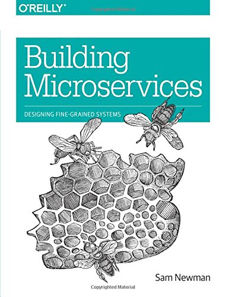

# Микросервисы

определение этого нового архитектурного термина

_Термин «микросервисная архитектура» появился в последние несколько лет для 
описания особого способа разработки программных приложений в виде наборов 
независимо развертываемых сервисов. Хотя точного определения этого 
архитектурного стиля не существует, существуют определенные общие характеристики 
организации, связанные с бизнес-возможностями, автоматизированным 
развертыванием, интеллектуальными возможностями конечных точек и
децентрализованным управлением языками и данными._

25 марта 2014

СОДЕРЖАНИЕ
Характеристики микросервисной архитектуры:
* Разделение на компоненты с помощью сервисов;
* Организован вокруг бизнес-возможностей;
* Продукты, а не проекты;
* Умные конечные точки и тупые конвейеры;
* Децентрализованное управление;
* Децентрализованное управление данными;
* Автоматизация инфраструктуры;
* Проектирование с учётом отказов;
* Эволюционное проектирование.
Будущее за микросервисами?
БОКОВЫЕ ПАНЕЛИ
* Насколько большим может быть микросервис?
* Микросервисы и SOA
* Много языков, много вариантов
* Стандарты, проверенные в бою, и обязательные стандарты
* Сделайте так, чтобы было легко поступать правильно
* Circuit breaker и готовый к продакшену код
* Синхронные вызовы считаются вредными

Джеймс Льюис

Джеймс Льюис — главный консультант Thoughtworks и член Консультативного совета 
по технологиям. Интерес Джеймса к созданию приложений из небольших сервисов 
для совместной работы исходит из опыта интеграции корпоративных систем в 
больших масштабах. Он создал ряд систем с использованием микросервисов и уже 
несколько лет является активным участником растущего сообщества.

Мартин Фаулер

Мартин Фаулер — автор, спикер и широко известный специалист по разработке 
программного обеспечения. Он долгое время был озадачен проблемой компоновки 
программных систем, поскольку слышал больше расплывчатых заявлений, чем хотел бы. 
Он надеется, что микросервисы оправдают надежды, которое возложили на них сторонники.

[Популярное](https://martinfowler.com/tags/popular.html)

[Архитектура приложения](https://martinfowler.com/tags/application%20architecture.html)

[Микросервисы](https://martinfowler.com/tags/microservices.html)

«Микросервисы» — еще один новый термин на многолюдных улицах архитектуры 
программного обеспечения. Хотя наша естественная склонность не обращать на 
такие вещи презрительного взгляда, эта часть терминологии описывает стиль 
программных систем, которые мы находим все более и более привлекательными. 
Мы видели, что за последние несколько лет этот стиль использовался во многих 
проектах, и пока результаты были положительными, настолько, что для многих 
наших коллег он стал стилем по умолчанию для создания корпоративных приложений. 
К сожалению, однако, не так много информации, которая описывает, что такое 
стиль микросервиса и как его реализовать.

Короче говоря, архитектурный стиль микросервисов [[1](https://martinfowler.com/articles/microservices.html#footnote-etymology)] — это 
подход к разработке отдельного приложения в виде набора небольших сервисов, каждый из 
которых работает в своем собственном процессе и взаимодействует с помощью облегченных 
механизмов, часто HTTP API ресурсов. Эти сервисы строятся с учетом 
бизнес-возможностей и могут быть независимо развернуты с помощью полностью 
автоматизированного механизма развертывания. Существует минимум централизованного 
управления этими сервисами, которые могут быть написаны на разных языках 
программирования и использовать разные технологии хранения данных.

Чтобы начать объяснение стиля микросервиса, полезно сравнить его с монолитным 
стилем: монолитным приложением, созданным как единое целое. Корпоративные 
приложения часто состоят из трех основных частей: пользовательский интерфейс 
на стороне клиента (состоящий из HTML-страниц и javascript, запущенных в 
браузере на компьютере пользователя), база данных (состоящая из множества 
таблиц, вставленных в общую и обычно реляционную СУБД) и серверное приложение.
Приложение на стороне сервера будет обрабатывать HTTP-запросы, содержать логику 
предметной области, извлекать и обновлять данные из базы данных, а также 
выбирать и заполнять представления HTML для отправки в браузер. Это серверное 
приложение представляет собой монолит — единый логический исполняемый файл [[2](https://martinfowler.com/articles/microservices.html#footnote-monolith)].
Любые изменения в системе предполагают создание и развертывание новой версии 
серверного приложения.

> В моем руководстве по микросервисам содержатся ссылки на лучшие статьи, видео,
> книги и подкасты о микросервисах.

Такой монолитный сервер — естественный подход к построению такой системы. Вся 
ваша логика обработки запроса выполняется в одном процессе, что позволяет вам 
использовать основные возможности вашего языка для разделения приложения на 
классы, функции и пространства имен. С некоторой осторожностью вы можете 
запускать и тестировать приложение на ноутбуке разработчика и использовать 
конвейер развертывания, чтобы убедиться, что изменения правильно протестированы 
и развернуты в продакшен среде. Вы можете горизонтально масштабировать монолит, 
запустив множество экземпляров за балансировщиком нагрузки.

Монолитные приложения могут быть успешными, но люди все больше разочаровываются 
в них, особенно по мере того, как все больше приложений развертывается в облаке.
Циклы изменений связаны друг с другом — изменение, внесенное в небольшую часть 
приложения, требует пересборки и развертывания всего монолита. Со временем 
часто становится трудно поддерживать хорошую модульную структуру, что 
затрудняет сохранение изменений, которые должны затрагивать только один модуль 
внутри этого модуля. Масштабирование требует масштабирования всего 
приложения, а не его частей, что требует больших ресурсов.

Рисунок 1 - Монолиты и микросервисы

Эти разочарования привели к созданию архитектурного стиля микросервисов: 
приложения создаются как наборы сервисов. Помимо того, что сервисы можно 
развертывать и масштабировать независимо друг от друга, каждый сервис также 
обеспечивает четкие границы модулей, даже позволяя писать разные сервисы на 
разных языках программирования. Ими также могут управлять разные команды.

Мы не утверждаем, что стиль микросервисов является новым или инновационным, 
его корни восходят, по крайней мере, к принципам проектирования Unix. Но мы 
думаем, что мало кто задумывается о микросервисной архитектуре и что для многих 
разработков программного обеспечения было бы лучше, если бы они ее использовали.

## Характеристики микросервисной архитектуры

Мы не можем сказать, что существует формальное определение архитектурного 
стиля микросервисов, но мы можем попытаться описать то, что мы считаем общими 
характеристиками для архитектур, соответствующих этому типу. Как и в любом 
определении, в котором излагаются общие характеристики, не все микросервисные 
архитектуры обладают всеми характеристиками, но мы ожидаем, что большинство 
микросервисных архитектур обладают большинством характеристик. Хотя мы, авторы, 
были активными членами этого довольно разрозненного сообщества, мы намерены 
попытаться описать то, что мы видим в нашей собственной работе и в аналогичных 
усилиях известных нам команд. В частности, мы не даем какого-то определения, 
которому нужно соответствовать.

### Разделение на компоненты с помощью сервисов

С тех пор, как мы были вовлечены в индустрию разработки программного 
обеспечения, у нас было желание создавать системы, соединяя компоненты, во 
многом так, как это происходит с вещами в физическом мире. За последние пару 
десятилетий мы наблюдаем значительный прогресс в создании больших сборников 
общих библиотек, которые являются частью большинства языковых платформ.

Говоря о компонентах, мы сталкиваемся со сложным определением того, что делает 
компонент. [Наше определение](https://martinfowler.com/bliki/SoftwareComponent.html) 
заключается в том, что **компонент** — это единица программного обеспечения, которая 
может быть независимо заменена и обновлена.

Архитектуры микросервисов будут использовать библиотеки, но их основной способ 
компоновки собственного программного обеспечения — разбиение на сервисы. Мы 
определяем библиотеки как компоненты, которые связаны с программой и вызываются 
с использованием вызовов функций в памяти, а сервисы — это внепроцессные 
компоненты, которые взаимодействуют с помощью такого механизма, как запрос 
веб-сервиса или удаленный вызов процедуры. (Это понятие отличается от понятия 
сервисного объекта во многих объектно-ориентированных программах [[3](https://martinfowler.com/articles/microservices.html#footnote-service-object)].)

Одна из основных причин использования сервисов в качестве компонентов (а не 
библиотек) заключается в том, что сервисы можно развертывать независимо. Если у 
вас есть приложение [[4](https://martinfowler.com/articles/microservices.html#footnote-application)], 
состоящее из нескольких библиотек в одном процессе, изменение любого отдельного 
компонента приводит к необходимости повторного развертывания всего приложения.
Но если это приложение разбито на несколько сервисов, вы можете ожидать, что 
множество изменений в отдельном сервисе потребуют повторного развертывания 
только этого сервиса. Это не всегда так, некоторые изменения изменят 
интерфейсы сервисов, что приведет к некоторой координации, но цель хорошей 
микросервисной архитектуры состоит в том, чтобы свести их к минимуму за счет 
согласованных границ сервисов и механизмов эволюции в контрактах сервисов.

Еще одним следствием использования сервисов в качестве компонентов является 
более явный интерфейс компонентов. Большинство языков не имеют хорошего 
механизма для определения явного [опубликованного интерфейса](https://martinfowler.com/bliki/PublishedInterface.html). Часто только 
документация и дисциплина не позволяют клиентам нарушать инкапсуляцию 
компонента, что приводит к чрезмерно тесной связанности между компонентами. 
Сервисы позволяют избежать этого, используя явные механизмы удаленного вызова.

Использование подобных сервисов имеет свои недостатки. Удаленные вызовы 
обходятся дороже, чем вызовы внутри процесса, поэтому удаленные API должны 
быть более детализированными, что зачастую неудобно в использовании. Если вам 
нужно изменить распределение обязанностей между компонентами, такие изменения в 
поведении сложнее сделать, когда вы пересекаете границы процесса.

В первом приближении мы можем наблюдать, что сервисы сопоставляются с 
процессами во время выполнения, но это только первое приближение. Сервисы могут 
состоять из нескольких процессов, которые всегда будут разрабатываться и 
развертываться вместе, например процесс приложения и база данных, используемая
только этим сервисом.

### Организован вокруг бизнес-возможностей

При попытке разделить большое приложение на части руководство часто 
сосредотачивается на технологическом уровне, выделяя команду отвечающую за
пользовательский интерфейс, логику на стороне сервера и базу данных. Когда 
команды разделены по этому принципу, даже простые изменения могут привести к 
тому, что межкомандный проект потребует времени и утверждения бюджета. Умная 
команда проведет оптимизацию вокруг этого и выберет меньшее из двух зол — 
просто внедрить логику в любое приложение, к которому у них есть доступ. Логика 
везде другими словами. Это пример закона Конвея[[5](https://martinfowler.com/articles/microservices.html#footnote-conwayslaw)] в действии.

> Любая организация, проектирующая систему (в широком смысле), 
> создаст проект, структура которого является копией коммуникационной 
> структуры организации.
> 
> -- Мелвин Конуэй, 1968 г.

Рисунок 2 - Закон Конвея в действии.

Микросервисный подход к разделению отличается: он разделяется на сервисы, 
организованные с учетом бизнес-возможностей. Такие сервисы предполагают широкое 
внедрение программного обеспечения для этой области бизнеса, включая 
пользовательский интерфейс, постоянное хранилище и любое внешнее сотрудничество.
Следовательно, команды являются кросс-функциональными, включая весь спектр 
навыков, необходимых для разработки: пользовательский опыт, базы данных и 
управление проектами.

Рисунок 3 - Границы сервисов, усиленные командными границами

Одна компания, организованная таким образом, называется [www.comparethemarket.com](http://www.comparethemarket.com/). 
Кросс-функциональные команды отвечают за создание и эксплуатацию каждого 
продукта, и каждый продукт разделен на ряд отдельных сервисов, 
взаимодействующих через шину сообщений.

Большие монолитные приложения всегда можно разделить на модули с учетом 
бизнес-возможностей, хотя это не является распространенным случаем. Конечно, 
мы бы призвали большую команду, создающую монолитное приложение, разделить 
себя по бизнес-направлениям. Основная проблема, которую мы здесь увидели, 
заключается в том, что они, как правило, организованы вокруг слишком большого 
количества контекстов. Если монолит охватывает многие из этих модульных 
границ, отдельным членам команды может быть трудно уместить их в свою 
кратковременную память. Кроме того, мы видим, что модульные линии требуют 
большой дисциплины для обеспечения соблюдения. Обязательно более явное 
разделение, требуемое сервисными компонентами, упрощает поддержание 
четкости границ команды.

> **Насколько большим может быть микросервис?**
> 
> Хотя «микросервис» стал популярным названием для этого архитектурного стиля, 
> его название приводит к неудачному акценту на размере сервиса и спорам о том,
> что подразумевает под собой «микро». В наших беседах с практиками микросервисов,
> мы видели разные размеры сервисов. Самые большие размеры, о которых 
> сообщается, соответствуют представлению Amazon о команде двух пицц (т. е. вся 
> команда может быть накормлена двумя пиццами), что означает не более дюжины 
> человек. В меньшем масштабе мы видели организации, в которых команда из 
> полдюжины поддерживала бы полдюжину сервисов.
>
> Это приводит к вопросу о том, существуют ли достаточно большие различия в 
> этом диапазоне размеров, чтобы не объединять системы, для 
> обслуживания которых требуется дюжина человек и обслуживаемых одним человеком,
> под одним названием "микросервис". На данный момент мы думаем, что лучше 
> сгруппировать их вместе, но вполне возможно, что мы изменим свое мнение по 
> мере дальнейшего изучения этого стиля.

### Продукты, а не проекты

Большинство усилий по разработке приложений сводится к использованию 
модель проекта: где цель состоит в том, чтобы создать некую часть программного 
обеспечения, которая затем считается завершенной. После завершения программное 
обеспечение передается обслуживающей организации, а создавшая его проектная 
группа расформировывается.

Сторонники микросервисов, как правило, избегают этой модели, предпочитая вместо 
этого представление о том, что команда должна владеть продуктом на протяжении 
всего его жизненного цикла. Общим источником вдохновения для этого является 
концепция Amazon «вы создаете, вы запускаете это», когда команда разработчиков 
берет на себя полную ответственность за программное обеспечение в продакшен.
Это дает разработчикам ежедневный контакт с тем, как их программное обеспечение 
ведет себя в продакшен среде, и расширяет контакт с их пользователями, 
поскольку им приходится брать на себя хотя бы часть бремени поддержки.

Менталитет продукта тесно связан с бизнес-возможностями. Вместо того, чтобы 
смотреть на программное обеспечение как на набор функций, которые необходимо 
завершить, существуют постоянные отношения, в которых вопрос заключается в 
том, как программное обеспечение может помочь своим пользователям улучшить 
бизнес-возможности.

Нет никаких причин, по которым этот же подход нельзя использовать с 
монолитными приложениями, но меньшая степень детализации сервисов может 
упростить создание личных отношений между разработчиками сервисов и их 
пользователями.

### Умные конечные точки и тупые конвейеры

При построении коммуникационных структур между различными процессами мы видели 
множество продуктов и подходов, которые подчеркивают необходимость вкладывать 
значительные средства в сам коммуникационный механизм. Хорошим примером этого 
является корпоративная сервисная шина (ESB), где продукты ESB часто включают в 
себя сложные средства для маршрутизации сообщений, хореографии, преобразования 
и применения бизнес-правил.

> **Микросервисы и SOA**
> 
> Когда мы говорим о микросервисах, часто возникает вопрос, не является ли это 
> просто сервисно-ориентированной архитектурой (SOA), которую мы видели десять 
> лет назад. В этом есть смысл, потому что стиль микросервисов очень похож на 
> тот, за который выступали некоторые сторонники SOA. Проблема, однако, в том, 
> что SOA означает [слишком много разных вещей](https://martinfowler.com/bliki/ServiceOrientedAmbiguity.html), и чаще всего, когда мы 
> сталкиваемся с чем-то, что называется «SOA», это значительно отличается от 
> стиля, который мы здесь описываем, обычно из-за акцента на ESB, используемых 
> для интеграции монолитных приложений.
>
> В частности, мы видели так много неудачных реализаций сервис-ориентированности — от 
> тенденции скрывать сложность в ESB [[6](https://martinfowler.com/articles/microservices.html#footnote-esb)] до неудачных многолетних 
> инициатив, стоящих миллионы и не приносящих никакой пользы, до моделей 
> централизованного управления, которые так активно препятствуют изменениям, что 
> иногда трудно преодолеть эти проблемы.
> 
> Конечно, многие методы, используемые в сообществе микросервисов, выросли из 
> опыта разработчиков, интегрирующих сервисы в крупные организации. Примером 
> этого является шаблон [толерантного читателя](https://martinfowler.com/bliki/TolerantReader.html). Усилия, связанные с использованием 
> Интернета, внесли свой вклад, применение простых протоколов — еще один 
> подход, основанный на этом опыте — это привело к отказу от главных 
> стандартов, которые достигли своей сложности, что, [честно говоря, захватывает дух](http://wiki.apache.org/ws/WebServiceSpecifications).
> (Каждый раз, когда вам нужна онтология для управления вашими онтологиями, 
> вы знаете, что у вас большие проблемы.)
> 
> Это распространенное проявление SOA привело к тому, что некоторые 
> сторонники микросервисов полностью отказались от термина SOA, хотя другие считают 
> микросервисы одной из форм SOA [[7](https://martinfowler.com/articles/microservices.html#footnote-fine-grained)], возможно, с _правильной ориентацией на 
> сервисы_. В любом случае тот факт, что SOA означает такие разные вещи, 
> означает, что полезно иметь термин, который более четко определяет этот 
> архитектурный стиль.

Микросервисное сообщество предпочитает альтернативный подход: умные конечные 
точки и тупые конвейеры. Приложения, построенные на основе микросервисов, 
стремятся быть как можно менее связанными и как можно более связными - в них 
содержится своя собственная логика предметной области и они работают скорее
как фильтры в классическом понимании Unix — получая запрос, применяя 
соответствующую логику и выдавая ответ. Они управляются с использованием 
простых протоколов RESTish, а не сложных протоколов, таких как WS-Choreography 
или BPEL, или оркестровки с помощью централизованного инструмента.

Чаще всего используются два протокола: HTTP-запрос-ответ API с ресурсами и 
легковесный обмен сообщениями [[8](https://martinfowler.com/articles/microservices.html#footnote-protobufs)]. Лучшим выражением для первого является

> Будьте в сети, а не за сетью
>
> -- [Ян Робинсон](https://www.amazon.com/gp/product/0596805829/ref=as_li_tl?ie=UTF8&camp=1789&creative=9325&creativeASIN=0596805829&linkCode=as2&tag=martinfowlerc-20)

Микросервисные команды используют принципы и протоколы, на которых построена 
всемирная паутина (и в значительной степени Unix). Часто используемые ресурсы 
могут быть кэшированы с очень небольшими усилиями со стороны разработчиков или 
специалистов по эксплуатации.

Второй широко используемый подход — обмен сообщениями по облегченной шине 
сообщений. Выбранная инфраструктура, как правило, "глупа" (не содержит логики,
поскольку действует только как маршрутизатор сообщений) — простые реализации, 
такие как RabbitMQ или ZeroMQ, не предоставляют ничего, кроме надежной 
асинхронной структуры — логика по-прежнему находится в конечных точках, которые
создают и принимают сообщения; в сервисах.

В монолите компоненты выполняются внутри процесса и связь между ними 
осуществляется посредством вызова метода или вызова функции. Самая большая 
проблема при превращении монолита в микросервисы заключается в изменении схемы 
взаимодействия. Наивное преобразование из вызовов методов в памяти в RPC 
приводит к бесперебойному общению, которое не работает должным образом. Вместо 
этого вам нужно заменить детализированную коммуникацию более общим подходом.

## Децентрализованное управление

Одним из последствий централизованного управления является тенденция к 
стандартизации на единых технологических платформах. Опыт показывает, что такой 
подход стеснен — не всякая проблема — гвоздь и не всякое решение — молоток. Мы 
предпочитаем использовать правильный инструмент для работы, и хотя монолитные 
приложения могут в определенной степени использовать преимущества разных 
языков, это не так распространено.

Разделив компоненты монолита на сервисы, у нас есть выбор при построении 
каждого из них. Вы хотите использовать Node.js для создания простой страницы 
отчетов? Действуй. C++ для особого компонента, работающего почти в реальном 
времени? Отлично. Вы хотите использовать другую разновидность базы данных, которая 
лучше подходит для чтения одного компонента? У нас есть технология, чтобы 
восстановить его.

Конечно, только потому, что вы можете что-то сделать, не означает, что вы 
должны это делать, но разделение вашей системы таким образом означает, что у 
вас есть выбор.

Команды, создающие микросервисы, также предпочитают другой подход к стандартам.
Вместо того, чтобы использовать набор определенных стандартов, записанных 
где-то на бумаге, они предпочитают идею создания полезных инструментов, 
которые другие разработчики могут использовать для решения проблем, подобных 
тем, с которыми они сталкиваются. Эти инструменты обычно собираются из 
реализаций и передаются более широкой группе, иногда, но не исключительно, с 
использованием внутренней модели с открытым исходным кодом. Теперь, когда 
Git и Github стали де-факто предпочтительными системами контроля версий, методы 
работы с открытым исходным кодом становятся все более и более распространенными 
внутри компании.

Netflix — хороший пример организации, которая следует этой философии. 
Совместное использование полезного и, прежде всего, проверенного в боевых 
условиях кода в качестве библиотек побуждает других разработчиков решать 
аналогичные проблемы аналогичными способами, но при этом оставляет дверь 
открытой для выбора другого подхода, если это необходимо. Общие библиотеки, 
как правило, сосредоточены на общих проблемах хранения данных, межпроцессного 
взаимодействия и, как мы обсудим ниже, на автоматизации инфраструктуры.

Для сообщества микросервисов накладные расходы особенно непривлекательны. Это 
не означает, что сообщество не ценит контракты на оказание услуг. Как раз 
наоборот, поскольку их, как правило, гораздо больше. Просто они ищут разные 
способы управления этими контрактами. Такие шаблоны, как [Tolerant Reader](https://martinfowler.com/bliki/TolerantReader.html) и 
[Consumer-Driven Contracts](https://martinfowler.com/articles/consumerDrivenContracts.html), часто 
применяются к микросервисам. Эти контракты на оказание помощи развиваются 
независимо. Выполнение контрактов, ориентированных на потребителя, как часть 
вашей сборки повышает уверенность и обеспечивает быструю обратную связь о том, 
работают ли ваши сервисы. Действительно, мы знаем о команде в Австралии, которая 
занимается созданием новых услуг с контрактами, ориентированными на потребителя. 
Они используют простые инструменты, которые позволяют им определить контракт на 
услугу. Это становится частью автоматизированной сборки еще до того, как будет 
написан код для нового сервиса. Затем сервис строится только до того момента, 
когда он удовлетворяет контракту — элегантный подход, позволяющий избежать дилеммы 
«YAGNI» [[9](https://martinfowler.com/articles/microservices.html#footnote-YAGNI)] 
при создании нового программного обеспечения. Эти методы и инструментарий, 
развивающийся вокруг них, ограничивают потребность в централизованном управлении 
контрактами, уменьшая временную связь между сервисами.

> **Много языков, много вариантов**
>
> Рост JVM как платформы — это лишь последний пример смешения языков в рамках 
> общей платформы. На протяжении десятилетий было обычной практикой использовать 
> язык более высокого уровня, чтобы воспользоваться преимуществами абстракций 
> более высокого уровня. Как и опускаться до железа и писать код, чувствительный 
> к производительности, на более низком уровне. Однако многие монолиты не нуждаются 
> в таком уровне оптимизации производительности, как и DSL и абстракции более 
> высокого уровня (к нашему разочарованию). Вместо этого монолиты обычно 
> представляют собой один язык, и существует тенденция к ограничению количества 
> используемых технологий [[10](https://martinfowler.com/articles/microservices.html#footnote-many-languages)].

Возможно, апогеем децентрализованного управления является принцип «создай и 
управляй», популяризированный Amazon. Команды несут ответственность за все 
аспекты программного обеспечения, которое они создают, включая эксплуатацию 
программного обеспечения в режиме 24/7. Передача этого уровня ответственности 
определенно не является нормой, но мы видим, что все больше и больше компаний 
перекладывают ответственность на команды разработчиков. Netflix — еще одна 
организация, принявшая этот принцип [[11](https://martinfowler.com/articles/microservices.html#footnote-netflix-flowcon)]. 
Просыпаться каждую ночь в 3 часа ночи из-за вашего пейджера, безусловно, является 
мощным стимулом для того, чтобы сосредоточиться на качестве при написании кода. 
Эти идеи настолько далеки от традиционной модели централизованного управления, 
насколько это возможно.

## Децентрализованное управление данными

Децентрализация управления данными представлена несколькими способами. На 
самом абстрактном уровне это означает, что концептуальная модель мира будет 
различаться между системами. Это распространенная проблема при интеграции в 
крупном предприятии: представление клиента о продажах будет отличаться от 
представления поддержки. Некоторые вещи, которые называются клиентами в 
представлении продаж, могут вообще не отображаться для поддержки. 
Те, которые отображаются, могут иметь разные атрибуты и (что еще хуже) общие атрибуты 
с немного отличающейся семантикой.

Эта проблема распространена между приложениями, но также может возникать внутри 
приложений, особенно когда это приложение разделено на отдельные компоненты. 
Полезным способом обдумывания этого является понятие [ограниченного контекста](https://martinfowler.com/bliki/BoundedContext.html) в 
предметно-ориентированном проектировании. DDD делит сложный домен на несколько ограниченных 
контекстов и отображает отношения между ними. Этот процесс полезен как для 
монолитных, так и для микросервисных архитектур, но существует естественная 
корреляция между границами сервиса и контекста, которая помогает прояснить и, 
как мы опишем в разделе о бизнес-возможностях, усилить разделение.

Помимо децентрализации решений о концептуальных моделях, микросервисы также 
децентрализуют решения о хранении данных. В то время как монолитные приложения 
предпочитают единую логическую базу данных для постоянных данных, предприятия 
часто предпочитают единую базу данных для целого ряда приложений — многие из 
этих решений основаны на коммерческих моделях поставщиков, связанных с 
лицензированием. Микросервисы предпочитают, чтобы каждый сервис управлял своей 
собственной базой данных, либо разными экземплярами одной и той же баз данных, 
либо совершенно разными системами баз данных — подход, называемый 
[Polyglot Persistence](https://martinfowler.com/bliki/PolyglotPersistence.html). Вы 
можете использовать Polyglot Persistence в монолите, но оно чаще встречается 
в микросервисах.

> **Стандарты, проверенные в бою, и обязательные стандарты**
> 
> В некотором смысле происходит противопоставление двух концепций заключающаяся 
> в том, что команды микросервисов склонны избегать жестких стандартов, 
> установленных группами на предприятии, отвечающими за архитектуру, но с радостью 
> используют и даже проповедуют использование открытых стандартов, таких как 
> HTTP, ATOM и другие микроформаты.
> 
> Основное различие заключается в том, как разрабатываются стандарты и как они 
> применяются. Стандарты, управляемые такими группами, как IETF, становятся 
> стандартами только тогда, когда в мире существует несколько их реальных 
> реализаций, которые часто вырастают из успешных проектов с открытым исходным 
> кодом.
> 
> Эти стандарты представляют собой мир, отличный от многих в корпоративном 
> мире, которые часто разрабатываются группами, имеющими небольшой 
> недавний опыт программирования или находятся под чрезмерным влиянием 
> поставщиков.

Децентрализация ответственности, связанной с данными, между микросервисами влияет на 
осуществление обновлений. Общий подход к работе с обновлениями заключался в 
использовании транзакций, чтобы гарантировать согласованность при обновлении 
нескольких ресурсов. Этот подход часто используется в монолитах.

Использование подобных транзакций помогает обеспечить согласованность, но 
создает значительную временную связанность, что проблематично для нескольких 
сервисов. Общеизвестно, что распределенные транзакции сложны в реализации, и, 
как следствие, микросервисные архитектуры [подчеркивают важность координации 
между сервисами без транзакций](http://www.eaipatterns.com/ramblings/18_starbucks.html) с 
явным признанием того, что согласованность может быть только согласованностью 
по событиям, а проблемы решаются с помощью компенсирующих операций.

Выбор способа управления несоответствиями является новой проблемой для многих 
групп разработчиков, но он часто соответствует деловой практике. Часто 
предприятия справляются с определенной степенью несогласованности, чтобы быстро 
реагировать на требование, и в то же время имеют какой-то обратный процесс для 
устранения ошибок. Компромисс оправдан до тех пор, пока стоимость исправления 
ошибок меньше, чем потерянная прибыль бизнеса при большей согласованности.

## Автоматизация инфраструктуры

Методы автоматизации инфраструктуры претерпели огромные изменения за последние 
несколько лет — эволюция облака и, в частности, AWS снизила операционную 
сложность создания, развертывания и эксплуатации микросервисов.

Многие продукты или системы, создаваемые с помощью микросервисов, создаются 
командами, имеющими большой опыт работы с [Непрерывной Доставкой](https://martinfowler.com/bliki/ContinuousDelivery.html) и её 
предшественником, [Непрерывной Интеграцией](https://martinfowler.com/articles/continuousIntegration.html). Команды, создающие программное 
обеспечение таким образом, широко используют методы автоматизации инфраструктуры. 
Это показано в конвейере сборки, показанном ниже.

Рисунок 5 - Базовый конвейер сборки

Поскольку это не статья о Непрерывной Доставке, мы обратим внимание лишь на пару 
ключевых особенностей. Нам нужна максимальная уверенность в том, что наше 
программное обеспечение работает, поэтому мы проводим множество **автоматических 
тестов**. Продвижение работающего программного обеспечения "вверх" по конвейеру 
означает, что мы **автоматизируем развертывание** в каждой новой среде.

Монолитное приложение будет создано, протестировано и успешно запущено в этих 
средах. Оказывается, как только вы вложили средства в автоматизацию пути к 
производству монолита, развертывание _большего_ количества приложений уже не 
кажется таким страшным. Помните, что одна из целей CD — сделать развертывание 
рутинным, так что одно это приложение или три, пока это все еще рутинно, не имеет 
значения [[12](https://martinfowler.com/articles/microservices.html#footnote-trickycd)].

Еще одна область, в которой мы видим, что команды используют обширную автоматизацию 
инфраструктуры, — это управление микросервисами в продакшен среде. В 
отличие от нашего утверждения выше о том, что пока развертывание рутинно, между 
монолитами и микросервисами не так уж много различий, операционная среда для 
каждого из них может быть разительно отличаться.

> **Сделайте так, чтобы было легко поступать правильно**
> 
> Мы обнаружили один побочный эффект повышенной автоматизации в результате 
> непрерывной доставки и развертывания — создание полезных инструментов, 
> помогающих разработчикам и операционистам. Инструменты для создания 
> имитаций, управления базами кода, установки простых сервисов или добавления 
> стандартного мониторинга и логирования сейчас довольно распространены. Лучшим 
> примером в Интернете, вероятно, является [набор инструментов с открытым исходным 
> кодом от Netflix](http://netflix.github.io/), но есть и другие, включая 
> [Dropwizard](http://dropwizard.codahale.com/), которые мы широко использовали.

Рисунок 6 - Развертывание модулей часто отличается от монолита.

## Проектирование с учётом отказов

Следствием использования сервисов в качестве компонентов является то, что 
приложения должны быть спроектированы так, чтобы они могли выдерживать сбои 
сервисов. Любой сервисный вызов может потерпеть неудачу из-за недоступности 
поставщика, клиент должен отреагировать на это как можно устойчивее. Это 
недостаток по сравнению с монолитной конструкцией, так как это создает 
дополнительную сложность в обращении с ней. Следствием этого является то, что 
команды микросервисов постоянно размышляют о том, как сбои сервисов влияют на 
работу пользователей. [Simian Army](https://github.com/Netflix/SimianArmy) от Netflix 
вызывает сбои сервисов и даже центров обработки данных в течение рабочего дня, 
чтобы проверить как устойчивость приложения, так и мониторинг.

Такого автоматизированного тестирования в продакшен среде было бы 
достаточно, чтобы вызвать у большинства оперативных групп дрожь, обычно 
предшествующую выходной неделе. Это не означает, что монолитные архитектурные 
стили не подходят для сложных настроек мониторинга — просто по нашему опыту 
это встречается реже.

> **Circuit breaker и готовый к продакшену код**
> 
> [Circuit breaker](https://martinfowler.com/bliki/CircuitBreaker.html) описывается в статье [Release it!](https://www.amazon.com/gp/product/B00A32NXZO/ref=as_li_tl?ie=UTF8&camp=1789&creative=9325&creativeASIN=B00A32NXZO&linkCode=as2&tag=martinfowlerc-20)
> вместе с другими шаблонами, такими как Bulkhead и Timeout. Реализованные 
> вместе, эти шаблоны имеют решающее значение при создании взаимодействующих
> приложений. Эта [статья в блоге Netflix](http://techblog.netflix.com/2012/02/fault-tolerance-in-high-volume.html) 
> отлично объясняет их применение. 

Поскольку сервисы могут выйти из строя в любое время, важно иметь возможность 
быстро обнаруживать сбои и, если возможно, автоматически восстанавливать сервис.
Микросервисные приложения уделяют большое внимание мониторингу приложения в 
режиме реального времени, проверяя как архитектурные элементы (сколько запросов 
в секунду получает база данных), так и важные для бизнеса показатели (например, 
сколько заказов поступает в минуту). Семантический мониторинг может являться 
системой раннего предупреждения о том, что что-то пойдет не так, что побудит 
команды разработчиков принять меры и провести расследование.

Это особенно важно для архитектуры микросервисов, поскольку предпочтельная для
микросервисов хореография и совместной работе приводит к неожиданно 
проявляющемуся поведению. В то время как многие ученые мужи восхваляют ценность 
случайного появления, правда в том, что возникающее поведение иногда может быть 
плохим. Мониторинг жизненно важен для быстрого обнаружения плохого
неожиданно проявившегося поведения, чтобы его можно было исправить.

Монолиты могут быть такими же прозрачными, как микросервисы — на самом деле 
так и должно быть. Разница в том, что вам абсолютно необходимо знать, 
когда сервисы, работающие в разных процессах, отключены. С библиотеками внутри 
одного и того же процесса такая прозрачность вряд ли будет полезна.

Команды, занимающиеся микросервисами, ожидают увидеть сложные настройки 
мониторинга и логирования для каждой отдельного сервиса, такие как информационные 
панели, отображающие статус включения/выключения, а также различные операционные 
и бизнес-показатели. Подробная информация о состоянии circuit breaker текущей 
пропускной способности и задержке — это другие примеры, с которыми мы часто 
сталкиваемся в реальном мире.

> Синхронные вызовы считаются вредными
> 
> Каждый раз, когда у вас существует несколько синхронных вызовов между 
> сервисами, вы столкнетесь с мультипликативным эффектом простоя. Проще говоря, 
> это когда время простоя вашей системы становится произведением времени 
> простоя отдельных компонентов. Вы сталкиваетесь с выбором: сделать ваши 
> вызовы асинхронными или управлять временем простоя. На сайте www.guardian.co.uk 
> они реализовали на новой платформе простое правило — один синхронный вызов 
> на запрос пользователя, в то время как в Netflix редизайн их API платформы 
> встроил асинхронность в структуру API.

## Эволюционное проектирование

Практики микросервисов, как правило, имеют опыт эволюционного проектирования и 
рассматривают декомпозицию сервисов как дополнительный инструмент, позволяющий 
разработчикам приложений контролировать изменения в своих приложениях, не 
замедляя их. Контроль за изменениями необязательно означает сокращение 
изменений — при правильном отношении и инструментах вы можете вносить частые, 
быстрые и хорошо контролируемые изменения в программное обеспечение.

Всякий раз, когда вы пытаетесь разбить программную систему на компоненты, вы 
сталкиваетесь с решением о том, как разделить части — по каким принципам мы 
решаем разделить наше приложение? Ключевым свойством компонента является 
понятие независимой замены и возможности обновления [[13](https://martinfowler.com/articles/microservices.html#footnote-RCA)], что означает, что 
мы ищем точки, в которых мы можем реализовать переписывание компонента, не 
затрагивая соседние. Действительно, многие микросервисные команды идут дальше, 
явно ожидая, что многие сервисы будут упразднены, а не будут развиваться в 
долгосрочной перспективе.

Веб-сайт Guardian является хорошим примером приложения, которое было 
спроектировано и построено как монолит, но развивалось в направлении 
микросервисов. Монолит по-прежнему является ядром веб-сайта, но они предпочитают 
добавлять новые функции, создавая микросервисы, использующие API-интерфейс 
монолита. Этот подход особенно удобен для функций, которые по своей сути 
являются временными, например, специализированные страницы для обработки 
спортивных событий. Такая часть веб-сайта может быть быстро создана с 
использованием языков быстрой разработки и удалена после завершения мероприятия.
Мы видели похожие подходы в финансовом учреждении, где новые услуги добавляются 
из-за рыночных потребностей и отбрасываются через несколько месяцев или даже 
недель.

Этот акцент на заменяемость является частным случаем более общего принципа 
модульного проектирования, который заключается в обеспечении модульности 
посредством шаблона изменений [[14](https://martinfowler.com/articles/microservices.html#footnote-beck-rate-of-change)].
Вы хотите, чтобы вещи, которые изменяются одновременно, находились в одном и 
том же модуле. Части системы, которые редко изменяются, должны находиться в 
разных сервисах, а не в тех, которые в настоящее время подвергаются большому 
количеству изменений. Если вы обнаружите, что постоянно меняете два сервиса 
вместе, это признак того, что их следует объединить.

Включение компонентов в сервисы дает возможность более детального планирования 
релизов. В монолите любые изменения требуют полной сборки и развертывания всего 
приложения. Однако с микросервисами вам нужно только повторно развернуть те 
сервисы, которые вы изменили. Это может упростить и ускорить процесс релиза.
Недостатком является то, что вам придется беспокоиться об изменениях в одном 
сервисе, которые нарушат работу его потребителей. Традиционный подход к 
интеграции состоит в том, чтобы попытаться решить эту проблему с помощью 
управления версиями, но в мире микросервисов предпочтение отдается [использованию 
версий только в крайнем случае](https://martinfowler.com/articles/enterpriseREST.html#versioning). Мы можем избежать большого количества версий, 
разрабатывая сервисы так, чтобы они были максимально терпимы к изменениям в их 
поставщиках информации.

***

## Будущее за микросервисами?

Наша главная цель при написании этой статьи — объяснить основные идеи и принципы 
микросервисов. Потратив на это время, мы ясно полагаем, что архитектурный стиль 
микросервисов является важной идеей, заслуживающей серьезного внимания 
применительно к корпоративным приложениям. Недавно мы создали несколько 
систем, используя этот стиль, и знаем других, которые использовали и 
поддерживают этот подход.

> Компромиссы микросервисов
> 
> 
> 
> Многие группы разработчиков пришли к выводу, что архитектурный стиль 
> микросервисов является лучшим подходом по сравнению с монолитной архитектурой. 
> Но другие команды обнаружили, что они снижают производительность. Как и любой 
> архитектурный стиль, микросервисы приносят свои недостатки и преимущества. 
> Чтобы сделать разумный выбор, вы должны понять их и применить к своему 
> конкретному контексту.
> 
> Мартин Фаулер, статья от 1 июля 2015, тег Микросервисы
> 
> [Читать далее](https://martinfowler.com/articles/microservice-trade-offs.html)

Те о ком мы знаем, являются в какой-то степени первооткрывателем архитектурного 
стиля, включая Amazon, Netflix, [The Guardian](http://www.theguardian.com/), [Государственную цифровую службу 
Великобритании](https://gds.blog.gov.uk/), [realestate.com.au](https://martinfowler.com/articles/realestate.com.au), 
Forward и [comparethemarket.com](http://www.comparethemarket.com/). Конференция 2013 года была полна примеров компаний, 
которые переходят на что-то, что можно было бы классифицировать как микросервисы, 
включая Travis CI. Кроме того, существует множество организаций, которые уже давно 
занимаются тем, что мы бы назвали микросервисами, но никогда не использовали это 
название. (Часто это обозначается как SOA, хотя, как мы уже говорили, SOA 
существует во многих противоречивых формах. [[15](https://martinfowler.com/articles/microservices.html#footnote-already))])

Однако, несмотря на этот положительный опыт, мы не утверждаем, что уверены в 
том, что микросервисы — это будущее направление для программных архитектур.
Хотя наш опыт до сих пор был положительным по сравнению с монолитными 
приложениями, мы осознаем тот факт, что прошло недостаточно времени, чтобы мы
могли сделать окончательное вывод.

Часто истинные последствия ваших архитектурных решений становятся очевидными 
только через несколько лет после того, как вы их приняли. Мы видели проекты, в 
которых хорошая команда с сильным стремлением к модульности построила 
монолитную архитектуру, с годами разрушившуюся. Многие люди считают, что такой 
распад менее вероятен с микросервисами, поскольку границы сервисов являются 
явными и их трудно обойти. Тем не менее, пока мы не увидим достаточное 
количество систем, работающих длительное время, мы не сможем по-настоящему оценить, 
насколько развиты микросервисные архитектуры.

Конечно, существуют причины, по которым можно ожидать, что микросервисы ни к чему
не приведут. При любой попытке разбиения на компоненты успех зависит от того, 
насколько хорошо программное обеспечение вписывается в компоненты. Трудно точно 
определить, где должны находиться границы компонентов. Эволюционный дизайн признает 
трудности правильного определения границ и, следовательно, важность легкости их 
рефакторинга. Но когда ваши компоненты — это сервисы с удаленным взаимодействием,
то рефакторинг намного сложнее, чем с внутрипроцессными библиотеками. Перемещение 
кода через границы сервисов затруднено, любые изменения интерфейса необходимо 
согласовывать между участниками, необходимо добавлять уровни обратной 
совместимости и усложнять тестирование.

> 
> 
> Наш коллега Сэм Ньюман провел большую часть 2014 года, работая над книгой, в 
> которой описан наш опыт создания микросервисов. Она должна стать вашим 
> следующим шагом, если вы хотите глубже погрузиться в тему.

Другая проблема заключается в том, что если компоненты компонуются нечетко, 
то все, что вы делаете, — это перенос сложности изнутри компонента на связи 
между компонентами. Это не только перемещает сложность, но и перемещает ее в 
менее явное и трудно контролируемое место. Легко думать, что дела обстоят лучше, 
когда вы смотрите на внутреннюю часть небольшого простого компонента, не замечая 
запутанных связей между сервисами.

Наконец, существует фактор уровня команды. Новые методики, как правило, 
используются более опытными командами. Но метод, который более эффективен для 
более опытной команды, необязательно будет работать для менее опытных команд.
Мы видели множество случаев, когда менее квалифицированные команды создавали 
беспорядочные монолитные архитектуры, но нужно время, чтобы увидеть, что 
происходит, когда такой беспорядок возникает с микросервисами. Плохая команда 
всегда будет создавать плохую систему — очень трудно сказать, уменьшат ли 
микросервисы беспорядок в этом случае или усугубят его.

Один разумный аргумент, который мы слышали, заключается в том, что вам не 
следует начинать с архитектуры микросервисов. Вместо этого [начните с монолита](https://martinfowler.com/bliki/MonolithFirst.html), 
сохраните его модульность и разделите на микросервисы, как только монолит 
станет проблемой. (Хотя [этот совет не идеален](https://martinfowler.com/articles/dont-start-monolith.html), поскольку хороший
внутрипроцессный интерфейс обычно не является хорошим сервисным интерфейсом.)

Поэтому мы пишем это с осторожным оптимизмом. До сих пор мы видели достаточно 
связанного с архитектурным стилем микросервисов, чтобы почувствовать, что это 
может быть [достойным шагом](https://martinfowler.com/microservices/). Мы не можем точно сказать, к чему мы прийдём, но 
одна из проблем разработки программного обеспечения заключается в том, что 
вы можете принимать решения только на основе неполной информации, которая 
у вас есть в настоящее время.

***

Сноски

1: Термин «микросервис» обсуждался на семинаре архитекторов программного 
обеспечения недалеко от Венеции в мае 2011 года, чтобы описать то, что 
участники считали общим архитектурным стилем, который многие из них недавно 
изучали. В мае 2012 года та же группа выбрала «микросервисы» как наиболее 
подходящее название. Джеймс представил некоторые из этих идей в качестве 
тематического исследования в марте 2012 года на 33-й конференции в Кракове
[«Микросервисы — Java, путь Unix»](http://2012.33degree.org/talk/show/67), как и 
Фред Джордж [примерно в то же время](http://www.slideshare.net/fredgeorge/micro-service-architecure).
Адриан Кокрофт из Netflix, описывая этот подход как «мелкозернистый SOA», был 
первопроходцем в веб, как и многие другие, упомянутые в этой статье — Джо 
Уолнес, Дэниел Терхорст-Норт, Эван Ботчер и Грэм Тэкли.

2: Термин монолит уже некоторое время используется сообществом Unix. В 
«Искусстве программирования Unix» оно появляется для описания систем, которые 
становятся слишком большими.

3: Многие объектно-ориентированные проектировщики, в том числе и мы, используют 
термин «сервисный объект» в смысле [предметно-ориентированного проектирования](https://www.amazon.com/gp/product/0321125215/ref=as_li_tl?ie=UTF8&camp=1789&creative=9325&creativeASIN=0321125215&linkCode=as2&tag=martinfowlerc-20) 
для объекта, который выполняет важный процесс, не привязанный к какой-либо 
сущности. Это понятие отличается от того, как мы используем «сервис» в этой 
статье. К сожалению, термин «услуга» имеет оба значения, и нам приходится жить 
с полисемой.

4: Мы рассматриваем [приложение как социальную конструкцию](https://martinfowler.com/bliki/ApplicationBoundary.html), которая связывает 
воедино кодовую базу, группу функций и объем финансирования.

5: Оригинал статьи можно найти на веб-сайте Мелвина Конвея [здесь](http://www.melconway.com/Home/Committees_Paper.html).

6: Мы не можем не упомянуть утверждение Джима Уэббера о том, что ESB означает 
[«Коробка спагетти с ошибками»](http://www.infoq.com/presentations/soa-without-esb).

7: Netflix делает ссылку явной — до недавнего времени называя свой 
архитектурный стиль тонкоструктурной SOA.

8: В крайних случаях организации часто переходят на бинарные протоколы — 
например, [protobuf](https://code.google.com/p/protobuf/). Системы, использующие их, по-прежнему демонстрируют 
характеристики интеллектуальных конечных точек, «тупых конвейеров» — и жертвуют 
прозрачностью ради масштаба. Большинству веб-ресурсов и, конечно же, 
подавляющему большинству предприятий не нужно идти на этот компромисс — 
прозрачность может стать большим преимуществом.

9: «YAGNI» или «Вам это не понадобится» — это [принцип экстремального программирования](http://c2.com/cgi/wiki?YouArentGonnaNeedIt) 
и призыв не добавлять функции, пока вы не узнаете, что они вам нужны.

10: Немного неискренне с нашей стороны утверждать, что монолиты — это один язык — 
чтобы создавать системы в современной сети, вам, вероятно, необходимо знать 
JavaScript и XHTML, CSS, выбранный вами серверный язык, SQL и диалект ORM. Вряд ли 
это один язык, но вы знаете, что мы имеем в виду.

11: Адриан Кокрофт особо упоминает «самообслуживание разработчиков» и 
«Разработчики управляют тем, что они написали» (так в оригинале) в этой 
[превосходной презентации](http://www.slideshare.net/adrianco/flowcon-added-to-for-cmg-keynote-talk-on-how-speed-wins-and-how-netflix-is-doing-continuous-delivery), 
представленной на Flowcon в ноябре 2013 года.

12: Здесь мы немного лукавим. Очевидно, что развертывание большего количества 
сервисов в более сложных топологиях сложнее, чем развертывание одного монолита. 
К счастью, шаблоны уменьшают эту сложность, хотя инвестиции в инструменты 
по-прежнему необходимы.

13: На самом деле Даниэль Терхорст-Норт называет этот стиль архитектурой 
сменных компонентов, а не микросервисами. Поскольку это, кажется, говорит о 
подмножестве характеристик, мы предпочитаем последнее.

14: Кент Бек выделяет это как один из своих принципов проектирования в 
[«Шаблонах реализации»](https://www.amazon.com/gp/product/0321413091/ref=as_li_tl?ie=UTF8&camp=1789&creative=9325&creativeASIN=0321413091&linkCode=as2&tag=martinfowlerc-20).

15: И вряд ли SOA является корнем этой истории. Я помню, как люди говорили: 
«Мы занимаемся этим годами», когда в начале века появился термин SOA.
Одним из аргументов было то, что этот стиль видит свои корни в том, как 
программы COBOL обменивались данными через файлы данных в первые дни 
корпоративных вычислений. С другой стороны, можно утверждать, что микросервисы — это 
то же самое, что и модель программирования Erlang, но применительно к контексту 
корпоративного приложения.

## Использованная литература

Хотя это не исчерпывающий список, существует ряд источников, из которых 
практики черпали вдохновение или которые придерживаются философии, сходной 
с той, что описана в этой статье.

Блоги и онлайн-статьи

* Блог Клеменса Вастерса об облаке в Microsoft
* Введение Дэвида Моргантини в тему в его блоге
* 12 факторов приложений от Heroku
* Принципы проектирования государственных цифровых услуг Великобритании
* Блог Джимми Нильссона и статья на infoq о Cloud Chunk Computing
* Алистер Кокберн о гексагональных архитектурах

Книги

* [Release it](https://www.amazon.com/gp/product/0978739213/ref=as_li_tl?ie=UTF8&camp=1789&creative=9325&creativeASIN=0978739213&linkCode=as2&tag=martinfowlerc-20)
* [Rest на практике](https://www.amazon.com/gp/product/0596805829/ref=as_li_tl?ie=UTF8&camp=1789&creative=9325&creativeASIN=0596805829&linkCode=as2&tag=martinfowlerc-20)
* [Проектирование веб API (бесплатная электронная книга)](https://pages.apigee.com/web-api-design-ebook.html). Брайан Маллой, Apigee.
* [Шаблоны корпоративной интеграции](https://www.amazon.com/gp/product/0321200683/ref=as_li_tl?ie=UTF8&camp=1789&creative=9325&creativeASIN=0321200683&linkCode=as2&tag=martinfowlerc-20)
* [Искусство программирования для Unix](https://www.amazon.com/gp/product/0131429019/ref=as_li_tl?ie=UTF8&camp=1789&creative=9325&creativeASIN=0131429019&linkCode=as2&tag=martinfowlerc-20)
* [Развитие объектно-ориентированного программного обеспечения на основе тестов](https://www.amazon.com/gp/product/0321503627/ref=as_li_tl?ie=UTF8&camp=1789&creative=9325&creativeASIN=0321503627&linkCode=as2&tag=martinfowlerc-20)
* [Современная фирма: организационный дизайн для повышения производительности и роста](https://www.amazon.com/gp/product/0198293755/ref=as_li_tl?ie=UTF8&camp=1789&creative=9325&creativeASIN=0198293755&linkCode=as2&tag=martinfowlerc-20)
* [Непрерывная доставка: надежные релизы программного обеспечения благодаря автоматизации сборки, тестирования и развертывания](https://www.amazon.com/gp/product/0321601912/ref=as_li_tl?ie=UTF8&camp=1789&creative=9325&creativeASIN=0321601912&linkCode=as2&tag=martinfowlerc-20)
* [Предметно-ориентированное проектирование (DDD): структуризация сложных программных систем](https://www.amazon.com/gp/product/0321125215/ref=as_li_tl?ie=UTF8&camp=1789&creative=9325&creativeASIN=0321125215&linkCode=as2&tag=martinfowlerc-20)

Презентации

* [Архитектура без архитекторов](https://www.youtube.com/watch?v=qVyt3qQ_7TA). Эрик Дерненбург.
* [Мой автобус выглядит большим в этом?](http://www.infoq.com/presentations/soa-without-esb) Джим Уэббер и Мартин Фаулер, QCon 2008.
* [Партизанская СОА](http://www.infoq.com/presentations/webber-guerilla-soa). Джим Уэббер, 2006 г.
* [Шаблоны эффективной доставки](http://vimeo.com/43659070). Дэниел Терхорст-Норт, 2011 г.
* [Слайд-канал Адриана Кокрофта](http://www.slideshare.net/adrianco).
* [Гидры и Гипермедиа](http://vimeo.com/28608667). Ян Робинсон, JavaZone 2010.
* [Правосудию предстоит миллион замысловатых ходов](https://martinfowler.com/articles/microservices.html). Леонард Ричардсон, Qcon 2008.
* [Java, путь UNIX](http://vimeo.com/74452550). Джеймс Льюис, JavaZone 2012
* [Архитектура микросервисов](http://yow.eventer.com/yow-2012-1012/micro-services-architecture-by-fred-george-1286). Фред Джордж, ВАУ! 2012
* [Демократизация данных о внимании на guardian.co.uk](http://gotocon.com/video#18). Грэм Тэкли, GOTO Орхус 2013
* [Функциональное реактивное программирование с RxJava](http://gotocon.com/video#6). Бен Кристенсен, GOTO Орхус 2013 (требуется регистрация).
* [Разбиваем монолит](http://www.infoq.com/presentations/Breaking-the-Monolith). Стефан Тилков, май 2012 г.

Статьи

* Л. Лэмпорт, «Реализация надежных распределенных многопроцессорных систем», 1978 г. http://research.microsoft.com/en-us/um/people/lamport/pubs/implementation.pdf
* Л. Лэмпорт, Р. Шостак, М. Пиз, «Проблема византийских генералов», 1982 г. (доступно по адресу) http://www.cs.cornell.edu/courses/cs614/2004sp/papers/lsp82.pdf
* Р.Т. Филдинг, «Архитектурные стили и проектирование сетевых программных архитектур», 2000 г. http://www.ics.uci.edu/~fielding/pubs/dissertation/top.htm
* Э. А. Брюэр, «На пути к надежным распределенным системам», 2000 г. http://www.cs.berkeley.edu/~brewer/cs262b-2004/PODC-keynote.pdf
* Э. Брюэр, «CAP двенадцать лет спустя: как изменились правила», 2012 г., http://www.infoq.com/articles/cap-twelve-years-later-how-the-rules-have-changed

## Дальнейшее чтение

Приведенный выше список содержит ссылки, которые мы использовали при написании 
этой статьи в начале 2014 года. Актуальный список источников для получения 
дополнительной информации см. в Руководстве по ресурсам микросервисов.

## Версии документа

25 марта 2014 г.: последний раздел о том, будущее ли за микросервисами?

24 марта 2014 г.: добавлен раздел об эволюционном дизайне.

19 марта 2014 г.: добавлены разделы, посвященные автоматизации инфраструктуры и проектированию на случай сбоя.

18 марта 2014 г.: добавлен раздел о децентрализованных данных.

17 марта 2014 г.: добавлен раздел о децентрализованном управлении.

14 марта 2014 г.: добавлен раздел об интеллектуальных конечных точках и тупых конвейерах.

13 марта 2014 г.: добавлен раздел о продуктах, а не о проектах

12 марта 2014 г.: добавлен раздел об организации бизнес-возможностей.

10 марта 2014 г.: опубликована первая часть.