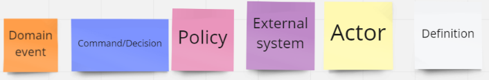
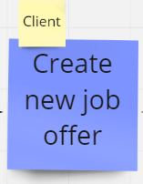
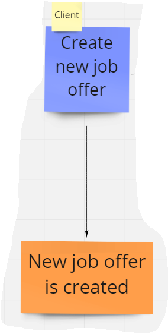
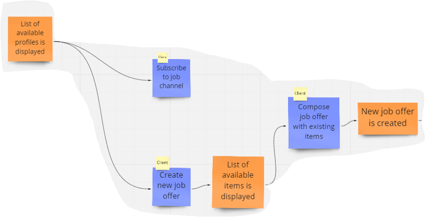
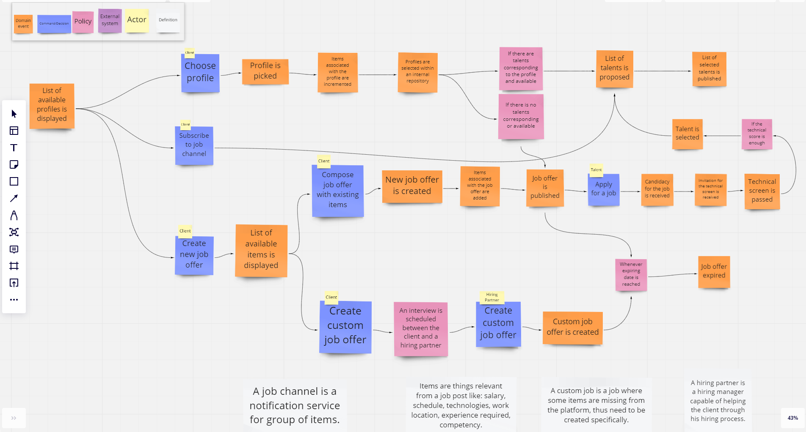

# Создаём систему микросервисов с нуля — коммит 2

[Оригинал](https://medium.com/@alexis.tadifo/build-a-microservices-system-from-scratch-commit-2-635124bbedcb)

В последнем коммите мы выбрали основной подход к построению системы найма: DDD.
В этом коммите мы проведём eventstorming, который поможет сформировать систему 
на основе того, что действительно происходит во время найма.

Фото [Tim Gouw](https://unsplash.com/@punttim) из [Unsplash](https://unsplash.com/)

## Составляющие

Во время нашего eventstorming, мы будем использовать хорошо известные [понятия](https://www.eventstorming.com/)
как событие предметной области, команды/действия, стратегия, акторы и 
определение.

Понятия eventstorming

В качестве инструмента подойдёт [Miro](https://miro.com/) (даже бесплатная версия).

## Первая итерация

Как определить процесса найма? _Процесс, в ходе которого кого-то нанимает 
другое лицо (будь то компания или физическое лицо)_. Это определение утверждает, 
что:

* идет процесс отбора;
* кто-то нанимает;
* есть кто-то нанятый.

Эти предположения можно преобразовать в:

* есть кто-то с проектом и требованиями, _кто хочет чтобы кто-то_ другой помог ему 
  с удовлетворением этих требований;
* есть человек, _готовый принять участие в проекте_, тем самым готовый показать, 
  что он соответствует требованиям;
* для того чтобы понять, что человек _соответствует требованиям, производится ряд 
  действий_ (процесс).

Итак, мы начинаем с того, что клиент создает новое предложение о работе 
(кто-то предлагает новый проект)...

и событие предметной области в результате

На этом этапе мы могли бы начать задавать некоторые вопросы:

* есть ли способ помешать нашим клиентам создавать предложения о работе, которые 
  уже существуют и хорошо написаны?
* можем ли мы получить статистику по предложениям о работе, чтобы расширить 
  возможности программного обеспечения?
* есть ли способ помешать ленивым клиентам создавать предложения о работе и 
  вместо этого повторно использовать то, что уже предлагают другие?

Теперь наша диаграмма выглядит так.

## Определения
* _Профиль_ — это шаблон предложения о работе. Он получается из бывших 
  предложений о работе.
* Элементы — это то, что относится к предложению о работе, такие как: _зарплата_, 
  _график_, _технологии_, _место работы_, _требуемый опыт_, _компетентность_.
* _Канал с предложениями_ - это служба уведомлений для группы элементов.

## События предметной области

* _Отображается список доступных профилей_: если профили доступны, они 
  отображаются для клиента.
* _Отображается список доступных элементов_: клиенты могут создавать предложения 
  о работе, составляя и повторно используя уже существующие элементы.
* Создано новое предложение о работе.

## Команды/действия

* _Подписаться на канал с предложениями_: клиент может подписаться на канал c 
  предложениями, выбрав из списка элементов. Это означает, что клиент будет
  получать предложения на основе своих подписок.
* _Создать новое предложение о работе_.
* _Скомпоновать предложение о работе_, используя существующие элементы: клиент 
  может создать совершенно новое предложение о работе, повторно используя 
  существующие элементы по своему усмотрению.
  
## Единый язык

* Предложения о работе
* Профиль
* Элемент
* Скомпонованное предложение о работе
* Подписка
* Канал с предложениями

## N-ная итерация

Теперь наша диаграмма выглядит так.

Из неё следует, что

## Акторы

* Клиент (кто предлагает работу)
* Кандидаты (те, кто ищут работу)
* Партнер по найму (тот, кто помогает с процессом поиска)

## Определения

* Профиль — это шаблон предложения о работе. Получается из предыдущих.
* Элементы — это то, что относящиеся к предложению о работе, такие как: _зарплата_, 
  _график_, _технологии_, _место работы_, _требуемый опыт_, _компетентность_.
* _Канал с предложениями_ - это служба уведомлений для группы элементов.
* _Настраиваемое пользователем предложение о работе_ - это вакансия, в которой 
  отсутствуют некоторые элементы по определению, поэтому его необходимо создавать
  особым образом.
* Партнер по найму - это менеджер, способный помочь клиенту в процессе найма.

## События предметной области

* _Отображается список доступных профилей_: если профили доступны, они
  отображаются для клиента.
* _Отображается список доступных элементов_: клиенты могут создавать предложения
  о работе, составляя и повторно используя уже существующие элементы.
* _Создано новое предложение о работе_.
* _Создано настраиваемое пользователем предложение о работе_.
* _Выбран профиль_.
* _Увеличилось количество элементов связанных с профилем_.
* _Профили выбраны во внутреннем хранилище_.
* _Предложен список кандидатов_.
* _Список выбранных кандидатов опубликован_.
* _Увеличилось количество элементов связанных с вакансией_.
* _Вакансия опубликована_.
* _Получен отклик на вакансию от кандидата_.
* _Получено приглашение на техническое собеседование_.
* _Техническое собеседование пройдено_.
* _Вакансия больше не актуальна_.

## Команды/действие

* _Подписаться на канал с предложениями_: клиент может подписаться на канал c 
  предложениями, выбрав из списка элементов. Это означает, что клиент будет 
  получать предложения на основе своих подписок.
* _Создать новое предложение о работе_.
* _Скомпоновать предложение о работе_, используя существующие элементы: клиент
  может создать совершенно новое предложение о работе, повторно используя
  существующие элементы по своему усмотрению.
* _Создать настраиваемое пользователем предложение о работе_: клиент может создать 
  настраиваемое предложение о работе.
* _Создать настраиваемое пользователем предложение о работе_: менеджер по найму 
  создаёт настраиваемое предложение о работе с учётом требований клиента.
* _Откликнуться на вакансию_.
* _Выбрать профиль_.

## Единый язык

* Предложения о работе
* Профиль
* Элемент
* Скомпонованное предложение о работе
* Подписка
* Канал с предложениями
* Кандидат
* Оценка технических знаний
* Техническое собеседование
* Настраиваемое пользователем предложение о работе
* Партнер по найму
* Публикация
* Отклик на вакансию

## Состояние нашей системы

На данный момент после eventstorming:

* клиент может создать вакансию, если уже существует профиль, который он может повторно 
  использовать;
* клиент может создать вакансию просто путём компоновки некоторых уже существующих 
  критериев;
* клиент может создать вакансию с помощью менеджера по найму;
* каждый раз, когда создается предложение о работе, элементы, связанные с этой 
  вакансией сохраняются и могут быть проанализированы (например, в статистических 
  целях) и использованы клиентом и кандидатами;
* кандидат может откликаться на вакансию;
* уровень кандидата может быть проверен на техническом собеседовании;
* клиент может подписаться на особый профиль и получать профили кандидатов, как 
  только они станут доступны.
  
В следующем коммите мы поговорим об агрегате и ограниченном контексте.

***

## Ссылки и книги

* [https://medium.com/@chatuev/big-picture-event-storming-7a1fe18ffabb](https://medium.com/@chatuev/big-picture-event-storming-7a1fe18ffabb)
