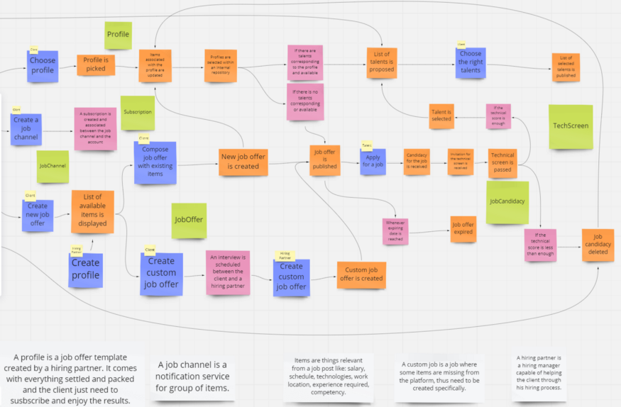

# Создаём систему микросервисов с нуля — коммит 3

[Оригинал](https://medium.com/@alexis.tadifo/build-a-microservices-system-from-scratch-commit-3-49585cf59)

В [последнем коммите](https://medium.com/@alexis.tadifo/build-a-microservices-system-from-scratch-commit-2-635124bbedcb) мы углубились в нашу предметную область, используя eventstorming.

## Следующая итерация проекта

После еще одной итерации проекта (да, он меняется каждый раз!), мы можем 
добавить больше событий предметной области.

> Вы можете увидеть актуальную диаграмму после eventstorming [здесь](https://miro.com/welcomeonboard/aFhUV3JIa0h4cndRcXVkV1kyNkxkZU90WDQzcTlKalZSVUdYcVNlSFBlRnZIN3Azd2lxc2p5SjZrclRGTFFVNnwzMDc0NDU3MzQ4NDc2NDI2NzI2?invite_link_id=72157436564).

Мы добавили кое-что вверху в последней итерации проекта.

## События предметной области

* _Создан новый аккаунт_: аккаунт клиента создан.
* _Аккаунт удалён_.
* _Подписки удалены_: все подписки, связанные с аккаунтом удалены.

## Команды/действия

* _Создать аккаунт_.
* Удалить аккаунт.
* _Начать процесс найма_.
* _Закончить процесс найма_.
* _Отобразить результаты процесса найма_.

## Набор критериев и требований

* Существуют ли подписки на канал с вакансиями.

## Единый язык

* _Процесс найма_.
* _Аккаунт_.

## Определения

* _Профиль_: шаблон предложения о работе, созданный партнером по найму. Он уже 
  полностью настроен и готов к работе, а клиенту просто нужно подписаться и наслаждаться 
  результатами.

Начиная с этого момента мы можем начать искать агрегаты и ограниченные контексты.
Здесь нет необходимости бесконечно зацикливаться, поскольку мы можем (и будем)
рефакторить части нашего проекта.

## Сущности

Клиент создаёт учётную запись для выполнения всех своих действий, талант (кандидат
на работу) делает то же самое, но для выполнения своих действий (техническое 
собеседование, отклика на вакансию и т. д.). Таким образом, мы можем использовать
сущность UserAccount для работы со всеми этим действиями с учётом всех требований.

## UserAccount

Выполняя такую процедуру, появятся другие сущности.

## HiringProcess

## JobChannel

## Subscription

а также...

* JobOffer
* Profile
* JobCandidacy
* TechScreen

Как вы заметили мы не отнесли некоторую информацию в сущности. Хорошим примером 
является **элемент**. Он используется многими другими сущностями и командами, но
ему не нужна надлежащая идентификация, чтобы быть сущностью. Вместо этого мы
будем использовать _элемент_ как объект-значение.

## Ключевые агрегаты

Следующие агрегаты важны для нашей системы.

## Пользователь

Этот агрегат охватывает всё связанное с пользователями системы, используя учётную
запись пользователя в качестве основного объекта.

* **Корень**: UserAccount
* **Связан с**: Subscription / JobChannel / HiringProcess

# Вакансия

* **Корень**: JobOffer
* **Связан с**: JobCandidacy / TechScreen

# Найм

* **Корень**: HiringProcess
* **Связан с**: JobChannel / JobOffer / User

## Screen

* **Корень**: TechScreen
* **Связан с**: Test (не показан на диаграмме) / ...

## Ограниченные контексты

[bounded-contexts](images/part3/0_eAgGYPyQCkfqKsmD.jpeg)
Фото [Джима Витковски](https://unsplash.com/@jcw) из [Unsplash](https://unsplash.com/)

## Управление пользователем

Этот ограниченный контекст содержит всё связанное с управлением учетными 
записями пользователей.

## Работа с профилями

Этот ограниченный контекст содержит всё связанное с использованием профилей (подписка,
эксплуатация, ...).

## Управление каналом

Этот ограниченный контекст содержит всё связанное с каналами вакансий.

## Отбор

Этот ограниченный контекст содержит всё связанное с тем как клиент создаёт вакансию
и выбирает предложенных талантов.

## Управление кандидатами

Этот ограниченный контекст содержит всё связанное с управлением отдельным кандидатом
из списка.

_В настоящий момент мы видим, что медленно, но верно начали проявляться наши 
сервисы. Следующая коммит будет посвящен первой попытке проектирования 
архитектуры микросервисов наряду с вопросами, связанными с инфраструктурой._

_Алексис С. ТАДИФО_

***

## Ссылки и книги

* [https://medium.com/@chatuev/big-picture-event-storming-7a1fe18ffabb](https://medium.com/@chatuev/big-picture-event-storming-7a1fe18ffabb)
* [https://docs.microsoft.com/en-us/azure/architecture/microservices/model/tactical-ddd](https://docs.microsoft.com/en-us/azure/architecture/microservices/model/tactical-ddd)
* [https://docs.microsoft.com/en-us/azure/architecture/microservices/model/microservice-boundaries](https://docs.microsoft.com/en-us/azure/architecture/microservices/model/microservice-boundaries)
* [https://shijuvar.medium.com/microservices-overview-misinterpretations-and-misuses-56a1979edafb](https://shijuvar.medium.com/microservices-overview-misinterpretations-and-misuses-56a1979edafb)
* [https://blog.sapiensworks.com/post/2014/10/31/DDD-Identifying-Bounded-Contexts-and-Aggregates-Entities-and-Value-Objects.aspx](https://blog.sapiensworks.com/post/2014/10/31/DDD-Identifying-Bounded-Contexts-and-Aggregates-Entities-and-Value-Objects.aspx)
* [https://www.rubiconred.com/blog/event-storming](https://www.rubiconred.com/blog/event-storming)