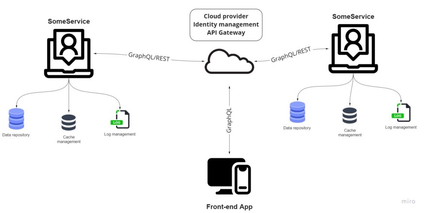

# Создаём систему микросервисов с нуля — коммит 4

[Оригинал](https://medium.com/@alexis.tadifo/build-a-microservices-system-from-scratch-commit-4-a2da209b43ce)

В [последнем коммите](https://medium.com/@alexis.tadifo/build-a-microservices-system-from-scratch-commit-3-49585cf59) мы провели Eventstorming, чтобы спроектировать всю платформу 
на основе предметных областей.

В этом коммите мы рассмотрим техническую архитектуру.

Фото [Biel Morro](https://unsplash.com/@bielmorro) из [Unsplash](https://unsplash.com/)

Начиная с этого момента, следует учитывать, что весь проект похож на проект собора 
(соборы строятся на протяжении нескольких столетий): _мы знаем, с чего начать, но 
мы приветствуем изменения и предпочитаем качество над скоростью_.

## Какие сервисы?

Мы создадим сервисы в соответствии с ограниченными контекстами из предыдущего 
коммита.

## UserService

Этот сервис отвечает за управление пользователями платформы (клиентами, кандидатами, 
партнерами по найму). 

## ProfilingService

Этот сервис используется для выполнения любых действий, связанных с профилем, 
будь то подписка, изучение и т. д.

## ChannelService

Этот сервис используется для работы с каналами вакансий.

## CherrypickService

Этот сервис используется для создания вакансий и выбора кандидатов среди предложенных.

## CandidacyService

Этот сервис используется в качестве оболочки для управления всем процессом и 
взаимодействия с другими сервисами.

## PaymentService

Этот сервис используется для управления платежами внутри платформы.

## Как они будут взаимодействовать?

Каждая услуга будет доступна через API и шлюзы. На этом этапе мы можем спросить 
себя: как мы можем обрабатывать все потоки связи, входящие и исходящие API? 
У нас есть несколько вариантов:

* SOAP
* REST
* GraphQL
* RPC (gRPC)

## SOAP ?

SOAP до сих пор является одним из наиболее распространенных способов 
взаимодействия с API. Он очень удобен, когда приходится иметь дело с различными 
протоколами связи (SMTP, FTP, ...) и быть независимым на обоих концах связи 
(клиент, сервер). _К сожалению_, мы не будем его использовать, так как его 
полезная нагрузка довольно велика и не подходит для всех этих сервисов, которые 
будут потреблять огромные объемы сообщений.

## REST ?

REST довольно прост, использует как JSON, так и XML. Несмотря на неизменность его 
ответов, что чаще всего избыточно, мы будем использовать REST в большинстве 
случаев.

## GraphQL ?

GraphQL действительно гибок, позволяет использовать асинхронное взаимодействие и 
вспомогательные запросы запрашивают только то, что им нужно в качестве ответа 
(в отличие от REST). Хотя кривая обучения GraphQL может быть проблемой, мы 
попробуем использовать его для некоторых API (конечно, для тех, которые 
вызываются чаще всего).

## gRPC?

gRPC предназначен для очень быстрой коммуникации между API и позволяет выполнять 
двунаправленную потоковую передачу. К сожалению, мы не будем его использовать, 
так как он обязывает использовать его на обоих концах, а мы не можем 
позволить себе такое ограничение.

Наш выбор: GraphQL и REST.

## Основная архитектура

Наша архитектура не будет зависеть ни от какого конкретного облачного провайдера 
(хостинг, данные и вычисления), ни от какого-либо специализированного инструмента управления 
идентификацией.

_На этом этапе мы действительно можем начать углубляться в вопросы и темы 
эксплуатации. Следующий коммит будет посвящен фронтенд приложению._

_Алексис С. ТАДИФО_

***

## Ссылки и книги

* [https://github.com/GoogleCloudPlatform/microservices-demo](https://github.com/GoogleCloudPlatform/microservices-demo)
* [https://www.redhat.com/architect/apis-soap-rest-graphql-grpc](https://www.redhat.com/architect/apis-soap-rest-graphql-grpc)
* [https://strapi.io/blog/how-graphql-and-rest-api-can-work-together](https://strapi.io/blog/how-graphql-and-rest-api-can-work-together)
* [https://medium.com/swlh/graphql-api-or-rest-api-why-not-have-both-c4171e68900a](https://medium.com/swlh/graphql-api-or-rest-api-why-not-have-both-c4171e68900a)
* [https://blog.logrocket.com/improve-microservice-architecture-graphql-api-gateways/](https://blog.logrocket.com/improve-microservice-architecture-graphql-api-gateways/)