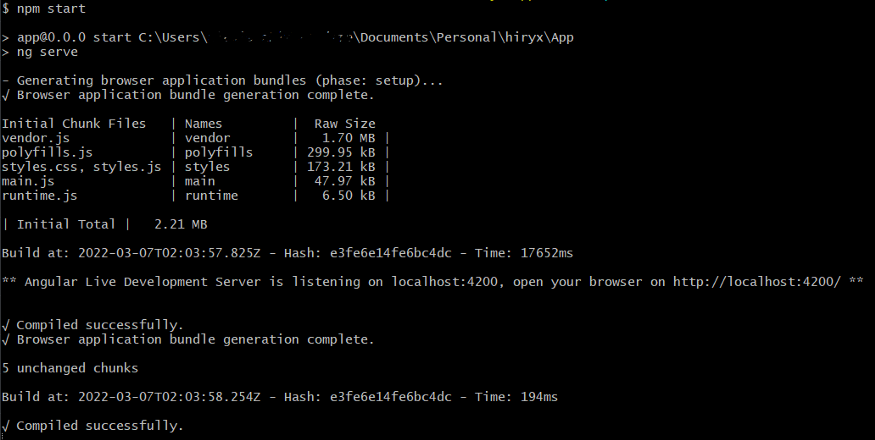
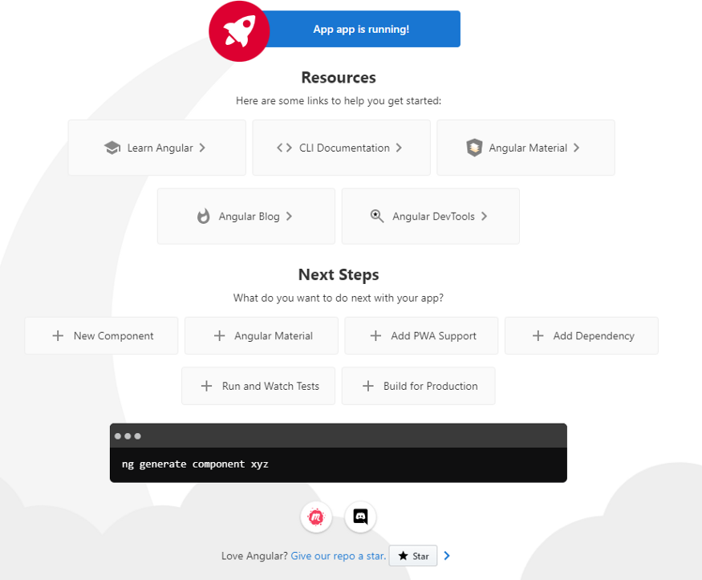

# Создаём систему микросервисов с нуля — коммит 7

[Оригинал](https://medium.com/@alexis.tadifo/build-a-microservices-system-from-scratch-commit-7-1c96120eb9e8)

В [последнем коммите](https://medium.com/@alexis.tadifo/build-a-microservices-system-from-scratch-commit-6-57729da65c1f)
мы разработали фронтенд для нашей платформы. Мы решили пойти по этому пути:
_проектирование фронтенда_ (**сделано**) => _шаблон фронтенда_ => _CI архитектура_ => 
CD архитектура.

## Выбираем шаблон фронтенда

Вместо того, чтобы писать код с нуля, мы начнём с того, что уже написано и не
слишком сложно переделать под требования с помощью созданных нами компонентов.
Итак, нашими основными критериями будут:

* простота внешнего вида;
* хорошее использование функций и классов typescript/javascript (поскольку мы 
  не хотим тратить слишком много времени на рефакторинг);
* бесплатный и безусловный доступ (_на этом этапе нет смысла ни начинать 
  тратить деньги, ни делиться личными данными_).

## Какими ресурсами мы воспользовались

* [Бесплатные проекты или шаблоны Angular с открытым исходным кодом [Github]](https://www.javaguides.net/2019/04/free-open-source-angular-projects-or-templates.html)
* [8 лучших бесплатных шаблонов Angular, которые вам могут понадобиться этой весной](https://angularexpo.com/best-free-angular-templates-you-need-to-have-this-spring/)

## Выбранный шаблон

У нас есть победитель ...

[БЕСПЛАТНАЯ ПРЕМИУМ ANGULAR 6+ ПАНЕЛЬ АДМИНИСТРИРОВАНИЯ ИСПОЛЬЗУЯ МАТЕРИАЛЬНЫЙ ДИЗАЙН 
+МАКЕТ С ИСПОЛЬЗОВАНИЕМ FLEX](https://github.com/codetok/cdk-admin)

Всё готово к работе!

> _Следующий шаг: создать CI/CD инфраструктуру ещё до того, как начнём 
> редактировать фронтенд._

_Алексис С. ТАДИФО_
